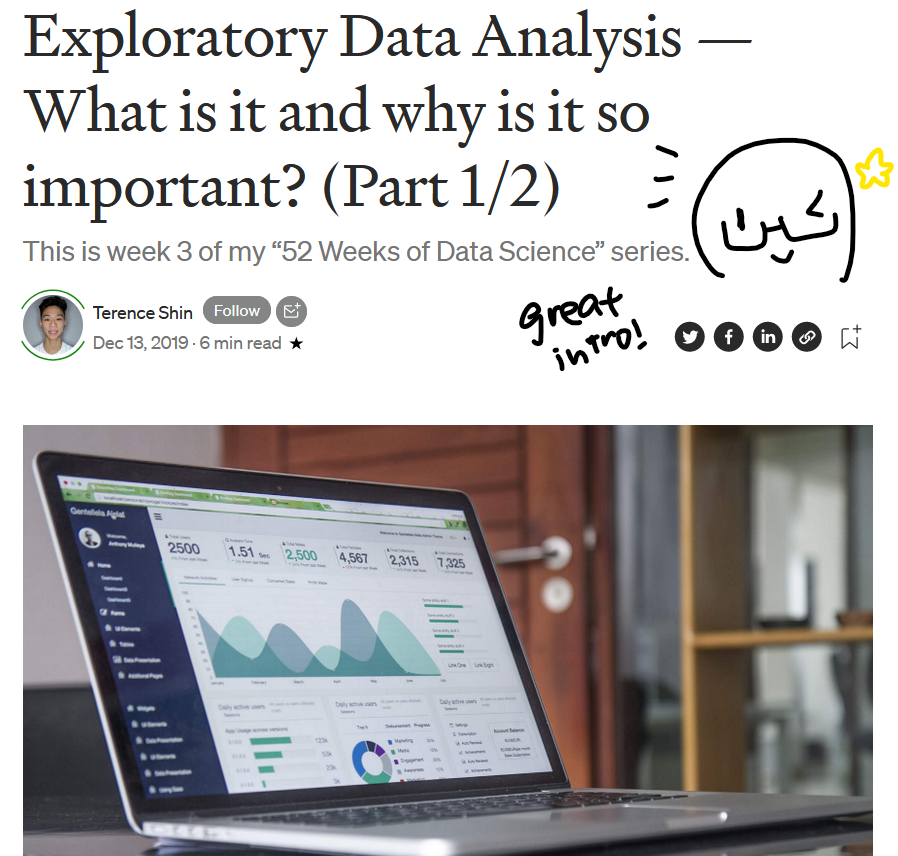

```{r setup, include=FALSE}
knitr::opts_chunk$set(echo = TRUE, 
                      eval = TRUE,
                      message = FALSE,
                      warning = FALSE)
```

## 1.0 Overview
Before we even start, you might be wondering: why geospatial analytics? Why are we learning about it, and how is it relevant to a business or a governmental/academic institution?

A quick Google search brings up thousands upon thousands of answers, articles, and research papers: I recommend [Deloitte's 3-Minute Guide](https://www2.deloitte.com/content/dam/Deloitte/global/Documents/Deloitte-Analytics/dttl-analytics-us-ba-geospatial3minguide.pdf) on why geospatial analytics matters and the value it brings to a business its data.

<center>
{width=50%} 
</center>

In today's Hands-On Exercise, we'll be doing an introduction to geospatial analytics in R: 

- importing the data and (if necessary) converting it into an accessible format
- carrying out geoprocessing tasks with **sf**
- carrying out data wrangling tasks with **dplyr**
- performing Exploratory Data Analysis (EDA) with **ggplot2**

## 2.0 Setup

### 2.1 Packages Used

<center>
{width=50%}
</center>

The R packages we'll be introducing today are:
- **sf**: used for importing, managing, and processing geospatial data
- **tidyverse**: used for importing, wrangling and visualising data (and other data science tasks!)

>Note: Tidyverse consists of a family of R packages, such as readr, tidyr, and dplyr - these are used for the different steps of the data wrangling + visualisation process!

Here's a **handy code chunk** that we'll likely be putting at the start of every file: it (a) creates a list of packages, (b) checks if they have been installed (and installs it for us if they haven't), and lastly (c) launches them in the Rstudio environment.

```{r, code_folding=FALSE}
packages = c('sf', 'tidyverse')
for (p in packages){
  if(!require(p, character.only = T)){
    install.packages(p)
  }
  library(p,character.only = T)
}
```

### 2.2 Data Used
The datasets used for this exercise are:

- Master Plan 2014 Subzone Boundary (Web) from [data.gov.sg](https://data.gov.sg/)
- Pre-Schools Location from [data.gov.sg](https://data.gov.sg/)
- Cycling Path from [LTADataMall](https://www.mytransport.sg/content/mytransport/home/dataMall.html)
- Singapore Airbnb listing data, 19 July 2021 from [Inside Airbnb](http://insideairbnb.com/get-the-data.html)

A good practice would be to put the data sets in a 'data' folder, sorted accordingly into 'geospatial' and 'aspatial' folders.

<center>
{width=25%} 
</center>

## 3.0 Importing Geospatial Data into R
Now that we've got our data, let's take a closer look at the formats they're in and how to import them into R. The geospatial data we have are:

- `MP14_SUBZONE_WEB_PL`, a polygon feature layer in ESRI shapefile format, 
- `CyclingPath`, a line feature layer in ESRI shapefile format, and
- `PreSchool`, a point feature layer in kml file format. 

To import, we'll be using a handy function called `st_read()` from the **sf** package. The arguments it takes in depends on the file format. For the shapefile format, two arguments are provided:  `dsn` to define the data path, and `layer` to provide the shapefile name. Bonus: we don't need to specify the file extension for shapefiles `r emo::ji("smile")` On the other hand, for the kml file format, our argument is the complete path with the kml file extension.

<center>
{width=75%}
</center>

### 3.1 Importing polygon feature data in shapefile format
Dataset used: `MP14_SUBZONE_WEB_PL`
File format: shapefile
Data frame type: polygon feature

```{r}
mpsz = st_read(dsn = "data/geospatial", 
                  layer = "MP14_SUBZONE_WEB_PL")
```

From the output message, we can see that in our `mpsz` simple feature data frame, there are 323 multipolygon features, 15 fields and is in the **svy21** projected coordinates system.

### 3.2 Importing polyline feature data in shapefile form
Dataset used: `CyclingPath`
File format: shapefile
Data frame type: line feature

```{r}
cyclingpath = st_read(dsn = "data/geospatial", 
                         layer = "CyclingPath")
```

From the output message, we can see that in our `cyclingpath` linestring feature data frame, there are 1625 linestring features, 2 fields and is in the **svy21** projected coordinates system.

### 3.3 Importing GIS data in kml format
Dataset used: `pre-schools-location-kml`
File format: kml
Data frame type: point feature

```{r}
preschool = st_read("data/geospatial/pre-schools-location-kml.kml")
```

From the output message, we can see that in our `preschool` point feature data frame, there are 1359 linestring features, 2 fields and is in the **wgs84** projected coordinates system.

## 4.0 Importing + Converting Aspatial Data into R
For aspatial data, such as the  `listings` Airbnb datset, there's an extra step in the importing process. We'll import it into a [tibble data frame](https://r4ds.had.co.nz/tibbles.html), then convert it into a simple feature data frame.

### 4.1 Importing aspatial data
Since our `listings` data set is in a csv file format, we'll use the *read_csv()* function from the **readr** package, like so:

```{r}
listings <- read_csv("data/aspatial/listings.csv")
glimpse(listings) 
```

From the output message, we can see that in our `listing` tibble data frame, there are 4252 rows and 16 columns (not features and fields like in our simple data feature frame!) Take note of the `latitude` and `longitude` fields - we'll be using them in the next phase. 

> Assumption: The data is in the **wgs84** Geographic Coordinate System on account of its latitude/longtitude fields.

### 4.2 Converting aspatial data
Now, let's convert our `listing` tibble data frame into a by using the *st_as_sf()* function from the **sf** package.

```{r}
listings_sf <- st_as_sf(listings, 
                       coords = c("longitude", "latitude"),
                       crs=4326) %>%
  st_transform(crs = 3414)
```

Let's explain the code chunk!

<center>
{width=75%}
</center>

This gives us the new simple feature data frame, `listings_sf`:

```{r}
glimpse(listings_sf)
```

>Note that a new column called `geometry` has been added! In addition, `longtitude` and `latitude`  have both been dropped.

### 4.3 Combining it together: Importing asptial data as sf {.tabset}

## 5.0 Checking the Content of a Data Frame
Now that we've got our data frames, this begs the question: what exactly *is* inside them? Let's learn how to retrieve the information of the dataframe with 3 simple methods!

### 5.1 st_geometry()
Let's say that we want a preliminary look at our data - just seeing the basic feature information is sufficient. In this case, *st_geometry()* is most appropriate:

```{r}
st_geometry(mpsz)
```

As we can see, only the basic information of the feature class (type of geometry, geographic extent of features and CRS) is displayed.

### 5.2 glimpse()
However, basic information won't take us very far. Let's dig a little deeper and learn about the associated attribute information in the data frame. This is where *glimpse()* comes in:

```{r}
glimpse(mpsz)
```

With *glimpse()*, we now know the data type of each field - for example, `FMEL-UPD_D` field is of the **date** data type.

### 5.3 head()
Sometimes, we want to dig as deep as we can and reveal all the information of a feature object. In this case, *head()* is best:

```{r}
head(mpsz)
```

>Note that the 'n' argument allows us to select how many records to display!

## 6.0 Plotting & Projection

### 6.1 Plotting
Now that we've got our data, we get into the meat of the matter: visualisation! Having a dataframe of fields and data points is taxing for human eyes to process, but with a bit of plotting and mapping, our geospatial data becomes a gold mine of great insights. Let's try to *plot()* it out:

```{r}
plot(mpsz)
```

This is a handy multi-plot of all attributes (up to a reasonable amount). But maybe we just want to plot a specific attribute:

```{r}
plot(mpsz["PLN_AREA_N"])
```

There are also times where we need just the geometry - in other words, the map outline:

```{r}
plot(st_geometry(mpsz))
```

### 6.2 Projection
**Projection transformation** is when we project a simple feature data frame from one coordinate system to another. There are two common issues that require projection transformation: (a) missing or inaccurate coordinate system, or (b) inappropriate coordinate systems for the analysis chosen.

#### 6.2.1 Missing/Inaccurate Coordinate System
To tackle the first issue, we'll need to **assign an ESPG code to the data frame**. Firstly, let's check the coordinate system of our `mpsz` data frame:

```{r}
st_crs(mpsz)
```

Although `mpsz` data frame is projected in svy21, the output indicates that the EPSG is 9001.  This is the wrong EPSG code! The correct EPSG code for svy21 should be [3414](https://epsg.io/3414). Let's change it:

```{r}
mpsz3414 <- st_set_crs(mpsz, 3414)
st_crs(mpsz3414)
```

#### 6.2.2 Inappropriate Coordinate Systems
Still remember our geospatial data overview in 3.0? You might have noticed that the coordinate system differed among our data frames: `mpsz` and `cyclingpath` are **svy21**, while `preschool` is **wgs84**. `preschool` might run into issues when we're performing geoprocessing, because a geographic coordinate system is not appropriate if our analysis needs distance or/and area measurements. 

```{r}
preschool3414 <- st_transform(preschool, 
                              crs = 3414)
st_geometry(preschool3414)
```

Notice the change to the svy21 projected coordinate system! 

>You might notice that the values in the bounding box have changed, too! They are now greater than the original 0-360 range of decimal degree commonly used by majority of the geographic coordinate systems.

## 7.0 Geoprocessing
Other than handling data, the handy **sf** package also has functions for geoprocessing (otherwise known as GIS analysis). Let's explore some commonly-used geoprocessingn functions!

### 7.1 Buffering
Let's say that in a bid to promote healthier living, the authorities are planning to upgrade the existing cycling paths, making it safer and more appealing to cyclists all around! To do that, they'll need to acquire 5 metres of reserved land on both sides of the cycling path. Our task is to find the total area of land that's to be acquired.

Firstly, let's compute the 5-meter buffers around the cycling paths:

```{r}
buffer_cycling <- st_buffer(cyclingpath, 
                               dist=5, nQuadSegs = 30)
```

Then, let's actually calculate the area of the buffers:

```{r}
buffer_cycling$AREA <- st_area(buffer_cycling)
```

Lastly, let's find the total area with *sum()*:

```{r}
sum(buffer_cycling$AREA)
```

### 7.2 Point-In-Polygon Count
Let's say that a preschool service group is organising a nation-wide event, and wants to find out the number of preschools in each Planning Subzone.

We can kill two birds with one stone with this handy combination of *st_intersects()* and *length()*. [*st_intersects()*](https://r-spatial.github.io/sf/reference/geos_binary_pred.html) helps us identify the preschools located in each Planningn Subzone, while *length()* calculates the number of preschools per Planning Subzone.
 
```{r}
mpsz3414$`PreSch Count`<- lengths(st_intersects(mpsz3414, preschool3414))
```

Let's check a summary of `PreSch Count`:

```{r}
summary(mpsz3414$`PreSch Count`)
```

Now, the preschool service group wants to hold a subzone-specific event! They want to target the Planning Subzone with the most number of preschools to maximise their outreach, so let's help them out with [*top_n()*](https://dplyr.tidyverse.org/reference/top_n.html):

```{r}
top_n(mpsz3414, 1, `PreSch Count`)
```

Lastly, the preschool service group wants to know the density of preschools by planning subzone for future events. We'll  need to derive the area of each planning subzone:

```{r}
mpsz3414$Area <- mpsz3414 %>%
  st_area()
```

Now, introducing a new function, [*mutate()*](https://dplyr.tidyverse.org/reference/mutate.html)! It's to help us add the density column into `mpsz3414`:

```{r}
mpsz3414 <- mpsz3414 %>%
  mutate(`PreSch Density` = `PreSch Count`/Area * 1000000)
```

>While they look similar and have a similar function (to add new variables), there's a difference between *mutate()* and *transmute()*! *mutate()* adds new variables and preserves existing ones while *transmute()* adds new variables and drops existing ones. Use the appropriate one for the situation!

## 8.0 Exploratory Data Analysis (EDA)
Why do we do EDA? Here's a [great Medium article](https://medium.com/swlh/exploratory-data-analysis-what-is-it-and-why-is-it-so-important-part-1-2-240d58a89695) that introduces EDA: from its significance to its components, it's got you covered!

<center>
{width=50%}
</center>

For this EDA section, we'll be introducing various [ggplot2](https://ggplot2.tidyverse.org/) functions that'll help us create functional and yet truthful statistical graphs that'll help us visualise and understand our data!

Firstly, let's use *hist()* to plot a histogram and reveal the distribution of `PreSch Density`:

```{r}
hist(mpsz3414$`PreSch Density`)
```

That looks good - but it's not something you'll publish in your reports! Let's add a little customisation:

```{r}
ggplot(data=mpsz3414, 
       aes(x= as.numeric(`PreSch Density`)))+
  geom_histogram(bins=20, 
                 color="black", 
                 fill="light blue") +
  labs(title = "Are pre-school even distributed in Singapore?",
       subtitle= "There are many planning sub-zones with a single pre-school, on the other hand, \nthere are two planning sub-zones with at least 20 pre-schools",
      x = "Pre-school density (per km sq)",
      y = "Frequency")
```

### DIY section

**DIY: Using ggplot2, plot a scatterplot showing the relationship between Pre-school Density and Pre-school Count.**

Let's approach this step-by-step. Firstly, we'll need the variables Pre-school Density and Pre-school Count. Luckily, we've already created both in 2.5.2 Point-In-Polygon Count.

Next, we need to plot a scatterplot. For our histogram, we used geom_histogram - and for a scatterplot, we'll use geom_point. We can further customise this by adjusting the colour, size and fill of the points, like so:

```{r fig.width=5, fig.height=5}
ggplot(data=mpsz3414, 
       aes(y = `PreSch Count`, 
           x= as.numeric(`PreSch Density`)))+
  geom_point(color="black", 
             fill="light blue") + 
  labs(title = "",
      x = "Pre-school density (per km sq)",
      y = "Pre-school count")
```

Seem finished? There's actually one more step: **ensuring that your data is presented as fairly as possible** - we don't want to mislead our readers `r emo::ji("munch")` In this case, notice that the aspect ratio of our graph is off - its height is greater than its width! Let's correct that by setting limiters with the xlim() and ylim() functions inside ggplot2:

```{r echo=FALSE, fig.width=5, fig.height=5}
ggplot(data=mpsz3414, 
       aes(y = `PreSch Count`, 
           x= as.numeric(`PreSch Density`)))+
  geom_point(color="black", 
             fill="light blue") + 
  xlim(0, 60) +
  ylim(0, 60) +
  labs(title = "",
      x = "Pre-school density (per km sq)",
      y = "Pre-school count")
```

And there we have it! A representative scatterplot visualisation `r emo::ji("sparkles")`

## 7.0 End Notes
This is the end of this week's exercise! I'm really excited to learn more about geospatial analytics: we've just begun to scratch the surface, and there's so much more to explore and experiment with!

On a related sidenote: I've learned a number of things myself when creating this blog post! For example, I wanted to have a table of contents, but googling 'sidebar navigation pane' proved to be far less effective than just reading the [Distill Basics](https://rstudio.github.io/distill/basics.html) - which is a lesson learnt on reading the provided materials!

On a funny note, here's a mini-comic on my experience with tabsets:

<center>
{width=75%} 
{width=75%}
</center>

Tabsets are meant for html documents, but this output is a distill article... Of course it didn't work `r emo::ji("loudly_crying_face")` Well, that's just another learning point in our Geospatial Analytics Journey !

Walk with me as we dive deeper the coming weeks! `r emo::ji("hugging_face")` `r emo::ji("sparkling_heart")` `r emo::ji("sparkles")`

P.S. I found my old tablet so I could illustrate the points better! Handwriting will be more consistent from this blog post onwards `r emo::ji("smile")`

<center>
{width=50%}
</center>
