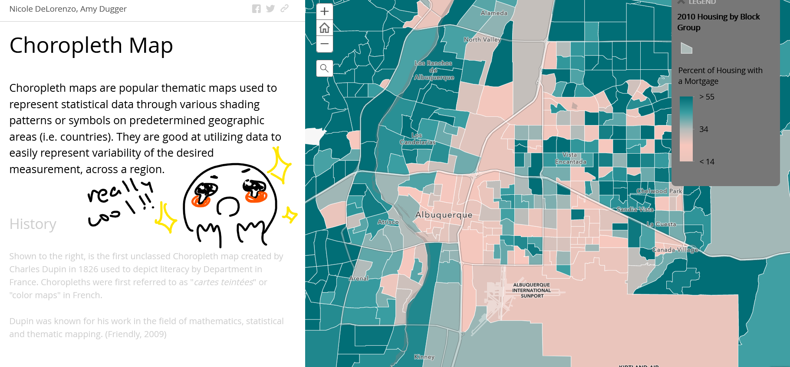
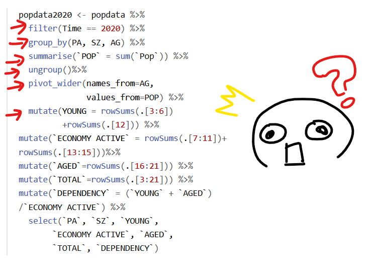
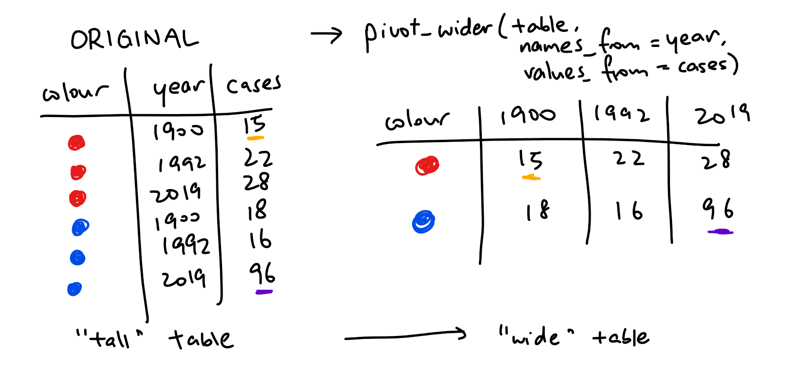
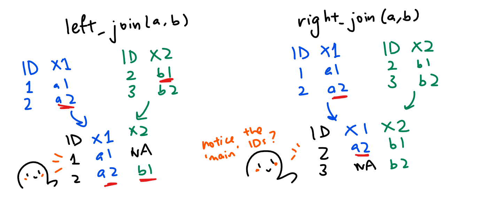
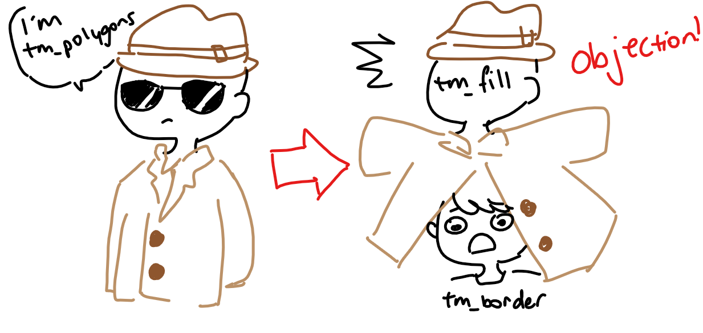
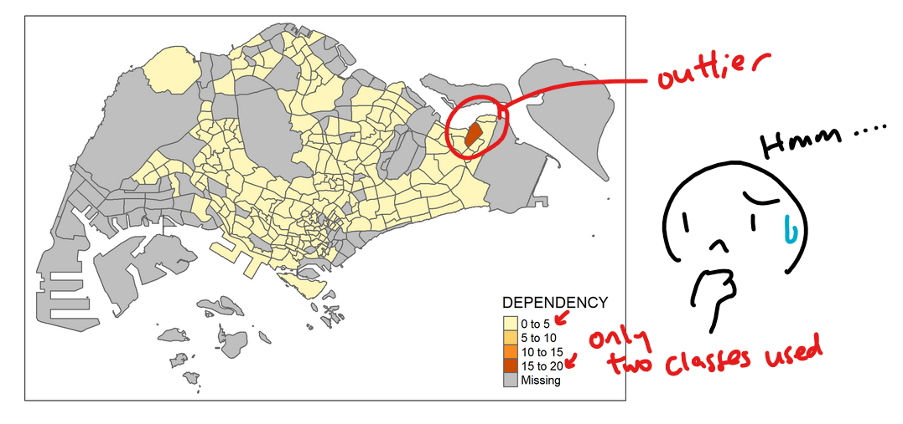

```{r setup, include=FALSE}
knitr::opts_chunk$set(echo = TRUE, 
                      eval = TRUE,
                      message = FALSE,
                      warning = FALSE,
                      fig.retina = 3)
```

## 1.0 Overview
In [Hands-On Exercise 02](https://is415-msty.netlify.app/posts/2021-08-30-hands-on-exercise-2/), we learned how to handle geospatial data in R: from importing to content-checking to plotting and projection! We ever learned a couple of geoprocessing tricks `r emo::ji("winking_face")`. Now that we know how to go all of that, let's get into the meat of geospatial visualisations: choropleth maps!

So what are choropleth maps? Here's a [great primer](https://www.arcgis.com/apps/MapJournal/index.html?appid=75eff041036d40cf8e70df99641004ca) on what they are (with examples!) as well as the advantages + disadvantages of using them - but in short, they're thematic maps: maps used to represent statistical data of a geographic region - usually through patterns or graduated colours. For example, seeing the distribution of elderly across Singapore's various subzones!

<center>
{width=75%} 
</center>

## 2.0 Setup

### 2.1 Packages Used

The R packages we'll be introducing today are:

- **tmap**: used for creating thematic maps, such as choropleth and bubble maps

In addition, we'll be using the packages from our last lesson:

- **sf**: used for importing, managing, and processing geospatial data
- **tidyverse**: used for importing, wrangling and visualising data (and other data science tasks!)

```{r}
packages = c('sf', 'tmap', 'tidyverse')
for (p in packages){
  if(!require(p, character.only = T)){
    install.packages(p)
  }
  library(p,character.only = T)
}
```

### 2.2 Data Used
The datasets used for this exercise are:

- Master Plan 2014 Subzone Boundary (Web) (`MP14_SUBZONE_WEB_PL`) from [data.gov.sg](https://data.gov.sg/)
- Singapore Residents by Planning Area / Subzone, Age Group, Sex and Type of Dwelling, June 2011-2020 (`respopagesextod2011to2020.csv`) from [Department of Statistics, Singapore](https://www.singstat.gov.sg/)

> Note: Our aspatial data file does not contain any coordinates values, but it's PA and SZ fields can be used as unique identifiers to geocode to `MP14_SUBZONE_WEB_PL` shapefile!

### 2.3 Importing Data
We've learned how to import data in [Hands-On Exercise 02](https://is415-msty.netlify.app/posts/2021-08-30-hands-on-exercise-2/), so try doing it yourself in this section! If you're stuck, click on "show code" below.

#### 2.3.1 Importing Geospatial Data

```{r, code_folding=TRUE}
mpsz <- st_read(dsn = "data/geospatial", 
                layer = "MP14_SUBZONE_WEB_PL")
```

Let's examine the content - note that only the first 10 records are displayed for brevity:

```{r}
mpsz
```

#### 2.3.2 Importing Attribute Data

```{r, code_folding=TRUE}
popdata <- read_csv("data/aspatial/respopagesextod2011to2020.csv")
```

Hopefully, after this lesson, you've remembered the main methods for importing geospatial and attribute data respectively!

<center>
{width=50%} 
</center>

### 2.4 Data Preparation

#### 2.4.1 Data Wrangling
Before we can start mapping out our thematic map, we'll need to prepare a data table with our required values, which are as follows:

- YOUNG: age group 0 to 4 until age group 20 to 24
- ECONOMY ACTIVE: age group 25-29 until age group 60-64
- AGED: age group 65 and above
- TOTAL: all age groups
- DEPENDENCY: the ratio of young + aged groups against the economy-active group

```{r}
popdata2020 <- popdata %>%
  filter(Time == 2020) %>%
  group_by(PA, SZ, AG) %>%
  summarise(`POP` = sum(`Pop`)) %>%
  ungroup()%>%
  pivot_wider(names_from=AG, 
              values_from=POP) %>%
  mutate(YOUNG = rowSums(.[3:6])
         +rowSums(.[12])) %>%
mutate(`ECONOMY ACTIVE` = rowSums(.[7:11])+
rowSums(.[13:15]))%>%
mutate(`AGED`=rowSums(.[16:21])) %>%
mutate(`TOTAL`=rowSums(.[3:21])) %>%  
mutate(`DEPENDENCY` = (`YOUNG` + `AGED`)
/`ECONOMY ACTIVE`) %>%
  select(`PA`, `SZ`, `YOUNG`, 
       `ECONOMY ACTIVE`, `AGED`, 
       `TOTAL`, `DEPENDENCY`)
```

#### 2.4.2 Data Wrangling Explanations
<center>
{width=75%} 
</center>

Hmm, there are some new functions inside here that we haven't touched on before! Let's explain them, one by one:

- [filter()](https://dplyr.tidyverse.org/reference/filter.html): used to subset a data frame and retain rows that satisfy your conditions. 
    - In our code, we used this to retain records inside the 2020 timeframe only.
- [groupby() and ungroup()](https://dplyr.tidyverse.org/reference/group_by.html): takes an existing tbl and converts it to a grouped tbl (defined by your selected variables) where operations are performed "by group". If our operations are complete, we'll use ungroup() to remove the grouping.
    - For example, for a dataset of students, I can choose to group them by sex (male/female), their grades (A/B/C) or even if they're wearing glasses. 
    - In our code, we our selected variables to group them by are `PA`, `SZ` AND `AG`, and we perform the *summarise()* operation on it before ungrouping.
- [summarise()](https://dplyr.tidyverse.org/reference/summarise.html): creates a new data frame of summary statistics based on the combination of grouping variables provided (or, if there are no grouping variables,the output will have a single row summarising all observations in the input).
    - For example, say that I have data on ice-cream sales. I can choose to summarise to show the average sales, or I can choose to *group_by()* ice-cream type (vanilla/chocolate/strawberry) and then look at the average sales across each of those types.
- [mutate()](https://dplyr.tidyverse.org/reference/mutate.html): adds new variables and preserves existing ones.
    - For example, in our code, to form the `DEPENDENCY` column, we calculated the value of the young + aged groups over the economy-active groups and used *mutate()* to add it as a new column.

Lastly, here's an illustrated example of [pivot_wider()](https://tidyr.tidyverse.org/reference/pivot_wider.html). It's mean to 'widen' data, which means increasing the number of columns and decreasing the number of rows.

<center>
{width=75%} 
</center>

From the *pivot_wider()* example above, we can see the the name_from argument takes column that we want to expand the table by, while values_from refers to the column that we get the cell values from. 
>Note: notice that while the column names are 'gone' in the *pivot_wider()* table, the viewer still understands what they represent!

Credits to to the Youtube Channel SR for their [video example on *pivot_wider()*](https://www.youtube.com/watch?v=p5MGvIf_6jg) `r emo::ji("flexed_biceps")`

#### 2.4.3 Joining the geospatial and attribute data
We're almost ready to join the geospatial and attribute data - but wait! There's one extra step: we've got to convert the values in the `PA` and `SZ` fields to uppercase. This is because the values from those fields are in both uppercase and lowercase; on the other hand, `SUBZONE_N` and `PLN_AREA_N` are in uppercase only.

```{r}
popdata2020 <- popdata2020 %>%
  mutate_at(.vars = vars(PA, SZ), 
          .funs = funs(toupper)) %>%
  filter(`ECONOMY ACTIVE` > 0)
```

Now, let's join the two sets of data with *left_join()*! Here, we'll be using the planning subzone names (*SUBZONE_N* and *SZ* from the geospatial and attribute data frames respectively) as the common identifier.

```{r}
mpsz_pop2020 <- left_join(mpsz, popdata2020,
                          by = c("SUBZONE_N" = "SZ"))
```

Now you might be thinking... if there's a left_join(), surely there's a right_join() as well? What's the difference, and why aren't we using right_join()? 

<center>
{width=75%} 
</center>

left_join(a,b) is used when dataframe 'a' is your 'main' dataframe, and you'd like to merge some of the data from 'b' into 'a'. right_join(a,b) is vice versa: 'b' is your main, while 'a' is additional. In addition, the newly joined dataframe is modelled after your 'main' dataframe - and since we want our output to be a simple features dataframe, we're putting `mpsz` as our 'main' one. You can find out more [here](https://statisticsglobe.com/r-dplyr-join-inner-left-right-full-semi-anti)!

## 3.0 Choropleth Maps
Now into the meat of the matter: choropleth mapping! There are two approaches when preparing these maps, namely:

- Plotting a thematic map quickly by using *qtm()*.
- Plotting highly customisable thematic map by using tmap elements. 

### 3.1 Quick Mapping with qtm()
If you'd like a fast method that gives you a concise visualisation, *qtm()* is the way to go - it'll give you a cartographic standard choropleth map as shown below:

```{r}
tmap_mode("plot")
qtm(mpsz_pop2020, 
    fill = "DEPENDENCY")
```

As we can see, the 'fill' argument is used to map the attribute we have in mind - in this case, `DEPENDENCY`. But what is the *tmap_mode()*? Let's fiddle around with it...

```{r}
tmap_options(check.and.fix = TRUE)
tmap_mode("view")
qtm(mpsz_pop2020, 
    fill = "DEPENDENCY")
```

A wild interactive map appeared! `r emo::ji("rolling_on_the_floor_laughing")` If you change the *tmap_mode()* to "view", you'll get an interactive map - try hovering over it to see the values of each subzone, and zoom in and out to target specific areas!

### 3.2 Customised Mapping with tmap elements
While *qtm()* is well and good, it offers very little in way of customisation. If we want high-quality cartographic choropleth maps, we should make use of tmap's drawing elements. Here's an example of what a customised map looks like:

```{r}
tmap_mode("plot")
tm_shape(mpsz_pop2020)+
  tm_fill("DEPENDENCY", 
          style = "quantile", 
          palette = "Blues",
          title = "Dependency ratio") +
  tm_layout(main.title = "Distribution of Dependency Ratio by planning subzone",
            main.title.position = "center",
            main.title.size = 1.2,
            legend.height = 0.45, 
            legend.width = 0.35,
            frame = TRUE) +
  tm_borders(alpha = 0.5) +
  tm_compass(type="8star", size = 2) +
  tm_scale_bar() +
  tm_grid(alpha =0.2) +
  tm_credits("Source: Planning Sub-zone boundary from Urban Redevelopment Authorithy (URA)\n and Population data from Department of Statistics DOS", 
             position = c("left", "bottom"))
```

Wow! That's a detailed map - and it may seem like a lot to take in at once, but let's break down our map-making process step-by-step.

#### 3.2.1 Drawing a Base Map
Our very first step is the base map: the basic building block upon which we'll add our statistical details to! We'll define the input data `mpsz_pop2020` into *tm_shape()*, and then add one or more layer elements such as *tm_fill()* and *tm_polygons()*. In this case, we'll use *tm_polygons()* to draw the planning subzone polygons:

```{r}
tm_shape(mpsz_pop2020) +
  tm_polygons()
```

#### 3.2.2 Drawing a Choropleth Map with *tm_polygons()*
Now, let's achieve the same level of visualisation as *qtm()*: we want to show the geographic distribution of a selected variable by planning subzone. Easy-peasy: just assign the target variable (in this case `DEPENDENCY`) to *tm_polygons()*, like so:

```{r}
tm_shape(mpsz_pop2020)+
  tm_polygons("DEPENDENCY")
```

#### 3.2.3 Drawing a Choropleth Map with *tm_fill()* and *tm_border()**
Here's a secret: *tm_polygons()* is actually two kids in a trench coat!

<center>
{width=50%} 
</center>

To be exact, *tm_polygons()* is a wrapper of *tm_fill()* and *tm_border()*.  *tm_fill()* shades the polygons(using the default colour scheme) while *tm_borders()* adds the borders of the shapefile onto the choropleth map.

If we use *tm_fill()* alone...

```{r}
tm_shape(mpsz_pop2020)+
  tm_fill("DEPENDENCY")
```

The planning subzones are shaded according to their respective dependency values, but there aren't any boundaries. Let's remedy that:

```{r}
tm_shape(mpsz_pop2020)+
  tm_fill("DEPENDENCY") +
  tm_borders(lwd = 0.1,  alpha = 1)
```

This looks a bit different from using just *tm_polygons()* - notice how the borders are a lot thinner? This is due us tweaking the arguments for tm_borders:
- *alpha* = transparency value, from 0 (totally transparent) to 1 (totally opaque). By default, the alpha value of the column is used - which is normally 1.
- *col* = border colour, 
- *lwd* = border line width. The default is 1, and
- *lty* = border line type.  The default is "solid".

### 3.3 Data Classification methods

#### 3.3.1 Built-in Classification Methods
<center>
{width=50%} 
</center>

If you've got a keen eye, you might have noticed the legend in the lower-right corner of our maps, marking the dependency in increments of 5. You might also be thinking that the red subzone must be an outlier - it's dark red, while everything else is a pale yellow, and only two of the listed classes are used.

If so - we come to the conclusion: the outlier is affecting the map visualisation, and we can't see the varying intensities of other subzones `r emo::ji("astonished_face")` What do we do?

No fear - data classification is here! We ought to tweak the data classification method that's being used so as to adjust the data ranges/classes. tmap provides a total ten data classification methods: *fixed*, *sd*, *equal*, *pretty* (default), *quantile*, *kmeans*, *hclust*, *bclust*, *fisher*, and *jenks*. We'll define these in the *style* argument of *tm_fill()* or *tm_polygons()* will be used.

Let's test out the jenks and equal classification methods!

```{r code_folding=TRUE}
jenksmap = tm_shape(mpsz_pop2020)+
  tm_fill("DEPENDENCY",
          n = 5,
          style = "jenks") +
  tm_borders(alpha = 0.5) +
  tm_layout(main.title="Jenks Classification")
```

```{r code_folding=TRUE}
equalmap = tm_shape(mpsz_pop2020)+
  tm_fill("DEPENDENCY",
          n = 5,
          style = "equal") +
  tm_borders(alpha = 0.5) +
  tm_layout(main.title="Equal Classification")
```

```{r echo=FALSE, eval=TRUE, fig.retina=3, fig.height=5}
tmap_arrange(jenksmap, equalmap)
```

If you're curious about what the other classification methods look like, you can also check out [this handy website](https://geocompr.github.io/post/2019/tmap-color-scales/) for visualisations!

**** DIY section
**Prepare several choropleth maps, using similar classification methods but with different numbers of classes (i.e. 2, 6, 10, 20). What observation can you draw from comparing the output maps?**

```{r echo = FALSE}
jenks2 = tm_shape(mpsz_pop2020)+
  tm_fill("DEPENDENCY",
          n = 2,
          style = "jenks") +
  tm_borders(alpha = 0.5) +
  tm_layout(main.title="Jenks, Class 2")

jenks6 = tm_shape(mpsz_pop2020)+
  tm_fill("DEPENDENCY",
          n = 6,
          style = "jenks") +
  tm_borders(alpha = 0.5) +
  tm_layout(main.title="Jenks, Class 6")

jenks10 = tm_shape(mpsz_pop2020)+
  tm_fill("DEPENDENCY",
          n = 10,
          style = "jenks") +
  tm_borders(alpha = 0.5) +
  tm_layout(main.title="Jenks, Class 10")

jenks20 = tm_shape(mpsz_pop2020)+
  tm_fill("DEPENDENCY",
          n = 20,
          style = "jenks") +
  tm_borders(alpha = 0.5) +
  tm_layout(main.title="Jenks, Class 20")

tmap_arrange(jenks2, jenks6, jenks10, jenks20)
```

```{r echo = FALSE}
equal2 = tm_shape(mpsz_pop2020)+
  tm_fill("DEPENDENCY",
          n = 2,
          style = "equal") +
  tm_borders(alpha = 0.5) +
  tm_layout(main.title="Equal, Class 2")

equal6 = tm_shape(mpsz_pop2020)+
  tm_fill("DEPENDENCY",
          n = 6,
          style = "equal") +
  tm_borders(alpha = 0.5) +
  tm_layout(main.title="Equal, Class 6")

equal10 = tm_shape(mpsz_pop2020)+
  tm_fill("DEPENDENCY",
          n = 10,
          style = "equal") +
  tm_borders(alpha = 0.5) +
  tm_layout(main.title="Equal, Class 10")

equal20 = tm_shape(mpsz_pop2020)+
  tm_fill("DEPENDENCY",
          n = 20,
          style = "equal") +
  tm_borders(alpha = 0.5) +
  tm_layout(main.title="Equal, Class 20")

tmap_arrange(equal2, equal6, equal10, equal20)
```

As we can see: across the 'equal' classifications, the map mostly stays the same - and only at very high numbers of classes would you see any differentiation for a dataset like ours (which has an outlier subzone). On the other hand, 'jenks' seems to have a more 'accurate' subzone that allows for varying intensities to be visaulised even in the presence of subsets, even at small class numbers.

However, it's likely that your viewer won't be able to differentiate the difference between each class the greater the class number, as we can see from our class number = 20 examples. On the other hand, having too few classes makes it hard for any differentiation between subzones to be seen! This balance is something we have to keep in mind as we choose our classification methods for choropleth modelling.

#### 3.3.2 Custom Breaks
For the built-in styles we've learned previously, the category breaks are computer internally - but we can override these and explicitly set the breakpoints by using the `breaks` argument in *tm_fill()*.

>Note: for tmap, breaks include a minimum and maximum - so if you want *n* categories, you'll need to specify *n+1* elements in the breaks argument!

Before we start, let's get some descriptive statistics on the targeted variable:

```{r}
summary(mpsz_pop2020$DEPENDENCY)
```

With reference to the results above, we'll set our break points at 0.60, 0.70, 0.80, and 0.90. In addition, as mentioned in our note above, we'll need to include a minimum and maximum, which we'll set at 0 and 100. Our *breaks* vector is thus c(0, 0.60, 0.70, 0.80, 0.90, 1.00).

```{r}
tm_shape(mpsz_pop2020)+
  tm_fill("DEPENDENCY",
          breaks = c(0, 0.60, 0.70, 0.80, 0.90, 1.00)) +
  tm_borders(alpha = 0.5)
```

### 3.4 Colour Scheme
Tired of seeing the ol' red-orange-yellow colour on all our maps? Never fear - RColorBrewer is here! Let's try changing up our colour scheme by defining the *palette* in *tm_fill()*:

```{r}
tm_shape(mpsz_pop2020)+
  tm_fill("DEPENDENCY",
          n = 6,
          style = "quantile",
          palette = "Blues") +
  tm_borders(alpha = 0.5)
```

Wow, that BLUE me away! Bad puns aside, did you know that you can reverse the colour palette? Just do add a '-' prefix:

```{r}
tm_shape(mpsz_pop2020)+
  tm_fill("DEPENDENCY",
          style = "quantile",
          palette = "-Greens") +
  tm_borders(alpha = 0.5)
```

### 3.5 Map Layouts
To further customise your maps, maybe you'd like to add titles, scale bars and aspect ratios. Maybe you'd like to change just one aspect, or you'd like a complete overhaul on the presentation. In this section, we'll introduce you to three methods to switch up your map layout!

#### 3.5.1 Legend
Change the placement, format and appearance of the legend with the `legend` option:

```{r}
tm_shape(mpsz_pop2020)+
  tm_fill("DEPENDENCY", 
          style = "jenks", 
          palette = "Blues", 
          legend.hist = TRUE, 
          legend.is.portrait = TRUE,
          legend.hist.z = 0.1) +
  tm_layout(main.title = "Distribution of Dependency Ratio by planning subzone \n(Jenks classification)",
            main.title.position = "center",
            main.title.size = 1,
            legend.height = 0.45, 
            legend.width = 0.35,
            legend.outside = FALSE,
            legend.position = c("right", "bottom"),
            frame = FALSE) +
  tm_borders(alpha = 0.5)
```

#### 3.5.2 Style
Change a wide variety of layout settings with the *tmap_style()* option:

```{r}
tm_shape(mpsz_pop2020)+
  tm_fill("DEPENDENCY", 
          style = "quantile", 
          palette = "-Greens") +
  tm_borders(alpha = 0.5) +
  tmap_style("classic")
```

#### 3.5.3 Cartographic Furniture
Add map furniture such as a compass, scale bar or grid lines with their associated methods:

```{r}
tm_shape(mpsz_pop2020)+
  tm_fill("DEPENDENCY", 
          style = "quantile", 
          palette = "Blues",
          title = "No. of persons") +
  tm_layout(main.title = "Distribution of Dependency Ratio \nby planning subzone",
            main.title.position = "center",
            main.title.size = 1.2,
            legend.height = 0.45, 
            legend.width = 0.35,
            frame = TRUE) +
  tm_borders(alpha = 0.5) +
  tm_compass(type="8star", size = 2) +
  tm_scale_bar(width = 0.15) +
  tm_grid(lwd = 0.1, alpha = 0.2) +
  tm_credits("Source: Planning Sub-zone boundary from Urban Redevelopment Authorithy (URA)\n and Population data from Department of Statistics DOS", 
             position = c("left", "bottom"))
```

And lastly, reset to the default style with:

```{r}
tmap_style("white")
```

### 3.6 Facet Maps
There are times were we need to compare maps - and it's easier to compare them when they're side by side instead of two paragraphs apart! They also enable visualisations of how spatial relationships change with respect to another variable, such as time.


In tmap, facet maps can be plotted in three ways:

- by assigning multiple values to at least one of the aesthetic arguments,
- by defining a group-by variable in *tm_facets()*, and
- by creating multiple stand-alone maps with *tmap_arrange()*.

#### 3.6.1 By assigning multiple values to at least one of the aesthetic arguments

Defining ***ncols*** in **tm_fill()**:

```{r}
tm_shape(mpsz_pop2020)+
  tm_fill(c("YOUNG", "AGED"),
          style = "equal", 
          palette = "Blues") +
  tm_layout(legend.position = c("right", "bottom")) +
  tm_borders(alpha = 0.5) +
  tmap_style("white")
```

Assigning multiple values to at least one of the aesthetic arguments:

```{r}
tm_shape(mpsz_pop2020)+ 
  tm_polygons(c("DEPENDENCY","AGED"),
          style = c("equal", "quantile"), 
          palette = list("Blues","Greens")) +
  tm_layout(legend.position = c("right", "bottom"))
```

#### 3.6.2 By defining a group-by variable in *tm_facets()*

```{r}
tm_shape(mpsz_pop2020) +
  tm_fill("DEPENDENCY",
          style = "quantile",
          palette = "Blues",
          thres.poly = 0) + 
  tm_facets(by="REGION_N", 
            free.coords=TRUE, 
            drop.shapes=TRUE) +
  tm_layout(legend.show = FALSE,
            title.position = c("center", "center"), 
            title.size = 20) +
  tm_borders(alpha = 0.5)
```

#### 3.6.3 By creating multiple stand-alone maps with *tmap_arrange()*

```{r}
youngmap <- tm_shape(mpsz_pop2020)+ 
  tm_polygons("YOUNG", 
              style = "quantile", 
              palette = "Blues")
agedmap <- tm_shape(mpsz_pop2020)+ 
  tm_polygons("AGED", 
              style = "quantile", 
              palette = "Blues")
tmap_arrange(youngmap, agedmap, asp=1, ncol=2)
```

### 3.7 Mappping Spatial Object to meet a Selection Criterion
Other than creating facet maps, we also have the option of having our map meet a particular selection criterion with the selection function:

```{r}
tm_shape(mpsz_pop2020[mpsz_pop2020$REGION_N=="CENTRAL REGION", ])+
  tm_fill("DEPENDENCY", 
          style = "quantile", 
          palette = "Blues", 
          legend.hist = TRUE, 
          legend.is.portrait = TRUE,
          legend.hist.z = 0.1) +
  tm_layout(legend.outside = TRUE,
            legend.height = 0.45, 
            legend.width = 5.0,
            legend.position = c("right", "bottom"),
            frame = FALSE) +
  tm_borders(alpha = 0.5)
```

## 4.0 End Notes
With this, we've started our foray into the visualisation portion of geospatial analytics! There's still lots to learn, so stick by my side `r emo::ji("smile")` We'll see you next exercise!
<center>
{width=50%} 
</center>
