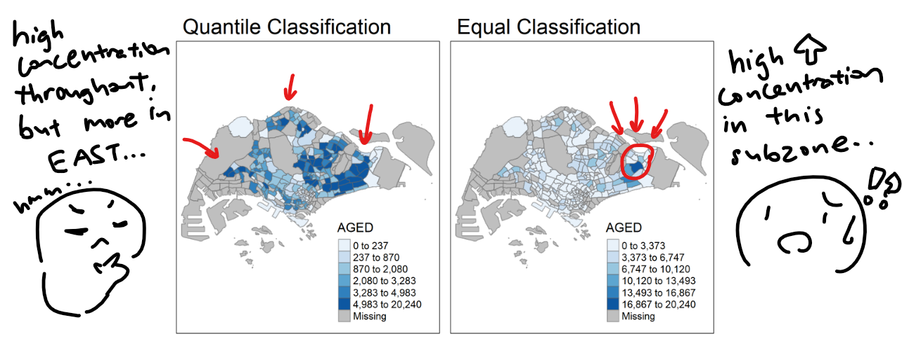
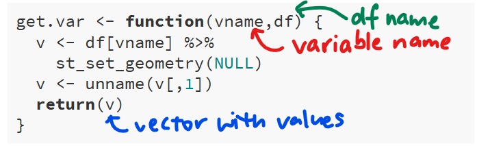
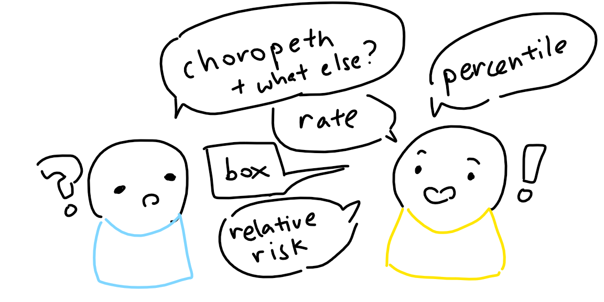
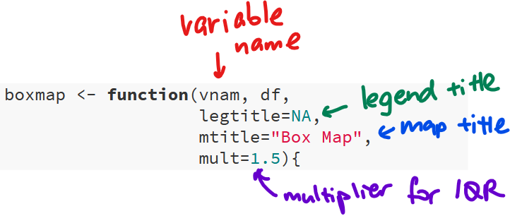

```{r setup, include=FALSE}
knitr::opts_chunk$set(echo = TRUE, 
                      eval = TRUE,
                      message = FALSE,
                      warning = FALSE)
```


```{r echo=FALSE}
packages = c('sf', 'tmap', 'tidyverse')
for (p in packages){
  if(!require(p, character.only = T)){
    install.packages(p)
  }
  library(p,character.only = T)
}
```

## 1.0 Overview
Before we start, you might be thinking, "Wait, don't we already know how to create choropeth maps from [Hands-On Exercise 03](https://is415-msty.netlify.app/posts/2021-09-02-hands-on-exercise-3)? What else do we need?" It's true that choropeth maps are a great statistical representation of our data, but they are just as often misrepresented or misinterpreted. For example, take the following:

```{r echo=FALSE}
mpszpop2020 <- read_rds("data/rds/mpszpop2020.rds")
```


```{r echo=FALSE, eval=TRUE}
map1 = tm_shape(mpszpop2020)+
  tm_fill("AGED",
          n = 6,
          style = "quantile",
          palette = "Blues") +
  tm_borders(alpha = 0.5) +
  tm_layout(main.title="Quantile Classification")
```

```{r echo=FALSE, eval=TRUE}
map2 = tm_shape(mpszpop2020)+
  tm_fill("AGED",
          n = 6,
          style = "equal",
          palette = "Blues") +
  tm_borders(alpha = 0.5) +
  tm_layout(main.title="Equal Classification")
```

```{r echo=FALSE, eval=TRUE, fig.retina=3, fig.height=4}
tmap_arrange(map1,map2)
```

These maps are using the same data, but they look different because of their data classification methods: the map on the left uses the quantile classification method while the one on the right uses the equal interval classification method. As a result, the viewer would have different takeaways from viewing the maps:

<center>

</center>

This, of course, has **far-reaching implications and real-world consequences**. For example, in the context of the ongoing global pandemic COVID-19, local authorities are concerned about the senior citizens in our country who are more susceptible and have a higher risk factor. As such, they need to find out which subzones have extremely high numbers of aged population, and roll out more measures in said subzones - perhaps more check-ins, higher priority on particular resources etc. that would undoubtedly have *life-saving* consequences. 

From the maps above, they can either choose to focus all their attention on one particular subzone (equal classification), or they might spread their resources out over a wide area, with a particular focus on central-to-east subzones (quantile classification). **But how do we know which one is correct?** Focusing all their efforts in one sole subzone could lead to missing out on other subzones that might have a middling amount of senior citizens but a high *concentration* - affecting the lives of thousands, or tens or thousands. Having their focus on many subzones across the whole island, on the other hand, might mean spreading their resources too thin - which has similar negative effects on tens of thousands of civilian lives.

**To get an accurate understanding of the data, and to truthfully display that - this is the crux of the issue that we face when creating visualisations.** And the best way to do that is to have a wide variety of visualisations on hand - which is what we'll be learning in this week's in-class exercise!

## 2.0 Writing Functions
Let's write functions! They're preferred over copy-and-pasting your past formulae: you can update your function as requirements change instead of needing to update the copy-pasted code one-by-one, AND reduce the risk of human error (read: mistakes!) that comes with copy-pasting code, such as forgetting to update a variable name.

In this section, we'd like to write a function to extract a variable as a vector. We presently have our `mpsz2020` data - let's clean it up a little and check for its summary statistics:

```{r}
mpszpop2020a <- mpszpop2020 %>%
  drop_na()

percent <- c(0,.01,.1,.5,.9,.99,1)
var <- mpszpop2020a["DEPENDENCY"] %>%
  st_set_geometry(NULL)
quantile(var[,1], percent)
```

Now, let's actually create the function!

```{r}
get.var <- function(vname,df) {
  v <- df[vname] %>% 
    st_set_geometry(NULL)
  v <- unname(v[,1])
  return(v)
}
```

<center>
{width=50%}
</center>

We'll be using this in Section 3.2 Percentile Maps, so keep it in the back of your mind! `r emo::ji("muscle")`

## 3.0 Extreme Value Visaulisations
There are many ways we can visualise extreme values, and in this section we'll learn about boxplots and extreme value maps! Extreme value maps help 'spatialize EDA', and are variations of common choropleth maps where the classification is designed to highlight extreme values at the lower and upper end of the scale, with the goal of identifying outliers. 

<center>
{width=50%}
</center>

### 3.1 Boxplots
Boxplots are a great way to show the statistics & distribution of data values - and especially to look at outliers! 

```{r echo=FALSE, eval=TRUE,fig.retina=3, fig.align='center', fig.height=5, fig.width=4}
ggplot(data=mpszpop2020, 
       aes(x = "", 
           y = AGED)) +
  geom_boxplot()
```

However, a downside is that they're unable to reveal the spatial distribution of said outliers - which is why we use them primarily for EDA and turn to maps for visualisation when it comes to geospatial data.

### 3.2 Percentile Maps

#### 3.2.1 Introduction to Percentile Maps
The percentile map is a special type of quantile map with six specific categories: 0-1%,1-10%, 10-50%,50-90%,90-99%, and 99-100%. Also, remember the function we wrote in 2.0 Writing Functions? We'll be putting that to good use now!

```{r}
percent <- c(0,.01,.1,.5,.9,.99,1)
var <- get.var("DEPENDENCY", mpszpop2020a)
bperc <- quantile(var,percent)
tm_shape(mpszpop2020) +
  tm_polygons() +
tm_shape(mpszpop2020a) +
  tm_fill("DEPENDENCY",
          title="DEPENDENCY",
          breaks=bperc,
          palette="Blues",
          labels=c("< 1%", "1% - 10%",
                   "10% - 50%", 
                   "50% - 90%",
                   "90% - 99%", 
                   "> 99%"))  +
  tm_borders() +
  tm_layout(title = "Percentile Map", 
            title.position = c("right",
                               "bottom"))
```

#### 3.2.2 Writing a `percentmap` function
That looks good! But, having to write this every time we want a map is taxing... so let's put what we learned in 2.0 Writing Functions to use, and write a handy percent map function that'll visualise a percentile map for whichever variable we'd like `r emo::ji("sparkles")`

```{r}
percentmap <- function(vnam, df, legtitle=NA, mtitle="Percentile Map"){
  percent <- c(0,.01,.1,.5,.9,.99,1)
  var <- get.var(vnam,df)
  bperc <- quantile(var,percent)
  tm_shape(mpszpop2020) +
  tm_polygons() +
  tm_shape(df) +
     tm_fill(vnam,
             title=legtitle,
             breaks=bperc,
             palette="Blues",
          labels=c("< 1%", "1% - 10%", "10% - 50%", "50% - 90%", "90% - 99%", "> 99%"))  +
  tm_borders() +
  tm_layout(title = mtitle, title.position = c("right","bottom"))
}
```

Let's test out our function:

```{r}
youngmap <- percentmap("YOUNG", mpszpop2020a)
agedmap <- percentmap("AGED", mpszpop2020a)
```

```{r echo=FALSE, eval=TRUE, fig.retina=3, fig.height=4}
tmap_arrange(youngmap,agedmap)
```

### 3.3 Box Maps
A box map displays summary statistics on a choropleth map by using the basic principles of boxplot. We'll use a custom breaks specification when creating a box map - though note that these vary depending on whether lower or upper outliers are present.

#### 3.3.1 Writing a `boxbreaks` function
Let's create a function that'll create break points for our boxmap! It needs to consider if there are lower/upper outliers, and returns us a vector of breakpoints.

```{r}
boxbreaks <- function(v,mult=1.5) {
  qv <- unname(quantile(v))
  iqr <- qv[4] - qv[2]
  upfence <- qv[4] + mult * iqr
  lofence <- qv[2] - mult * iqr
  # initialize break points vector
  bb <- vector(mode="numeric",length=7)
  # logic for lower and upper fences
  if (lofence < qv[1]) {  # no lower outliers
    bb[1] <- lofence
    bb[2] <- floor(qv[1])
  } else {
    bb[2] <- lofence
    bb[1] <- qv[1]
  }
  if (upfence > qv[5]) { # no upper outliers
    bb[7] <- upfence
    bb[6] <- ceiling(qv[5])
  } else {
    bb[6] <- upfence
    bb[7] <- qv[5]
  }
  bb[3:5] <- qv[2:4]
  return(bb)
}
```

Now, let's test it out!

```{r}
mpszpop2020a <- mpszpop2020 %>%
  filter(AGED>=0)
var <- get.var("AGED", mpszpop2020a)
boxbreaks(var)
```

#### 3.3.2 Writing a `boxmap` function
Now that we have our `boxbreaks` function, we'll need to map it out! Like in 3.1 Percentile Maps, let's make a handy function to help us:

```{r}
boxmap <- function(vnam, df, 
                   legtitle=NA,
                   mtitle="Box Map",
                   mult=1.5){
  var <- get.var(vnam,df)
  bb <- boxbreaks(var)
  tm_shape(mpszpop2020) +
    tm_polygons() +
  tm_shape(df) +
     tm_fill(vnam,title=legtitle,
             breaks=bb,
             palette="Blues",
          labels = c("lower outlier", 
                     "< 25%", 
                     "25% - 50%", 
                     "50% - 75%",
                     "> 75%", 
                     "upper outlier"))  +
  tm_borders() +
  tm_layout(title = mtitle, 
            title.position = c("right",
                               "bottom"))
}
```

<center>
{width=75%}
</center>

Let's test it out:

```{r fig.retina=4, fig.height=5}
boxmap("ECONOMY ACTIVE", mpszpop2020a)
```

From the map, we can see that there are 6 upper outliers - in context of our data, there are 6 planning subzones with extremely high numbers of aged population, and out of those 6, 4 of them are clustered around the Eastern region.

> Note: the inclusion of tm_shape(mpszpop2020) allows the map to keep its shape, even if there are areas with no/missing data! Without it, your map would look weirdly potato-shaped, like so:

```{r echo=FALSE}
potatoboxmap <- function(vnam, df, 
                   legtitle=NA,
                   mtitle="Box Map",
                   mult=1.5){
  var <- get.var(vnam,df)
  bb <- boxbreaks(var)
  tm_shape(df) +
     tm_fill(vnam,title=legtitle,
             breaks=bb,
             palette="Blues",
          labels = c("lower outlier", 
                     "< 25%", 
                     "25% - 50%", 
                     "50% - 75%",
                     "> 75%", 
                     "upper outlier"))  +
  tm_borders() +
  tm_layout(title = mtitle, 
            title.position = c("right",
                               "bottom"))
}
```

```{r fig.retina=4, fig.height=5}
potatoboxmap("ECONOMY ACTIVE", mpszpop2020a)
```

### 3.4 Rate Maps
<center>
{width=50%}
</center>

As our friends at xkcd put it, the population is not evenly distributed across the map. As such, counting-based map distributions maps roughly start representing the population instead of our topic of interest For example:

```{r echo=FALSE}
mapa = qtm(mpszpop2020, "TOTAL",
    title = "Distribution of total population, 2020")
```

```{r echo=FALSE}
mapb = qtm(mpszpop2020, "AGED",
    title = "Distribution of aged population, 2020")
```

```{r echo=FALSE, eval=TRUE, fig.retina=3, fig.height=4}
tmap_arrange(mapa,mapb)
```

This is where a rate map comes in! Let's computer the raw rate first:

```{r}
mpszpop2020rate <- mpszpop2020 %>%
  mutate(`AGED%` = (`AGED`
/`TOTAL`)*100) %>%
  filter(`AGED%` >= 0)
```

And use our handy `boxmap` function to plot to raw rate map:

```{r fig.retina=4, fig.height=5}
var <- get.var("AGED%", mpszpop2020rate)
boxbreaks(var)
boxmap("AGED%",mpszpop2020rate)
```

Now we can see the difference:

```{r echo=FALSE}
absmap = boxmap("AGED",mpszpop2020rate)
```

```{r echo=FALSE}
ratemap = boxmap("AGED%",mpszpop2020rate)
```

```{r echo=FALSE, eval=TRUE, fig.retina=4, fig.height=5}
tmap_arrange(absmap,ratemap)
```
