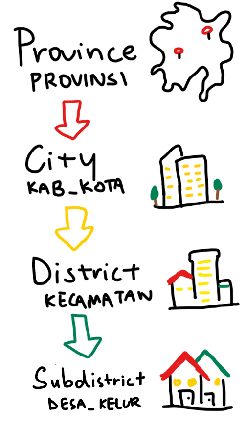
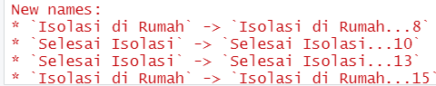
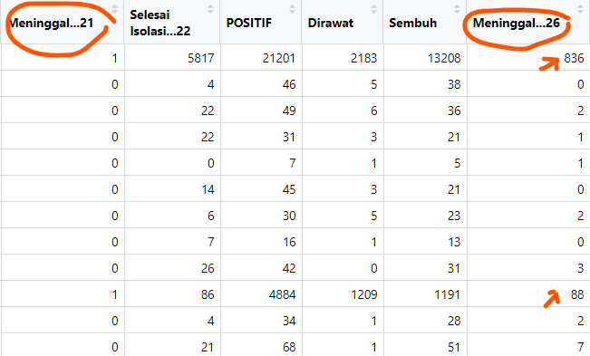
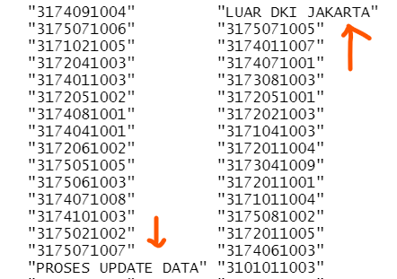
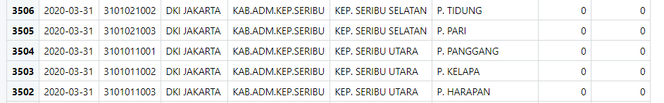
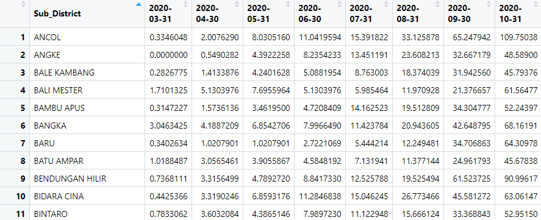
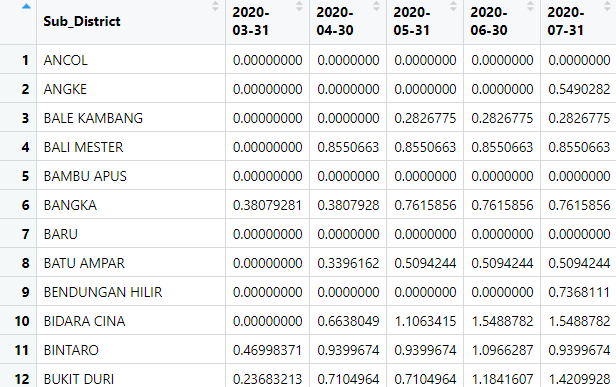
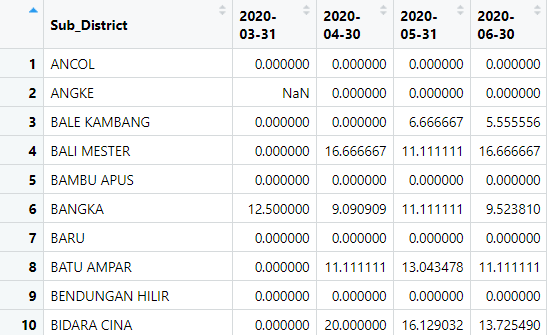
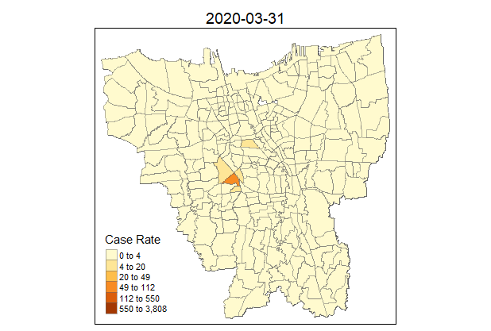
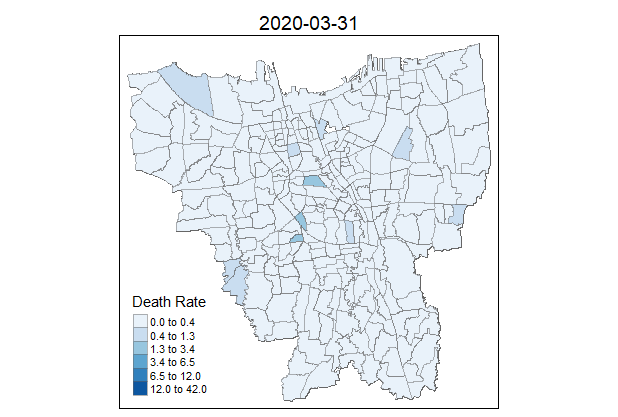

```{r setup, include=FALSE}
knitr::opts_chunk$set(echo = TRUE, 
                      eval = TRUE,
                      message = FALSE,
                      warning = FALSE,
                      fig.retina = 3)
```

## 1.0 Overview

### 1.1 Background
On 2nd March 2020, alarm bells rang across Indonesia: newspapers countrywide printed the same headline, radio stations blared, and worried eyes turned to a televised statement from Preisdent Joko Widodo.

He had just confirmed the first two cases of COVID-19 in the country.

This would mark the start of COVID-19's influence on Indonesia, spanning over 4 million confirmed cases and over 130,000 reported cumulative deaths to date of writing, and marking Indonesia as the country with the highest number of report COVID-19 cases in Southeast Asia. A quick look at [Indonesia's official COVID-19 Distribution Map](https://covid19.go.id/peta-sebaran) introduces a statistical overview and an approximate geographical estimation of the hardest-hit areas. Yet the breadth of its content belies a level of generalisation - which makes it hard to do analysis on a finer-grained level. 

Why does this matter? Out of the 34 provinces in Indonesia, DKI Jakarta made up close to 24% of cumulative confirmed cases - a shocking statistic that bears looking into. As such, our goal is to dive deeper into sub-district levels of data and visualise the spatio-temporal patterns in DKI Jakarta.

## 1.2 Problem Statement
This analysis aims to *visualise and understand* the spatio-temporal patterns of COVID-19 cases in DKI Jakarta and its sub-districts, with our goals being:

- Examine sub-districts that have a higher number of confirmed cases and deaths relative to other sub-districts and to their own population size (i.e. the rate of cases/death, not the number of cases/deaths)
- Reveal the spatio-temporal patterns of COVID-19 cases in the DKI Jakarta province on a sub-district level
- Research possible underlying reasons for particular COVID-19 cumulative case/death trends on a sub-district level

## 2.0 Setup

### 2.1 Packages Used
The R packages we'll use for this analysis are:

- **sf**: used for importing, managing, and processing geospatial data
- **tidyverse**: a collection of packages for data science tasks
- **tmap**: used for creating thematic maps, such as choropleth and bubble maps
- **maptools**: a set of tools for manipulating geographic data
- **kableExtra**: an extension of kable, used for table customisation
- **plyr**: used for splitting data, applying functions and combining results

In addition, the following **tidyverse** packages will be used:

- **readxl** for importing Excel worksheets (.xlsx)
- **tidyr** for manipulating and tidying data
- **dplyr** for wrangling and transforming data
- **ggplot2** for visualising data

```{r}
# initialise a list of required packages
# note that 'readxl' is in the list of packages despite being part of tidyverse: as readxl is not a core tidyverse package, it needs to be loaded explicitly
packages = c('plyr', 'sf', 'tidyverse', 'readxl', 'tmap', 'maptools', 'kableExtra')

# for each package, check if installed and if not, install it
for (p in packages){
  if(!require(p, character.only = T)){
    install.packages(p)
  }
  library(p,character.only = T)
}
```

### 2.2 Datasets Used

```{r}
# initialise a dataframe of our geospatial and aspatial data details
datasets <- data.frame(
  Type=c("Geospatial",
         "Aspatial"),
  Name=c("[Batas Desa Provinsi DKI Jakarta](https://www.indonesia-geospasial.com/2020/04/download-shapefile-shp-batas-desa.html)",
         "[Standar Kelurahan Data Corona (Monthly)](https://riwayat-file-covid-19-dki-jakarta-jakartagis.hub.arcgis.com/)"),
  Format=c("Shapefile", 
           ".xlsx"),
  Description=c("Sub-districts in DKI Jakarta",
                "Sub-district level data of daily COVID-19 cases in DKI Jakarta  
                between March 2020~July 2021")
  )

# with reference to this guide on kableExtra:
# https://cran.r-project.org/web/packages/kableExtra/vignettes/awesome_table_in_html.html
# kable_material is the name of the kable theme
# 'hover' for to highlight row when hovering, 'scale_down' to adjust table to fit page width
library(knitr)
library(kableExtra)
kable(head(datasets), caption="Datasets Used") %>%
  kable_material("hover", latex_options="scale_down")
```

To retrieve the monthly cumulative records for the COVID-19 cases in Jakarta, we took the data compiled on the last day of each month, *with an exception*: there was a broken link for the 31st January 2021 data file, hence the 30th January 2021 data file was used instead.

## 3.0 Data Wrangling: Geospatial Data
### 3.1 Importing Geospatial Data

```{r}
# bd stands for "batas desa", translated as "village boundary"
# reads in geospatial data and stores into bd_jakarta dataframe
bd_jakarta <- st_read(dsn="data/geospatial",
                      layer="BATAS_DESA_DESEMBER_2019_DUKCAPIL_DKI_JAKARTA")
```

From the output message, we learn that:

- Geometry type is multipolygon
- 269 features, 161 fields
- Assigned CRS is [WGS 84](https://epsg.io/4326), the 'World Geodetic System 1984'. That doesn't seem appropriate - we'll come back to that later in 3.3

### 3.2 Data Pre-Processing
Before we even start visualising our data, we have to first check for two things: invalid geometries and missing values, which could impact future calculations and representations.

*Reference was taken from the senior sample submissions for the code for this section, with credit to Xiao Rong Wong's [Geographic Analysis of the Supply & Demand of Childcare Services in Singapore](https://rpubs.com/xiaorongw/IS415_Take-home_Ex01)*

#### 3.2.1 Invalid Geometries
Let us first check for invalid geometries:

```{r}
# function breakdown:
# the st_is_valid function checks whether a geometry is valid
# which returns the indices of certain values based on logical conditions
# length returns the length of data objects

# checks for the number of geometries that are NOT valid
length(which(st_is_valid(bd_jakarta) == FALSE))

# Alternative Method
# test <- st_is_valid(bd_jakarta,reason=TRUE)
# length(which(test!= "Valid Geometry"))
# credit to Rajiv Abraham Xavier https://rpubs.com/rax/Take_Home_Ex01
```

There are no invalid geometries.

#### 3.2.2 Missing Values
Now, let us check for missing values:

```{r}
# the rowSums(is.na(bd_jakarta))!=0 checks every row if there are NA values, returning TRUE or FALSE
# the bd_jakarta 'wrapper' prints said rows that contain NA values
bd_jakarta[rowSums(is.na(bd_jakarta))!=0,]
```

That's a long output! There are too many columns, and it'll clutter up future analysis - which we'll take care of in 3.5. As we can see, there are two particular rows with missing values for `KAB_KOTA` (City), `KECAMATAN` (District) and `DESA_KELUR` (Village), as well as a few other fields - specifically, OBJECT_ID 25645 and 25646. We'll remove them:

```{r}
# removes rows that have an NA value in DESA_KELUR
# in context of this data, we can use other columns, such as KAB_KOTA or KECAMATAN
# but since we're looking at this on a sub-district level, DESA_KELUR seemed most appropriate
bd_jakarta <- na.omit(bd_jakarta,c("DESA_KELUR"))
```

### 3.3 Verifying + Transforming Coordinate System
Let us check the CRS of `bd_jarkarta`:

```{r}
# retrieves the coordinate system of bd_jakarta
st_crs(bd_jakarta)
```

As we can see, the assigned coordinates system is [WGS 84](https://epsg.io/4326), the 'World Geodetic System 1984'. In the context of this dataset, this isn't appropriate: as this is an Indonesian-specific geospatial dataset, we should be using the national CRS of Indonesia, [DGN95](https://epsg.io/23845), the 'Datum Geodesi Nasional 1995', ESPG code 23845. Let's rectify that:

```{r}
# transforms the CRS to DGN95, ESPG code 23845
bd_jakarta <- st_transform(bd_jakarta, 23845)
```

Let us check if the CRS has been properly assigned:

```{r}
st_crs(bd_jakarta)
```

Success! `r emo::ji("smile")`

### 3.4 Removal of Outer Islands
We've finished our standard pre-processing! Let's quickly visualise the data...

```{r} 
# plots the geometry only
# alternatively, we can use plot(bd_jakarta$geometry)
plot(st_geometry(bd_jakarta))
```

As we can see, `bd_jakarta` includes both the mainland and the outer islands. As per the assignment requirements, since the outer islands aren't relevant to our analysis, we'll have to remove them.

There are a few ways we can do this - but the best way would be to explore our data. From 3.2.2, we saw an output of all the fields - and drew attention to `KAB_KOTA` (City), `KECAMATAN` (District) and `DESA_KELUR` (Village). 

<center>

</center

Of these three, KAB_KOTA would be the logical choice: it's the coarsest-grained level of distinction. Let's check for its unique values:

```{r}
# ouputs unique values of the KAB_KOTA field
unique(bd_jakarta$"KAB_KOTA")
```

As we can see, all cities within Jakarta have a `JAKARTA` prefix, while `KEPULAUAN SERIBU` (translated to 'Thousand Islands') refers to the outer islands. Just to check, we can visualise `KAB_KOTA`:

```{r}
# with bd_jakarta as the input data (setting the 'base')
# draw the KAB_KOTA (city) polygons
# essentially shades the map according to the city divisions
tm_shape(bd_jakarta) + 
  tm_polygons("KAB_KOTA")
```

Now that we know how to identify the outer islands, it's time to remove them:

```{r}
# filters out the outer islands by accepting only if the value of KAB_KOTA is NOT KEPULAUAN SERIBU
bd_jakarta <- filter(bd_jakarta, KAB_KOTA != "KEPULAUAN SERIBU")
```

### 3.5 Retaining first 9 fields of `bd_jakarta`
In addition, the assignment requires us to retain the only the fields relevant to our analysis - in other words, the first 9 fields in the `bd_jakarta` data frame.

```{r}
# filters out other fields by accepting only the first 9 fields
bd_jakarta <- bd_jakarta[, 0:9]
```

### 3.6 Renaming Columns with Translation
Lastly, let's translate the column names of `bd_jakarta` into English for ease of comprehension:

```{r}
# with reference to: https://www.codegrepper.com/code-examples/r/rename+column+name+in+r
# renames the columns in the style New_Name = OLD_NAME
bd_jakarta <- bd_jakarta %>% 
  dplyr::rename(
    Object_ID=OBJECT_ID,
    Province=PROVINSI, 
    City=KAB_KOTA, 
    District=KECAMATAN, 
    Village_Code=KODE_DESA, 
    Village=DESA, 
    Sub_District=DESA_KELUR,
    Code=KODE, 
    Total_Population=JUMLAH_PEN
    )
```

### 3.7 Brief EDA
Before we move on into importing the aspatial data and into the meat of our geovisualiastion, it's important to get a feel for the data that we're working with, especially on the sub-district level. As such, let's take a quick glimpse:

```{r}
# reveals the data type of all fields + some values
glimpse(bd_jakarta)
```

```{r}
# checks for number of unique sub-districts
length(unique(bd_jakarta$"Sub_District"))
length(unique(bd_jakarta$"District"))
```

Note that there are 261 unique sub-districts, and 42 unique distrcits. The max number of categories for mapping with tmap is 30 - and even though we can adjust the max.categories in tmap_options, 261 segmented sections (and even 42 sections) on a single map is too fragmented and minute for human eyes. As such, the only level which is human-readable is the 'City' level:

```{r}
# shades the map according to the city divisions
tm_shape(bd_jakarta) + 
  tm_polygons("City")
```

## 4.0 Data Wrangling: Aspatial Data
### 4.1 Pre-Importing EDA
In our 'data/aspatial' folder, we have multiple .xlsx files ranging from 30 March 2020 to July 2021. However, before we start compiling all of our data, it's important to understand what we're working with and to check for any discrepancies, so let's perform a brief EDA:

```{r}
# reads the 31st March 2020 .xlsx aspatial data and stores it as mar2020
mar2020 <- read_xlsx("data/aspatial/Standar Kelurahan Data Corona (31 Maret 2020 Pukul 08.00).xlsx")
glimpse(mar2020)
```

*glimpse()* reveals to us that there is a duplicate `ID_KEL` column - which  our *read_xlsx()* function then auto-assigns with a '...n', like so:

<center>
{width=50%}
</center>

This duplication extends from March 2020 to June 2020, after which another duplicate occurs in July 2020:

```{r}
# reads the 31st July 2020 .xlsx aspatial data and stores it as jul2020
jul2020 <- read_xlsx("data/aspatial/Standar Kelurahan Data Corona (31 Juli 2020 Pukul 09.00).xlsx")
glimpse(jul2020)
```

<center>
{width=75%}
</center>

This time, there are duplicates of the `Isolasi di Rumah`, `Selasi Isolasi` and `Meninggal` columns, and this duplication extends till August 2021. While this might seem concerning, we'll address this in the following sections.

### 4.2 Creating an Aspatial Data Pre-processing Function
Firstly, let us list down the requirements for our aspatial data:

- we only need particular columns of interest (listed below)
- we need to create an extra Date column that has the month and year of the observation, which was originally in the file name
    - each file has a regular naming format: Standar Kelurahan Data Corona (DD Month YYYY Pukul Ti.me)
    - the months in the naming format are in Bahasa Indonesia - for ease of comprehension, we should convert it to English
- there are varying duplicates in each .xlsx that needs to be removed
    - as such, we should ensure that read_xlsx does NOT auto-rename the columns when importing
    - after which, duplicated columns should be removed with the handy [*duplicated()*](https://www.rdocumentation.org/packages/base/versions/3.6.2/topics/duplicated) function which returns which elements (rows) are duplicates
    - in addition, for the `Meninggal` column we should keep the LAST duplicate, which properly reflects the cumulative death cases

<center>
{width=75%}
</center>

Our columns of interest (those that are relevant to our analysis) are as follows:

- Name_provinsi (Province)
- name_kota (City)
- nama_kecamatan (District)
- nama_kelurahan (Sub-District)
- Meninggal (Cumulative Death Cases)
- POSITIF (Cumulative Confirmed Cases)
- month
- ID

Now that we know our requirements, we can do this step-by-step: importing all the files into one df, retaining the necessary columns (and deleting duplicate columns), then adding the `date` column. Alternatively, we can combine all of these into a function!
    
```{r}
# takes in an aspatial data filepath and returns a processed output
aspatial_preprocess <- function(filepath){
  # the .name_repair="minimal" is to indicate not to replace duplicate column names with 'NAME...n' like we saw above!
  # reference: https://readxl.tidyverse.org/articles/articles/column-names.html
  result_file <- read_xlsx(filepath, .name_repair="minimal")
  
  # Remove Duplicate Columns
  # essentially, it's saying "take the columns that aren't duplicated, and if there are duplicates, take the last duplicate"
  # we use fromLast = TRUE to ensure that we keep the last duplicated column
  # reference: https://www.marsja.se/how-to-remove-duplicates-in-r-rows-columns-dplyr/
  # reference: https://stackoverflow.com/questions/16905425/find-duplicate-values-in-r
  result_file <- result_file[, !duplicated(colnames(result_file), fromLast = TRUE)] 
  
  # Create the Date Column
  # the format of our files is: Standar Kelurahan Data Corona (DD Month YYYY Pukul Ti.me)
  # while the start is technically "(", "(" is part of a regular expression and leads to a warning message, so we'll use "Corona" instead. The [[1]] refers to the first element in the list.
  # we're loading it as DD-Month-YYYY format
  # the end is 1 space before "Pukul", which means we have to -2 spaces (one for P, one for space)
  # as such, the most relevant functions are substr (returns a substring) and either str_locate (returns location of substring as an integer matrix) or gregexpr (returns a list of locations of substring)
  # reference https://stackoverflow.com/questions/14249562/find-the-location-of-a-character-in-string
  startpoint <- gregexpr(pattern="Corona", filepath)[[1]] + 8
  endpoint <- gregexpr(pattern="Pukul", filepath)[[1]] - 2
  result_file$Date <- substr(filepath, startpoint, endpoint)
  
  # Retain the Relevant Columns
  result_file <- result_file %>% 
    select("Date", 
           "ID_KEL", 
           "Nama_provinsi", 
           "nama_kota", 
           "nama_kecamatan", 
           "nama_kelurahan", 
           "POSITIF", 
           "Meninggal")
  return(result_file)
}
```

### 4.3 Feeding Files into our `aspatial_preprocess` function
Now that we have our custom function to preprocess aspatial data, we need to feed file into it. There's the option of doing it manually, inputting our file names line by line - but with a handy function called *list.files()* and [*lapply()*](https://www.rdocumentation.org/packages/base/versions/3.6.2/topics/lapply) (that applies a function to all elements in a list), the process can be cut down to a few lines!

```{r} 
# in the folder 'data/aspatial', find files with the extension '.xlsx' and add it to our fileslist 
# the full.names=TRUE prepends the directory path to the file names, giving a relative file path - otherwise, only the file names (not the paths) would be returned 
# reference: https://stat.ethz.ch/R-manual/R-devel/library/base/html/list.files.html
fileslist <-list.files(path = "data/aspatial", pattern = "*.xlsx", full.names=TRUE)

# afterwards, for every element in fileslist, apply aspatial_process function
dflist <- lapply(seq_along(fileslist), function(x) aspatial_preprocess(fileslist[x]))
```

Lastly, we'll need to convert the `dflist` into an actual dataframe with [*ldply()*](https://www.rdocumentation.org/packages/plyr/versions/1.8.6/topics/ldply), like so:

```{r} 
cases_jakarta <- ldply(dflist, data.frame)
```

Let's check what `cases_jakarta` looks like, and make sure the columns are correct:

```{r} 
glimpse(cases_jakarta)
```

### 4.4 Formatting Date Column
Since the values in the `Date` column were derived from substrings, they're naturally in string format. We should [convert that into datetime](https://www.rdocumentation.org/packages/base/versions/3.6.2/topics/as.Date), keeping in mind that the values in `Date` are in Bahasa Indonesia

```{r} 
# parses the 'Date' column into Month(Full Name)-YYYY datetime objects
# reference: https://stackoverflow.com/questions/53380650/b-y-date-conversion-gives-na

# locale="ind" means that the locale has been set as Indonesia
Sys.setlocale(locale="ind")
cases_jakarta$Date <- c(cases_jakarta$Date) %>% 
  as.Date(cases_jakarta$Date, format ="%d %B %Y")

glimpse(cases_jakarta)
```

### 4.4 Renaming Columns with Translation
Just like what we did in 3.6, we'll translate the column names to English for ease of comprehension:

```{r}
# renames the columns in the style New_Name = OLD_NAME
cases_jakarta <- cases_jakarta %>% 
  dplyr::rename(
    Date=Date,
    ID=ID_KEL,
    Province=Nama_provinsi, 
    City=nama_kota, 
    District=nama_kecamatan, 
    Sub_District=nama_kelurahan,
    Cases=POSITIF, 
    Deaths=Meninggal
    )
```

### 4.5 Further Data Processing
Now that we have our confirmed dataframe, let's execute any pre-processing we might have missed. Firstly, let's check for missing values:

```{r}
# returns rows that contain NA values
cases_jakarta[rowSums(is.na(cases_jakarta))!=0,]
```

Since those rows have missing values from their ID all the way to their sub-districts, they should be removed accordingly:

```{r}
# removes rows that have an NA value in ID
cases_jakarta <- na.omit(cases_jakarta,c("ID"))
```

<center>
{width=50%}
</center>

In addition, a brief inspection of `cases_jakarta` reveals abnormal values for the `ID` column: specifically, BELUM DIKETAHUI, PROSES UPDATE DATA and LUAR DKI JAKARTA. Let's remove them:

```{r}
# removes the rows where ID is BELUM DIKETAHUI, PROSES UPDATE DATA and LUAR DKI JAKARTA
cases_jakarta <- cases_jakarta[!(cases_jakarta$ID=="BELUM DIKETAHUI" | 
                                   cases_jakarta$ID=="PROSES UPDATE DATA" | 
                                   cases_jakarta$ID=="LUAR DKI JAKARTA") ,]
```

Lastly, we want to remove any records from the Outer Islands where the City is, like these:

<center>
{width=75%}
</center>

```{r}
# filters out the outer islands by accepting only if the value of City is NOT KAB.ADM.KEP.SERIBU
cases_jakarta <- filter(cases_jakarta, City != "KAB.ADM.KEP.SERIBU")
```

With that, we're done with the data importing and pre-processing! Let's move on into the next section `r emo::ji("flexed_biceps")` 

## 5.0 Geospatial Data Integration
### 5.1 Preliminary joining + EDA
Now that we have both the geospatial and aspatial data frames, we'll need to join them. A quick look at their headers tell us what their common fields are:

```{r}
# checks for column names of the dataframes
colnames(bd_jakarta)
colnames(cases_jakarta)
```

It seems that the Province, City, Distict and Sub_District should match up. Let's try doing that first:

```{r}
# joins cases_jakarta to bd_jakarta based on Province, Sub_District and City
combined_jakarta <- left_join(bd_jakarta, cases_jakarta,
                              by=c(
                                "Province"="Province", 
                                "Sub_District"="Sub_District",
                                "City"="City")
                              )
```

Now, let's visualise our current `combined_jakarta` in terms of cases and deaths:

```{r}
# maps the Cases and Deaths side-by-side
prelim_cases = tm_shape(combined_jakarta)+
  tm_fill("Cases") +
  tm_borders(alpha = 0.5) +
  tm_layout(main.title="Preliminary Cases Count")

prelim_deaths = tm_shape(combined_jakarta)+
  tm_fill("Deaths") +
  tm_borders(alpha = 0.5) +
  tm_layout(main.title="Preliminary Death Count")

tmap_arrange(prelim_cases, prelim_deaths)
```

Hmm, that's not quite right. There are still some 'missing' values, but we've taken care to remove NA records from both sets of data. The most likely reason for this is due to mistmatched records (one says Berenstein while the other says Berenstain, for example) - which requires addition tweaking and investigation.

### 5.2 Identifying Mismatched Sub-District Records
A brief comparison of the geospatial vs aspatial values reveals to us the mismatch: for the `Sub_District` field, there isn't standardisation of the sub-district names, which leads to the same sub-district being referred to by slightly different names, such as `KRAMAJATI` vs `KRAMAT JATI`. This is why these records appear as 'missing values'. To find all of these discrepancies, we should look for sub-district names that appear in our `cases_jakarta` that don't appear in `bd_jakarta`, like so:

```{r}
# checks for unique values of Sub_District in cases_jakarta that aren't already present in bd_jakarta and vice versa
cases_subdistrict <- c(cases_jakarta$Sub_District)
bd_subdistrict <- c(bd_jakarta$Sub_District)

unique(cases_subdistrict[!(cases_subdistrict %in% bd_subdistrict)])
unique(bd_subdistrict[!(bd_subdistrict %in% cases_subdistrict)])
```

```{r}
# initialise a dataframe of our cases vs bd subdistrict spelling
spelling <- data.frame(
  Aspatial_Cases=c("BALE KAMBANG", "HALIM PERDANA KUSUMAH", "JATI PULO", "KALI BARU", "KAMPUNG TENGAH", "KRAMAT JATI", "KERENDANG", "PAL MERIAM", "PINANG RANTI", "RAWA JATI"),
  Geospatial_BD=c("BALEKAMBAG", "HALIM PERDANA KUSUMA", "JATIPULO", "KALIBARU", "TENGAH", "KRAMATJATI", "KRENDANG", "PALMERIAM", "PINANGRANTI", "RAWAJATI")
  )

# with dataframe a input, outputs a kable
library(knitr)
library(kableExtra)
kable(spelling, caption="Mismatched Records") %>%
  kable_material("hover", latex_options="scale_down")
```

### 5.3 Correcting Mismatched Sub-District Records
Now that we know which sub-district records are mismatched, we need to rectify the mismatches by renaming them:

```{r}
# where bd_jakarta is a mismatched value, replace with the correct value
bd_jakarta$Sub_District[bd_jakarta$Sub_District == 'BALEKAMBANG'] <- 'BALE KAMBANG'
bd_jakarta$Sub_District[bd_jakarta$Sub_District == 'HALIM PERDANA KUSUMA'] <- 'HALIM PERDANA KUSUMAH'
bd_jakarta$Sub_District[bd_jakarta$Sub_District == 'JATIPULO'] <- 'JATI PULO'
bd_jakarta$Sub_District[bd_jakarta$Sub_District == 'KALIBARU'] <- 'KALI BARU'
bd_jakarta$Sub_District[bd_jakarta$Sub_District == 'TENGAH'] <- 'KAMPUNG TENGAH'
bd_jakarta$Sub_District[bd_jakarta$Sub_District == 'KRAMATJATI'] <- 'KRAMAT JATI'
bd_jakarta$Sub_District[bd_jakarta$Sub_District == 'KRENDANG'] <- 'KERENDANG'
bd_jakarta$Sub_District[bd_jakarta$Sub_District == 'PALMERIAM'] <- 'PAL MERIAM'
bd_jakarta$Sub_District[bd_jakarta$Sub_District == 'PINANGRANTI'] <- 'PINANG RANTI'
bd_jakarta$Sub_District[bd_jakarta$Sub_District == 'RAWAJATI'] <- 'RAWA JATI'
```

### 5.4 Joining + EDA
Now, we have a standardised common identifier among our geospatial and aspatial dataframes. Let's join them once more:

```{r}
# joins cases_jakarta to bd_jakarta based on Sub_District
combined_jakarta <- left_join(bd_jakarta, cases_jakarta,
                              by=c("Sub_District"="Sub_District")
                              )
```

Now, let's once again visualise our updated `combined_jakarta` in terms of cases and deaths:

```{r}
# maps the Cases and Deaths side-by-side
updated_cases = tm_shape(combined_jakarta)+
  tm_fill("Cases") +
  tm_borders(alpha = 0.5) +
  tm_layout(main.title="Updated Cases Count")

updated_deaths = tm_shape(combined_jakarta)+
  tm_fill("Deaths") +
  tm_borders(alpha = 0.5) +
  tm_layout(main.title="Updated Death Count")

tmap_arrange(updated_cases, updated_deaths)
```

## 5.5 Calculations
Before we move into into EDA and thematic mapping, we need to calculate the cumulative confirmed cases rate (i.e. cases per 10000 population) and the cumulative death rate by month, as per assignment requirements.

#### 5.5.1 Cumulative Confirmed Cases Rate
The cumulative confirmed cases rate can be calculated by summing up the number of cases (based on the name of the sub-district and the date), and then dividing by the total population - but do note that the total population represented in our dataframe represents 10,000 denominations (in other words, this is number of cases for every 10,000 people). This can easily be achieved with [*pivot_wider()*](https://tidyr.tidyverse.org/reference/pivot_wider.html).

```{r}
# grouping based on the sub-district and date
# the cumulative_case_rate is based on the sum of cases over the total population
cases_rate <- cases_jakarta %>%
  inner_join(bd_jakarta, by=c("Sub_District" = "Sub_District")) %>%
  group_by(Sub_District, Date) %>%
  dplyr::summarise(`cumulative_case_rate` = ((sum(Cases)/(Total_Population))*10000)) %>%
  
  #afterwards, pivots the table based on the Dates, using the cumulative case rate as the values
  ungroup() %>% pivot_wider(names_from = Date,
              values_from = cumulative_case_rate)
```

Our `case_rate` will look like this:

<center>
{width=75%}
</center>

#### 5.5.2 Cumulative Death Rate
Assumption: Cumulative Death Rate refers to the total number of deaths, divided by population. For total number of deaths over confirmed cases, also known as the Case Fatality Ratio, please refer to section 5.5.3 below!

```{r}
# grouping based on the sub-district and date
# the cumulative_case_rate is based on the sum of deaths over the total population
death_rate <- cases_jakarta %>%
  inner_join(bd_jakarta, by=c("Sub_District" = "Sub_District")) %>%
  group_by(Sub_District, Date) %>%
  dplyr::summarise(`cumulative_death_rate` = ((sum(Deaths)/(Total_Population))*10000)) %>%
  
  #afterwards, pivots the table based on the Dates, showing the cumulative death rate
  ungroup() %>% pivot_wider(names_from = Date,
              values_from = cumulative_death_rate)
```

<center>
{width=75%}
</center>

#### 5.5.3 Case Fatality Ratio
Case Fatality Ratio, also known as [CFR](https://www.who.int/news-room/commentaries/detail/estimating-mortality-from-covid-19#:~:text=Calculating%20CFR%20Case%20fatality%20ratio,severity%20among%20detected%20cases%3A) is the proportion of individuals diagnosed with a disease who die from that disease. Within this context, it refers to the number of people who contacted COVID-19 and passed away. The CFR is used as a measure of severity among detected cases.

The Case Fatality Ratio can be represented as such:
$$
\text{Case Fatality ratio (CFR, in%)} = \frac{\text{Number of deaths from disease}}{\text{Number of confirmed cases of disease}} * 100
$$

```{r}
# grouping based on the sub-district and date
# the case_fatality_ratio is based on the sum of deaths over confirmed cases
# note that the CFR is in % form, whcih is why we *100
CFR <- cases_jakarta %>%
  inner_join(bd_jakarta, by=c("Sub_District" = "Sub_District")) %>%
  group_by(Sub_District, Date) %>%
  dplyr::summarise(`case_fatality_ratio` = ((sum(Deaths)/sum(Cases))*100)) %>%
  
  #afterwards, pivots the table based on the Dates, showing the cumulative death rate
  ungroup() %>% pivot_wider(names_from = Date,
              values_from = case_fatality_ratio)
```

<center>
{width=75%}
</center>

Note that for CFR, there are some NaN values on account of the case rate (our denominator) being zero. To accurately reflect the CFR, we will not remove those rows or transform from NaN to 0: on a map, they should reflect as 'missing values'.

### 5.6 Converting dataframes to sf objects
Before we move on into the mapping, we should convert these dataframes into sf objects.

```{r}
combined_jakarta <- st_as_sf(combined_jakarta)

# need to join our previous dataframes with the geospatial data to ensure that geometry column is present
cases_rate <- cases_rate%>% left_join(bd_jakarta, by=c("Sub_District"="Sub_District"))
cases_rate <- st_as_sf(cases_rate)

death_rate <- death_rate%>% left_join(bd_jakarta, by=c("Sub_District"="Sub_District"))
death_rate <- st_as_sf(death_rate)

CFR <- CFR%>% left_join(bd_jakarta, by=c("Sub_District"="Sub_District"))
CFR <- st_as_sf(CFR)
```

## 6.0 Mapping: Monthly Cumulative Cases Rate
### 6.1 Jenks Choropleth Map
I'm planning to use the jenks classification method. It 'seeks to minimize the average deviation from the class mean while maximizing the deviation from the means of the other groups' [(source)](https://wiki.gis.com/wiki/index.php/Jenks_Natural_Breaks_Classification) and tends to identify real, natural classes within the data. However, jenks will not work as well if the data has a low variance, so let's check the variance: 

```{r}
# commented out most of the variances due to the increasing variance over time
var(cases_rate$`2020-03-31`)
# var(cases_rate$`2020-04-30`)
# var(cases_rate$`2020-05-31`)
# var(cases_rate$`2020-06-30`)
# var(cases_rate$`2020-07-31`)
# var(cases_rate$`2020-08-31`)
# var(cases_rate$`2020-09-30`)
# var(cases_rate$`2020-10-31`)
# var(cases_rate$`2020-11-30`)
# var(cases_rate$`2020-12-31`)
# var(cases_rate$`2021-01-30`)
# var(cases_rate$`2021-02-28`)
# var(cases_rate$`2021-03-31`)
# var(cases_rate$`2021-04-30`)
# var(cases_rate$`2021-05-31`)
# var(cases_rate$`2021-06-30`)
var(cases_rate$`2021-07-31`)
```

Since the variance is increasing over time and seems significant, we can continue with jenks classification. After some testing, having 6 classes seems to be the optimum: too many classes and it becomes hard for the human eye to differentiate between the gradients, while too few classes makes it hard for any differentiation to be seen.

```{r}
library(tmap)

# using the jenks method, with 6 classes
tmap_mode("plot")
tm_shape(cases_rate)+
  tm_fill("2020-03-31", 
          n= 6,
          style = "jenks", 
          title = "Case Rate") +
  tm_layout(main.title = "Distribution of COVID-19 Case Rate in March 2020",
            main.title.position = "center",
            main.title.size = 1,
            legend.height = 0.5, 
            legend.width = 0.4,
            frame = TRUE) +
  tm_borders(alpha = 0.5)
```

We should plot it for all the months - so let's have a helper function for plotting this!

```{r}
# input: the dataframe and the variable name - in this case, the month 
# with style="jenks" for the jenks classification method
jenks_plot <- function(df, varname) {
  tm_shape(cases_rate) +
    tm_polygons() +
  tm_shape(df) +
    tm_fill(varname, 
          n= 6,
          style = "jenks", 
          title = "Case Rate") +
    tm_layout(main.title = varname,
          main.title.position = "center",
          main.title.size = 1.2,
          legend.height = 0.45, 
          legend.width = 0.35,
          frame = TRUE) +
    tm_borders(alpha = 0.5)
}
```

Now, let's visualise the jenks plots for all months:

```{r}
# split it up into multiple arranges to make it easier to see
library(tmap)
tmap_mode("plot")
tmap_arrange(jenks_plot(cases_rate, "2020-03-31"),
             jenks_plot(cases_rate, "2020-04-30"),
             jenks_plot(cases_rate, "2020-05-31"),
             jenks_plot(cases_rate, "2020-06-30"))

tmap_arrange(jenks_plot(cases_rate, "2020-07-31"),
             jenks_plot(cases_rate, "2020-08-31"),
             jenks_plot(cases_rate, "2020-09-30"),
             jenks_plot(cases_rate, "2020-10-31"))

tmap_arrange(jenks_plot(cases_rate, "2020-11-30"),
             jenks_plot(cases_rate, "2020-12-31"),
             jenks_plot(cases_rate, "2021-01-30"),
             jenks_plot(cases_rate, "2021-02-28"))

tmap_arrange(jenks_plot(cases_rate, "2021-03-31"),
             jenks_plot(cases_rate, "2021-04-30"),
             jenks_plot(cases_rate, "2021-05-31"),
             jenks_plot(cases_rate, "2021-06-30"))

tmap_arrange(jenks_plot(cases_rate, "2021-07-31"))
```

### 6.2 Observations from Jenks Choropleth Map
Do note that each map has its own  *relative* case rate: the ranges gradually grow larger over time with the greater influx of cases. By comparing the change of case rates over the months, there are a number of observations we can make:

- In the early stages (March 2020 ~ May 2020), there is a visible darkly-coloured 'center' slightly to the left of the central Jakarta. In the section below, we learned that this is the `SENAYAN` sub-district with the highest cases_rate, which is likely where the first cases initially appeared.
- Between June 2020 ~ August 2020, there is a noticeable shift for the 'center' with the highest case rate - `GAMBIR`, which would then remain as the sub-district with the highest cases_rate until the end of our data (July 2021)
- There is a noticeable darkening of gradient across majority of the map as we transition from the first quarter (March 2020 ~ May 2020) to the next quarter, with special mentions going to July 2020 and October 2020. While, as mentioned, the ranges for each map are not consistent, it is undeniable that more areas are being affected with increasing severity in the later stages as compared to the earlier stages.
- The month where the case rate was ramping up in severity across the country (and thus had a significant amount of darker areas) would be 2021 February.
- We can roughly track the journey of the COVID-19 'clusters' across the map:
    - Central Cluster: Originated in `SENAYAN`, circulating within central Jakarta before taking root in `GAMBIR`.
    - Southern Cluster: Became prominent in December 2020 onwards, where multiple sub-districts were medium-ly affected. While it pales in comparison to the central cluster, it still has a relatively significant presence.
    - Northeast Cluster: while the 'center' of the cluster (with the most darkest shade) changed frequently in the initial stages, by December 2020 there a pair of confirmed 'center' districts that stayed constant throughout 2021. Close proximity of the northeast cluster with the central cluster (specifically, `GAMBIR`)
    - Additionally, across the map, it seems that a darker colour will likely have similarly dark colours near it, which could be a sign of spreading to neighbouring districts - we'll confirm this in 6.4

Let us check for the sub-districts with the highest cases rate at the various stages:

```{r}
# to check for darkest sub-district in early stages
cases_rate$Village[which.max(cases_rate$`2020-03-31`)]
# to check for darkest sub-district in the later stages
cases_rate$Village[which.max(cases_rate$`2020-08-31`)]

# reorder based on decreasing values for Feb 2021, and assign to a new df
cases_rate_descending <- cases_rate[order(cases_rate$`2021-02-28`,decreasing = TRUE),]
cases_rate_descending_top5 <- cases_rate_descending[1:5,]
cases_rate_descending_top5[,"Sub_District"]
```

As we can see, the top 5 sub-districts with the highest cases rate are:

- `GAMBIR`, which is consistently the top sub-district in that regard, 
- `SENAYAN` where the first batch of cases likely originated (in the sense that that area had multiple cases that increased and spread to surrounding sub-distrcits, not that that was where the first case occurred), 
- and other top districts seem to be `KUNINGAN TIMUR`, `GUNUNG` and `SETIA BUDI`

### 6.3 Spatio-Temporal Mapping with custom breakpoints
In the above section, we saw each map by their *relative* case rate - but to see the spatio-temporal progression of case rates, we should set a fixed range. In this case, customising our breakpoints would be ideal - just like above, we'll be breaking into 6 classes.

Firstly, let's find the maximum of the case_rates - since the highest case rate is logically in the latest month (July 2021), we'll find the maximum case_rate from there:

```{r}
# gets maximum value (case rate) of July 2021 from cases_rate df
max(cases_rate$`2021-07-31`)
```

Now that we know our maximum number, let's set our breakpoints:

```{r eval=FALSE}
# these breakpoints are chosen based on the jenks breaks ranges from the previous section
breakpoints = c(0, 4, 20, 49, 112, 550, 3808)
```

This time, let's test it out on July 2021:

```{r}
library(tmap)
tmap_mode("plot")
tm_shape(cases_rate)+
  tm_fill("2021-07-31", 
          breaks= c(0, 4, 20, 49, 112, 1105, 3808),
          title = "Case Rate") +
  tm_layout(main.title = "Distribution of COVID-19 Case Rate in July 2021 (Spatio-Temporal)",
            main.title.position = "center",
            main.title.size = 1,
            legend.height = 0.5, 
            legend.width = 0.4,
            frame = TRUE) +
  tm_borders(alpha = 0.5)
```

It might seem pretty skewed towards the 'heavier' end, but this is to be expected: after all, this is the end of our dataset where COVID-19 has had over a year of presence in Jakarta. Once again, let's create a helper function to help us:

```{r}
break_plot <- function(df, varname) {
  tm_shape(cases_rate) +
    tm_polygons() +
  tm_shape(df) +
    tm_fill(varname, 
          breaks= c(0, 4, 20, 49, 112, 550, 3808),
          title = "Case Rate") +
    tm_layout(main.title = varname,
          main.title.position = "center",
          main.title.size = 1.2,
          legend.height = 0.45, 
          legend.width = 0.35,
          frame = TRUE) +
    tm_borders(alpha = 0.5)
}
```

Now, let's visualise the custom break plots for all months:

```{r}
# split it up into multiple arranges to make it easier to see
library(tmap)
tmap_mode("plot")
tmap_arrange(break_plot(cases_rate, "2020-03-31"),
             break_plot(cases_rate, "2020-04-30"),
             break_plot(cases_rate, "2020-05-31"),
             break_plot(cases_rate, "2020-06-30"))

tmap_arrange(break_plot(cases_rate, "2020-07-31"),
             break_plot(cases_rate, "2020-08-31"),
             break_plot(cases_rate, "2020-09-30"),
             break_plot(cases_rate, "2020-10-31"))

tmap_arrange(break_plot(cases_rate, "2020-11-30"),
             break_plot(cases_rate, "2020-12-31"),
             break_plot(cases_rate, "2021-01-30"),
             break_plot(cases_rate, "2021-02-28"))

tmap_arrange(break_plot(cases_rate, "2021-03-31"),
             break_plot(cases_rate, "2021-04-30"),
             break_plot(cases_rate, "2021-05-31"),
             break_plot(cases_rate, "2021-06-30"))
             
tmap_arrange(break_plot(cases_rate, "2021-07-31"))
```

### 6.4 Observations from Spatio-Temporal Map

<center>

</center>
*Made by exporting .pngs of individual plots into an online [gifmaker](https://gifmaker.me/)*

Now, we can supplement our observations in 6.2 with a spatio-temporal dimension! Here are the observations made:

- The general trend of the spread seems to (a) target neighboring districts, which reaffirms our observation in 6.2 on how dark sub-districts are likely to have similarly/slightly less dark sub-districts nearby it and (b) 'grows from the center'. We can observe that the gradual darkening seems to originate from the Central Jakarta and then outwards - likely due to COVID-19 crossing sub-district borders and increased rate of infection that comes from more cases (more infected people) within the same geographical boundaries.
- As expected, `SENAYAN`, the top sub-district with the highest cases rate, reached the highest class of case rate first. Accordingly, the other top sub-districts eventually joined the highest class of case rate by the end of the dataset.

## 7.0 Mapping: Monthly Cumulative Death Rate
### 7.1 Jenks Choropleth Map
Like in our monthly cumulative cases in 6.1, we'll be using the jenks classification method for our choropleth map, but we need to check the variance first:

```{r}
var(death_rate$`2020-03-31`)
var(death_rate$`2020-04-30`)
var(death_rate$`2020-05-31`)
var(death_rate$`2020-06-30`)
var(death_rate$`2020-07-31`)
var(death_rate$`2020-08-31`)
var(death_rate$`2020-09-30`)
var(death_rate$`2020-10-31`)
var(death_rate$`2020-11-30`)
var(death_rate$`2020-12-31`)
var(death_rate$`2021-01-30`)
var(death_rate$`2021-02-28`)
var(death_rate$`2021-03-31`)
var(death_rate$`2021-04-30`)
var(death_rate$`2021-05-31`)
var(death_rate$`2021-06-30`)
var(death_rate$`2021-07-31`)
```

The low variance for the initial stages might seem concerning, but it increases over time to a significant level for majority of the data, so we'll continue with this. In addition, we'll be using custom breakpoints in the next section for our spatio-temporal analysis, which will supplement our observations. 

We'll need to tweak our `jenks_plot` helper function a bit due to the class titles:

```{r}
# input: the dataframe and the variable name - in this case, the month 
# with style="jenks" for the jenks classification method
# minor tweak to tm_fill - changed title and palette
jenks_plot <- function(df, varname) {
  tm_shape(cases_rate) +
    tm_polygons() +
  tm_shape(df) +
    tm_fill(varname, 
          n= 6,
          style = "jenks", 
          title = "Death Rate",
          palette="Blues") +
    tm_layout(main.title = varname,
          main.title.position = "center",
          main.title.size = 1.2,
          legend.height = 0.45, 
          legend.width = 0.35,
          frame = TRUE) +
    tm_borders(alpha = 0.5)
}
```

Now, let's visualise the jenks plots for all months:

```{r}
# split it up into multiple arranges to make it easier to see
library(tmap)
tmap_mode("plot")
tmap_arrange(jenks_plot(death_rate, "2020-03-31"),
             jenks_plot(death_rate, "2020-04-30"),
             jenks_plot(death_rate, "2020-05-31"),
             jenks_plot(death_rate, "2020-06-30"))

tmap_arrange(jenks_plot(death_rate, "2020-07-31"),
             jenks_plot(death_rate, "2020-08-31"),
             jenks_plot(death_rate, "2020-09-30"),
             jenks_plot(death_rate, "2020-10-31"))

tmap_arrange(jenks_plot(death_rate, "2020-11-30"),
             jenks_plot(death_rate, "2020-12-31"),
             jenks_plot(death_rate, "2021-01-30"),
             jenks_plot(death_rate, "2021-02-28"))

tmap_arrange(jenks_plot(death_rate, "2021-03-31"),
             jenks_plot(death_rate, "2021-04-30"),
             jenks_plot(death_rate, "2021-05-31"),
             jenks_plot(death_rate, "2021-06-30"))

tmap_arrange(jenks_plot(death_rate, "2021-07-31"))
```

### 7.2 Observations from Jenks Choropleth Map
Like before, do note that each map has its own  *relative* death rate: the ranges gradually grow larger over time with the greater influx of deaths By comparing the change of death rates over the months, there are a number of observations we can make:

- As identified in our cumulative cases mapping, at the start of the dataset (March 2020) `SENAYAN`, the sub-district with the highest cases rate, similarly has a high death rate
- HOWEVER, contrary to expectations, the sub-district with the highest death rate is `KARET SEMANGGI`, a position it holds from March 2020 to December 2020
- From March 2020 to September 2020, `GAMBIR`, the sub-district that would see the highest case rates till the end of our data (July 2021), actually had a relatively pale colouring compared to its fellow sub-districts. It was only from October 2021 onwards that it started turning dark, before attaining the highest death rate in Jan 2021
- November 2020 and March/April 2021 saw a noticeable darkening across majority of the map, indicative of higher death rates across Jakarta - but most of these areas start to pale again when we come to the end of the dataset (July 2021). Darkening across the board is attributed to Jakarta's rising death rates, though it's likely than an event, such as a new variant of COVID-19, had hit Jakarta. To explain the paling: certain sub-districts with an abnormally high death rate had started to polarise the rest of the results (pulling the range up)
- Additionally, across the map (just like in cumulative cases), it seems that a darker colour will likely have similarly dark colours near it, though it is admittedly patchier than the trend we saw in cumulative cases. It makes sense to see this: the more cases there are, the more likely death from the COVID-19 is, which drives up the 'death over population' death rate.

Let us check for the sub-districts with the highest cases rate at the various stages:

```{r}
# to check for darkest sub-district in early stages
death_rate$Village[which.max(death_rate$`2020-03-31`)]
# to check for darkest sub-district in the later stages
death_rate$Village[which.max(death_rate$`2021-02-28`)]

# reorder based on decreasing values for July 2021, and assign to a new df
death_rate_descending <- death_rate[order(death_rate$`2021-06-30`,decreasing = TRUE),]
death_rate_descending_top5 <- death_rate_descending[1:5,]
death_rate_descending_top5[,"Sub_District"]
```

As we can see, the top 5 sub-districts with the highest death rate are:

- `GAMBIR`, which is consistently the top sub-district both death rate and cases rate
- `GUNUNG` and `SETIA BUDI`, both of which appared in the top 5 sub-districts with the highest cases rate, seems to reinforce the idea that the case rate is highly asociated with the death rate
- other sub-districts are `KUNINGAN TIMUR` AND `SELONG`
- `KARET SEMANGGI` which had high death rates from March 2020 till the end of the year did not appear in the top 5 sub-districts

Interestingly, despite `SENAYAN` having one of the highest case rates, it does not appear to be ranked as highly in the death rate. This could indicate two things: either (a) `SENAYAN`'s local government has pushed out and enforced successful measures involving the local community (or distribution of aid), which has helped the COVID-19-affected patients recover, or (b) the case rate is not as tightly coupled to the death rate as we initially thought. We do not have enough information to vouch for either, but it is worth for local governments on the district or provincial level to survey and check on the measures in place in `SENAYAN`.

### 7.3 Monthly Cumulative Deaths - Spatio-Temporal Mapping
In the above section, we saw each map by their *relative* death rate - but to see the spatio-temporal progression of death rates, we should set a fixed range. Just like for our cumulative case rate in 6.3, we should customise our breakpoints and break into 6 classes.

Firstly, let's find the maximum of the death_rate - with reference to the previous section's graphs, it seems that the highest death rate is in the latest month (July 2021), we'll find the maximum death_rate from there:

```{r}
# gets maximum value (case rate) of July 2021 from cases_rate df
max(death_rate$`2021-07-31`)
```

Now that we know our maximum number, let's set our breakpoints:

```{r eval=FALSE}
# these breakpoints are chosen based on the jenks breaks ranges from the previous section
breakpoints = c(0, 0.4, 1.3, 3.4, 6.5, 12, 42)
```

Once again, let's tweak our previous helper function:

```{r}
# minor tweak to tm_fill - change title and palette
break_plot <- function(df, varname) {
  tm_shape(cases_rate) +
    tm_polygons() +
  tm_shape(df) +
    tm_fill(varname, 
          breaks= c(0, 0.4, 1.3, 3.4, 6.5, 12, 42),
          title = "Death Rate",
          palette="Blues") +
    tm_layout(main.title = varname,
          main.title.position = "center",
          main.title.size = 1.2,
          legend.height = 0.45, 
          legend.width = 0.35,
          frame = TRUE) +
    tm_borders(alpha = 0.5)
}
```

Now, let's visualise the custom break plots for all months:

```{r}
# split it up into multiple arranges to make it easier to see
library(tmap)
tmap_mode("plot")
tmap_arrange(break_plot(death_rate, "2020-03-31"),
             break_plot(death_rate, "2020-04-30"),
             break_plot(death_rate, "2020-05-31"),
             break_plot(death_rate, "2020-06-30"))

tmap_arrange(break_plot(death_rate, "2020-07-31"),
             break_plot(death_rate, "2020-08-31"),
             break_plot(death_rate, "2020-09-30"),
             break_plot(death_rate, "2020-10-31"))

tmap_arrange(break_plot(death_rate, "2020-11-30"),
             break_plot(death_rate, "2020-12-31"),
             break_plot(death_rate, "2021-01-30"),
             break_plot(death_rate, "2021-02-28"))

tmap_arrange(break_plot(death_rate, "2021-03-31"),
             break_plot(death_rate, "2021-04-30"),
             break_plot(death_rate, "2021-05-31"),
             break_plot(death_rate, "2021-06-30"))

tmap_arrange(break_plot(death_rate, "2021-07-31"))
```

### 7.4 Observations from Spatio-Temporal Map

<center>

</center>

Let's supplement our observations in 7.2:
- Similar to the case rate in 6.4, the general trend of the spread seems to (a) target neighboring districts and (b) 'grows from the center', albeit more patchily and with less intensity than what we saw for the case rate spatio-temporal graphs. The cross-border nature of COVID-19 naturally leads to more cases, which naturally leads to more deaths by COVID-19 complciations, thus increasing the death over population rate.
- Contrasting the cases rate map, and related to the low variances of the initial months, there are paler areas all around for the first few months (March 2020~June 2020) before a a marked uptick (and darkening areas) is observed from July onwards. This is in-line with real world events: the life-threatening danger of COVID-19 was always present, but strains of new and nastier variants, alongside stretched resources, which were introduced as time went on are likely to have a hand in the higher death rate.

## 8.0 Mapping: Case Fatality Ratio
Onto our final mapping! Like the previous two, we'll be using the jenks classification method for our choropleth map - but this time, we won't be doing a spatio-temporal map, mainly becuase CFR is not cumulative and thus the map of one month does not 'build upon' the map of the previous.

### 8.1 Jenks Choropleth Map
We'll need to tweak our `jenks_plot` helper function a bit due to the class titles:

```{r}
# input: the dataframe and the variable name - in this case, the month 
# with style="jenks" for the jenks classification method
# minor tweak to tm_fill - changed title and palette
jenks_plot <- function(df, varname) {
  tm_shape(cases_rate) +
    tm_polygons() +
  tm_shape(df) +
    tm_fill(varname, 
          n= 6,
          style = "jenks", 
          title = "CFR",
          palette="Reds") +
    tm_layout(main.title = varname,
          main.title.position = "center",
          main.title.size = 1.2,
          legend.height = 0.45, 
          legend.width = 0.35,
          frame = TRUE) +
    tm_borders(alpha = 0.5)
}
```

Now, let's visualise the jenks plots for all months:

```{r}
# split it up into multiple arranges to make it easier to see
library(tmap)
tmap_mode("plot")
tmap_arrange(jenks_plot(CFR, "2020-03-31"),
             jenks_plot(CFR, "2020-04-30"),
             jenks_plot(CFR, "2020-05-31"),
             jenks_plot(CFR, "2020-06-30"))

tmap_arrange(jenks_plot(CFR, "2020-07-31"),
             jenks_plot(CFR, "2020-08-31"),
             jenks_plot(CFR, "2020-09-30"),
             jenks_plot(CFR, "2020-10-31"))

tmap_arrange(jenks_plot(CFR, "2020-11-30"),
             jenks_plot(CFR, "2020-12-31"),
             jenks_plot(CFR, "2021-01-30"),
             jenks_plot(CFR, "2021-02-28"))

tmap_arrange(jenks_plot(CFR, "2021-03-31"),
             jenks_plot(CFR, "2021-04-30"),
             jenks_plot(CFR, "2021-05-31"),
             jenks_plot(CFR, "2021-06-30"))

tmap_arrange(jenks_plot(CFR, "2021-07-31"))
```

### 7.2 Observations from Jenks Choropleth Map
By comparing the change of CFR over the months, there are a number of observations we can make:

- While the first few months (especially March 2020) had missing values, this is because, as mentioned in the 5.3.3 CFR section, there are some NaN values on account of the case rate (our denominator) being zero. They were not removed or transformed so as to accurately reflect the CFR
- It's worth noting that the range in the initial months were very polarised as well - mainly due to the small number of cases in the initial months. A small numerator (number of deaths) over a small denominator (number of cases) would naturally lead to a large, 'common' number (eg 33.3, 66.7)  This trend, of course, changes as the months pass - by September 2020, the distribution and the values have become to what we know as standard for a choropleth map
- Corresponding with what we've learned from the cumulative case rate and cumulative death rate, `SENAYAN`, the top sub-district with the highest cases rate, has a low CFR - which is notable, considering that it's near Central Jakarta where there are a few sub-districts with intensely high CFR
- There is less of a traceable pattern for CFR - there are some sub-districts with consistently high CFR, likely from the high number of cases and deaths, but there are also sub-districts that are intensely dark in one month and then back to middling or even a pale colour the next month. When compared to the more consistent patterns of the cumulative case rate and death rate, the conclusion that we can draw from this is: even though we can trace the patterns and even predict which sub-districts are going to see upticks in their case rate and death rates (based on historical data), the case fatality ratio is not as linear as that, and its complexity means that we need to put in all the more effort into understanding *what* causes the CFR to drop (what measures were effective?), so as to replicate those successes in other sub-districts and help as many as we can.

## 9.0 Conclusions
As stated when we first started this analysis, our goal is to both visualise and *understand* the patterns shown in the data. As such, this section is to provide some background information as to the spread of the cases and their corresponding death rate - and especially why we see such a violent surge in the cases rate and death rate.

As [an article discussing Indonesia's COVID-19 Response Strategies](https://theconversation.com/nine-months-and-no-progress-what-went-wrong-in-indonesias-covid-19-responses-and-what-can-be-done-145850) points out, Indonesia suffered poor response time and inefficient strategies for mobilising health resources, an opinion that is reiterated in [an article explaning the surge in Indonesia's cases](https://asia.nikkei.com/Spotlight/Coronavirus/Why-are-Indonesia-s-COVID-cases-surging-Five-things-to-know). 

In addition, poor data-sharing between upper levels of government (country-wide, provincial) and the local governments (district, sub-district) lead to a stifling of local government actions that made it hard for them to act without data or authority - which in turn fed into the lack of community participation. This was not taken advatnage of in the earlier stages when it was easiest to suppress the cases, which in turn caused it to snowball into something critical. This is aggravated by their [data management, which has 3 major flaws](https://theconversation.com/three-reasons-why-covid-19-data-in-indonesia-are-unreliable-and-how-to-fix-them-157056)

### Why This Matters
As the COVID-19 pandemic continues, there is an increasing need for transparency and efficiency of data sharing, especially for a country that has governmental bodies on multiple subdivisions such as Indonesia. Increasingly, [local governments find themselves needing to address the need to make information available to the public](https://blogs.adb.org/blog/how-indonesia-s-local-governments-are-getting-vital-covid-19-data-people-who-need-it), and [even the UN encourages governments around the world to embrace the digital government](https://www.un.org/development/desa/dpad/publication/un-desa-policy-brief-61-covid-19-embracing-digital-government-during-the-pandemic-and-beyond/)

This data is especially significant for the finer-grained levels of local governments - our sub-distrcits. They are the closest to the people in terms of response time, capability of enforcing quarantines and most importantly distributing aid, and oftentimes are more effective and targeted than government efforts. Their sub-district data, in turn, feeds back to the higher-ups: the districts, provinces, and finally country-wide - who can then adjust their regulations, send targeted aid to particular areas, and better address the situation. In other words, **this data enables the different levels of government of the country to work towards a common goal** like a well-oiled machine.

Such data isn't just limited by sharing up-to-date information, but also extends to **visualising said data in an accurate and easy-to-understand format**. In a situation where response time is key, it is critical to have your readers understand the data from a few key visualisations and start planning how to take action. In addition, such data is transparent to the citizens as well - giving them a gauge of the risk areas and keeping them up-to-date on the measures. 

This is the significance of geospatial analytics and of this analysis: **to ensure that data is accurate and understandable for all readers regardless of their background or experience**, in the hopes of enabling action and keeping your readers in the loop.

### Future Impact/Suggestions
While the COVID-19 pandemic is still ongoing, there are particular events that will undoubtedly lead to spikes in the cases, even with heavy government intervention. For example, a number of citizens [circumvented the ban on *mudik* to visit their for the Hari Raya Aidilfitri holidays ](https://www.straitstimes.com/asia/se-asia/jakarta-residents-scramble-to-prevent-spread-of-covid-19-after-hari-raya) - 

Additionally distinctions are made between the variant/strain of COVID-19 cases (alpha to delta), I believe we can create a more accurate analysis with more potential information to be gleaned. This is in light of the discovery of the [Delta Variant of COVID-19](http://www.xinhuanet.com/english/asiapacific/2021-06/13/c_1310006083.htm), where its fast spread between sub-districts implies that we should have a separate analysis tracking its spread so as to best contain it and deliver aid to the affected sub-districts.

## 10.0 Acknowledgements
Thank you Prof. Kam for all the lecture notes and hands-on exercises - I took a great deal of reference from them, from data wrangling to mapping!

### Resources Used
Here are the list of resources used in this analysis, as well as their links. Special thanks go to the Senior Sample Submissions that Prof. Kam recommended! `r emo::ji("heart")` 

- Xiao Rong Wong, [Geographic Analysis of the Supply and Demand of Childcare Services in Singapore](https://rpubs.com/xiaorongw/IS415_Take-home_Ex01)
- Rajiv Abraham Xavier, [Take Home Exercise 1](https://rpubs.com/rax/Take_Home_Ex01)
- [R functions list](https://statisticsglobe.com/r-functions-list/)
- [kableExtra guide](https://cran.r-project.org/web/packages/kableExtra/vignettes/awesome_table_in_html.html)
- [Renaming Columns in R](https://www.codegrepper.com/code-examples/r/rename+column+name+in+r)
- [readxl column names](https://readxl.tidyverse.org/articles/articles/column-names.html)
- [Removing Duplicate Rows & Columns](https://www.marsja.se/how-to-remove-duplicates-in-r-rows-columns-dplyr/)
- [Finding duplicate columns in R](https://stackoverflow.com/questions/16905425/find-duplicate-values-in-r)
- [Mathematical Expression with LaTex](https://www.overleaf.com/learn/latex/Fractions_and_Binomials)
- [Estimating mortality from COVID-19 (CFR article)]([CFR](https://www.who.int/news-room/commentaries/detail/estimating-mortality-from-covid-19#:~:text=Calculating%20CFR%20Case%20fatality%20ratio,severity%20among%20detected%20cases%3A))
