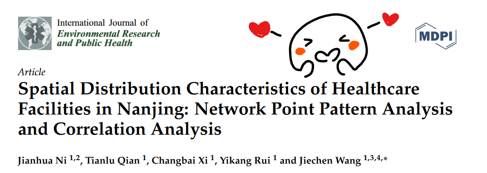
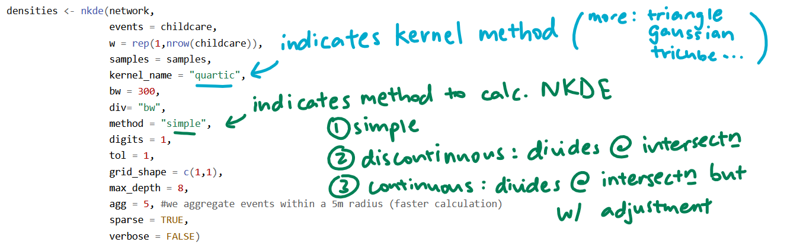
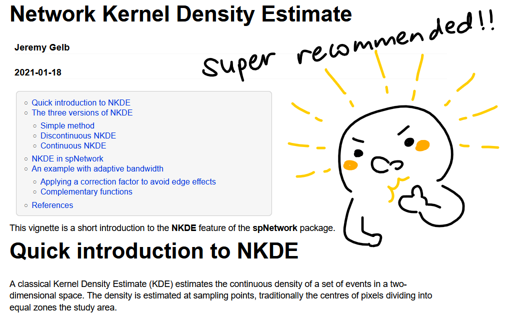

```{r setup, include=FALSE}
knitr::opts_chunk$set(echo = TRUE, 
                      eval = TRUE,
                      message = FALSE,
                      warning = FALSE,
                      fig.retina = 3)
```

## 1.0 Overview
In [Hands-On Exercise 04](https://is415-msty.netlify.app/posts/2021-09-05-hands-on-exercise-4/), we learned how to how to conduct Spatial Point Pattern Analysis (SPPA) on our data. This exercise, we'll be learning about Network-constrained Spatial Point Pattern Analysis (NetSPPA): analysis of spatial point events that occur on or alongside a network. For example, in today's exercise, we'll be analysing the spatial distribution of childcare centres with relation to the road network.

While researching for articles on NetSPPA, I chanced upon this [in-depth NetSPPA study](https://www.mdpi.com/1660-4601/13/8/833) that analysed the relationship between the road networks in Nanjing with the distribution of healthcare facilities, with the aim of examining the reasonability of existing healthcare facility distribution and optimising the location of new ones. Using weighted Kernel Density Estimation (KDE), network K-function analysis and correlation analysis, they achieved insights into the spread of hospitals around street centralities, and even saw a difference in distribution between public hospitals and private ones. You can also download it [here](data/resources/Spatial Distribution Characteristics of Healthcare Facilities in Nanjing.pdf). 

<center>
{width=90%} 
</center>

## 2.0 Setup

### 2.1 Packages Used

The R packages we'll be introducing today are:

- [**sp**](https://cran.r-project.org/web/packages/sp/index.html): provides classes and methods for dealing with spatial data in R, and provides related utility functions
- [**spNetwork**](https://cran.r-project.org/web/packages/spNetwork/index.html): used for performing spatial points pattern analysis (SPPA) on a network, such as kernel density estimation (KDE) and K-function
- [**rgdal**](https://cran.r-project.org/web/packages/rgdal/index.html): provides bindings to the Geospatial Data Analysis Library (GDAL) and used for projectoin/transforamtion operations

In addition, we'll be using the packages from our last lesson:

- **tmap**: used for creating thematic maps, such as choropleth and bubble maps

```{r}
packages = c('sp', 'rgdal', 'spNetwork', 'tmap')
for (p in packages){
  if(!require(p, character.only = T)){
    install.packages(p)
  }
  library(p,character.only = T)
}
```

### 2.2 Data Used
The datasets used for this exercise are:

- `Punggol_St`, a line features geospatial data which stores the road network within Punggol Planning Area (ESRI shapefile)
- `Punggol_CC`, a point feature geospatial data which stores the location of childcare centres within Punggol Planning Area (ESRI shapefile)

### 2.3 Importing Data
We're used to using *st_read()* for importing geospatial data, but this time we'll be using something new: *readOGR()*, which outputs a suitable Spatial vector object. In this case, we'll be importing `Punggol_St` and `Punggol_CC` as SpatialLinesDataFrame and SpatialPointsDataFrame respectively.

```{r}
# we use verbose=FALSE so that the progress won't be reported
network <- readOGR(dsn="data/geospatial", 
                   layer="Punggol_St",
                   verbose = FALSE)
childcare <- readOGR(dsn="data/geospatial",
                     layer="Punggol_CC",
                     verbose = FALSE)
```

<center>
{width=75%} 
</center>

### 2.4 Data Preparation

We can take a look at our data with *str()*:

```{r}
#str(network) commented out due to length of output
str(childcare)
```

Before we move on into visulisation, we need to take care of one more step. **spNetwork** expects the geospatial data to contain complete CRS information, so - just like how we used to set the CRS of a dataframe with *st_transform()*, we'll similarly set the for our Spatial vector objects with *spTransform()*! Like our previous geospatial data, the ESPG code for SVY21 is [3414](https://epsg.io/3414).

```{r}
childcare <-spTransform(childcare, CRS("+init=epsg:3414"))
network <- spTransform(network,CRS("+init=epsg:3414"))
```

### 2.5 Data Visualisation
Let's visualise our geospatial data in both static and interactive forms to better help with our analysis:

```{r}
plot(network)
plot(childcare,add=T,col='red',pch = 19)
```

```{r}
tmap_mode('view')
tm_shape(childcare)+
  tm_dots() +
tm_shape(network)+
  tm_lines()

#return tmap mode to plot for future visualisations
tmap_mode('plot')
```

## 3.0 Network Constrained KDE (NetKDE) Analysis

### 3.1 Preparing the lixels objects
Before computing NetKDE, the SpatialLines object need to be cut into lixels with a specified minimal distance - which we'll do with *lixelize_lines()*:

```{r}
lixels <- lixelize_lines(network,700,mindist = 350)
```

With this, we've set certain dimensions for our lixels objects:

- length of a lixel (*lx_length*) is set to 700m
- minimum length of a lixel (*mindist*) is set to 350m 
    - if the final lixel is shorter than the minimum length, it will be added to the previous lixel
    - segments that are already shorter than minimum length are not modified
    - if minimum length is NULL, then *mindist* = *maxdist*/10

### 3.2 Generating line centre points
Next, let us generate a SpatialPointsDataFrame with line centre points (points that are located at the center of the line, based on the line length). This will be performed with *lines_center()*, as seen below: 

```{r}
samples <- lines_center(lixels)
```

### 3.3 Performing NetKDE
Now, let's get into the meat of the matter: NetKDE!

```{r}
densities <- nkde(network, 
                  events = childcare,
                  w = rep(1,nrow(childcare)),
                  samples = samples,
                  kernel_name = "quartic",
                  bw = 300, 
                  div= "bw", 
                  method = "simple", 
                  digits = 1, 
                  tol = 1,
                  grid_shape = c(1,1), 
                  max_depth = 8,
                  #for faster calculation, aggregate events within a 5m radius
                  agg = 5, 
                  sparse = TRUE,
                  verbose = FALSE)
```

Whew, that's a long code chunk! Let's break it down a little:

<center>
{width=80%}
</center>

More details on the other parameters can be found [here](https://rdrr.io/github/JeremyGelb/spNetwork/man/nkde.html); moreover, I would recommend reading this [comprehensive guide](https://cran.r-project.org/web/packages/spNetwork/vignettes/NKDE.html) introducing NKDE, the 3 methods to calculate it (simple, discontinuous and continuous) and most importantly spNetworks's application of NKDE.

<center>
{width=75%}
</center>

### 3.4 Visualising NetKDE
Before we can visualise the NetKDE values, we'll need to insert our computed density values, `densities`, into the `density` field of our sample and lixel objects: 

```{r}
samples$density <- densities
lixels$density <- densities
```

You might've noticed from just now that the computed density values are very small - this is because the svy21 projection system is in meters. However, that isn't an appropriate scale of measurement: saying that there are 0.0000005 chidcare centres in a meter just doesn't make sense `r emo::ji("worried_face")` Let's rescale that into events per kilometer instead: 

```{r}
samples$density <- samples$density*1000
lixels$density <- lixels$density*1000
```

Now, let's try visualising it as a interactive map again:

```{r}
tmap_mode('view')
tm_shape(lixels)+
  tm_lines(col="density")+
tm_shape(childcare)+
  tm_dots()

#return tmap mode to plot for future visualisations
tmap_mode('plot')
```

Try playing around with the map: you're realise that road segments with a relatively higher density of childcare centres will appear darker in colour than those with a relatively lower density of childcare centres. 

## 4.0 Network Constrained G- and K-Function Analysis
Now, let's perform a **complete spatial randomness (CSR)** test: this is to test if the events within a given study area occur in completely random fashion. The main reason for doing so is for efficiency and targeted analysis: if our data exhibits signs of complete spatial randomness, then there is no underlying structure and therefore little to be gained from further analysis. 

The null hypothesis is defined as:

**H0: The observed spatial point events (i.e distribution of childcare centres) are uniformly distributed over a street network in Punggol Planning Area.**

The CSR test is based on the assumption of the binomial point process, which implies the hypothesis that the childcare centres are randomly and independently distributed over the street network.

If this hypothesis is rejected, we may infer that the distribution of childcare centres are spatially interacting and dependent on each other; as a result, they may form nonrandom patterns.

```{r}
kfun_childcare <- kfunctions(network, 
                             childcare,
                             start = 0, 
                             end = 1000, 
                             step = 50, 
                             width = 50, 
                             nsim = 50, 
                             resolution = 50,
                             verbose = FALSE, 
                             conf_int = 0.05)
```

Another long code chunk - let's break it down! Here are the arguments used:

- lines: A SpatialLinesDataFrame with the sampling points. The geometries must be a SpatialLinesDataFrame (may crash if some geometries are invalid).
- points: A SpatialPointsDataFrame representing the points on the network. These points will be snapped on the network.
- start: A double, the start value for evaluating the k and g functions. 
- end: A double, the last value for evaluating the k and g functions.
- step: A double, the jump between two evaluations of the k and g function.
- width: The width of each donut for the g-function.
- nsim: An integer indicating the number of Monte Carlo simulations required.  In the above example, 50 simulation was performed.  **Note:** most of the time, more simulations are required for inference
- resolution: When simulating random points on the network, selecting a resolution will reduce greatly the calculation time.  When resolution is null the random points can occur everywhere on the graph.  If a value is specified, the edges are split according to this value and the random points are selected vertices on the new network.
- conf_int: A double indicating the width confidence interval (default = 0.05).

The output of *kfunctions()* is a list with the following values:

- *plotkA*, a ggplot2 object representing the values of the k-function
- *plotgA*, a ggplot2 object representing the values of the g-function
- *valuesA*, a DataFrame with the values used to build the plots

Since it's a ggplot2 object, we can easily visaulise these! Let's try visualising the k-function:

```{r}
kfun_childcare$plotk
```

How do we interpret this? The blue line is the empirical network K-function of the childcare centres in Punggol planning area, while the gray envelope represents the results of the 50 simulations in the interval 2.5% - 97.5%. You might notice that the blue line is within the gray envelope for most part, but is below it between 250m-400m: from this, our inference is that childcare centres in the Punggol planning area resemble a regular pattern at the distance of 250m-400m. 

## 5.0 End Notes
With that, we've learned the gist of performing NetSPPA! From how to prepare our data for NetSPPA, to performing NetKDE and visualising our results, to performing a CSR test and plotting our k- and g-functions, we've done it all! We're slowly building up our geospatial analytics repertoire - and there's still so much more to discover `r emo::ji("smile")` See you next exercise!
