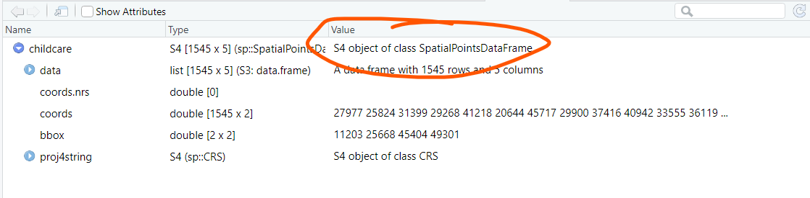

```{r setup, include=FALSE}
knitr::opts_chunk$set(echo = TRUE, 
                      eval = TRUE,
                      message = FALSE,
                      warning = FALSE,
                      error = FALSE,
                      fig.retina = 3)
```

## 1.0 Overview
In [Hands-On Exercise 5](https://is415-msty.netlify.app/posts/2021-09-12-hands-on-exercise-5/), we learned how to perform Network-constrained Spatial Point Patterns Analysis with **spNetwork**. As such, in this In-Class Exercise, we'll be putting what we learned into use! 

The first few sections (2.0 Setup to 3.0 Data Wrangling) are essentially the same as what we did in [In-Class Exercise 4](https://is415-msty.netlify.app/posts/2021-09-06-in-class-exercise-4/)

## 2.0 Setup

### 2.1 Packages Used
The R packages we'll be using today are all from our last exercise:

- [**maptools**](https://cran.r-project.org/web/packages/maptools/index.html): a set of tools for manipulating geographic data and creating Spatial* objects
- [**sf**](https://cran.r-project.org/web/packages/sf/index.html): used for importing, managing, and processing geospatial data
- [**raster**](https://cran.r-project.org/web/packages/raster/): reads, writes, manipulates, analyses and models gridded spatial data (i.e. raster-based geographical data)
- [**spatstat**](https://spatstat.org/): used for performing spatial point pattern analysis (SPPA)
- [**tmap**](https://cran.r-project.org/web/packages/tmap/index.html): used for plotting thematic maps, such as choropleth and bubble maps
- [**tidyverse**](https://www.tidyverse.org/): used for importing, wrangling and visualising data (and other data science tasks!)
- **plotly**: used for plotting interactive plots
- **ggthemes**: an extension of ggplot2, with more advanced themes for plotting

```{r}
packages = c('maptools', 'sf', 'raster','spatstat', 'tmap', 'tidyverse', 'plotly', 'ggthemes')
for (p in packages){
  if(!require(p, character.only = T)){
    install.packages(p)
  }
  library(p,character.only = T)
}
```

### 2.2 Data Used
The datasets used for this exercise are:

- `CHILDCARE`, a point feature data in rds format from [data.gov.sg](https://data.gov.sg/), providing both location and attribute information of childcare centres
- `CHAS`, a point feature data in rds format that provides location and attribute information of CHAS clinics
- `MP14_SUBZONE_WEB_PL`, a polygon feature data in ESRI shapefile format from [data.gov.sg](https://data.gov.sg/), providing information of URA 2014 Master Plan Planning Subzone boundary data 
- `Punggol_St`, a line features geospatial data which stores the road network within Punggol Planning Area (ESRI shapefile)

### 2.3 Importing Data
#### 2.3.1 Importing Geospatial Data
For our geospatial data, out output goal is tibbles sf object, so we'll use st_read():

> Compare against [Hands-On Exercise 5](https://is415-msty.netlify.app/posts/2021-09-12-hands-on-exercise-5/) where we used readOGR() for a Spatial vector object output

```{r}
mpsz_sf <- st_read(dsn = "data/shapefile", 
                layer = "MP14_SUBZONE_WEB_PL")
```

As we can see, `mpsz`'s projection is in svy21.

#### 2.3.2 Importing Aspatial Data
Here, we're using *read_rds()* of the **readr** package rather than the *readRDS()* from base R - this is because we want our output to be a tibble object.

```{r}
childcare <- read_rds("data/rds/childcare.rds")
CHAS <- read_rds("data/rds/CHAS.rds")
```

Note that there are some issues in the childcare dataframe: the `Lat` and `Lng` coordinate fields are in decimal degrees, and thus should be of numeric data type instead of the chr data type. The `WGS84` referencing system is assumed. 

## 3.0 Data Preparation + Wrangling
### 3.1 Converting from Aspatial to Geospatial
```{r}
CHAS_sf <- st_as_sf(CHAS,
                    coords = c("X_COORDINATE",
                               "Y_COORDINATE"),
                    crs=3414)
```

>Note: st_as_sf accepts coordinates in character data type. Personally, I believe it to be better practice to convert to numeric data type first, but as long as you check the data beforehand and you get no error messages, then there shouldn't be a significant difference

```{r}
# if you'd like, we can convert lat and lng to numeric data type first 
childcare$Lat <- as.numeric(childcare$Lat)
childcare$Lng <- as.numeric(childcare$Lng)

# transform in CRS WGS84 (code 4326) first, due to lat+lng decimal degrees
childcare_sf <- st_as_sf(childcare,
                    coords = c("Lng",
                               "Lat"),
                    crs=4326) %>%
  # afterwards, transform to CRS SVY21 (code 3414)
  st_transform(crs=3414)
```

At this stage, it's good practice to do a plot to show the location of the data points. Remember to use the _sf versions - the originals are *aspatial*! Let's have an interactive map :

```{r}
tmap_mode("view")
tm_shape(childcare_sf) +
  tm_dots(alpha=0.4, #affects transparency of points
          col="blue",
          size=0.05) +
tm_shape(CHAS_sf) +
  tm_dots(alpha=0.4,
          col="red",
          size=0.05)
```

### 3.2 Converting from sf to Spatial* data frame

```{r}
childcare <- as_Spatial(childcare_sf)
CHAS <- as_Spatial(CHAS_sf)
mpsz <- as_Spatial(mpsz_sf)
```

### 3.3 Converting from Spatial* data frame to Spatial* objects

```{r}
childcare_sp <- as(childcare, "SpatialPoints")
CHAS_sp <- as(CHAS,"SpatialPoints")
mpsz_sp <- as(mpsz,"SpatialPolygons")
```

Note the difference between `childcare` and `childcare_sp` - one is a Spatial* data frame, while the other is a Spatial* object:

<center>
{width=75%}
{width=75%}
</center>

### 3.4 Converting from Spatial* objects to spatstat ppp format

```{r}
childcare_ppp <- as(childcare_sp, "ppp")
CHAS_ppp <- as(CHAS_sp, "ppp")
```

>Note: this uses the *as.ppp()* of **maptools** package - make sure it's installed!

### 3.5 Removing duplicate points using jitter

```{r}
childcare_ppp_jit <- rjitter(childcare_ppp,
                             retry=TRUE,
                             nsim=1, #number of simulations
                             drop=TRUE)
CHAS_ppp_jit <- rjitter(CHAS_ppp,
                             retry=TRUE,
                             nsim=1, #number of simulations
                             drop=TRUE)

#check for duplicates
any(duplicated(childcare_ppp_jit))
any(duplicated(CHAS_ppp_jit))
```

>Note: This one requires the **spatstat** package. Also, _ppp_jit is neither simple features nor sp - it's ppp format, so tmap won't understand it. You'll need to convert it back to simple features if you want to plot it.

## 4.0 Punggol Planning Area

### 4.1 Extracing Punggol Planning Area

```{r}
pg <- mpsz[mpsz@data$PLN_AREA_N=="PUNGGOL",]
```

>Note: for this particular function - remember that there's a comma behind it! Without it, it won't run :^(

### 4.2 Converting SpatialPolygonsDataFrame into SpatialPolygons object

```{r}
pg_sp <- as(pg, "SpatialPolygons")
```

### 4.3 Converting SpatialPolygons objects into owin objects
An owin object is requied by spatstat if you want to define irregular windows.

```{r}
pg_owin <- as(pg_sp, "owin")
```

### 4.4 Extracting spatial points window owin

```{r}
childcare_pg <- childcare_ppp_jit[pg_owin]
CHAS_pg <- CHAS_ppp_jit[pg_owin]
```

Let's take a quick look and visualise this:

```{r}
plot(childcare_pg)
```

Note that it's showing data points within our study area AKA Punggol. If you plot the jitter-only version, you'll get all the points without any boundary:

```{r}
plot(childcare_ppp_jit)
```

## 5.0 Analysis
### 5.1 L-function

```{r}
L_childcare <- envelope(childcare_pg,
                        Lest,
                        nsim=99, 
                        rank=1, # go through 1 round of rankings
                        global=TRUE) # make global

L_CHAS <- envelope(CHAS_pg,
                        Lest,
                        nsim=99, 
                        rank=1, # go through 1 round of rankings
                        global=TRUE) # make global
```

### 5.1 Interactive L-function

```{r}
title <- "Pairwise Distance: L function"

Lcsr_df <- as.data.frame(L_childcare)

colour=c("#0D657D","#ee770d","#D3D3D3")
csr_plot <- ggplot(Lcsr_df, aes(r, obs-r))+
  # plot observed value
  geom_line(colour=c("#4d4d4d"))+
  geom_line(aes(r,theo-r), colour="red", linetype = "dashed")+
  # plot simulation envelopes
  geom_ribbon(aes(ymin=lo-r,ymax=hi-r),alpha=0.1, colour=c("#91bfdb")) +
  xlab("Distance r (m)") +
  ylab("L(r)-r") +
  geom_rug(data=Lcsr_df[Lcsr_df$obs > Lcsr_df$hi,], sides="b", colour=colour[1])  +
  geom_rug(data=Lcsr_df[Lcsr_df$obs < Lcsr_df$lo,], sides="b", colour=colour[2]) +
  geom_rug(data=Lcsr_df[Lcsr_df$obs >= Lcsr_df$lo & Lcsr_df$obs <= Lcsr_df$hi,], sides="b", color=colour[3]) +
  theme_tufte()+
  ggtitle(title)

text1<-"Significant clustering"
text2<-"Significant segregation"
text3<-"Not significant clustering/segregation"

# the below conditional statement is required to ensure that the labels (text1/2/3) are assigned to the correct traces
if (nrow(Lcsr_df[Lcsr_df$obs > Lcsr_df$hi,])==0){ 
  if (nrow(Lcsr_df[Lcsr_df$obs < Lcsr_df$lo,])==0){ 
    ggplotly(csr_plot, dynamicTicks=T) %>%
      style(text = text3, traces = 4) %>%
      rangeslider() 
  }else if (nrow(Lcsr_df[Lcsr_df$obs >= Lcsr_df$lo & Lcsr_df$obs <= Lcsr_df$hi,])==0){ 
    ggplotly(csr_plot, dynamicTicks=T) %>%
      style(text = text2, traces = 4) %>%
      rangeslider() 
  }else {
    ggplotly(csr_plot, dynamicTicks=T) %>%
      style(text = text2, traces = 4) %>%
      style(text = text3, traces = 5) %>%
      rangeslider() 
  }
} else if (nrow(Lcsr_df[Lcsr_df$obs < Lcsr_df$lo,])==0){
  if (nrow(Lcsr_df[Lcsr_df$obs >= Lcsr_df$lo & Lcsr_df$obs <= Lcsr_df$hi,])==0){
    ggplotly(csr_plot, dynamicTicks=T) %>%
      style(text = text1, traces = 4) %>%
      rangeslider() 
  } else{
    ggplotly(csr_plot, dynamicTicks=T) %>%
      style(text = text1, traces = 4) %>%
      style(text = text3, traces = 5) %>%
      rangeslider()
  }
} else{
  ggplotly(csr_plot, dynamicTicks=T) %>%
    style(text = text1, traces = 4) %>%
    style(text = text2, traces = 5) %>%
    style(text = text3, traces = 6) %>%
    rangeslider()
  }
```
