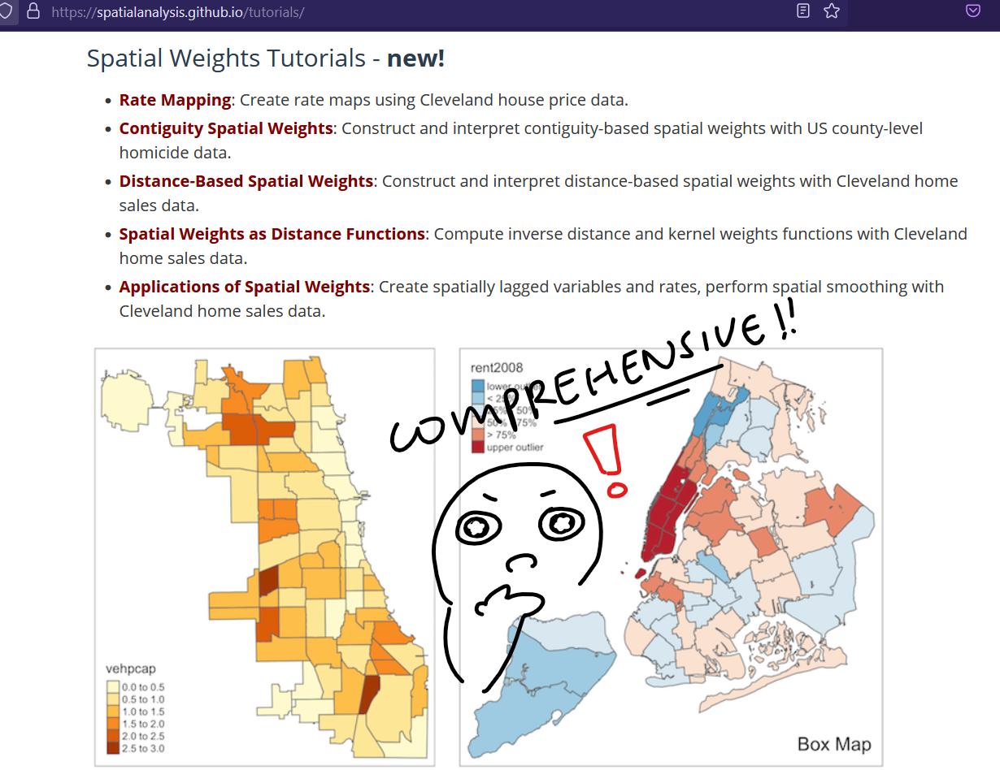
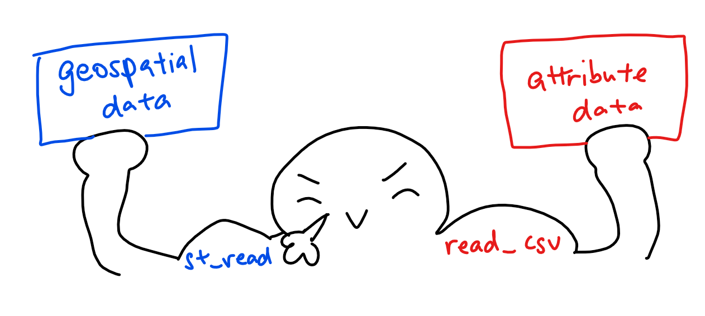
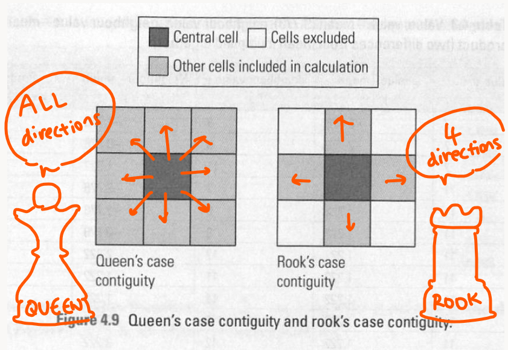
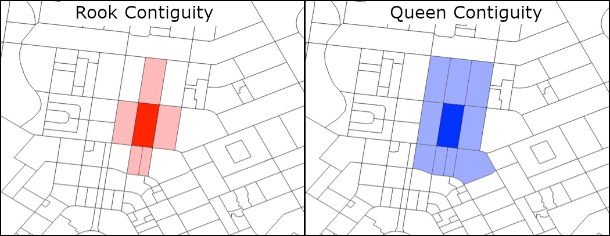
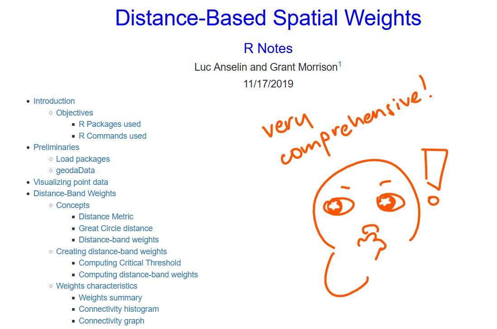
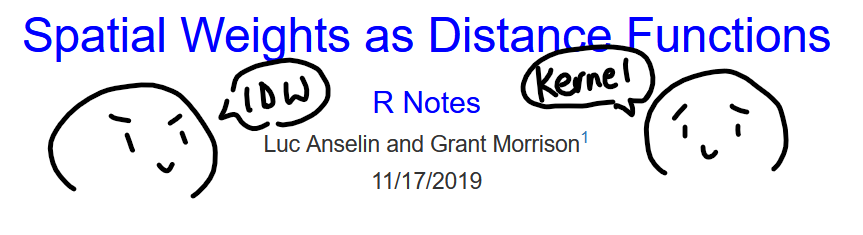

```{r setup, include=FALSE}
knitr::opts_chunk$set(echo = TRUE, 
                      eval = TRUE,
                      message = FALSE,
                      warning = FALSE,
                      fig.retina = 3)
```

## 1.0 Overview
This week, we'll be looking at spatial weights and their applications. There's a [handy website](https://spatialanalysis.github.io/tutorials/) that we recommend as reading/reference for this topic: it has comprehensive explanations + walkthroughs of spatial weights in R. I'll link them in each section `r emo::ji("thumbs_up")` 

<center>
{width=75%}
</center>

## 2.0 Setup

### 2.1 Packages Used

The R packages we'll be introducing today are:

- [**spdep**](https://cran.r-project.org/web/packages/spdep/index.html): used to create spatial weights matrix objects and related calculations (e.g. spatially lag attributes)

In addition, we'll be using the packages from our previous lessons:

- [**sf**](https://cran.r-project.org/web/packages/sf/index.html): used for importing, managing, and processing geospatial data
- [**tmap**](https://cran.r-project.org/web/packages/tmap/index.html): used for plotting thematic maps, such as choropleth and bubble maps
- [**tidyverse**](https://www.tidyverse.org/): used for importing, wrangling and visualising data (and other data science tasks!)

```{r}
packages = c('sf', 'spdep', 'tmap', 'tidyverse')
for (p in packages){
  if(!require(p, character.only = T)){
    install.packages(p)
  }
  library(p,character.only = T)
}
```

### 2.2 Data Used
The datasets used for this exercise are:

- `Hunan_2012` (aspatial data): a .csv which stores Hunan's local development indicators in 2012
- `Hunan` (geospatial data): an ESRI shapefile which stores Hunan's country boundary layers

### 2.3 Importing Data
Let's import our aspatial and geospatial data per usual:

```{r}
#output: simple features object
hunan <- st_read(dsn = "data/geospatial", 
                 layer = "Hunan")

#output: R dataframe class
hunan2012 <- read_csv("data/aspatial/Hunan_2012.csv")
```

Once again, recall:

<center>
{width=75%}
</center>

### 2.4 Data Preparation

Let's perform a relational join to update the attribute data of `hunan`'s SpatialPolygonsDataFrame with the attribute fields of our `hunan2012` dataframe. We'll do this with *left_join()*:

```{r}
hunan <- left_join(hunan,hunan2012)
knitr::kable(head(hunan, n=5))
```

### 2.5 Data Visualisation
Let's visualise our geospatial data: our goal is to show the distribution of GDPPC 2012:

```{r}
qtm(hunan, "GDPPC")
```

## 3.0 Computing Contiguity Spatial Weights
Our [recommended reading](https://spatialanalysis.github.io/lab_tutorials/Contiguity_Spatial_Weights.html) will bring us through the different contiguity weights and how to visualise them.

<center>
{width=75%}
</center>

Now onto the meat of this exercise: spatial weights! We'll be using the  [*poly2nb()*](https://r-spatial.github.io/spdep/reference/poly2nb.html) function of our **spdep** package to compute contiguity weight matrices for the study area.

What this function does is to build a neighbours list based on regions with contiguous boundaries - which means they're in 'contact' and share one or more boundary points. For example, on the Singapore map, the North-East region is contiguous with the North region and the East region.

One thing to note is the `queen` argument:

- TRUE (default): a single shared boundary point meets the contiguity condition
- FALSE: more than one shared point is required
- note that more than one shared boundary point does not necessarily mean a shared boundary line

We'll be computing based on two types of contiguity: Queen and Rook. If you're a chess buff (or even a chess amateur), these terms will sound familiar to you: and as you might've guessed, they're related to the positions the queen and rook can move on a chess board.

<center>
{width=75%}
</center>
*Source: Lloyd, C. (2010). Spatial data analysis: an introduction for GIS users. Oxford university press. Retrieved from https://gis.stackexchange.com/questions/172998/queen-vs-rook-neighborhood, Self-annotated*

In a geospatial context, this is what it looks like:

<center>
{width=90%}
</center>
*Credit: [AURIN](https://aurin.org.au/resources/workbench-user-guides/portal-user-guides/analysing-your-data/spatial-weight-matrices-tools/contiguous-spatial-weight-matrix/)*

Notice that for the Queen contiguity, even having a single 'point' of shared border qualifies the region as a 'neighbour' - this is what distinguishes it from the Rook contiguity, where the region (polygon) must share a border of some length with the starting region. It can be considered the a more 'stringent' definition of polygon contiguity. [(Reference)](https://www.biomedware.com/files/documentation/OldCSHelp/Concepts/Polygon_contiguity.htm)

### 3.1 Computing (QUEEN) contiguity based neighbours
First, let's compute the Queen contiguity weight matrix:

```{r}
wm_q <- poly2nb(hunan, queen=TRUE)
summary(wm_q)
```

The summary report above shows that there are 88 area units in Hunan, where the most connected area unit has 11 neighbours. In addition, there are two area units with only 1 neighbour. 

For each polygon in our polygon object (in this context, our areas in Hunan), *wm_q* lists all neighboring polygons. For example, let's see the neighbors for the first polygon:

```{r}
wm_q[[1]]
```

Polygon 1 has 5 neighbors, with each number representing the polygon IDs as stored in our hunan SpatialPolygonsDataFrame class. Let's try retrieving the county name of Polygon ID=1:

```{r}
#psst: county is not a misspelling! it's akin to a district/prefecture
hunan$County[1]
```

The output reveals that Polygon ID=1 is Anxiang. We can also retrieve all the county names at once:

```{r}
hunan$NAME_3[c(2,3,4,57,85)]
```

Lastly, let's look at the complete weight matrix:

```{r eval=TRUE, echo=TRUE}
str(wm_q)
```

Be warned: The output might cut across several pages.  Save the trees if you are going to print out the report.

### 3.2 Creating (ROOK) contiguity based neighbours

For a rook contiguity weight matrix, we simply need to include the queen=FALSE argument:

```{r}
wm_r <- poly2nb(hunan, queen=FALSE)
summary(wm_r)
```

The summary is almost the same as the queen contiguity - but notice that now, the most connected area only has 10 neighbour instead of the 11 we saw in the queen contiguity. This is due to the more 'stringent' boundary defintions that Rook uses, as mentioned at the start of this session.

## 4.0 Visualising contiguity weights

### 4.1 Getting polygon centroids
Now that we've got our weights, we have to visualise them: and the best way is through a connectivity graph! A connectivity graph takes a point and displays a line to each neighboring point - which leads us to an issue with our current setup: we're working with polygons, but we need points...

Never fear, the **sf** package is here! To get points from polygons, we typically use the polygon centroids. In the context of this dataset, we'll need to set our coordinates into a separate data frame with a mapping function, which will apply a given function to each element of a vector and returns a vector of the same length. 

Our function is *st_centroid()*, with our input vector is the geometry column of us.bound - which has both longitude and latitude values that we'll save as separate variables (and combine to get our centroid). To help us execute the mapping, we'll be using *map_dbl()*  from the **purrr** package!

Let's get our longitude first:

```{r}
longitude <- map_dbl(hunan$geometry, ~st_centroid(.x)[[1]])
```

The latitude is the same, except that we're accessing the 2nd value to get latitude:

```{r}
latitude <- map_dbl(hunan$geometry, ~st_centroid(.x)[[2]])
```

Now that we have latitude and longitude, we'll use cbind to put longitude and latitude into the same object:

```{r}
coords <- cbind(longitude, latitude)
```

Let's check to see if things are formatted correctly!

```{r}
head(coords)
```

### 4.2 Plotting based on contiguity 

Here is the Queen contiguity based neighbours map:

```{r}
plot(hunan$geometry, border="lightgrey")
plot(wm_q, coords, pch = 19, cex = 0.6, add = TRUE, col= "red")
```

And here is the Rook contiguity based neighbours map:

```{r}
plot(hunan$geometry, border="lightgrey")
plot(wm_r, coords, pch = 19, cex = 0.6, add = TRUE, col = "red")
```

A quick comparison:

```{r}
par(mfrow=c(1,2))
plot(hunan$geometry, border="lightgrey")
plot(wm_q, coords, pch = 19, cex = 0.6, add = TRUE, col= "red", main="Queen Contiguity")
plot(hunan$geometry, border="lightgrey")
plot(wm_r, coords, pch = 19, cex = 0.6, add = TRUE, col = "red", main="Rook Contiguity")
```

## 5.0 Computing distance-based neighbours
Our [recommended reading](https://spatialanalysis.github.io/lab_tutorials/Distance_Based_Spatial_Weights.html) will bring us through distance-band weights, k-nearest neighbours weights as well as distance-based weights for polygons.

<center>
{width=75%}
</center>

Now, let's learn how to derive distance-based weight matrices! We'll be using the  [*dnearneigh()*](https://r-spatial.github.io/spdep/reference/dnearneigh.html) function of our **spdep** package, which will identify neighbours of region points by Euclidean distance. 

>Note: if unprojectede coordinates are used and eitehr specified in the coordinates object x, OR with x as a two-column matrix + longlat=TRUE, great circle distances in km will be clacualted assuming the WGS84 reference ellipsoid.

### 5.1 Determining the cut-off distance

Firstly, we need to determine the upper limit for distance band by using the steps below:

- Return a matrix with the indices of points belonging to the set of the k nearest neighbours of each other by using [*knearneigh()*](https://r-spatial.github.io/spdep/reference/knearneigh.html) of **spdep**.
- Convert the knn object returned by *knearneigh()* into a neighbours list of class nb with a list of integer vectors containing neighbour region number ids by using [*knn2nb()*](https://r-spatial.github.io/spdep/reference/knn2nb.html).
- Return the length of neighbour relationship edges by using [*nbdists()*](https://r-spatial.github.io/spdep/reference/nbdists.html) of **spdep**.  The function returns in the units of the coordinates if the coordinates are projected, in km otherwise.
- Remove the list structure of the returned object by using [**unlist()**](https://www.rdocumentation.org/packages/base/versions/3.6.2/topics/unlist).

```{r}
#coords <- coordinates(hunan)
k1 <- knn2nb(knearneigh(coords))
k1dists <- unlist(nbdists(k1, coords, longlat = TRUE))
summary(k1dists)
```

We can see that the largest first nearest neighbour distance is 61.79km - we'll use this as the upper threshold, since this guarantees that all units will have at least one neighbour!

### 5.2 Computing fixed distance weight matrix
Now, let's compute the distance weight matrix by using *dnearneigh()*:

```{r}
wm_d62 <- dnearneigh(coords, 0, 62, longlat = TRUE)
wm_d62
```

>Note: "Average number of links: 3.681818" represents that there are around 4 neighbours on average. 

Next, let's display the content of wm_d62 weight matrix:

```{r}
str(wm_d62)
```

PSST! Another way to display the structure of the weight matrix is to combine [*table()*](https://www.rdocumentation.org/packages/base/versions/3.6.2/topics/table) and [*card()*](https://r-spatial.github.io/spdep/reference/card.html) of spdep.

```{r}
table(hunan$County, card(wm_d62))
```

```{r}
n_comp <- n.comp.nb(wm_d62)
n_comp$nc
```

```{r}
table(n_comp$comp.id)
```

### 5.3 Plotting fixed distance weight matrix
Now, let's plot the distance weight matrix:

```{r}
plot(hunan$geometry, border="lightgrey")
plot(wm_d62, coords, add=TRUE)
plot(k1, coords, add=TRUE, col="red", length=0.08)
```

Did you notice the difference between the red and black lines? The red lines show us the links of 1st nearest neighbours while the black lines show the links of neighbours within the cut-off distance of 62km. 

Let's plot them side-by-side for easier comparison:

```{r}
par(mfrow=c(1,2))
plot(hunan$geometry, border="lightgrey")
plot(k1, coords, add=TRUE, col="red", length=0.08, main="1st nearest neighbours")
plot(hunan$geometry, border="lightgrey")
plot(wm_d62, coords, add=TRUE, pch = 19, cex = 0.6, main="Distance link")
```

### 5.4 Computing adaptive distance weight matrix
Having a fixed distance weight matrix means that more densely settled areas (e.g. urban areas) tend to have more neighbours while the less densely settled areas (e.g. rural areas) tend to have lesser neighbours. 

However, we can control the number of neighbours directly using k-nearest neighbours, either by accepting asymmetric neighbours or imposing symmetry:

```{r}
knn6 <- knn2nb(knearneigh(coords, k=6))
knn6
```

Let's take a look at the content of the matrix:

```{r}
str(knn6)
```

> Note: now, each county has 6 neighbours :^)


### 5.5 Plotting distance based neighbours
Now, let's plot our matrix:

```{r}
plot(hunan$geometry, border="lightgrey")
plot(knn6, coords, pch = 19, cex = 0.6, add = TRUE, col = "red")
```

## 6.0 Weights based on IDW
Our [recommended reading](https://spatialanalysis.github.io/lab_tutorials/Spatial_Weights_as_Distance_Functions.html) will bring us through inverse distance weights and kernel weights.

<center>
{width=75%}
</center>

Let's learn  how to derive a spatial weight matrix based on Inversed Distance method! First, we'll compute the distances between areas by using [*nbdists()*](https://r-spatial.github.io/spdep/reference/nbdists.html):

```{r}
dist <- nbdists(wm_q, coords, longlat = TRUE)
ids <- lapply(dist, function(x) 1/(x))
ids
```

### 6.1 Row-standardised weights matrix
Now, we'll need to assign weights to each neighbouring polygon - in this case, we'll assign equal weights to each (style="w"), and assign 1/# of neighbours to each neighbouring county, then summing the weighted income values.

There is a downside to this,though: polygons along the edges of the study area will base their lagged values on fewer polygons. This means that they'll potentially be over- or under-estimating the true nature of the spatial autocorrelation in the data. Do take note!

```{r}
#zero.policy=TRUE allows for lists of non-neighbours
#zero.policy=FALSE will return an error if there are missing neighbours in the dataset
rswm_q <- nb2listw(wm_q, style="W", zero.policy = TRUE)
rswm_q
```

Let's check the weight of the first polygon's four neighbors type:

```{r}
rswm_q$weights[10]
```

Each neighbor is assigned a 0.2 of the total weight. This means that when R computes the average neighboring income values, each neighbor's income will be multiplied by 0.2 before being tallied.

Using the same method, we can also derive a row-standardised distance weight matrix:

```{r}
rswm_ids <- nb2listw(wm_q, glist=ids, style="B", zero.policy=TRUE)
rswm_ids
```

```{r}
rswm_ids$weights[1]
```

```{r}
summary(unlist(rswm_ids$weights))
```

## 7.0 Application of Spatial Weight Matrix
There are all sorts of spatial lagged variables, such as:

- spatial lag with row-standardized weights,
- spatial lag as a sum of neighbouring values,
- spatial window average, and spatial window sum.

### 7.1 Spatial lag with row-standardized weights
We'll compute the average neighbor GDPPC value for each polygon - which are often referred to as **spatially lagged values**.

```{r}
GDPPC.lag <- lag.listw(rswm_q, hunan$GDPPC)
GDPPC.lag
```

Let's append the spatially lagged GDPPC values onto `hunan`:

```{r}
# tip: try to run this separately to look at each of the results!
lag.list <- list(hunan$NAME_3, lag.listw(rswm_q, hunan$GDPPC))
lag.res <- as.data.frame(lag.list)
colnames(lag.res) <- c("NAME_3", "lag GDPPC")
hunan <- left_join(hunan,lag.res)
```

Let's take a look!
The following table shows the average neighboring income values (stored in the Inc.lag object) for each county.

```{r}
head(hunan)
```

With this, we can see the average nieghbouring income values (Inc.lag) for each county! Now, let's plot both the GDPPC and spatial lag GDPPC for comparison:

```{r fid.width=12, fig.height=8}
gdppc <- qtm(hunan, "GDPPC")
lag_gdppc <- qtm(hunan, "lag GDPPC")
tmap_arrange(gdppc, lag_gdppc, asp=1, ncol=2)
```

### 7.2 Spatial window sum
The spatial window sum uses and includes the diagonal element. Since we're directly altering the strucutre to add diagonal elements, let's assign `knn6` to a new variable:

```{r}
knn6a <- knn6
```

To add the diagonal element to the neighbour list, we'll use the handy *include.self()* function:

```{r}
include.self(knn6a)
```

Next, we'll assign binary weights to the neighbour structure that includes the diagonal element:

```{r}
binary.knn6 <- lapply(knn6a, function(x) 0*x+1)
binary.knn6[1]
```

Once again, we're using *nb2listw()* and *glist()* to explicitly assign weight values:

```{r}
wm_knn6 <- nb2listw(knn6a, glist = binary.knn6, style = "B")
```

Now that we have our new weight structure, let's compute the lag variable:

```{r}
lag_knn6 <- lag.listw(wm_knn6, hunan$GDPPC)
```

That's good and all, but we want it as a data.frame! Let's convert the lag variable listw object:

```{r}
lag.list.knn6 <- list(hunan$NAME_3, lag.listw(wm_knn6, hunan$GDPPC))
lag_knn6.res <- as.data.frame(lag.list.knn6)
#let's rename the field names as NAME_3 and lag_sum GDPPC 
colnames(lag_knn6.res) <- c("NAME_3", "lag_sum GDPPC")
```

Now on to the next step! We have to append the *lag_sum GDPPC* values onto *hunan* sf data.frame by using *left_join()*:

```{r}
hunan <- left_join(hunan, lag_knn6.res)
```

Lastly, *qtm()* of **tmap** package is used to plot the GDPPC and lag_sum GDPPC map next to each other for quick comparison:

```{r}
gdppc <- qtm(hunan, "GDPPC")
lag_sum_gdppc <- qtm(hunan, "lag_sum GDPPC")
tmap_arrange(gdppc, lag_sum_gdppc, asp=1, ncol=2)
```

## 8.0 Ending Notes
With that, we've got spatial weights under our belts! Join me next exercise to see how else we can apply them in our future analysis `r emo::ji("smile")` 
