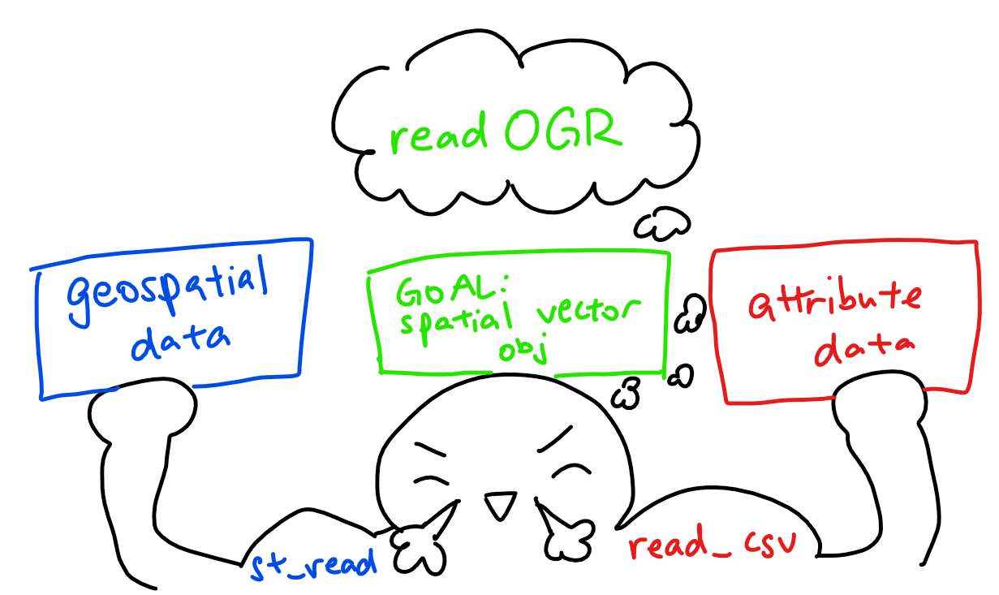
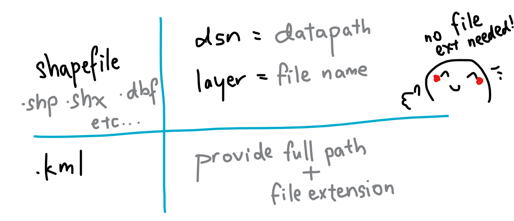
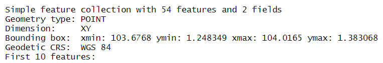
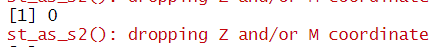
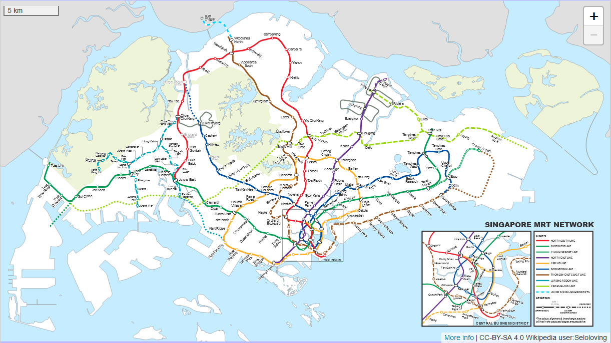

```{r setup, include=FALSE}
knitr::opts_chunk$set(echo = TRUE, 
                      eval = TRUE,
                      message = FALSE,
                      warning = FALSE,
                      fig.retina = 3)
```

## 1.0 Overview

### 1.1 Background
<center>
{width=90%}
</center>
*The email that started Airbnb. [Source](https://twitter.com/Bill_Gross/status/699646672125558784?)*

From a couple of air mattresses and a complimentary breakfast at $80/night to a billion-dollar international business, Airbnb stands as one of the greatest success stories of the sharing economy. Their peer-to-peer model of short-term home-sharing have found a foothold worldwide: from Washington DC to New Delhi, from Shanghai to Havana - convenient locations at low cost have garnered great support from hosts and travellers alike.

And how has Singapore accommodated this sector of the sharing revolution? 

Turns out: it hasn't. [Short-term rentals of less than three months remain illegal](https://www.channelnewsasia.com/singapore/no-change-3-month-minimum-stay-duration-private-residential-properties-ura-877211) in Singapore - 6 months if you're renting out a HDB. In addition, there's an [occupancy limit](https://irblaw.com.sg/learning-centre/airbnb-legal-singapore/) for those looking to rent out their HDBs: 6 persons for a 3-room flat, and 9 persons for a 4-room flat or larger. An extensive public consultation spanning 4 years came back with the conclusion: you might be alright with renting out your home, but [your neighbours aren't](https://www.todayonline.com/singapore/short-term-home-sharing-remains-illegal-singapore-airbnb-disappointed). Security concerns, a loss of privacy, causing disturbances within the neighbourhood or even damaging common facilities are among the top concerns of private homeowners - and this sentiment comes across in the strict regulatory framework for renting out short-term accommodations.

Airbnb's setbacks aren't solely with government restrictions: with 2020 came the COVID-19 global pandemic, which caused significant upheaval in the lives of many - arguably, the lives of every. As [this paper](https://espace.library.uq.edu.au/view/UQ:ab59afd/Airbnb_Before_During_and_After_COVID19.pdf?dsi_version=e54855794274f8f32a6d5c5132254f51#page=132) points out, Airbnb hosts were 'spoiled by high returns and the prospect of the ever-increasing growth of the Airbnb market' pre-COVID, only to be hit with cancelled bookings and overwhelming financial pressure that lead to (temporary) exodus from the short-term rental market, or transition into long-term rentals. 

In the context of Singapore, how do these two play into Airbnb accommodations?

### 1.2 Problem Statement
There are two parts to our analysis that we want to investigate, namely: 

- [A] how the distribution of Airbnb listings are affected by location factors (such as MRTs, tourist locations etc.)
- [B] the impact of COVID-19 on Airbnb listings in Singapore (a comparison of the pre- and post-COVID-19 listings)

## 2.0 Setup

### 2.1 Packages Used
The R packages we'll use for this analysis are:

- [**sf**](https://cran.r-project.org/web/packages/sf/index.html): used for importing, managing, and processing geospatial data
- [**tidyverse**](https://www.tidyverse.org/): a collection of packages for data science tasks
- [**tmap**](https://cran.r-project.org/web/packages/tmap/index.html): used for creating thematic maps, such as choropleth and bubble maps
- [**spatstat**](https://spatstat.org/): used for point pattern analysis
- [**raster**](https://cran.r-project.org/web/packages/raster/): reads, writes, manipulates, analyses and models gridded spatial data (i.e. raster-based geographical data)
- [**maptools**](https://cran.r-project.org/web/packages/maptools/index.html): a set of tools for manipulating geographic data
- [**rgdal**](https://cran.r-project.org/web/packages/rgdal/index.html): provides bindings to the Geospatial Data Analysis Library (GDAL) and used for projectoin/transforamtion operations
- [**kableExtra**](https://haozhu233.github.io/kableExtra/): an extension of kable, used for table customisation
- [**plotly**](https://plotly.com/r/): used for creating interactive web graphics, and can be used in conjunction with ggplot2 with the `ggplotly()` function
- [**ggthemes**](https://cran.r-project.org/web/packages/ggthemes/index.html): an extension of ggplot2, with more advanced themes for plotting
- [**onemapsgapi**](https://cran.r-project.org/web/packages/onemapsgapi/index.html): used to query Singapore-specific spatial data, alongside additional functionalities. Recommended readings: [Vignette](https://cran.r-project.org/web/packages/onemapsgapi/vignettes/onemapsgapi_vignette.html) and [Documentation](https://www.onemap.gov.sg/docs/)

In addition, the following **tidyverse** packages will be used:

- **readr** for importing delimited files (.csv)
- **tidyr** for manipulating and tidying data
- **dplyr** for wrangling and transforming data
- **ggplot2** for visualising data

```{r}
# initialise a list of required packages
packages = c('sf', 'tidyverse', 'tmap', 'spatstat', 'raster', 'maptools', 'rgdal',
             'kableExtra', 'plotly', 'ggthemes', 'onemapsgapi')

# for each package, check if installed and if not, install it
for (p in packages){
  if(!require(p, character.only = T)){
    install.packages(p)
  }
  library(p,character.only = T)
}
```

### 2.2 Datasets Used

```{r}
# initialise a dataframe of our geospatial and aspatial dataset details
datasets <- data.frame(
  Type=c("Geospatial",
         "Geospatial",
         "Geospatial",
         "Geospatial",
         "Geospatial",
         
         "Aspatial",
         "Aspatial",
         "Aspatial",
         "Aspatial",
         "Aspatial",
         "Aspatial",
         "Aspatial",
         "Aspatial"),
  
  Name=c("Singapore National Boundary `CostalOutline`",
         "Master Plan 2014 Subzone Boundary (Web) `MP14_SUBZONE_WEB_PL`",
         "MRT & LRT Locations Aug 2021 `MRTLRTStnPtt`",
         "Bus Stop Locations Aug 2021 `BusStop`",
         "Taxi Stand Locations Aug 2021 `TaxiStop`",
         
         "Singapore Airbnb Listings June 2019",
         "Singapore Airbnb Listings July 2021",
         "Hotels",
         "Tourism",
         "Historic Sites",
         "Moneychanger Locations",
         "Monuments",
         "Museums"),
  
  Format=c(".shp", 
           ".shp", 
           ".shp", 
           ".shp", 
           ".shp", 
           
           ".csv",
           ".csv",
           ".csv",
           ".csv",
           ".kml",
           ".kml",
           ".kml",
           ".kml"),
  
  Source=c("[data.gov.sg](https://data.gov.sg/dataset/national-map-polygon)",
           "[data.gov.sg](https://data.gov.sg/dataset/master-plan-2014-subzone-boundary-web)",
           "[LTA Data Mall](https://datamall.lta.gov.sg/content/datamall/en/search_datasets.html?searchText=mrt)",
           "[LTA Data Mall](https://datamall.lta.gov.sg/content/datamall/en/search_datasets.html?searchText=bus%20stop)",
           "[LTA Data Mall](https://datamall.lta.gov.sg/content/datamall/en/search_datasets.html?searchText=taxi)",
           
           "[Inside Airbnb](http://insideairbnb.com/get-the-data.html)",
           "[Inside Airbnb](http://insideairbnb.com/get-the-data.html)",
           "[OneMap API](https://www.onemap.gov.sg/docs/)",
           "[OneMap API](https://www.onemap.gov.sg/docs/)",
           "[data.gov.sg](https://data.gov.sg/dataset/historic-sites)",
           "[data.gov.sg](https://data.gov.sg/dataset/locations-of-money-changer)",
           "[data.gov.sg](https://data.gov.sg/dataset/monuments)",
           "[data.gov.sg](https://data.gov.sg/dataset/museums)")
  )

# with reference to this guide on kableExtra:
# https://cran.r-project.org/web/packages/kableExtra/vignettes/awesome_table_in_html.html
# kable_material is the name of the kable theme
# 'hover' for to highlight row when hovering, 'scale_down' to adjust table to fit page width
library(knitr)
library(kableExtra)
kable(datasets, caption="Datasets Used") %>%
  kable_material("hover", latex_options="scale_down")
```
*Each source links to the respective dataset source, not the generic website - you can download and follow along `r emo::ji("thumbs_up")` *

Due to authorisation issues with the OneMap API, I chose to download the datasets from either [Data.gov.sg](https://data.gov.sg/) or [LTA Data Mall](https://datamall.lta.gov.sg/content/datamall/en.html) instead; However, they are all available as themes on OneMap. The list of available themes from the OneMap API was referenced from [this document](https://www.tech.gov.sg/files/media/media-releases/2013/04/factsheetOneMappdf.pdf)

## 3.0 Data Wrangling: Geospatial Data
Here's a lil refresher on the import methods:

<center>
{width=90%}
</center>

### 3.1 Importing Geospatial Data
Note: we could use either *st_read()* or *readOGR()* to read our geospatial data, but I prefer to read it in as a simple features dataframe first and then use *as_Spatial()* to convert it to a Spatial* object when necessary. This way, I can perform visualisations on both the simple features dataframe and Spatial* objects!

In addition, since we have .kml files - recall what we learned in our very first exercise, [Hands-On Exercise 02](https://is415-msty.netlify.app/posts/2021-08-30-hands-on-exercise-2/):

<center>
{width=90%}
</center>

```{r}
# reads in geospatial data and stores into respective dataframes
sg <- st_read(dsn = "data/geospatial", layer="CostalOutline")
mpsz <- st_read(dsn = "data/geospatial", layer = "MP14_SUBZONE_WEB_PL")
rail_network <- st_read(dsn="data/geospatial", layer="MRTLRTStnPtt")

# self-sourced data for further visualisations
bus <- st_read(dsn="data/geospatial/selfsourced", layer="BusStop")
taxi <- st_read(dsn="data/geospatial/selfsourced", layer="TaxiStop")
museums <- st_read("data/geospatial/selfsourced/museums-kml.kml")
monuments <- st_read("data/geospatial/selfsourced/monuments-kml.kml")
moneychangers <- st_read("data/geospatial/selfsourced/locations-of-money-changer-kml.kml")
historic_sites <- st_read("data/geospatial/selfsourced/historic-sites-kml.kml")
```

Overall, most of the projected CRS are the 'Singapore Projected Coordinate system', [SVY21](https://epsg.io/3414) (ESPG Code 3414), whichi s appropriate for our analysis (which is Singapore-centric). However, the `museums`, `monuments`, `moneychangers` and `historic_sites` are using the 'World Geodetic System 1984', [WGS84](https://epsg.io/4326). We'll address this and check on their CRS with *st_crs()* later on in Section 3.3.

Also, notice that `museums`, `monuments`, `moneychangers` and `historic_sites` have their dimensions listed as 'XYZ': it has a z-dimension, though as we can see from the z_range, both zmin and zmax are at 0. As it is irrelevant to our analysis, we'll drop this with [*st_zm()*](https://r-spatial.github.io/sf/reference/st_zm.html) in our pre-processing.

### 3.2 Data Pre-Processing
Before we even start visualising our data, we have to first check for two things: invalid geometries and missing values, which could impact future calculations and representations if not addressed. In addition, we have to drop the z-dimension from some of our dataframes.

*Reference was taken from the senior sample submissions for the code for this section, with credit to Xiao Rong Wong's [Geographic Analysis of the Supply & Demand of Childcare Services in Singapore](https://rpubs.com/xiaorongw/IS415_Take-home_Ex01)*

#### 3.2.1 Dropping Z-Dimension
As we noticed in the section above, certain dataframes have a Z-dimension. We'll take care of with [*st_zm()*](https://r-spatial.github.io/sf/reference/st_zm.html), a function that drops Z (or M) dimensions from feature geometries and appropriate reset the classes.

```{r results='hide'}
# drops the Z-dimension from our dataframes
# due to the length of the output, I've opted to hide the results 
# reference for manipulating output messages: https://yihui.org/knitr/demo/output/
museums <- st_zm(museums)
monuments <- st_zm(monuments)
moneychangers <- st_zm(moneychangers)
historic_sites <- st_zm(historic_sites)
```

```{r eval=FALSE}
# once again, due to the length of output, I've opted to leave this as a non-evaluated line of code
# however, I've included a screenshot of the first portion of the output!
museums
```

<center>

</center>

#### 3.2.2 Invalid Geometries
Let us first check for invalid geometries:

```{r}
# function breakdown:
# the st_is_valid function checks whether a geometry is valid
# which returns the indices of certain values based on logical conditions
# length returns the length of data objects

# checks for the number of geometries that are NOT valid
length(which(st_is_valid(sg) == FALSE))
length(which(st_is_valid(mpsz) == FALSE))
length(which(st_is_valid(rail_network) == FALSE))

length(which(st_is_valid(bus) == FALSE))
length(which(st_is_valid(taxi) == FALSE))
length(which(st_is_valid(museums) == FALSE))
length(which(st_is_valid(monuments) == FALSE))
length(which(st_is_valid(moneychangers) == FALSE))
length(which(st_is_valid(historic_sites) == FALSE))

# Alternative Method
# test <- st_is_valid(sg,reason=TRUE)
# length(which(test!= "Valid Geometry"))
# credit to Rajiv Abraham Xavier https://rpubs.com/rax/Take_Home_Ex01
```

Note: even if you didn't drop the Z co-ordinate for this section, our st_is_valid() function will automatically do it for you, like so:

<center>
{width=75%}
</center>

As we can see from the output, `sg` has 1 invalid geometry while `mpsz` has 9 invalid geometries. With reference to [this article on checking and creating validity](https://r-spatial.github.io/sf/reference/valid.html), let's address them and check again:

```{r}
# st_make_valid takes in an invalid geometry and outputs a valid one with the lwgeom_makevalid method
sg <- st_make_valid(sg)
length(which(st_is_valid(sg) == FALSE))
mpsz <- st_make_valid(mpsz)
length(which(st_is_valid(mpsz) == FALSE))
```

Success! `r emo::ji("party_popper")` 

#### 3.2.3 Missing Values
Now, let us check for missing values:

```{r}
# the rowSums(is.na(sg))!=0 checks every row if there are NA values, returning TRUE or FALSE
# the sg 'wrapper' prints said rows that contain NA values
sg[rowSums(is.na(sg))!=0,]
mpsz[rowSums(is.na(mpsz))!=0,]
rail_network[rowSums(is.na(rail_network))!=0,]

bus[rowSums(is.na(bus))!=0,]
taxi[rowSums(is.na(taxi))!=0,]
museums[rowSums(is.na(museums))!=0,]
monuments[rowSums(is.na(monuments))!=0,]
moneychangers[rowSums(is.na(moneychangers))!=0,]
historic_sites[rowSums(is.na(historic_sites))!=0,]
```

There doesn't seem to be any missing values for any of our provided geospatial datasets `r emo::ji("sparkles")` But our self-sourced ones have some missing values, so let's address them. After a bit of EDA and testing, I've realised that all the observations for `TYPE_CD` in the taxi dataframe are NA: likely because there is a separate column, `TYPE_CD_DE`, that describes the taxi stand type (i.e. overlap of features). As such, we should drop that column first before re-testing for NA values.

```{r}
# using select(), removes the TYPE_CD column from taxi dataframe
# and assigns this new dataframe back to taxi
# reference: https://www.statology.org/remove-columns-in-r/
taxi <- taxi %>% select(-TYPE_CD)

# checking for NA values again
taxi[rowSums(is.na(taxi))!=0,]
```

Now, let's move on to removing the NA observations:

```{r}
# removes rows that have an NA value in the respective NA columns
# which is LOC_DESC and TYPE_CD_DE for bus and taxi respectively
bus <- na.omit(bus,c("LOC_DESC"))
taxi <- na.omit(taxi,c("TYPE_CD_DE"))
```

And let's check for missing values one last time, just to be sure:

```{r}
# the rowSums(is.na(bus))!=0 checks every row if there are NA values, returning TRUE or FALSE
# the bus 'wrapper' prints said rows that contain NA values
bus[rowSums(is.na(bus))!=0,]
taxi[rowSums(is.na(taxi))!=0,]
```

Alright, our geospatial data pre-processing is done! `r emo::ji("partying_face")` 

### 3.3 Verifying + Transforming Coordinate System
When we imported the data, we made a mental note to verify the projected CRS - and we'll do that now!

```{r}
# using st_crs() function to check on the CRS and ESPG Codes
st_crs(sg)
st_crs(mpsz)
st_crs(rail_network)

st_crs(bus)
st_crs(taxi)
st_crs(museums)
st_crs(monuments)
st_crs(moneychangers)
st_crs(historic_sites)
```

Hmm. That's not right - our projected CRS should be SVY21 (ESPG Code 3414), but our current ESPG Codes are 9001. In addition, some of our self-sourced datasets are in WG84 (ESPG Code 4326) as well Let's assign the correct ESPG Codes:

```{r}
# with st_set_crs(), we can assign the appropriate ESPG Code
sg <- st_set_crs(sg, 3414)
mpsz <- st_set_crs(mpsz, 3414)
rail_network <- st_set_crs(rail_network, 3414)

bus <- st_set_crs(bus, 3414)
taxi <- st_set_crs(taxi, 3414)

# with st_transform(), we can change from one CRS to another
museums <- st_transform(museums, crs=3414)
monuments <- st_transform(monuments, crs=3414)
moneychangers <- st_transform(moneychangers, crs=3414)
historic_sites <- st_transform(historic_sites, crs=3414)
```

And now, let's check if the CRS has been properly assigned:

```{r}
st_crs(sg)
st_crs(mpsz)
st_crs(rail_network)

st_crs(bus)
st_crs(taxi)
st_crs(museums)
st_crs(monuments)
st_crs(moneychangers)
st_crs(historic_sites)
```

Whew, that's a long output - but as we can see, it's all good! `r emo::ji("light_bulb")` 

### 3.4 Initial Visualisation
Now that we've finished our standard pre-processing, let's try visualising our data:

```{r} 
# plots the geometry only - these are the 'base' maps
# alternatively, we can use plot(sg$geometry)
plot(st_geometry(sg))
plot(st_geometry(mpsz))
```

The main difference between `sg` and `mpsz` is that the former is a nationwide map, while the latter shows the subzones. Whichever we use depends on the scale of analysis: we might use `sg` for a general overview, while we'll tap on the subzone divisions in `mpsz` if we want to look into specific subzones.

```{r}
# switching to interactive map for better visualisation and to explore specific areas if needed
tmap_mode("view")
tm_shape(rail_network) +
  tm_dots(col="purple", size=0.05)

# return tmap mode to plot for future visualisations
tmap_mode("plot")
```

These are the MRT/LRT train stations. There are 3 distinct clusters - the two in the upper area, (West and Northeast regions specifically) are due to the LRT lines, while the cluster in the Central region is due interconnections of different lines in the CBD and city areas for increased connectivity 

This also matches up to the existing railway network map:

<center>
{width=90%}
</center>
*Retrieved from [MRT.SG](https://mrt.sg/map). Original work by Wikipedia user Seloloving.*

Let's also visualise our self-sourced MRT and Bus Stops:

```{r}
tmap_mode("plot")
tm_shape(mpsz) +
  tm_borders(alpha = 0.5) +
  tmap_options(check.and.fix = TRUE) +
tm_shape(bus) +
  tm_dots(col="red", size=0.05) +
  tm_layout(main.title = "Bus Stops",
          main.title.position = "center",
          main.title.size = 1.2,
          frame = TRUE)

tm_shape(mpsz) +
  tm_borders(alpha = 0.5) +
  tmap_options(check.and.fix = TRUE) +
tm_shape(taxi) +
  tm_dots(col="blue", size=0.05) +
  tm_layout(main.title = "Taxi Stands",
          main.title.position = "center",
          main.title.size = 1.2,
          frame = TRUE)
```

These will be good supplements to our `railway_network` - we can look at how the transport system and general connectivity of a place could play a role in the distribution of airbnb listings, especially since many tourists depend on the public transport system to get around a country due to its accessibility and cost, characteristics that are amplified in Singapore's limited 728.6 km².

Let's also take a look at the points of interest, namely museums, monuments, moneychangers and historical sites. Tourists visit a country for a litany of reasons, but the top motivations are to understand the history and culture of the country, while moneychangers are crucial to their funds.

```{r}
tmap_mode("view")
tm_shape(museums) +
  tm_dots(alpha=0.4, #affects transparency of points
          col="red",
          size=0.05) +
tm_shape(monuments) +
  tm_dots(alpha=0.4,
          col="blue",
          size=0.05) +
tm_shape(moneychangers) +
  tm_dots(alpha=0.4,
          col="orange",
          size=0.05) +
tm_shape(historic_sites) +
  tm_dots(alpha=0.4,
          col="green",
          size=0.05)

# return tmap mode to plot for future visualisations
tmap_mode("plot")
```

## 4.0 Data Wrangling: Aspatial Data

### 4.1 Importing Aspatial Data + EDA
Firstly, let's import our data: 

```{r}
# reads the the respective aspatial data and stores it as dataframes
listings_2019 <- read_csv("data/aspatial/listings_30062019.csv")
listings_2021 <- read_csv("data/aspatial/listings_19072021.csv")
hotels <- read_csv("data/aspatial/hotels.csv")
tourism <- read_csv("data/aspatial/tourism.csv")
```

You might remember that [in our last take-home exercise](https://is415-msty.netlify.app/posts/2021-09-10-take-home-exercise-1/), we discovered the existence of duplicate columns when performing EDA. It's important to understand what we're working with and to check for any discrepancies! As such, let's take a look at our dataframes with *glimpse()*:

```{r}
# gives an associated attribute information of the dataframe 
glimpse(listings_2019)
glimpse(listings_2021)
glimpse(hotels)
glimpse(tourism)
```

With this, we can observe that all our data have Longtitude and Latitude features - though some of them use `Long` and `Lat` and others use `Longtitude` and `Latitude`. In addition, all of their projected CRS are of ESPG Code 4326: the World Geodetic System 1984 (WGS84). We'll need to re-assign that to fit with our geospatial data, which is using the SVY21 CRS.

### 4.2 Data Pre-Processing

## 5.0 Combined Data Wrangling: Geospatial & Aspatial Data
As we're doing spatial points analysis, we'll need to convert our data to appropriate formats.

### 5.1 Converting from Aspatial to Geospatial

```{r}
CHAS_sf <- st_as_sf(CHAS,
                    coords = c("X_COORDINATE",
                               "Y_COORDINATE"),
                    crs=3414)

childcare$Lat <- as.numeric(childcare$Lat)
childcare$Lng <- as.numeric(childcare$Lng)
childcare_sf <- st_as_sf(childcare,
                    coords = c("Lng",
                               "Lat"),
                    crs=4326) %>%
  st_transform(crs=3414)
```

### 5.2 Converting from sf to Spatial* Classses

```{r}
childcare <- as_Spatial(childcare_sf)
CHAS <- as_Spatial(CHAS_sf)
mpsz <- as_Spatial(mpsz_sf)
sg <- as_Spatial(sg_sf)
```

### 5.3 Converting from Spatial* classes to sp format

```{r}
childcare_sp <- as(childcare, "SpatialPoints")
CHAS_sp <- as(CHAS,"SpatialPoints")
sg_sp <- as(sg, "SpatialPolygons")
```

### 5.4 Converting from sp format to spatstat ppp format

```{r}
childcare_ppp <- as(childcare_sp, "ppp")
CHAS_ppp <- as(CHAS_sp, "ppp")
```


## 6.0 [A] Airbnb Distribution in 2019: Exploratory Spatial Data Analysis

## 7.0 [A] Airbnb Distribution in 2019: Second-order Spatial Point Patterns Analysis

## 8.0 [B] Impact of COVID-19: Exploratory Spatial Data Analysis

## 9.0 [B] Impact of COVID-19: Second-order Spatial Point Patterns Analysis

## 10.0 Conclusions

## 11.0 Acknowledgements
Once again, thank you Prof. Kam for our IS415 Geospatial Analytics and Applications course materials & resources `r emo::ji("smile")` 
