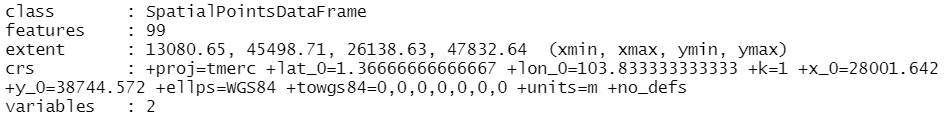

```{r setup, include=FALSE}
knitr::opts_chunk$set(echo = TRUE, 
                      eval = TRUE,
                      message = FALSE,
                      warning = FALSE,
                      fig.retina = 3)
```

## 1.0 Overview

### 1.1 Background
<center>
{width=90%}
</center>
*The email that started Airbnb. [Source](https://twitter.com/Bill_Gross/status/699646672125558784?)*

From a couple of air mattresses and a complimentary breakfast at $80/night to a billion-dollar international business, Airbnb stands as one of the greatest success stories of the sharing economy. Their peer-to-peer model of short-term home-sharing have found a foothold worldwide: from Washington DC to New Delhi, from Shanghai to Havana - convenient locations at low cost have garnered great support from hosts and travellers alike.

And how has Singapore accommodated this sector of the sharing revolution? 

Turns out: it hasn't. [Short-term rentals of less than three months remain illegal](https://www.channelnewsasia.com/singapore/no-change-3-month-minimum-stay-duration-private-residential-properties-ura-877211) in Singapore - 6 months if you're renting out a HDB. In addition, there's an [occupancy limit](https://irblaw.com.sg/learning-centre/airbnb-legal-singapore/) for those looking to rent out their HDBs: 6 persons for a 3-room flat, and 9 persons for a 4-room flat or larger. An extensive public consultation spanning 4 years came back with the conclusion: you might be alright with renting out your home, but [your neighbours aren't](https://www.todayonline.com/singapore/short-term-home-sharing-remains-illegal-singapore-airbnb-disappointed). Security concerns, a loss of privacy, causing disturbances within the neighbourhood or even damaging common facilities are among the top concerns of private homeowners - and this sentiment comes across in the strict regulatory framework for renting out short-term accommodations.

Airbnb's setbacks aren't solely with government restrictions: with 2020 came the COVID-19 global pandemic, which caused significant upheaval in the lives of many - arguably, the lives of every. As [this paper](https://espace.library.uq.edu.au/view/UQ:ab59afd/Airbnb_Before_During_and_After_COVID19.pdf?dsi_version=e54855794274f8f32a6d5c5132254f51#page=132) points out, Airbnb hosts were 'spoiled by high returns and the prospect of the ever-increasing growth of the Airbnb market' pre-COVID, only to be hit with cancelled bookings and overwhelming financial pressure that lead to (temporary) exodus from the short-term rental market, or transition into long-term rentals. 

In the context of Singapore, how do these two play into Airbnb accommodations?

### 1.2 Problem Statement
There are two parts to our analysis that we want to investigate, namely: 

- [A] how the distribution of Airbnb listings are affected by location factors (such as MRTs, tourist locations etc.)
- [B] the impact of COVID-19 on Airbnb listings in Singapore (a comparison of the pre- and post-COVID-19 listings)

## 2.0 Setup

### 2.1 Packages Used
The R packages we'll use for this analysis are:

- [**sf**](https://cran.r-project.org/web/packages/sf/index.html): used for importing, managing, and processing geospatial data
- [**tidyverse**](https://www.tidyverse.org/): a collection of packages for data science tasks
- [**tmap**](https://cran.r-project.org/web/packages/tmap/index.html): used for creating thematic maps, such as choropleth and bubble maps
- [**spatstat**](https://spatstat.org/): used for point pattern analysis
- [**raster**](https://cran.r-project.org/web/packages/raster/): reads, writes, manipulates, analyses and models gridded spatial data (i.e. raster-based geographical data)
- [**maptools**](https://cran.r-project.org/web/packages/maptools/index.html): a set of tools for manipulating geographic data
- [**rgdal**](https://cran.r-project.org/web/packages/rgdal/index.html): provides bindings to the Geospatial Data Analysis Library (GDAL) and used for projectoin/transforamtion operations
- [**kableExtra**](https://haozhu233.github.io/kableExtra/): an extension of kable, used for table customisation
- [**plotly**](https://plotly.com/r/): used for creating interactive web graphics, and can be used in conjunction with ggplot2 with the `ggplotly()` function
- [**ggthemes**](https://cran.r-project.org/web/packages/ggthemes/index.html): an extension of ggplot2, with more advanced themes for plotting
- [**onemapsgapi**](https://cran.r-project.org/web/packages/onemapsgapi/index.html): used to query Singapore-specific spatial data, alongside additional functionalities. Recommended readings: [Vignette](https://cran.r-project.org/web/packages/onemapsgapi/vignettes/onemapsgapi_vignette.html) and [Documentation](https://www.onemap.gov.sg/docs/)
- [**devtools**](https://cran.r-project.org/web/packages/devtools/index.html): used for installing any R packages which is not available in RCRAN. In this context, it'll be used to download the [**xaringanExtra**](https://pkg.garrickadenbuie.com/xaringanExtra/#/) package for [panelsets](https://pkg.garrickadenbuie.com/xaringanExtra/#/panelset)

In addition, the following **tidyverse** packages will be used:

- **readr** for importing delimited files (.csv)
- **tidyr** for manipulating and tidying data
- **dplyr** for wrangling and transforming data
- **ggplot2** for visualising data

```{r}
# initialise a list of required packages
packages = c('sf', 'tidyverse', 'tmap', 'spatstat', 'raster', 'maptools', 'rgdal',
             'kableExtra', 'plotly', 'ggthemes', 'onemapsgapi', 'devtools')

# for each package, check if installed and if not, install it
for (p in packages){
  if(!require(p, character.only = T)){
    install.packages(p)
  }
  library(p,character.only = T)
}
```

```{r results="hide"}
devtools::install_github("gadenbuie/xaringanExtra")
library(xaringanExtra)
```

```{r panelset, echo=FALSE}
xaringanExtra::use_panelset()
```

### 2.2 Datasets Used

```{r}
# initialise a dataframe of our geospatial and aspatial dataset details
datasets <- data.frame(
  Type=c("Geospatial",
         "Geospatial",
         "Geospatial",
         "Geospatial",
         "Geospatial",
         "Geospatial",
         "Geospatial",
         "Geospatial",
         "Geospatial",
         
         "Aspatial",
         "Aspatial",
         "Aspatial",
         "Aspatial"),
  
  Name=c("Singapore National Boundary `CostalOutline`",
         "Master Plan 2014 Subzone Boundary (Web) `MP14_SUBZONE_WEB_PL`",
         "MRT & LRT Locations Aug 2021 `MRTLRTStnPtt`",
         "Bus Stop Locations Aug 2021 `BusStop`",
         "Taxi Stand Locations Aug 2021 `TaxiStop`",
         "Historic Sites",
         "Moneychanger Locations",
         "Monuments",
         "Museums",
         
         "Singapore Airbnb Listings June 2019",
         "Singapore Airbnb Listings June 2021",
         "Tourism",
         "Hotels"),
  
  Format=c(".shp", 
           ".shp", 
           ".shp", 
           ".shp", 
           ".shp", 
           ".kml",
           ".kml",
           ".kml",
           ".kml",
           
           ".csv",
           ".csv",
           ".csv",
           ".csv"),
  
  Source=c("[data.gov.sg](https://data.gov.sg/dataset/national-map-polygon)",
           "[data.gov.sg](https://data.gov.sg/dataset/master-plan-2014-subzone-boundary-web)",
           "[LTA Data Mall](https://datamall.lta.gov.sg/content/datamall/en/search_datasets.html?searchText=mrt)",
           "[LTA Data Mall](https://datamall.lta.gov.sg/content/datamall/en/search_datasets.html?searchText=bus%20stop)",
           "[LTA Data Mall](https://datamall.lta.gov.sg/content/datamall/en/search_datasets.html?searchText=taxi)",
           "[data.gov.sg](https://data.gov.sg/dataset/historic-sites)",
           "[data.gov.sg](https://data.gov.sg/dataset/locations-of-money-changer)",
           "[data.gov.sg](https://data.gov.sg/dataset/monuments)",
           "[data.gov.sg](https://data.gov.sg/dataset/museums)",
           
           "[Inside Airbnb](http://insideairbnb.com/get-the-data.html)",
           "[Inside Airbnb](http://insideairbnb.com/get-the-data.html)",
           "[OneMap API](https://www.onemap.gov.sg/docs/)",
           "[OneMap API](https://www.onemap.gov.sg/docs/)")
  )

# with reference to this guide on kableExtra:
# https://cran.r-project.org/web/packages/kableExtra/vignettes/awesome_table_in_html.html
# kable_material is the name of the kable theme
# 'hover' for to highlight row when hovering, 'scale_down' to adjust table to fit page width
library(knitr)
library(kableExtra)
kable(datasets, caption="Datasets Used") %>%
  kable_material("hover", latex_options="scale_down")
```
*Each source links to the respective dataset source, not the generic website - you can download and follow along `r emo::ji("thumbs_up")` *

Due to authorisation issues with the OneMap API, I chose to download the datasets from either [Data.gov.sg](https://data.gov.sg/) or [LTA Data Mall](https://datamall.lta.gov.sg/content/datamall/en.html) instead; However, they are all available as themes on OneMap. The list of available themes from the OneMap API was referenced from [this document](https://www.tech.gov.sg/files/media/media-releases/2013/04/factsheetOneMappdf.pdf)

#### Justification for Supplementary Datasets
In order to supplement the rail network of MRTs and LRTs, I've included bus stop and taxi stand locations - both of which contribute to our public transport, which, as [this paper](https://www.sciencedirect.com/science/article/pii/S2212571X13000772) points out, adds to the total tourist experience (Duval, 2007) and may influence tourist satisfaction with the destination (Thompson & Schofield, 2007).

To encourage tourists to use public transport, a joint effort between the Land Transport Authority (LTA) and the Singapore Tourism Board (STB) lead to the official launch of the ['Singapore Tourist Pass' and a Public Transport Guide for Tourists (The “Travel with Ease” Guide)](https://www.stb.gov.sg/content/stb/en/media-centre/media-releases/singapore-tourist-pass-and-public-transport-guide.html). The former allows for unlimited bus and train rides for S$8/day, making public transport both cost-effective and convenient for tourists - the latter presents tourists with useful information on the various modes of public transport and gives travel directions to various places of interest. This is one of the contributors to [Singapore taking top spot in McKinsey's 2018 "Cities with Best Public Tranportation" Survey](https://www.straitstimes.com/singapore/us-travel-site-ranks-singapores-public-transport-system-best-in-the-world). 

As such, I have reason to believe accessibility to the public transport system is a contributing factor to the attractiveness of Airbnb listings - and as we know, public transport extends past just the MRTs and LRTs! Thus my inclusion of bus stops (bus services are included as part of the Singapore Tourist Pass) and taxi stands (taxis *are* part of public transport, just not mass transport - and taxis are the fastest and most direct method to get to specific sightseeing areas).

<center>
{width=90%}
</center>
*Retrieved from Science Direct, [Using Historical Heritage as a Factor in Tourism Development](https://www.sciencedirect.com/science/article/pii/S1877042815021485)*

In addition, historical and cultural objects, such as museums or monuments, are one of the main factors of tourism. As this paper, [Using Historical Heritage as a Factor in Tourism Development](https://www.sciencedirect.com/science/article/pii/S1877042815021485) puts it: the cultural capacity of the region, expressed through its historical heritage, plays a huge role in the development of tourism - something I believe could be showcased through this analysis. Thus my inclusion of museums, monuments and historical sites - some of which might overlap with the existing 'tourism' aspatial dataset, but we might be able to better determine the relationships 

The inclusion of moneychangers is self-explanatory: at any point of the tourist's journey, unexpected incidents that require extra funds might crop up, necessitating either using their credit card (which is known to incur significant fees, and might not be accepted in certain parts of a country or even the whole country) or a trip to the moneychanger. 

## 3.0 Data Wrangling: Geospatial Data
Here's a lil refresher on the import methods:

<center>
{width=90%}
</center>

### 3.1 Importing Geospatial Data
Note: we could use either *st_read()* or *readOGR()* to read our geospatial data, but I prefer to read it in as a simple features dataframe first and then use *as_Spatial()* to convert it to a Spatial* object when necessary. This way, I can perform visualisations on both the simple features dataframe and Spatial* objects!

In addition, since we have .kml files - recall what we learned in our very first exercise, [Hands-On Exercise 02](https://is415-msty.netlify.app/posts/2021-08-30-hands-on-exercise-2/):

<center>
{width=90%}
</center>

::::: {.panelset}
::: {.panel}
## Base {.panel-name}
```{r}
# reads in geospatial data and stores into respective dataframes
sg_sf <- st_read(dsn = "data/geospatial", layer="CostalOutline")
mpsz_sf <- st_read(dsn = "data/geospatial", layer = "MP14_SUBZONE_WEB_PL")
rail_network_sf <- st_read(dsn="data/geospatial", layer="MRTLRTStnPtt")
```
:::
::: {.panel}
## Self-Sourced {.panel-name}
```{r}
# self-sourced data for further visualisations
bus_sf <- st_read(dsn="data/geospatial/selfsourced", layer="BusStop")
taxi_sf <- st_read(dsn="data/geospatial/selfsourced", layer="TaxiStop")
museums_sf <- st_read("data/geospatial/selfsourced/museums-kml.kml")
monuments_sf <- st_read("data/geospatial/selfsourced/monuments-kml.kml")
moneychangers_sf <- st_read("data/geospatial/selfsourced/locations-of-money-changer-kml.kml")
historic_sites_sf <- st_read("data/geospatial/selfsourced/historic-sites-kml.kml")
```
:::
:::::

Overall, most of the projected CRS are the 'Singapore Projected Coordinate system', [SVY21](https://epsg.io/3414) (ESPG Code 3414), whichi s appropriate for our analysis (which is Singapore-centric). However, the `museums`, `monuments`, `moneychangers` and `historic_sites` are using the 'World Geodetic System 1984', [WGS84](https://epsg.io/4326). We'll address this and check on their CRS with *st_crs()* later on in Section 3.3.

Also, notice that `museums`, `monuments`, `moneychangers` and `historic_sites` have their dimensions listed as 'XYZ': it has a z-dimension, though as we can see from the z_range, both zmin and zmax are at 0. As it is irrelevant to our analysis, we'll drop this with [*st_zm()*](https://r-spatial.github.io/sf/reference/st_zm.html) in our pre-processing.

### 3.2 Data Pre-Processing
Before we even start visualising our data, we have to first check for two things: invalid geometries and missing values, which could impact future calculations and representations if not addressed. In addition, we have to drop the z-dimension from some of our dataframes.

*Reference was taken from the senior sample submissions for the code for this section, with credit to Xiao Rong Wong's [Geographic Analysis of the Supply & Demand of Childcare Services in Singapore](https://rpubs.com/xiaorongw/IS415_Take-home_Ex01)*

#### 3.2.1 Dropping Z-Dimension
As we noticed in the section above, certain dataframes have a Z-dimension. We'll take care of with [*st_zm()*](https://r-spatial.github.io/sf/reference/st_zm.html), a function that drops Z (or M) dimensions from feature geometries and appropriate reset the classes.

```{r results='hide'}
# drops the Z-dimension from our dataframes
# due to the length of the output, I've opted to hide the results 
# reference for manipulating output messages: https://yihui.org/knitr/demo/output/
museums_sf <- st_zm(museums_sf)
monuments_sf <- st_zm(monuments_sf)
moneychangers_sf <- st_zm(moneychangers_sf)
historic_sites_sf <- st_zm(historic_sites_sf)
```

```{r eval=FALSE}
# once again, due to the length of output, I've opted to leave this as a non-evaluated line of code
# however, I've included a screenshot of the first portion of the output!
museums
```

<center>

</center>

#### 3.2.2 Invalid Geometries
Let us first check for invalid geometries:

```{r}
# function breakdown:
# the st_is_valid function checks whether a geometry is valid
# which returns the indices of certain values based on logical conditions
# length returns the length of data objects

# checks for the number of geometries that are NOT valid
length(which(st_is_valid(sg_sf) == FALSE))
length(which(st_is_valid(mpsz_sf) == FALSE))
length(which(st_is_valid(rail_network_sf) == FALSE))

length(which(st_is_valid(bus_sf) == FALSE))
length(which(st_is_valid(taxi_sf) == FALSE))
length(which(st_is_valid(museums_sf) == FALSE))
length(which(st_is_valid(monuments_sf) == FALSE))
length(which(st_is_valid(moneychangers_sf) == FALSE))
length(which(st_is_valid(historic_sites_sf) == FALSE))

# Alternative Method
# test <- st_is_valid(sg_sf,reason=TRUE)
# length(which(test!= "Valid Geometry"))
# credit to Rajiv Abraham Xavier https://rpubs.com/rax/Take_Home_Ex01
```

Note: even if you didn't drop the Z co-ordinate for this section, our st_is_valid() function will automatically do it for you, like so:

<center>
{width=75%}
</center>

As we can see from the output, `sg` has 1 invalid geometry while `mpsz` has 9 invalid geometries. With reference to [this article on checking and creating validity](https://r-spatial.github.io/sf/reference/valid.html), let's address them and check again:

```{r}
# st_make_valid takes in an invalid geometry and outputs a valid one with the lwgeom_makevalid method
sg_sf <- st_make_valid(sg_sf)
length(which(st_is_valid(sg_sf) == FALSE))
mpsz_sf <- st_make_valid(mpsz_sf)
length(which(st_is_valid(mpsz_sf) == FALSE))
```

Success! `r emo::ji("party_popper")` 

#### 3.2.3 Missing Values
Now, let us check for missing values:

::::: {.panelset}
::: {.panel}
## Base {.panel-name}
```{r}
# the rowSums(is.na(sg_sf))!=0 checks every row if there are NA values, returning TRUE or FALSE
# the sg_sf [] 'wrapper' prints said rows that contain NA values
sg_sf[rowSums(is.na(sg_sf))!=0,]
mpsz_sf[rowSums(is.na(mpsz_sf))!=0,]
rail_network_sf[rowSums(is.na(rail_network_sf))!=0,]
```
:::
::: {.panel}
## Self-Sourced {.panel-name}
```{r}
bus_sf[rowSums(is.na(bus_sf))!=0,]
taxi_sf[rowSums(is.na(taxi_sf))!=0,]
museums_sf[rowSums(is.na(museums_sf))!=0,]
monuments_sf[rowSums(is.na(monuments_sf))!=0,]
moneychangers_sf[rowSums(is.na(moneychangers_sf))!=0,]
historic_sites_sf[rowSums(is.na(historic_sites_sf))!=0,]
```
:::
:::::

There doesn't seem to be any missing values for any of our provided geospatial datasets `r emo::ji("sparkles")` But our self-sourced ones have some missing values, so let's address them. After a bit of EDA and testing, I've realised that all the observations for `TYPE_CD` in the taxi dataframe are NA: likely because there is a separate column, `TYPE_CD_DE`, that describes the taxi stand type (i.e. overlap of features). As such, we should drop that column first before re-testing for NA values.

```{r}
# using select(), removes the TYPE_CD column from taxi_sf dataframe
# and assigns this new dataframe back to taxi
# reference: https://www.statology.org/remove-columns-in-r/
taxi_sf <- taxi_sf %>% select(-TYPE_CD)

# checking for NA values again
taxi_sf[rowSums(is.na(taxi_sf))!=0,]
```

Now, let's move on to removing the NA observations:

```{r}
# removes rows that have an NA value in the respective NA columns
# which is LOC_DESC and TYPE_CD_DE for bus_sf and taxi_sf respectively
bus_sf <- na.omit(bus_sf,c("LOC_DESC"))
taxi_sf <- na.omit(taxi_sf,c("TYPE_CD_DE"))
```

And let's check for missing values one last time, just to be sure:

```{r}
# the rowSums(is.na(bus))!=0 checks every row if there are NA values, returning TRUE or FALSE
# the bus 'wrapper' prints said rows that contain NA values
bus_sf[rowSums(is.na(bus_sf))!=0,]
taxi_sf[rowSums(is.na(taxi_sf))!=0,]
```

Alright, our geospatial data pre-processing is done! `r emo::ji("partying_face")` 

### 3.3 Verifying + Transforming Coordinate System
When we imported the data, we made a mental note to verify the projected CRS - and we'll do that now!

::::: {.panelset}
::: {.panel}
## Base {.panel-name}
```{r}
# using st_crs() function to check on the CRS and ESPG Codes
st_crs(sg_sf)
st_crs(mpsz_sf)
st_crs(rail_network_sf)
```
:::
::: {.panel}
## Self-Sourced {.panel-name}
```{r}
st_crs(bus_sf)
st_crs(taxi_sf)
st_crs(museums_sf)
st_crs(monuments_sf)
st_crs(moneychangers_sf)
st_crs(historic_sites_sf)
```
:::
:::::

Hmm. That's not right - our projected CRS should be SVY21 (ESPG Code 3414), but for our given data, the current ESPG Codes are 9001. In addition, some of our self-sourced datasets are in WG84 (ESPG Code 4326) as well. Let's assign the correct ESPG Codes:

```{r warning=FALSE}
# with st_set_crs(), we can assign the appropriate ESPG Code
sg_sf <- st_set_crs(sg_sf, 3414)
mpsz_sf <- st_set_crs(mpsz_sf, 3414)
rail_network_sf <- st_set_crs(rail_network_sf, 3414)

bus_sf <- st_set_crs(bus_sf, 3414)
taxi_sf <- st_set_crs(taxi_sf, 3414)

# with st_transform(), we can change from one CRS to another
museums_sf <- st_transform(museums_sf, crs=3414)
monuments_sf <- st_transform(monuments_sf, crs=3414)
moneychangers_sf <- st_transform(moneychangers_sf, crs=3414)
historic_sites_sf <- st_transform(historic_sites_sf, crs=3414)
```

And now, let's check if the CRS has been properly assigned:

::::: {.panelset}
::: {.panel}
## Base {.panel-name}
```{r}
# using st_crs() function to check on the CRS and ESPG Codes
st_crs(sg_sf)
st_crs(mpsz_sf)
st_crs(rail_network_sf)
```
:::
::: {.panel}
## Self-Sourced {.panel-name}
```{r}
st_crs(bus_sf)
st_crs(taxi_sf)
st_crs(museums_sf)
st_crs(monuments_sf)
st_crs(moneychangers_sf)
st_crs(historic_sites_sf)
```
:::
:::::

Whew, that's a long output - but as we can see, it's all good! `r emo::ji("light_bulb")` 

### 3.4 Initial Visualisation
Now that we've finished our standard pre-processing, let's try visualising our data:

::::: {.panelset}
::: {.panel}
## SG {.panel-name}
```{r}
# plots the geometry only - these are the 'base' maps
# alternatively, we can use plot(sg$geometry)
plot(st_geometry(sg_sf))
```
:::
::: {.panel}
## MPSZ {.panel-name}
```{r}
plot(st_geometry(mpsz_sf))
```
:::
:::::

The main difference between `sg` and `mpsz` is that the former is a nationwide map, while the latter shows the subzones. Whichever we use depends on the scale of analysis: we might use `sg` for a general overview, while we'll tap on the subzone divisions in `mpsz` if we want to look into specific subzones.

```{r}
# switching to interactive map for better visualisation and to explore specific areas if needed
tmap_mode("view")
tm_shape(rail_network_sf) +
  tm_dots(col="purple", size=0.05)

# return tmap mode to plot for future visualisations
tmap_mode("plot")
```

These are the MRT/LRT train stations. There are 3 distinct clusters - the two in the upper area, (West and Northeast regions specifically) are due to the LRT lines, while the cluster in the Central region is due interconnections of different lines in the CBD and city areas for increased connectivity 

This also matches up to the existing railway network map:

<center>
{width=90%}
</center>
*Retrieved from [MRT.SG](https://mrt.sg/map). Original work by Wikipedia user Seloloving.*

Let's also visualise our self-sourced Bus Stops & Taxi Stands:

::::: {.panelset}
::: {.panel}
## Bus Stops {.panel-name}
```{r}
tmap_mode("plot")
tm_shape(mpsz_sf) +
  tm_borders(alpha = 0.5) +
  tmap_options(check.and.fix = TRUE) +
tm_shape(bus_sf) +
  tm_dots(col="red", size=0.05) +
  tm_layout(main.title = "Bus Stops",
          main.title.position = "center",
          main.title.size = 1.2,
          frame = TRUE)
```
:::
::: {.panel}
## Taxi Stands {.panel-name}
```{r}
tmap_mode("plot")
tm_shape(mpsz_sf) +
  tm_borders(alpha = 0.5) +
  tmap_options(check.and.fix = TRUE) +
tm_shape(taxi_sf) +
  tm_dots(col="blue", size=0.05) +
  tm_layout(main.title = "Taxi Stands",
          main.title.position = "center",
          main.title.size = 1.2,
          frame = TRUE)
```
:::
:::::

These will be good supplements to our `railway_network` - we can look at how the transport system and general connectivity of a place could play a role in the distribution of airbnb listings, especially since many tourists depend on the public transport system to get around a country due to its accessibility and cost, characteristics that are amplified in Singapore's limited 728.6 km².

Let's also take a look at the historical/cultural points of interest, namely museums, monuments, moneychangers and historical sites. As mentioned in 2.2's Justification of Datasets used, tourists visit a country for a litany of reasons, but the top motivations are to understand the history and culture of the country, while moneychangers are crucial to their funds.

For this interactive graph, 'warm' colours (red, orange, yellow) represents places of historical/cultural interest (museums, monuments and historical sites) while 'cool' colours (blue) represents the moneychangers.

```{r}
tmap_mode("view")
tm_shape(museums_sf) +
  tm_dots(alpha=0.4, #affects transparency of points
          col="red",
          size=0.05) +
tm_shape(monuments_sf) +
  tm_dots(alpha=0.4,
          col="orange",
          size=0.05) +
tm_shape(moneychangers_sf) +
  tm_dots(alpha=0.4,
          col="blue",
          size=0.05) +
tm_shape(historic_sites_sf) +
  tm_dots(alpha=0.4,
          col="yellow",
          size=0.05)

# return tmap mode to plot for future visualisations
tmap_mode("plot")
```

## 4.0 Data Wrangling: Aspatial Data

### 4.1 Importing Aspatial Data + EDA
Now that we have our geospatial data sorted out, let's move on to our aspatial data! We'll need to import the data first. You might remember that [in our last take-home exercise](https://is415-msty.netlify.app/posts/2021-09-10-take-home-exercise-1/), we discovered the existence of duplicate columns when performing EDA. It's important to understand what we're working with and to check for any discrepancies! As such, after importing, let's take a look at our dataframes with *glimpse()*:

::::: {.panelset}
::: {.panel}
## Import {.panel-name}
```{r}
# reads the the respective aspatial data and stores it as dataframes
# I've included show_col_types=FALSE so that there won't be a output of column types
# since in the next portion, we'll be using glimpse() to look at columns specifically
listings_2019 <- read_csv("data/aspatial/listings_30062019.csv", show_col_types=FALSE)
listings_2021 <- read_csv("data/aspatial/listings_29062021.csv", show_col_types=FALSE)
hotels <- read_csv("data/aspatial/hotels.csv", show_col_types=FALSE)
tourism <- read_csv("data/aspatial/tourism.csv", show_col_types=FALSE)
```
:::
::: {.panel}
## Glimpse() {.panel-name}
```{r}
# gives an associated attribute information of the dataframe 
glimpse(listings_2019)
glimpse(listings_2021)
glimpse(hotels)
glimpse(tourism)
```
:::
:::::

With this, we can observe that all our data have Longitude and Latitude features - though some of them use `Latitude` and `Longtitude` while others use `Lat` and `Lng`. Also, notice that for `tourism`, there are *both* `Lat`&`Lng` as well as `Latitude`&`Longtitude` - from the first few entries, they seem identical, but we'll see which one we go with when checking for missing values.

This also indicates that their projected CRS is the World Geodetic System 1984 (WGS84), which is the most commonly used and favoured CRS. We'll need to re-assign that to fit with our geospatial data, which is using SVY21.

### 4.2 Data Pre-Processing

#### 4.2.1 Missing Values
Like with our geospatial data, we should check if there are missing values. We're only concerned about the longitude and latitude specifically:

```{r}
sum(is.na(listings_2019$latitude))
sum(is.na(listings_2019$longitude))
sum(is.na(listings_2021$latitude))
sum(is.na(listings_2021$longitude))

sum(is.na(hotels$Lat))
sum(is.na(hotels$Lng))
sum(is.na(tourism$Lat))
sum(is.na(tourism$Lng))
sum(is.na(tourism$LATITUDE))
sum(is.na(tourism$LONGTITUDE))
```
>Note: PSST! If you'd like a way to show the number of NA values for columns with NA values only, I'd recommend checking [this](https://sebastiansauer.github.io/NAs-with-dplyr/) out.

As we can see, `tourism`'s Lat vs LATITUDE issue can now be resolved. There seems to be one missing value in the LATITUDE/LONGITUDE features as opposed to the Lat/Lng one (which has no missing values), so we'll use Lat/Lng for `tourism`. Let's also check the row with missing values:

```{r}
tourism[(is.na(tourism$LONGTITUDE)),]
tourism[(is.na(tourism$LATITUDE)),]
```

As we can see, the observation with missing latitude/longitude is 'Cruises from Singapore', which makes sense considering that a cruise ship would be inside Singapore waters, or outside of Singapore's geographical boundaries - both of which would be hard (if not nigh impossible) to represent on a map representing Singapore's landmass. As such, let's remove that observation:

```{r}
tourism <- tourism[!(is.na(tourism$LONGTITUDE)), ]
tourism <- tourism[!(is.na(tourism$LATITUDE)), ]
```

And we'll check again:

```{r}
sum(is.na(tourism$LATITUDE))
sum(is.na(tourism$LONGTITUDE))
```

That's done and dusted! `r emo::ji("smile")` 

#### 4.2.2 Convert into sf objects + Transforming Coordinate System
Now, we have to transform our dataframes into sf objects, and then verify and transform our assigned CRS for our aspatial datasets. In fact, we already know that (just like some of our geospatial datasets above) these datasets are using WGS84 (ESPG Code 4326) on account of using Latitude and Longitude - so we can do these two things in one go:

```{r}
# you can chose to reuse the variable name as-is, especially if you have no plans to revisit older variables
# however, i believe it to be better practice to rename variables so that we know what type of data we're working with at any point of time!\
# st_as_sf outputs a simple features data frame
listings_2019_sf <- st_as_sf(listings_2019, 
                          # our coordinates are the longitude and latitude
                          coords = c("longitude", 
                                     "latitude"), 
                          # the geographical features are in longitude & latitude, in decimals
                          # as such, WGS84 is the most appropriate coordinates system
                          crs = 4326) %>%
  #afterwards, we transform it to SVY21, our desired CRS
  st_transform(crs=3414)

listings_2021_sf <- st_as_sf(listings_2021, 
                          coords = c("longitude", 
                                     "latitude"), 
                          crs = 4326) %>%
  st_transform(crs=3414)

hotels_sf <- st_as_sf(hotels, 
                      coords = c("Lng", 
                                 "Lat"), 
                      crs = 4326) %>%
  st_transform(crs=3414)

tourism_sf <- st_as_sf(tourism, 
                       coords = c("Lng", 
                                  "Lat"), 
                       crs = 4326) %>%
  st_transform(crs=3414)
```

## 5.0 Combined Data Wrangling: Geospatial & Aspatial Data
As we're doing spatial points analysis, we'll need to convert both our geospatial and aspaital data into the appropriate formats.

### 5.1 Converting sf data frames to sp's Spatial* class
Firstly, we'll need to convert the simple features data frames into Spatial* classes if we can to do SPPA on it:

```{r}
mpsz <- as_Spatial(mpsz_sf)
sg <- as_Spatial(sg_sf)
rail_network <-as_Spatial(rail_network_sf)

bus <- as_Spatial(bus_sf)
taxi <- as_Spatial(taxi_sf)
museums <- as_Spatial(museums_sf)
monuments <- as_Spatial(monuments_sf)
moneychangers <- as_Spatial(moneychangers_sf)
historic_sites <- as_Spatial(historic_sites_sf)

listings_2019 <- as_Spatial(listings_2019_sf)
listings_2021 <- as_Spatial(listings_2021_sf)
hotels <- as_Spatial(hotels_sf)
tourism <- as_Spatial(tourism_sf)
```

Let's check the newly-converted Spatial* classes!

::::: {.panelset}
::: {.panel}
## Singapore Boundaries (mpsz + sg) {.panel-name}
```{r}
mpsz
sg
```
:::
::: {.panel}
## Base {.panel-name}
```{r}
listings_2019
listings_2021
hotels
tourism
rail_network
```
:::
::: {.panel}
## Self-sourced {.panel-name}
Due to the sheer length of output of our self-sourced data, I've opted to to make code evluation FALSE for this code chunk. Screenshots of the first section of the output are included instead!

```{r eval=FALSE}
# geospatial data (self-sourced)
bus
taxi
museums
monuments
moneychangers
historic_sites
```

<center>
{width=90%}
{width=90%}
{width=90%}
{width=90%}
{width=90%}
{width=90%}
</center>
:::
:::::

### 5.2 Converting from Spatial* classes to sp format
**spatstat** requires the analytical data to be in **ppp** object form, but since there is no way to directly convert a Spatial* classes into **ppp** object, we’ll need to convert the Spatial* classes into a generic Spatial object first, then convert the generic sp object into ppp object form.

```{r}
# convert into respective sp (in our case, either polygons or points)
mpsz_sp <- as(mpsz, "SpatialPolygons")
sg_sp <- as(sg, "SpatialPolygons")
rail_network_sp <-as(rail_network, "SpatialPoints")

listings_2019_sp <- as(listings_2019, "SpatialPoints")
listings_2021_sp <- as(listings_2021, "SpatialPoints")
hotels_sp <- as(hotels, "SpatialPoints")
tourism_sp <- as(tourism, "SpatialPoints")

bus_sp <- as(bus, "SpatialPoints")
taxi_sp <- as(taxi, "SpatialPoints")
museums_sp <- as(museums, "SpatialPoints")
monuments_sp <- as(monuments, "SpatialPoints")
moneychangers_sp <- as(moneychangers, "SpatialPoints")
historic_sites_sp <- as(historic_sites, "SpatialPoints")
```

### 5.3 Converting from sp format to spatstat ppp format
Note that there is no way of coercing **SpatialPolygons** to **ppp** format - nor is there any need to. As such, we won't be including our 'base maps', mpsz and sg.

```{r}
# from sp object, convert into ppp format
listings_2019_ppp <- as(listings_2019_sp, "ppp")
listings_2021_ppp <- as(listings_2021_sp, "ppp")
rail_network_ppp <-as(rail_network_sp, "ppp")
hotels_ppp <- as(hotels_sp, "ppp")
tourism_ppp <- as(tourism_sp, "ppp")

bus_ppp <- as(bus_sp, "ppp")
taxi_ppp <- as(taxi_sp, "ppp")
museums_ppp <- as(museums_sp, "ppp")
monuments_ppp <- as(monuments_sp, "ppp")
moneychangers_ppp <- as(moneychangers_sp, "ppp")
historic_sites_ppp <- as(historic_sites_sp, "ppp")
```

Now, let's check the newly-converted **ppp** objects with *summary()*:

```{r}
# from sp object, convert into ppp format
summary(rail_network_ppp)
summary(listings_2019_ppp)
summary(listings_2021_ppp)
summary(hotels_ppp)
summary(tourism_ppp)

summary(bus_ppp)
summary(taxi_ppp)
summary(museums_ppp)
summary(monuments_ppp)
summary(moneychangers_ppp)
summary(historic_sites_ppp)
```

From our output, we can summarise:

- ppp objects with duplicated points: listings_2019_ppp, listings_2021_ppp, hotels_ppp, tourism_ppp, taxi_ppp, moneychangers_ppp
- ppp objects with no duplicated points: railway_network_ppp, bus_ppp, museums_ppp, monuments_ppp, historic_sites_ppp

### 5.4 Handling Duplicated Points + Jittering
Though we've found which **ppp** objects have duplicates, it's always best to double-check and verify. We can use *duplicated()* for this:

```{r}
# looks if there is any instance of duplicated points in the ppp object
# returns TRUE if there is even a sinngle set of duplicated points

# should be TRUE i.e. have duplicated
any(duplicated(listings_2019_ppp)) 
any(duplicated(listings_2021_ppp)) 
any(duplicated(hotels_ppp)) 
any(duplicated(tourism_ppp)) 
any(duplicated(taxi_ppp)) 
any(duplicated(moneychangers_ppp)) 

# should be FALSE i.e. no duplicates
any(duplicated(rail_network_ppp)) 
any(duplicated(bus_ppp)) 
any(duplicated(museums_ppp)) 
any(duplicated(monuments_ppp)) 
any(duplicated(historic_sites_ppp)) 

# we can also use multiplicity() to count the number of co-incidence points
# to get the number of locations with duplicated events, use this:
# sum(multiplicity(rail_network_ppp)>1)
```

Yup, this is congruent with what we discovered earlier. Our first instinct might be to delete said duplicated points - but deleting them, we might be ignoring repeat occurrences, which could be valuable data + insights. However, never fear - there's a better method to handle these duplicated points called **jittering**, where we add a small perturbation to the duplicate points so that they do not occupy the exact same space.

```{r}
listings_2019_ppp_jit <- rjitter(listings_2019_ppp, 
                             retry=TRUE, 
                             nsim=1, 
                             drop=TRUE)
listings_2021_ppp_jit <- rjitter(listings_2021_ppp, 
                             retry=TRUE, 
                             nsim=1, 
                             drop=TRUE)
hotels_ppp_jit <- rjitter(hotels_ppp, 
                             retry=TRUE, 
                             nsim=1, 
                             drop=TRUE)
tourism_ppp_jit <- rjitter(tourism_ppp, 
                             retry=TRUE, 
                             nsim=1, 
                             drop=TRUE)
taxi_ppp_jit <- rjitter(taxi_ppp, 
                             retry=TRUE, 
                             nsim=1, 
                             drop=TRUE)
moneychangers_ppp_jit <- rjitter(moneychangers_ppp, 
                             retry=TRUE, 
                             nsim=1, 
                             drop=TRUE)
```

Let's check for duplicates again:
```{r}
any(duplicated(listings_2019_ppp_jit)) 
any(duplicated(listings_2021_ppp_jit)) 
any(duplicated(hotels_ppp_jit)) 
any(duplicated(tourism_ppp_jit)) 
any(duplicated(taxi_ppp_jit)) 
any(duplicated(moneychangers_ppp_jit)) 
```

Awesome! `r emo::ji("sparkles")` 

### 5.5 Introducing the *owin* object
Usually, when analysing spatial point patterns, we’ll confine our analysis within a certain geographical area - such as the Singapore boundary. In spatstat, an object called *owin* is specially designed to represent this polygonal region. This is also why I mentioned in 5.3 that there was no need (nor existing functions) to convert our 'base maps' into **ppp** - because they're meant to be converted into *owin* instead.

#### 5.5.1 Creating the owin object

```{r}
# using sg_sp as it is the CostalOutline of Singapore, i.e. the whole island's boundary
sg_owin <- as(sg_sp, "owin")
plot(sg_owin)
```

#### 5.5.2 Combining point events object and owin object
Now, we'll extract the relevant events that are located within the Singapore:

```{r}
rail_network_ppp_sg = rail_network_ppp[sg_owin]
listings_2019_ppp_sg = listings_2019_ppp_jit[sg_owin]
listings_2021_ppp_sg = listings_2021_ppp_jit[sg_owin]
hotels_ppp_sg = hotels_ppp_jit[sg_owin]
tourism_ppp_sg = tourism_ppp_jit[sg_owin]

bus_ppp_sg = bus_ppp[sg_owin]
taxi_ppp_sg = taxi_ppp_jit[sg_owin]
museums_ppp_sg = museums_ppp[sg_owin]
monuments_ppp_sg = monuments_ppp[sg_owin]
moneychangers_ppp_sg = moneychangers_ppp_jit[sg_owin]
historic_sites_ppp_sg = historic_sites_ppp[sg_owin]
```

#### 5.5.3 Visualisation of ppp objects within Singapore boundaries
Now, let's take a look at the visualisation:

```{r}
# in the format of par(mfrow(c(rows,columns))) to display multiple plots at once
# reference: https://www.statmethods.net/advgraphs/layout.html
par(mfrow=c(1,2))
plot(listings_2019_ppp_sg)
plot(listings_2021_ppp_sg)

# One figure in row 1 and two figures in row 2
# reference: https://stackoverflow.com/questions/31319942/change-the-size-of-a-plot-when-plotting-multiple-plots-in-r
layout(matrix(c(1,1,2,3), nrow = 2, ncol = 2, byrow = TRUE))
plot(rail_network_ppp_sg)
plot(bus_ppp_sg)
plot(taxi_ppp_sg)

plot(tourism_ppp_sg)

par(mfrow=c(2,2))
plot(museums_ppp_sg)
plot(monuments_ppp_sg)
plot(moneychangers_ppp_sg)
plot(historic_sites_ppp_sg)
```

The graphs are a little cluttered at the moment, but we'll slowly sort out the relationships in our analysis! Another thing to note - it seems that for most part, places of interest (tourism, hotels, moneychangers etc.) are centered around the Central Region. That's worth looking into when we're narrowing down areas for analysis!

## 6.0 [A] Airbnb Distribution in 2019: Exploratory Spatial Data Analysis

### 6.1 Rescaling to kilometers
As we learned from our [Hands-On Ex 5B](https://is415-msty.netlify.app/posts/2021-09-23-hands-on-exercise-5b/), we'll need to use [*rescale()*](https://www.rdocumentation.org/packages/spatstat/versions/1.64-1/topics/rescale) of the **spatstat** package, so as to convert meters (which SVY21 uses) into kilometers (our desired unit of measurement).

```{r}
# essentially, we're telling the function 'new unit length is 1000'
# function will divide the old value by 1000 to obtain values expressed in kilometers
# while this section isn't using listings_2021 yet, we'll prep it with the rest of our data :^)
rail_network_ppp_sg_km <- rescale(rail_network_ppp_sg, 1000, 'km')
listings_2019_ppp_sg_km <- rescale(listings_2019_ppp_sg, 1000, 'km')
listings_2021_ppp_sg_km <- rescale(listings_2021_ppp_sg, 1000, 'km')
hotels_ppp_sg_km <- rescale(hotels_ppp_sg, 1000, 'km')
tourism_ppp_sg_km <- rescale(tourism_ppp_sg, 1000, 'km')

bus_ppp_sg_km <- rescale(bus_ppp_sg, 1000, 'km')
taxi_ppp_sg_km <- rescale(taxi_ppp_sg, 1000, 'km')
museums_ppp_sg_km <- rescale(museums_ppp_sg, 1000, 'km')
monuments_ppp_sg_km <- rescale(monuments_ppp_sg, 1000, 'km')
moneychangers_ppp_sg_km <- rescale(moneychangers_ppp_sg, 1000, 'km')
historic_sites_ppp_sg_km <- rescale(historic_sites_ppp_sg, 1000, 'km')
```

### 6.2 Computing kernel density estimation using automatic bandwidth selection method
As we went through in [Hands-On Ex 04](https://is415-msty.netlify.app/posts/2021-09-05-hands-on-exercise-4/), we have the choice of using either *bw.ppl* or *bw.diggle* - the former is recommended for patterns comprised primarily of tight clusters, while the latter is good for detecting a single tight cluster in the midst of random noise. You can find out more (with illustrated examples!) in [this mapping guide](https://maczokni.github.io/crime_mapping_textbook/studying-spatial-point-patterns.html).

I've decided to go with bw.diggle for my analysis: my justification being that from what I see of our prior visualisations, there is a significant cluster in the Central region, while other regions have a relatively more widespread distribution of location factors - as such, I do not believe that applying an algorithm more suited for patterns "comprised primarily of tight clusters" would be appropriate for our data.

```{r warning=FALSE}
# automatic bandwidth method: bw.diggle
# smoothing kernel: gaussian (default)
kde_rail_network_sg_bw <- density(rail_network_ppp_sg_km,
                                   sigma=bw.diggle,
                                   edge=TRUE,
                                   kernel="gaussian")
kde_listings_2019_sg_bw <- density(listings_2019_ppp_sg_km,
                                   sigma=bw.diggle,
                                   edge=TRUE,
                                   kernel="gaussian")
kde_listings_2021_sg_bw <- density(listings_2021_ppp_sg_km,
                                   sigma=bw.diggle,
                                   edge=TRUE,
                                   kernel="gaussian")
kde_hotels_sg_bw <- density(hotels_ppp_sg_km,
                                   sigma=bw.diggle,
                                   edge=TRUE,
                                   kernel="gaussian")
kde_tourism_sg_bw <- density(tourism_ppp_sg_km,
                                   sigma=bw.diggle,
                                   edge=TRUE,
                                   kernel="gaussian")

kde_bus_sg_bw <- density(bus_ppp_sg_km,
                                   sigma=bw.diggle,
                                   edge=TRUE,
                                   kernel="gaussian")
kde_taxi_sg_bw <- density(taxi_ppp_sg_km,
                                   sigma=bw.diggle,
                                   edge=TRUE,
                                   kernel="gaussian")
kde_museums_sg_bw <- density(museums_ppp_sg_km,
                                   sigma=bw.diggle,
                                   edge=TRUE,
                                   kernel="gaussian")
kde_monuments_sg_bw <- density(monuments_ppp_sg_km,
                                   sigma=bw.diggle,
                                   edge=TRUE,
                                   kernel="gaussian")
kde_moneychangers_sg_bw <- density(moneychangers_ppp_sg_km,
                                   sigma=bw.diggle,
                                   edge=TRUE,
                                   kernel="gaussian")
kde_historic_sites_sg_bw <- density(historic_sites_ppp_sg_km,
                                   sigma=bw.diggle,
                                   edge=TRUE,
                                   kernel="gaussian")
```

### 6.3 Plotting Kernel Density Estimation
```{r}
plot(kde_listings_2019_sg_bw)

plot(kde_tourism_sg_bw)

layout(matrix(c(1,1,2,3), nrow = 2, ncol = 2, byrow = TRUE))
plot(kde_rail_network_sg_bw)
plot(kde_bus_sg_bw)
plot(kde_taxi_sg_bw)

par(mfrow=c(2,2))
plot(kde_museums_sg_bw)
plot(kde_monuments_sg_bw)
plot(kde_moneychangers_sg_bw)
plot(kde_historic_sites_sg_bw)
```

### 6.4 Converting KDE output into grid object into RasterLayer object
Now, we have to convert our KDE outputs into RasterLayer objects. Since we can't do that directly, we'll need to convert them into a SpatialGridDataFrame first, then convert the SpatialGridDataFrame into RasterLayer objects:

```{r}
# convert into a SpatialGridDataFrame
# then converts gridded output into raster
kde_listings_2019_sg_bw_raster <- kde_listings_2019_sg_bw %>% 
  as.SpatialGridDataFrame.im() %>% 
  raster()

kde_listings_2021_sg_bw_raster <- kde_listings_2021_sg_bw %>% 
  as.SpatialGridDataFrame.im() %>% 
  raster()

kde_rail_network_sg_bw_raster <- kde_rail_network_sg_bw %>% 
  as.SpatialGridDataFrame.im() %>% 
  raster()

kde_hotels_sg_bw_raster <- kde_hotels_sg_bw %>% 
  as.SpatialGridDataFrame.im() %>% 
  raster()

kde_tourism_sg_bw_raster <- kde_tourism_sg_bw %>% 
  as.SpatialGridDataFrame.im() %>% 
  raster()

# self-sourced 
kde_bus_sg_bw_raster <- kde_bus_sg_bw %>% 
  as.SpatialGridDataFrame.im() %>% 
  raster()
kde_taxi_sg_bw_raster <- kde_taxi_sg_bw %>% 
  as.SpatialGridDataFrame.im() %>% 
  raster()
kde_museums_sg_bw_raster <- kde_museums_sg_bw %>% 
  as.SpatialGridDataFrame.im() %>% 
  raster()
kde_monuments_sg_bw_raster <- kde_monuments_sg_bw %>% 
  as.SpatialGridDataFrame.im() %>% 
  raster()
kde_moneychangers_sg_bw_raster <- kde_moneychangers_sg_bw %>% 
  as.SpatialGridDataFrame.im() %>% 
  raster()
kde_historic_sites_sg_bw_raster <- kde_historic_sites_sg_bw %>% 
  as.SpatialGridDataFrame.im() %>% 
  raster()
```

Now, let's check the properties of one of our RasterLayers:

```{r}
kde_listings_2019_sg_bw_raster
```

Note that the `crs` property is NA - let’s do something about that. We'll assign projection systems again:

```{r}
# assigns CRS as ESPG Code 3414 aka the SVY21 projection system
# while also specifying the units as km, since we rescaled it in the earlier section
projection(kde_listings_2019_sg_bw_raster) <- CRS("+init=EPSG:3414 +datum=WGS84 +units=km")
projection(kde_listings_2021_sg_bw_raster) <- CRS("+init=EPSG:3414 +datum=WGS84 +units=km")
projection(kde_rail_network_sg_bw_raster) <- CRS("+init=EPSG:3414 +datum=WGS84 +units=km")
projection(kde_hotels_sg_bw_raster) <- CRS("+init=EPSG:3414 +datum=WGS84 +units=km")
projection(kde_tourism_sg_bw_raster) <- CRS("+init=EPSG:3414 +datum=WGS84 +units=km")

projection(kde_bus_sg_bw_raster) <- CRS("+init=EPSG:3414 +datum=WGS84 +units=km")
projection(kde_taxi_sg_bw_raster) <- CRS("+init=EPSG:3414 +datum=WGS84 +units=km")
projection(kde_museums_sg_bw_raster) <- CRS("+init=EPSG:3414 +datum=WGS84 +units=km")
projection(kde_monuments_sg_bw_raster) <- CRS("+init=EPSG:3414 +datum=WGS84 +units=km")
projection(kde_moneychangers_sg_bw_raster) <- CRS("+init=EPSG:3414 +datum=WGS84 +units=km")
projection(kde_historic_sites_sg_bw_raster) <- CRS("+init=EPSG:3414 +datum=WGS84 +units=km")
```

### 6.5 Kernel Density Maps on OpenStreetMap

#### Making a density map function
Now, as the assignment requirements has specified, we should plot our kernel density maps on OpenStreetMap, aiming to describe the spatial patterns revealed as well as highlight the advantage of kernel density map over point map. Since we'll be plotting a lot of kernel density maps, let's create a function:

```{r}
density_map <- function(raster_object, map_title) {
  tm_basemap("OpenStreetMap") +
tm_shape(raster_object) +
  tm_raster("v", alpha=0.65) + 
  tm_layout(legend.position = c("right", "bottom"), 
            legend.height = 0.5, 
            legend.width = 0.4,
            main.title = map_title,
            main.title.position = 'center',
            main.title.size = 1,
            frame = FALSE)
  } 
```

#### Plotting Density map
Now, let's plot!

```{r}
# input: a raster object and the map title
listings_2019_density_map <- density_map(kde_listings_2019_sg_bw_raster, map_title = "June 2019 SG Airbnb Listings Density Map")
listings_2021_density_map <- density_map(kde_listings_2021_sg_bw_raster, map_title = "June 2021 SG Airbnb Listings Density Map")
rail_network_density_map <- density_map(kde_rail_network_sg_bw_raster, map_title = "SG Rail Network Density Map")
hotels_density_map <- density_map(kde_hotels_sg_bw_raster, map_title = "SG Hotels Density Map")
tourism_density_map <- density_map(kde_tourism_sg_bw_raster, map_title = "SG Tourist Attractions Density Map")

#self-sourced
bus_density_map <- density_map(kde_bus_sg_bw_raster, map_title = "SG Bus Stops Density Map")
taxi_density_map <- density_map(kde_taxi_sg_bw_raster, map_title = "SG Taxi Stands Density Map")
museums_density_map <- density_map(kde_museums_sg_bw_raster, map_title = "SG Museums Density Map")
monuments_density_map <- density_map(kde_monuments_sg_bw_raster, map_title = "SG Monuments Density Map")
moneychangers_density_map <- density_map(kde_moneychangers_sg_bw_raster, map_title = "SG Moneychangers Density Map")
historic_sites_density_map <- density_map(kde_historic_sites_sg_bw_raster, map_title = "SG Historic Sites Density Map")
```

```{r}
listings_2021_density_map

hotels_density_map

tourism_density_map

rail_network_density_map
```

```{r}
tmap_arrange(rail_network_density_map,
             bus_density_map,
             taxi_density_map)

tmap_arrange(museums_density_map,
             monuments_density_map,
             moneychangers_density_map,
             historic_sites_density_map)
```

### 6.6 Kernel Density Maps Analysis
As we can see from our maps above, the airbnb listings in 2019 seem to be heavily concentrated in the central region - a trend that is mirrored in the 'hotels' and 'tourism' maps. This pattern also seems to be present in our self-sourced maps - which reflects the real world, where Singapore's Central/Downtown Area is a hotspot for various points of interest for tourists, and thus related facilities (hotels + moneychangers) would be present as well.

In addition, you might be wondering, "why use a kernel density map over the point maps?"

There are a few advantages that Kernel Density Map has over Point Map. Let's compare our the point map for the rail network (MRT & LRT stations) against our just-plotted density map:

```{r}
tmap_mode("plot")
tm_shape(mpsz_sf) +
  tm_borders(alpha = 0.5) +
  tmap_options(check.and.fix = TRUE) +
tm_shape(rail_network_sf) +
  tm_dots(col="red", size=0.05) +
  tm_layout(main.title = "Rail Network Point Map",
          main.title.position = "center",
          main.title.size = 1.2,
          frame = TRUE)
```

```{r}
rail_network_density_map
```

With the kernel density map, denser areas with a heavier distribution of MRTs are easily spotted - such as the LRT-heavy areas as well as the Central region. This is because the kernel density z-estimate helps to smooth out the points in a given area - a much larger 'smoothing effect' than point density, which in turn is helped by the **visualisation** that kernel density maps have: its range for distributions.concentrations is clearly indicated by the gradient of colour - in my case, ranging from yellow to green for the different bands. Compare this against the individual points in a point map, which at most shows concentration of certain areas, but makes it hard for the viewer to comprehensively compare the distributions of different regions. 

## 7.0 [A] Central Region Specific KDE Maps

### 7.1 Creating owin object
From our KDE maps above, we've learned that the Central Region has a high distribution of listings and various location factors. However, we can't glean information about the region itself from our maps, so let's narrow down on the area and get to making new ones!

Now, we should use our planning subzone dataset, specifying that the `REGION_N` should be `CENTRAL REGION`. We can also choose to narrow down on specific planning areas with `PLN_AREA_N`:

<center>
{width=90%}
</center>

```{r}
central = mpsz_sf[mpsz_sf$REGION_N=='CENTRAL REGION',]
central_owin <- central %>%
    as('Spatial') %>%
    as('SpatialPolygons') %>%
    as('owin')
plot(central_owin)
```
### 7.2 Combining point events object and owin object
Now, we'll extract the relevant events that are located within the central region:

```{r}
rail_network_ppp_central = rail_network_ppp[central_owin]
listings_2019_ppp_central = listings_2019_ppp_jit[central_owin]
listings_2021_ppp_central = listings_2021_ppp_jit[central_owin]
hotels_ppp_central = hotels_ppp_jit[central_owin]
tourism_ppp_central = tourism_ppp_jit[central_owin]

bus_ppp_central = bus_ppp[central_owin]
taxi_ppp_central = taxi_ppp_jit[central_owin]
museums_ppp_central = museums_ppp[central_owin]
monuments_ppp_central = monuments_ppp[central_owin]
moneychangers_ppp_central = moneychangers_ppp_jit[central_owin]
historic_sites_ppp_central = historic_sites_ppp[central_owin]
```

### 7.3 Rescaling to kilometers
Once again, we'll need to convert meters (which SVY21 uses) into kilometers (our desired unit of measurement).

```{r}
# essentially, we're telling the function 'new unit length is 1000'
# function will divide the old value by 1000 to obtain values expressed in kilometers
# while this section isn't using listings_2021 yet, we'll prep it with the rest of our data :^)
rail_network_ppp_central_km <- rescale(rail_network_ppp_central, 1000, 'km')
listings_2019_ppp_central_km <- rescale(listings_2019_ppp_central, 1000, 'km')
listings_2021_ppp_central_km <- rescale(listings_2021_ppp_central, 1000, 'km')
hotels_ppp_central_km <- rescale(hotels_ppp_central, 1000, 'km')
tourism_ppp_central_km <- rescale(tourism_ppp_central, 1000, 'km')

bus_ppp_central_km <- rescale(bus_ppp_central, 1000, 'km')
taxi_ppp_central_km <- rescale(taxi_ppp_central, 1000, 'km')
museums_ppp_central_km <- rescale(museums_ppp_central, 1000, 'km')
monuments_ppp_central_km <- rescale(monuments_ppp_central, 1000, 'km')
moneychangers_ppp_central_km <- rescale(moneychangers_ppp_central, 1000, 'km')
historic_sites_ppp_central_km <- rescale(historic_sites_ppp_central, 1000, 'km')
```

### 7.4 Computing kernel density estimation using automatic bandwidth selection method

```{r warning=FALSE}
# automatic bandwidth method: bw.diggle
# smoothing kernel: gaussian (default)
kde_rail_network_central_bw <- density(rail_network_ppp_central_km,
                                   sigma=bw.diggle,
                                   edge=TRUE,
                                   kernel="gaussian")
kde_listings_2019_central_bw <- density(listings_2019_ppp_central_km,
                                   sigma=bw.diggle,
                                   edge=TRUE,
                                   kernel="gaussian")
kde_listings_2021_central_bw <- density(listings_2021_ppp_central_km,
                                   sigma=bw.diggle,
                                   edge=TRUE,
                                   kernel="gaussian")
kde_hotels_central_bw <- density(hotels_ppp_central_km,
                                   sigma=bw.diggle,
                                   edge=TRUE,
                                   kernel="gaussian")
kde_tourism_central_bw <- density(tourism_ppp_central_km,
                                   sigma=bw.diggle,
                                   edge=TRUE,
                                   kernel="gaussian")

kde_bus_central_bw <- density(bus_ppp_central_km,
                                   sigma=bw.diggle,
                                   edge=TRUE,
                                   kernel="gaussian")
kde_taxi_central_bw <- density(taxi_ppp_central_km,
                                   sigma=bw.diggle,
                                   edge=TRUE,
                                   kernel="gaussian")
kde_museums_central_bw <- density(museums_ppp_central_km,
                                   sigma=bw.diggle,
                                   edge=TRUE,
                                   kernel="gaussian")
kde_monuments_central_bw <- density(monuments_ppp_central_km,
                                   sigma=bw.diggle,
                                   edge=TRUE,
                                   kernel="gaussian")
kde_moneychangers_central_bw <- density(moneychangers_ppp_central_km,
                                   sigma=bw.diggle,
                                   edge=TRUE,
                                   kernel="gaussian")
kde_historic_sites_central_bw <- density(historic_sites_ppp_central_km,
                                   sigma=bw.diggle,
                                   edge=TRUE,
                                   kernel="gaussian")
```

### 7.5 Plotting Kernel Density Estimation
```{r}
plot(kde_listings_2019_central_bw)

plot(kde_tourism_central_bw)

layout(matrix(c(1,1,2,3), nrow = 2, ncol = 2, byrow = TRUE))
plot(kde_rail_network_central_bw)
plot(kde_bus_central_bw)
plot(kde_taxi_central_bw)

par(mfrow=c(2,2))
plot(kde_museums_central_bw)
plot(kde_monuments_central_bw)
plot(kde_moneychangers_central_bw)
plot(kde_historic_sites_central_bw)
```

### 7.6 Converting KDE output into grid object into RasterLayer object
Now, we have to convert our KDE outputs into RasterLayer objects. Since we can't do that directly, we'll need to convert them into a SpatialGridDataFrame first, then convert the SpatialGridDataFrame into RasterLayer objects:

```{r}
# convert into a SpatialGridDataFrame
# then converts gridded output into raster
kde_listings_2019_central_bw_raster <- kde_listings_2019_central_bw %>% 
  as.SpatialGridDataFrame.im() %>% 
  raster()

kde_listings_2021_central_bw_raster <- kde_listings_2021_central_bw %>% 
  as.SpatialGridDataFrame.im() %>% 
  raster()

kde_rail_network_central_bw_raster <- kde_rail_network_central_bw %>% 
  as.SpatialGridDataFrame.im() %>% 
  raster()

kde_hotels_central_bw_raster <- kde_hotels_central_bw %>% 
  as.SpatialGridDataFrame.im() %>% 
  raster()

kde_tourism_central_bw_raster <- kde_tourism_central_bw %>% 
  as.SpatialGridDataFrame.im() %>% 
  raster()

# self-sourced 
kde_bus_central_bw_raster <- kde_bus_central_bw %>% 
  as.SpatialGridDataFrame.im() %>% 
  raster()
kde_taxi_central_bw_raster <- kde_taxi_central_bw %>% 
  as.SpatialGridDataFrame.im() %>% 
  raster()
kde_museums_central_bw_raster <- kde_museums_central_bw %>% 
  as.SpatialGridDataFrame.im() %>% 
  raster()
kde_monuments_central_bw_raster <- kde_monuments_central_bw %>% 
  as.SpatialGridDataFrame.im() %>% 
  raster()
kde_moneychangers_central_bw_raster <- kde_moneychangers_central_bw %>% 
  as.SpatialGridDataFrame.im() %>% 
  raster()
kde_historic_sites_central_bw_raster <- kde_historic_sites_central_bw %>% 
  as.SpatialGridDataFrame.im() %>% 
  raster()
```

Now, let's check the properties of one of our RasterLayers:

```{r}
kde_listings_2019_central_bw_raster
```

Note that the `crs` property is NA - let’s do something about that. We'll assign projection systems again:

```{r}
# assigns CRS as ESPG Code 3414 aka the SVY21 projection system
# while also specifying the units as km, since we rescaled it in the earlier section
projection(kde_listings_2019_central_bw_raster) <- CRS("+init=EPSG:3414 +datum=WGS84 +units=km")
projection(kde_listings_2021_central_bw_raster) <- CRS("+init=EPSG:3414 +datum=WGS84 +units=km")
projection(kde_rail_network_central_bw_raster) <- CRS("+init=EPSG:3414 +datum=WGS84 +units=km")
projection(kde_hotels_central_bw_raster) <- CRS("+init=EPSG:3414 +datum=WGS84 +units=km")
projection(kde_tourism_central_bw_raster) <- CRS("+init=EPSG:3414 +datum=WGS84 +units=km")

projection(kde_bus_central_bw_raster) <- CRS("+init=EPSG:3414 +datum=WGS84 +units=km")
projection(kde_taxi_central_bw_raster) <- CRS("+init=EPSG:3414 +datum=WGS84 +units=km")
projection(kde_museums_central_bw_raster) <- CRS("+init=EPSG:3414 +datum=WGS84 +units=km")
projection(kde_monuments_central_bw_raster) <- CRS("+init=EPSG:3414 +datum=WGS84 +units=km")
projection(kde_moneychangers_central_bw_raster) <- CRS("+init=EPSG:3414 +datum=WGS84 +units=km")
projection(kde_historic_sites_central_bw_raster) <- CRS("+init=EPSG:3414 +datum=WGS84 +units=km")
```

### 7.7 Kernel Density Maps on OpenStreetMap

```{r}
# input: a raster object and the map title
listings_2019_density_map_central <- density_map(kde_listings_2019_central_bw_raster, map_title = "June 2019 SG Airbnb Listings Density Map")
listings_2021_density_map_central <- density_map(kde_listings_2021_central_bw_raster, map_title = "June 2021 SG Airbnb Listings Density Map")
rail_network_density_map_central <- density_map(kde_rail_network_central_bw_raster, map_title = "SG Rail Network Density Map")
hotels_density_map_central <- density_map(kde_hotels_central_bw_raster, map_title = "SG Hotels Density Map")
tourism_density_map_central <- density_map(kde_tourism_central_bw_raster, map_title = "SG Tourist Attractions Density Map")

#self-sourced
bus_density_map_central <- density_map(kde_bus_central_bw_raster, map_title = "SG Bus Stops Density Map")
taxi_density_map_central <- density_map(kde_taxi_central_bw_raster, map_title = "SG Taxi Stands Density Map")
museums_density_map_central <- density_map(kde_museums_central_bw_raster, map_title = "SG Museums Density Map")
monuments_density_map_central <- density_map(kde_monuments_central_bw_raster, map_title = "SG Monuments Density Map")
moneychangers_density_map_central <- density_map(kde_moneychangers_central_bw_raster, map_title = "SG Moneychangers Density Map")
historic_sites_density_map_central <- density_map(kde_historic_sites_central_bw_raster, map_title = "SG Historic Sites Density Map")
```

```{r}
listings_2021_density_map_central

hotels_density_map_central

tourism_density_map_central

rail_network_density_map_central
```

```{r}
tmap_arrange(rail_network_density_map_central,
             bus_density_map_central,
             taxi_density_map_central)

tmap_arrange(museums_density_map_central,
             monuments_density_map_central,
             moneychangers_density_map_central,
             historic_sites_density_map_central)
```

### 7.8 Kernel Density Maps Analysis
With the area focused on the central region, the distribution of the various location factors is a lot clearer! We can clearly see that the transport networks are centered right in the heart of the central region area - a quick comparison to [an interactive Singapore planning subzone map](https://www.citypopulation.de/en/singapore/admin/) or the [SingStat Planning Areas/Subzones Map](https://www.singstat.gov.sg/-/media/files/publications/population/population2015-map1.pdf) tells us that the planning areas with the highest density of location factors are in the "Central Area", such as:

- Downtown Core (City Hall, Raffles Place, Marina Centre)
- Kallang (Kampong Bugis, Lavender)
- and to a lesser extent the Rochor and Newton planning areas

In comparison, other Central Region planning areas like Kallang and Novena (that are actually adjacent to the Central Area) do not have as dense for these location factorss. 

What about the tourist-specific location factors like museum and monuments? From a glance, we can see that they're mostly centered in the Central Area - with a surprising mini-cluster of museums in Queenstown (far left).

However, compare all of this to the listings - what we can glean is that **it actually seems, at least visually, "separate" from the transit-specific and tourist-specific location factors** - with clusters appearing in Geylang and Kallang (alongside the usual Central Area cluster). This actually mirrors the hotels distribution, where similar clusters in the same area are visible. This unequal distribution of listings within Singapore and even within the central region itself could point towards there being *less* of a relationship between the listings and the location factors than initially thought. However, keep in mind that there is still an extremely high distribution of location factors in the central area where listings appeared, and in the real-world context, listings are also constrained by the existing residential areas around said location factors.

## 8.0 [A] Airbnb Distribution in 2019: Second-order Spatial Point Patterns Analysis
Now that we've analysed our spatial point patterns, we have to confirm our observations statistically - which is where hypothesis testing comes in. I'd like to specifically narrow down on my observations for the central region - especially since it's where we've found a higher concentration of our location factors and listings.

- H0: The distribution of the Airbnb Listings are randomly distributed
- H1: The distribution of the Airbnb Listings are not randomly distributed
- Confidence level : 99%
- Significance level : 0.01
*In light that 0.05 is the most common level of significance, I've decided to make it slightly stricter and use 0.01 - I believe a 1% risk of an incorrect hypothesis is good enough, especially considering the trade-offs between sensitivity and false positives for this hypothesis testing*

The chosen planning subzones (`PLN_AREA_N`) for comparison are:
- Downtown Core (higher concentration of both listings and location factors)
- Kallang (higher concentration for listings, less so for location factors)
- Bukit Timah (randomly chosen from the visually 'lower-concentration' listings planning areas)

### 8.1 Defining Study Areas
Like what we've done just now, we've got to make owin objects:

```{r}
downtown_owin <- mpsz_sf[mpsz_sf$PLN_AREA_N == "DOWNTOWN CORE",] %>%
    as('Spatial') %>%
    as('SpatialPolygons') %>%
    as('owin')

kallang_owin <- mpsz_sf[mpsz_sf$PLN_AREA_N == "KALLANG",] %>%
    as('Spatial') %>%
    as('SpatialPolygons') %>%
    as('owin')

bukit_timah_owin <- mpsz_sf[mpsz_sf$PLN_AREA_N == "BUKIT TIMAH",] %>%
    as('Spatial') %>%
    as('SpatialPolygons') %>%
    as('owin')
```

Then combine our point events object and owin object:

```{r}
downtown_2019_ppp <- listings_2019_ppp[downtown_owin]
kallang_2019_ppp <- listings_2019_ppp[kallang_owin]
bukit_timah_2019_ppp <- listings_2019_ppp[bukit_timah_owin]
```

Let's check their visualisation:

```{r}
par(mfrow=c(1,3))

plot(downtown_2019_ppp, main = "Downtown Core")
plot(kallang_2019_ppp, main = "Kallang")
plot(bukit_timah_2019_ppp , main = "Bukit Timah")

mtext("Airbnb Listings for selected planning areas in 2019", side = 3, line = -5, outer = TRUE)
```

### 8.2 G-function
The G function measures the distribution of the distances from an arbitrary event to its nearest event - we'll use *Gest()* function for this, as well as perform the Monte Carlo Simulation test with *envelope()*.

#### 8.2.1 Downtown Core
- H0: The distribution of the Airbnb Listings in Downtown Core are randomly distributed
- H1: The distribution of the Airbnb Listings in Downtown Core are not randomly distributed
- Confidence level : 99%
- Significance level : 0.01
- The null hypothesis will be rejected if p-value is smaller than alpha value of 0.01.

Firstly, we have to compute the g-function estimation:

```{r}
G_Downtown = Gest(downtown_2019_ppp, correction = "border")
plot(G_Downtown)
```

Now, we can perform the spatial randomness test:

```{r}
G_Downtown.csr <- envelope(downtown_2019_ppp, Gest, nsim = 100)
plot(G_Downtown.csr)
```

Conclusion: The observed G(r) is far above the G(theo) as well as the envelope - indicating that Airbnb listings in the Downtown Core area are clustered. Hence, we reject the null hypothesis that Airbnb listings in the Downtown Core area are randomly distributed at 99% confident interval.

#### 8.2.2 Kallang
- H0: The distribution of the Airbnb Listings in Kallang are randomly distributed
- H1: The distribution of the Airbnb Listings in Kallanga are not randomly distributed
- Confidence level : 99%
- Significance level : 0.01
- The null hypothesis will be rejected if p-value is smaller than alpha value of 0.01.

```{r}
G_Kallang = Gest(kallang_2019_ppp, correction = "border")
plot(G_Kallang)
```

Now, we can perform the spatial randomness test:

```{r}
G_Kallang.csr <- envelope(kallang_2019_ppp, Gest, nsim = 100)
plot(G_Kallang.csr)
```

Conclusion: The observed G(r) is far above the G(theo) as well as the envelope - indicating that Airbnb listings in the Kallang area are clustered. Hence, we reject the null hypothesis that Airbnb listings in the Kallang area are randomly distributed at 99% confident interval.

#### 8.2.3 Bukit Timah
- H0: The distribution of the Airbnb Listings in Bukit Timah are randomly distributed
- H1: The distribution of the Airbnb Listings in Bukit Timah are not randomly distributed
- Confidence level : 99%
- Significance level : 0.01
- The null hypothesis will be rejected if p-value is smaller than alpha value of 0.01.

```{r}
G_Bukit_Timah = Gest(bukit_timah_2019_ppp, correction = "border")
plot(G_Bukit_Timah)
```

Now, we can perform the spatial randomness test:

```{r}
G_Bukit_Timah.csr <- envelope(bukit_timah_2019_ppp, Gest, nsim = 100)
plot(G_Bukit_Timah.csr)
```

Conclusion: The observed G(r) is far above the G(theo) as well as the envelope - indicating that Airbnb listings in the Bukit Timah area are clustered. Hence, we reject the null hypothesis that Airbnb listings in the Bukit Timah area are randomly distributed at 99% confident interval.

#### 8.2.4 Listings Conclusions
As we can see, for our selected planning areas in the Central Region, we can conclude with 99% confidence (and 1% risk of our conclusion being unsubstantiated/invalid) that Airbnb listings in said areas are not randomly distributed. 

### 8.3 Singapore-wide Analysis
Before we move on to Section B, we should also check for the distribution of listings across the entire region.

- H0: The distribution of the Airbnb Listings in Singapore are randomly distributed
- H1: The distribution of the Airbnb Listings in Singapore are not randomly distributed
- Confidence level : 99%
- Significance level : 0.01
- The null hypothesis will be rejected if p-value is smaller than alpha value of 0.01.

```{r}
G_sg = Gest(listings_2019_ppp_sg, correction = "border")
plot(G_sg)
```

Now, we can perform the spatial randomness test:

```{r}
# due to the sheer size of this, it's computationally expensive
# thus number of simulations have been set to 50 instead of the usual 100
G_sg.csr <- envelope(listings_2019_ppp_sg, Gest, nsim = 50)
plot(G_sg.csr)
```

Conclusion: The observed G(r) is far above the G(theo) as well as the envelope - indicating that Airbnb listings across the island are clustered. Hence, we reject the null hypothesis that Airbnb listings in Singapore are randomly distributed at 99% confident interval.

## 9.0 [B] Impact of COVID-19: Exploratory Spatial Data Analysis
Now that we have an analysis of pre-COVID-19, 2019 Airbnb listings in Singapore, we should compare at with post-COVID-19 2021 Airbnb listings so as to see the impact COVID-19 has had on the business. Our first task is to derive kernel density maps of all Airbnb listings and Airbnb by room type as at June 2019 and June 2021!

Something to note: do you still remember our [Hands-On Ex 5B](https://is415-msty.netlify.app/posts/2021-09-23-hands-on-exercise-5b/)? Notice something we can apply from that analysis to this one? 

Yup, you guessed it: our "room type" is the associated categorical measurement for our listing events! In other words, they're marks - and we can perform **marked point pattern analysis** on them.

### 9.1 Interactive Map of 2019 and 2021 Listings
Let's first take a look at the Airbnb listings by room type for both years to get a feel for our data:

```{r}
# set to interactive mode
tmap_mode("view")
tm_basemap("OpenStreetMap") +
tm_shape(listings_2019_sf) +
  tm_dots(col = 'room_type', size = 0.02, title="Room Type" ,alpha=0.6,
          palette = c("#e76f51", "#e9c46a","#2a9d8f"))
  tm_layout(main.title = "Airbnb Listings by Room Type (2019)",
          main.title.position = "center",
          main.title.size = 1.2,
          frame = TRUE)
```  

```{r}
# set to plot mode
tmap_mode("plot")
tm_shape(mpsz_sf) +
  tm_borders(alpha = 0.5) +
  tmap_options(check.and.fix = TRUE) +
tm_shape(listings_2019_sf) +
  tm_dots(col = 'room_type', size = 0.02, title="Room Type" ,alpha=0.6,
          palette = c("#e76f51", "#e9c46a","#2a9d8f")) +
  tm_facets(by="room_type")
  tm_layout(main.title = "Airbnb Listings by Room Type (2019)",
          main.title.position = "center",
          main.title.size = 1.2,
          frame = TRUE)
```  

Like what we discovered in our previous analysis from Section A, the Central Region has the highest concentration of Airbnb listings - and of those listings, the most frequently-occurring room type is the "Entire home/apt". Yet outside of the Central Region, you might notice that majority of the listings are in the "Private room" category instead. "Shared room" is the least frequently listed. Let's see if this trend holds for 2021:

```{r}
# set to interactive mode
tmap_mode("view")
tm_basemap("OpenStreetMap") +
tm_shape(listings_2021_sf) +
  tm_dots(col = 'room_type', size = 0.02, title="Room Type" ,alpha=0.6,
          # as columns are in alphabetical order, i've added the hotel's blue colour #264653 as the second input. you can switch this out with your own!
          palette = c("#e76f51", "#264653", "#e9c46a","#2a9d8f"))
  tm_layout(main.title = "Airbnb Listings by Room Type (2021)",
          main.title.position = "center",
          main.title.size = 1.2,
          frame = TRUE)
```

```{r}
# set to plot mode
tmap_mode("plot")
tm_shape(mpsz_sf) +
  tm_borders(alpha = 0.5) +
  tmap_options(check.and.fix = TRUE) +
tm_shape(listings_2021_sf) +
  tm_dots(col = 'room_type', size = 0.02, title="Room Type" ,alpha=0.6,
          palette = c("#e76f51", "#264653", "#e9c46a","#2a9d8f")) +
  tm_facets(by="room_type")
  tm_layout(main.title = "Airbnb Listings by Room Type (2021)",
          main.title.position = "center",
          main.title.size = 1.2,
          frame = TRUE)
```  

It's to no one's surprise that there's a significant drop in the volume of airbnb listings for 2021, in the context of COVID-19 and the concerns it raises with regards to home-sharing. Yet the loss of rooms comes with the rise of a new room type: the "Hotel room" category. A bit of research tells us that [Airbnb pushed this initiative in Dec 2018](https://shorttermrentalz.com/news/airbnb-adds-new-hotel-category-and-filter-to-push-visibility-on-its-website/), giving better visibility to hotel owners as part of its venture into the hotel sector. Additionally, in accordance with 2019 trends, it seems that rooms in Central Region are still the most frequently-listed.

### 9.2 Individual Room Type Visualisatoin
From our initial visualisation in 9.1, we note that there are 4 room types:

- Private room
- Shared room
- Entire home/apt
- Hotel room (2021 only)

We'd like to look at the distribution for each of the room types, so let's go ahead and create dataframes for them:

```{r}
private_2019 <- listings_2019_sf[listings_2019_sf$room_type == 'Private room',]
shared_2021 <- listings_2019_sf[listings_2019_sf$room_type == 'Shared room',]
apt_2019 <- listings_2019_sf[listings_2019_sf$room_type == 'Entire home/apt',]

private_2021 <- listings_2021_sf[listings_2021_sf$room_type == 'Private room',]
shared_2019 <- listings_2021_sf[listings_2021_sf$room_type == 'Shared room',]
apt_2021 <- listings_2021_sf[listings_2021_sf$room_type == 'Entire home/apt',]
hotel_2021 <- listings_2021_sf[listings_2021_sf$room_type == 'Hotel room',] 
```

Now, let's visualise them in a side-by-side comparison:

```{r}
par(mfrow=c(1,2))

plot(mpsz)
plot(private_2019,add=T,col='red',pch = 3)

plot(mpsz)
plot(private_2021,add=T,col='red',pch = 3)
```

Private rooms are the denset amongst the four room types - we can see a significant drop in the distribution of private rooms across the region, but there's still a rather strong presence in the Central Region area.

```{r}
par(mfrow=c(1,2))

plot(mpsz)
plot(shared_2019,add=T,col='green',pch = 3)

plot(mpsz)
plot(shared_2021,add=T,col='green',pch = 3)
```

For shared rooms, there's a drop, but it's less discernible than that of private rooms.

```{r}
par(mfrow=c(1,2))

plot(mpsz)
plot(apt_2019,add=T,col='orange',pch = 3)

plot(mpsz)
plot(apt_2021,add=T,col='orange',pch = 3)
```

For entire homes/apartments, there's a significant decrease from 2019 to 2020 - and it's noteworthy that the North/Northeast regions seem relatively clear of listings of this category.

```{r}
plot(mpsz)
plot(hotel_2021,add=T,col='blue',pch = 3)
```

Lastly, while the hotel room has no 2019 comparison, we can glean that it's mostly centered upon the Central Region again - most likely the Downtown Core.

### 9.3 Data Pre-Processing
Before we head on to our marked point pattern analysis, we have to check our marked data first:

```{r}
# returns the various features and the data type the feature is in e.g. num, chr...
str(listings_2019)
str(listings_2021)
```

As we are working with marked data, and we know that the values are categorical (different room types), we need to ensure that the marked field is of **factor** data type. However, as seen from the output, our `room_type` field is of **chr** data type, not factor! Let’s rectify that with the *as.factor()* function:

```{r}
listings_2019@data$room_type <-as.factor(listings_2019@data$room_type)
listings_2021@data$room_type <-as.factor(listings_2021@data$room_type)
str(listings_2019)
str(listings_2021)
```

Success!

### 9.4 Data Wrangling

#### 9.3.1 Converting the SpatialPointsDataFrame into ppp format
Let’s convert our SpatialPointsDataFrame into ppp format with *as.(x, “ppp”)* or *as.ppp(x)*. In doing so, the additional field in x data frame will become the marks of the point pattern z.

```{r}
listings_2019_marked_ppp <- as(listings_2019, "ppp")
listings_2021_marked_ppp <- as(listings_2021, "ppp")
```

#### 9.3.2 Avoiding duplicated spatial point event by using jittering method
To avoid duplicated spatial point event issues, we'll use jittering:

```{r}
listings_2019_marked_ppp_jit <- rjitter(listings_2019_ppp, retry=TRUE, nsim=1, drop=TRUE)
listings_2021_marked_ppp_jit <- rjitter(listings_2021_ppp, retry=TRUE, nsim=1, drop=TRUE)
```

Are there any duplicated spatial point events? Let's check:

```{r}
any(duplicated(listings_2019_marked_ppp_jit))
any(duplicated(listings_2021_marked_ppp_jit))
```

Yay! `r emo::ji("smile")` Our duplicated points issue has been resolved!

### 9.5 Choosing Planning Subzone
This time, we've learned from our initial visualisations that there are clusters for different room types in different regions. As such, unlike in Section A where the high density of location factors and listings in the Central Region encouraged us to focus mainly on planning subzones in the Central Region, in this Section B, our focus is wider. Here are the four main planning areas we will look at:

- Downtown Core (high density of all types of room)
- Jurong West (high density of private rooms)
- Sembawang (small/middling density of shared room and private rooms)
- Pasir Ris (small density of private and shared room, close to Changi Airport so might have insights)

### 9.6 Defining Study Area
Like what we've done just now, we've got to make owin objects:

```{r}
# this one is a repeat, but I'm putting it here for reference!
downtown_owin <- mpsz_sf[mpsz_sf$PLN_AREA_N == "DOWNTOWN CORE",] %>%
    as('Spatial') %>%
    as('SpatialPolygons') %>%
    as('owin')

jurong_west_owin <- mpsz_sf[mpsz_sf$PLN_AREA_N == "JURONG WEST",] %>%
    as('Spatial') %>%
    as('SpatialPolygons') %>%
    as('owin')

sembawang_owin <- mpsz_sf[mpsz_sf$PLN_AREA_N == "SEMBAWANG",] %>%
    as('Spatial') %>%
    as('SpatialPolygons') %>%
    as('owin')

pasir_ris_owin <- mpsz_sf[mpsz_sf$PLN_AREA_N == "PASIR RIS",] %>%
    as('Spatial') %>%
    as('SpatialPolygons') %>%
    as('owin')
```

Then combine our point events object and owin object:

```{r}
downtown_2019_marked_ppp <- listings_2019_marked_ppp_jit[downtown_owin]
jurong_west_2019_marked_ppp <- listings_2019_marked_ppp_jit[jurong_west_owin]
sembawang_2019_marked_ppp <- listings_2019_marked_ppp_jit[sembawang_owin]
pasir_ris_2019_marked_ppp <- listings_2019_marked_ppp_jit[pasir_ris_owin]

downtown_2021_marked_ppp <- listings_2021_marked_ppp_jit[downtown_owin]
jurong_west_2021_marked_ppt <- listings_2021_marked_ppp_jit[jurong_west_owin]
sembawang_2021_marked_ppp <- listings_2021_marked_ppp_jit[sembawang_owin]
pasir_ris_2021_marked_ppp <- listings_2021_marked_ppp_jit[pasir_ris_owin]
```

Let's check their visualisation:

```{r}
# reference for title placement:
# https://stackoverflow.com/questions/14660372/common-main-title-of-a-figure-panel-compiled-with-parmfrow
par(mfrow=c(2,2))

plot(downtown_2019_marked_ppp, main = "Downtown Core", which.marks = "room_type")
plot(jurong_west_2019_marked_ppp, main = "Jurong West", which.marks = "room_type")
plot(sembawang_2019_marked_ppp, main = "Sembawang", which.marks = "room_type")
plot(pasir_ris_2019_marked_ppp, main = "Pasir Ris", which.marks = "room_type")

mtext("Airbnb Listings by Room Type for selected Planning Areas in 2019", side = 3, line = -11, outer = TRUE)
```

```{r}
par(mfrow=c(2,2))

plot(downtown_2021_marked_ppp, main = "Downtown Core", which.marks = "room_type")
plot(jurong_west_2021_marked_ppp, main = "Jurong West", which.marks = "room_type")
plot(sembawang_2021_marked_ppp, main = "Sembawang", which.marks = "room_type")
plot(pasir_ris_2021_marked_ppp, main = "Pasir Ris", which.marks = "room_type")

mtext("Airbnb Listings by Room Type for selected Planning Areas in 2021", side = 3, line = -11, outer = TRUE)
```

### 9.6 First-order Spatial Point Patterns Analysis (EDA)
Just like in Section A, let's get the kernel density estimation. We need to use *density()* of the spatstat package to compute the kernel density objects, and then *plot()* it out. In addition, we'll need to use *rescale()* to convert metres to kilometres (our desired unit of measurement). We can keep them as two separate lines of code, or we can combine them, like so:

```{r}
par(mfrow=c(2,2))
# in this context, for rescale(), we are telling the function that the new unit length is 1000 meters (or 1km), 
#so the function will divide the old coordinate values by 1000 to obtain coordinates expressed in kilometers

plot((density(split(rescale(downtown_2019_marked_ppp, 1000)))), main = "Downtown")
plot((density(split(rescale(jurong_west_2019_marked_ppp, 1000)))), main = "Jurong West")
plot((density(split(rescale(sembawang_2019_marked_ppp, 1000)))), main = "Sembawang")
plot((density(split(rescale(pasir_ris_2019_marked_ppp, 1000)))), main = "Pasir Ris")

mtext("Kernel Density Map for Airbnb Listings, Selected Planning Areas, 2019", side = 3, line = -11, outer = TRUE)
```


## 10.0 [B] Impact of COVID-19: Second-order Spatial Point Patterns Analysis

## 11.0 Conclusions

## 12.0 Acknowledgements
Once again, thank you Prof. Kam for our IS415 Geospatial Analytics and Applications course materials & resources `r emo::ji("smile")` 
