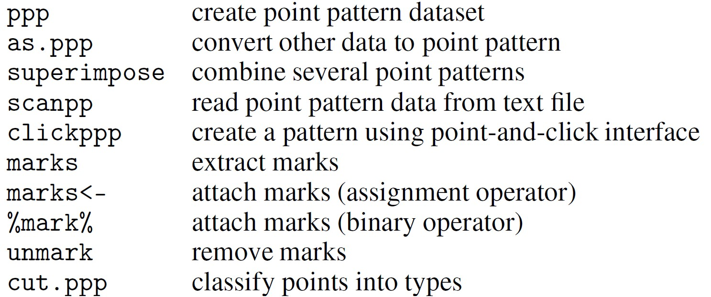
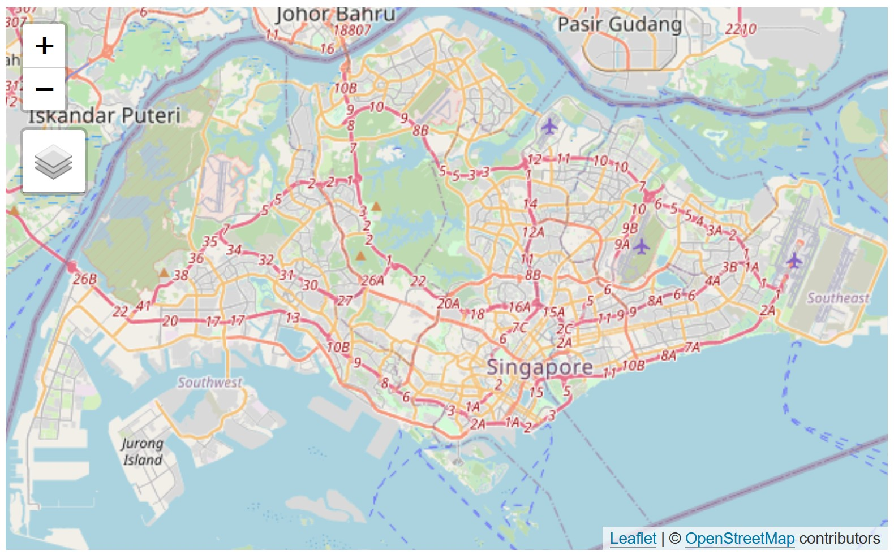
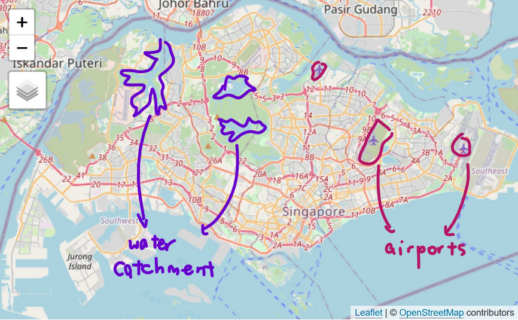
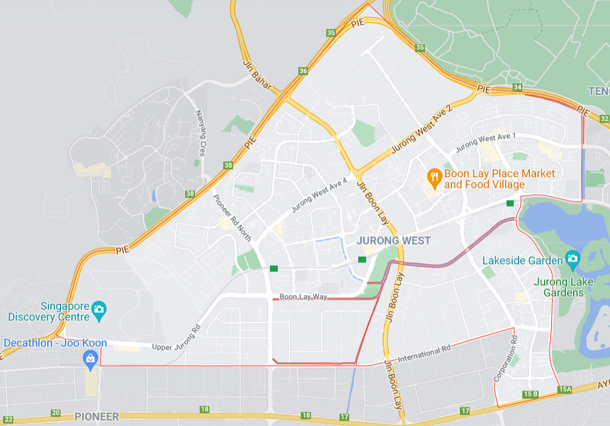

```{r setup, include=FALSE}
knitr::opts_chunk$set(echo = TRUE, 
                      eval = TRUE,
                      message = FALSE,
                      warning = FALSE,
                      fig.retina = 3)
```

## 1.0 Overview
In [Hands-On Exercise 5A](https://is415-msty.netlify.app/posts/2021-09-12-hands-on-exercise-5a/), we learned about Network-constrained Spatial Point Pattern Analysis (NetSPPA). In this exercise, we'll follow-up on what we've learned with Marked Point Pattern Analysis.

Firstly, what *are* marked point patterns? You might recall what point patterns are: they're events occurring within a defined study region (usually a country or city) - from traffic incidents to locations of business establishments. Now, these events might have associated continuous or categorical measurements, such as volume of sales (continuous) or types of schools (categorical). These measurements are called **marks** - and naturally, events with said marks are called **marked point patterns**.

One more thing to note! Marked point patterns have first-order and second-order properties:

- first-order properties: related to the intensity (i.e., density) of events and associated marks
- second-order properties: related to the spatial dependence (i.e., spatial arrangement) of the events and associated marks

### 1.1 Problem Statement
For this exercise, our aim is to discover & investigate the spatial point processes of childecare centres by operators in Singapore. In other words:

- Are the locations of childcare centre by different business groups (i.e. NT, PT, RC, ST) spatially independent?
- (In relation to the question above) if our answer is NO, is there any phenomena of attraction/ repulsion?

## 2.0 Setup

### 2.1 Packages Used

The R packages we'll be using today are:
- [**rgdal**](https://cran.r-project.org/web/packages/rgdal/index.html): provides bindings to the Geospatial Data Analysis Library (GDAL) and used for projectoin/transforamtion operations
- [**maptools**](https://cran.r-project.org/web/packages/maptools/index.html): a set of tools for manipulating geographic data
- [**raster**](https://cran.r-project.org/web/packages/raster/): reads, writes, manipulates, analyses and models gridded spatial data (i.e. raster-based geographical data)
- [**spatstat**](https://spatstat.org/): used for point pattern analysis
- [**tmap**](https://cran.r-project.org/web/packages/tmap/index.html): used for creating thematic maps, such as choropleth and bubble maps

```{r}
packages = c('rgdal', 'maptools', 'raster','spatstat', 'tmap')
for (p in packages){
  if(!require(p, character.only = T)){
    install.packages(p)
  }
  library(p,character.only = T)
}
```

### 2.2 Data Used
The datasets used for this exercise are:

- `CHILDCARE`, originally a .kml that has been converted to an ESRI shapefile, providing both location and attribute information of childcare centres
- `MP14_SUBZONE_WEB_PL`, a polygon feature data in ESRI shapefile format from [data.gov.sg](https://data.gov.sg/), providing information of URA 2014 Master Plan Planning Subzone boundary data 

### 2.3 Importing Data
Like what we've learned in Hands-On Ex 5A, we'll be using *readOGR()* to import geospatial data and output a suitable Spatial vector object. In this case, we'll be importing `CHILDCARE` and `MP14_SUBZONE_WEB_PL` as SpatialPointsDataFrame and SpatialPolygonsDataFrame respectively.

```{r}
childcare <- readOGR(dsn = "data/geospatial", layer="CHILDCARE")
mpsz = readOGR(dsn = "data/geospatial", layer="MP14_SUBZONE_WEB_PL")
```

<center>
{width=75%} 
</center>

### 2.4 Data Preparation

We can take a look at our data with *str()*:

```{r}
str(childcare)
```

As we are working with marked data, and we know that the values are categorical (different business groups), we need to ensure that the marked field is of **factor** data type. However, as seen from the output, our `Type` field is of **chr** data type, not factor! Let's rectify that:

```{r}
childcare@data$Type <- as.factor(childcare@data$Type)
```

**DIY section:** *Using the skill you learned from previous step, check to ensure that Type field is in factor data type now.*
Now, let's check to ensure that `Type` field is now of the **factor** data type:

```{r}
str(childcare)
```

### 2.5 Data Visualisation
Let's visualise our geospatial data in both static and interactive forms to better help with our analysis:

```{r}
tmap_mode("view")
tm_shape(mpsz) +
  tm_borders(alpha = 0.5) +
  tmap_options(check.and.fix = TRUE) +
tm_shape(childcare) +
  tm_dots(col = 'Type', size = 0.02)
tmap_mode("plot")
```

Alternatively, we can also create four small point maps by using *tm_facets()*:

```{r eval=TRUE, fig.width=12, fig.height=8}
tm_shape(mpsz) +
  tm_borders(alpha = 0.5) +
tm_shape(childcare) +
  tm_dots(col = 'Type', 
          size = 0.5) +
tm_facets(by="Type")
```

## 3.0 Spatial Data Wrangling
We'll be using **spatstat** functions extensively in this section for wrangling geospatial data, so here's a handy list of functions:

<center>
{width=75%}
</center>

### 3.1 Converting the SpatialPointsDataFrame into ppp format
Firstly, let's convert our SpatialPointsDataFrame into ppp format with *as.(x, "ppp")* or *as.ppp(x)*. In doing so, the additional field in *x* data frame will become the marks of the point pattern z.

```{r}
childcare_ppp <- as(childcare, "ppp")
plot(childcare_ppp)
```

From our graph, we can see that there are four sub-types in the marks list: NT, PT, RC and ST. Let's also take a look at the summary statistics:

```{r}
summary(childcare_ppp)
```

Now, we know that PT is the largest childcare operator in Singapore with a market share of 63%. This is followed by ST, RC and NT.

Notice that the summary also tells us, "*Pattern contains duplicated points*". We'll learn how to resolve this issue in the next section.

### 3.2 Avoiding duplicated spatial point event by using jittering method
Let's use the jittering method to avoid duplicated spatial point event issues:

```{r eval=TRUE}
childcare_ppp_jit <- rjitter(childcare_ppp, retry=TRUE, nsim=1, drop=TRUE)
```

Are there any duplicated spatial point events? Let's check:

```{r eval=TRUE}
any(duplicated(childcare_ppp_jit))
```

Yay! `r emo::ji("smile")` Our duplicated points issue has been resolved!

### 3.3 Creating ***owin***: Data Context
When analysing spatial point patterns, it is a good practice to confine the analysis within a geographical area, such as the Singapore boundary. To do this, we use an object called **owin** (from the **spatstat** package) which is designed to represent this polygonal region.

"So, what's wrong with our current geographical area?" Take a look at the map below:

<center>

</center>

Have you noticed any pecularities? Here's my annotated version:

<center>

</center>

The distribution of settlements in Singapore are constrained: either through natural geography, such as the water catchment areas, or strategic locations, such as the areas in the Western region reserved for airports.

As such, it would be wiser for us to narrow down the study area - such as looking at specific planning areas, which would be more appropriate.

### 3.4 Extracting study area
For this analysis, we'll focus on the Jurong West planning area:

```{r}
jw = mpsz[mpsz@data$PLN_AREA_N == "JURONG WEST",]
plot(jw, main = "Jurong West")
```

### 3.5 Converting the spatial point data frame into generic sp format
Next, let's convert these SpatialPolygonsDataFrame layers into generic spatialpolygons layers by using *as.SpatialPolygons.tess(x)*:

```{r}
jw_sp = as(jw, "SpatialPolygons")

#always a best practice to review the structure with str()
str(jw_sp)
```

### 3.6 Creating ***owin*** object
Now to actually convert these SpatialPolygons objects into owin objects:

```{r}
jw_owin = as(jw_sp, "owin")
str(jw_owin)
```

### 3.7 Combining childcare points and the study area
Now, let's extract the childcare data that is within our specified region (Jurong West):

```{r}
childcare_jw_ppp = childcare_ppp_jit[jw_owin]
```

And once again checking for summary statistics:

```{r}
summary(childcare_jw_ppp)
```

**DIY section:** *By referring to previous discussion, describe the content of the output.*
As we can see from our summary statistics output, PT is once again reigning in the Jurong West area with a 50% market share. However, since that is smaller than their national average of 63% market share, it can be said that their presence in Jurong West is smaller than that of other areas.

### 3.8 Plotting childcare points and the study area
Lastly, let's ensure that the spatial point events are indeed contained within the study area by plotting the combined childcare point and the study area:

```{r eval=TRUE}
plot(childcare_jw_ppp)
```

## 4.0 Analysing Marked Point Patterns

### 4.1 First-order Spatial Point Patterns Analysis
There are two things we need to do to get our intiial visualisation: use *density()* of the **spatstat** package to compute the kernel density objects, and then *plot()* it out. We can keep them as two separate lines of code, or we can combine them, like so:

```{r fig.width=12, fig.height=12}
plot(density(split(rescale(childcare_jw_ppp, 1000))))
```

**Question:** *Can you recall what is the purpose of rescale() and why it is used in our case?*
[*rescale()*](https://www.rdocumentation.org/packages/spatstat/versions/1.64-1/topics/rescale) of the **spatstat** package is used for converting a point pattern dataset to another unit of length. In this context, we're converting metres to kilometres: we're telling the function that the new unit length is 1000 metres (or 1km), so the function will divide the old coordinate values by 1000 to obtain coordinates expressed in kilometres `r emo::ji("sparkles")` 

**DIY:** *What observations can you draw from the figure above?*
At first glance, it might seem that NT has a high intensity (aka density of childcare centres) in Jurong West due to its gradient, which has a high amount of yellow (high-intensity), but notice the legend at the side: its range is from 0 to 2.5. Now compare this to PT's range of up to 14: that's a lot more congruent with our earlier analysis in 3.7, where we summarised that PT had an impressive 50% market share in Jurong West. 

Surprisingly, a good portion of PT's childcare centres are nestled in the Southeast tail of Jurong West - though they also have a middling portion in the central region, which seems to be the case for other business groups as well. In addition, NT seems to be the only operator with a 'unified' area - most of its centres are in the central region, with a few more expanding to the Eastern region and a consistent gradient throughout, as compared to the other operators where there tends be a a space of blues/purples (low-intensity) between their clusters.

Something interesting to note is that there across all the childcare operators, none of them have a childcare centre in the westmost part. A quick look at Google Maps tells us why: that's hwere the Singapore Discovery Centre is!

<center>
{width=75%}
</center>

Well, those are some good observations we've made! Let's check if we're correct - by using the *intensity()* function, we'll reveal the density of childcare centres by operators:

```{r}
intensity(rescale(childcare_jw_ppp, 1000))
```

Hooray `r emo::ji("party_popper")` We were right on the money: the output reveals that childcare centres operated by PT has the highest density of 3.95 units per km square, followed by ST's 1.91 units per km square, NT's 1.09 unit per km square and RC's 0.82 unit per km square.

### 4.2 Second-order Multi-type Point Patterns Analysis: Cross K-Function
Now, let's analyse the relationship between PT (i.e. privately-operated childcare centres) and ST (i.e. PAP-run childcare centres) by using [*Kcross()*](https://rdrr.io/cran/spatstat/man/Kcross.html):

```{r}
childcare_Kcross <- Kcross(childcare_jw_ppp, 
                           i="PT", j="ST",
                           correction='border')
plot(childcare_Kcross)
```

Hmm... it seems that the marked spatial point events are not spatially independent. We'll need to confirm this observation statistically through a hypothesis test.

### 4.3 Performing CSR testing on the Cross K-Function
The hypothesis and test are as follows:

- Ho = The distribution of PT childcare centres and ST childcare centres are spatially independent.
- H1 = The distribution of PT childcare centres and ST childcare centres are NOT at spatially independent.

The null hypothesis will be rejected if p-value is smaller than alpha value of 0.001 (i.e. at 99.9% confidence interval).

In order to perform the CSR test, we'll use the [*envelope()*](https://rdrr.io/cran/spatstat/man/envelope.html) function of our **spatstat** package.

```{r}
childcare_Kcross.csr <- envelope(childcare_jw_ppp, Kcross, i="PT", j="ST", correction='border', nsim=999)
plot(childcare_Kcross.csr, xlab="distance(m)", xlim=c(0,500))
```

**Question:** *Why nsim=999 is used?*

We'll be running through this with 999 simulations of CSR!

Hmm... as we can see, there are signs that the distribution of childcare centres operated by PT and ST are not spatially independent.  Unfortunately, we failed to reject the null hypothesis because the empirical k-cross line is within the envelope of the 99.9% confidence interval. 

### 4.4 Second-order Multi-type Point Patterns Analysis: Cross L-Function
Let's compute Cross L-function:

```{r eval=TRUE}
childcare_Lcross <- Lcross(childcare_jw_ppp, i="PT", j="ST", correction='border')
plot(childcare_Lcross, . -r ~ r, 
     xlab = "distance(m)", 
     xlim=c(0, 500))
```

**DIY:** *With reference to discussion in the earlier section, what observation(s) can you draw from the plot above?*

Once again, there are signs that the marked spatial point events are not spatially independent. We'll need to perform a hypothesis test to confirm this observation statistically.

### 4.5 Performing CSR testing on the Cross L-Function
**DIY:** *With reference to the example given in previous section, define the hypothesis null, hypothesis alternative and rejection criterion.*

The hypothesis and test are as follows:

- Ho = The distribution of PT childcare centres and ST childcare centres are spatially independent.
- H1 = The distribution of PT childcare centres and ST childcare centres are NOT at spatially independent.

The null hypothesis will be rejected if p-value is smaller than alpha value of 0.001 (i.e. at 99.9% confidence interval).

Similar to Cross-K-Function, we can perform the CSR test by using the [*envelope()*](https://rdrr.io/cran/spatstat/man/envelope.html) fucntion of our **spatstat** package:

```{r fig.width=8, fig.height=6}
childcare_Lcross.csr <- envelope(childcare_jw_ppp, Lcross, i="PT", j="ST", correction='border', nsim=999)
plot(childcare_Lcross.csr, . -r ~ r, xlab="distance(m)", xlim=c(0,500))
```

**DIY:** *Interpret the analysis result and draw conclusion with reference to the statistical testing result.*

Once again, the empirical k-cross line is within the envelope of the 99.9% confidence interval, so we fail to reject the null hypothesis.
