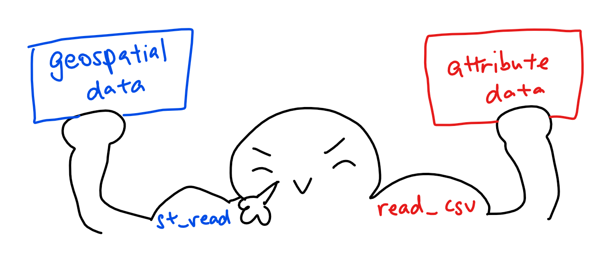

```{r setup, include=FALSE}
knitr::opts_chunk$set(echo = TRUE, 
                      eval = TRUE,
                      message = FALSE,
                      warning = FALSE,
                      fig.retina = 3)
```


## 0.0 WIP NOTICE
This exercise is still a work in progress! Please come back to it later :^)


## 1.0 Overview
### The analytical question 

Imagine you're a planner working for the local government, and you're tasked with planning the development across the province in line with the spatial policies set. Of course, the ideal would to have an equal distribution of development - but how would we find that?

With the appropriate spatial statistical methods, we can determine if the distrubution is equal, or if there are signs of **spatial clustering**. In the context of this exercise's data - we aim to select a development indicator (e.g. GDP per capita) and examine its spatial pattern within the boundaries of the Hunan Province.

## 2.0 Setup

### 2.1 Packages Used

The R packages we'll be using today are:

- [**sf**](https://cran.r-project.org/web/packages/sf/index.html): used for importing, managing, and processing geospatial data
- [**tmap**](https://cran.r-project.org/web/packages/tmap/index.html): used for plotting thematic maps, such as choropleth and bubble maps
- [**tidyverse**](https://www.tidyverse.org/): used for importing, wrangling and visualising data (and other data science tasks!)
- [**spdep**](https://cran.r-project.org/web/packages/spdep/index.html): used to create spatial weights matrix objects, global and local spatial autocorrelation statistics and related calculations (e.g. spatially lag attributes)

```{r}
packages = c('sf', 'spdep', 'tmap', 'tidyverse')
for (p in packages){
  if(!require(p, character.only = T)){
    install.packages(p)
  }
  library(p,character.only = T)
}
```

### 2.2 Data Used
The datasets used for this exercise are:

- `Hunan_2012` (aspatial data): a .csv which stores Hunan's local development indicators in 2012
- `Hunan` (geospatial data): an ESRI shapefile which stores Hunan's province administrative boundary layer at the county level

### 2.3 Importing Data
Let's import our aspatial and geospatial data per usual:

```{r}
#output: simple features object
hunan <- st_read(dsn = "data/geospatial", 
                 layer = "Hunan")

#output: R dataframe class
hunan2012 <- read_csv("data/aspatial/Hunan_2012.csv")
```

Once again, recall:

<center>
{width=75%}
</center>

### 2.4 Data Preparation

Let's perform a relational join to update the attribute data of `hunan`'s SpatialPolygonsDataFrame with the attribute fields of our `hunan2012` dataframe. We'll do this with *left_join()*:

```{r}
hunan <- left_join(hunan,hunan2012)
knitr::kable(head(hunan, n=5))
```

### 2.5 Data Visualisation
Let's visualise our geospatial data - our goal is to show the distribution of GDPPC 2012:

```{r fig.width=12, fig.height=8}
equal <- tm_shape(hunan) +
  tm_fill("GDPPC",
          n = 5,
          style = "equal") +
  tm_borders(alpha = 0.5) +
  tm_layout(main.title = "Equal interval classification")
quantile <- tm_shape(hunan) +
  tm_fill("GDPPC",
          n = 5,
          style = "quantile") +
  tm_borders(alpha = 0.5) +
  tm_layout(main.title = "Equal quantile classification")
tmap_arrange(equal, 
             quantile, 
             asp=1, 
             ncol=2)
```

## 3.0 Global Spatial Autocorrelation
Let's learn how to compute global spatial autocorrelation statistics, as well as how to perform spatial complete randomness test for global spatial autocorrelation. Callback to [our previous exercise](https://is415-msty.netlify.app/posts/2021-09-18-hands-on-exercise-6/) and its recommended reading on contiguity weights: 

<center>
{width=75%}
</center>

### 3.1 Computing Contiguity Spatial Weights
We'll be following what we did in our previous hands-on exercise to compute the contiguity weights!
Before we can compute the global spatial autocorrelation statistics, we need to construct the spatial weights of the study area, which will be used to define the neighbourhood relationships between the geographical units (i.e. county) in the study area.

First, let's compute the Queen contiguity weight matrix:

```{r}
wm_q <- poly2nb(hunan, queen=TRUE)
summary(wm_q)
```

The summary report above shows that there are 88 area units in Hunan, where the most connected area unit has 11 neighbours. In addition, there are two area units with only 1 neighbour. 

### 3.2 Row-standardised weights matrix
Now, we'll need to assign weights to each neighbouring polygon - in this case, we'll assign equal weights to each (style="w"), and assign 1/# of neighbours to each neighbouring county, then summing the weighted income values.

There is a downside to this,though: polygons along the edges of the study area will base their lagged values on fewer polygons. This means that they'll potentially be over- or under-estimating the true nature of the spatial autocorrelation in the data. Do take note!

For this example, we'll stick with the style="W" option for simplicity's sake - but note that other more robust options (such as style="B") are available. Feel free to experiment to fit to your data!

```{r}
#zero.policy=TRUE allows for lists of non-neighbours
#zero.policy=FALSE will return an error if there are missing neighbours in the dataset
# input MUST be an object of class nb
rswm_q <- nb2listw(wm_q, 
                   style="W", 
                   zero.policy = TRUE)
rswm_q
```


A little explanation of our the two arguments, `style` and `zero.policy`:

- *style* can take values "W", "B", "C", "U", "minmax" and "S".  
    - B is the basic binary coding
    - W is row standardised (sums over all links to n)
    - C is globally standardised (sums over all links to n)
    - U is equal to C divided by the number of neighbours (sums over all links to unity)
    - S is the variance-stabilizing coding scheme proposed by Tiefelsdorf et al (sums over all links to n)
- If *zero policy* is set to TRUE, weights vectors of zero length are inserted for regions without neighbour in the neighbours list. These will in turn generate lag values of zero, equivalent to the sum of products of the zero row t(rep(0, length=length(neighbours))) %*% x, for arbitrary numerical vector x of length length(neighbours). The spatially lagged value of x for the zero-neighbour region will then be zero, which may (or may not) be a sensible choice, depending on your data.

### 3.3 Global Spatial Autocorrelation: Moran's I 
Now to the meat of the matter: performing Moran's I statistics testing by using [*moran.test()*](https://r-spatial.github.io/spdep/reference/moran.test.html) of our **spdep** package.

#### 3.3.1 Moran's I test

```{r}
moran.test(hunan$GDPPC, 
           listw=rswm_q, 
           zero.policy = TRUE, 
           na.action=na.omit)
```

**Question: What statistical conclusion can you draw from the output above?**

The p-value which is 1.095e-06 - in other words, 0.0000001095, which is smaller than our alpha. With this, we will **reject the null hypothesis** at 99.9% confidence interval. Additionally, since the Moran I statistic 0.300749970 is > 0 and is approaching 1 (indicating positive autocorrelation), we can infer that the spatial patterns we observe resemble a cluster.

>Extra Notes: Confidence Intervals
- Confidence intervals translate into alpha values (or significance values), and are necessary when hypothesis testing
- Confidence intervals:
    - 90% alpha value is 0.1, number of simulations: 100
    - 95 % alpha value 0.05
    - 99 % alpha value 0.01 
    - 99.9 alpha value is 0.001 , number of simulations: 1000

#### 3.3.2 Computing Monte Carlo Moran's I
We should also perform the permutation test for Moran's I statistic by using [*moran.mc()*](https://r-spatial.github.io/spdep/reference/moran.mc.html) of **spdep**:

```{r}
set.seed(1234)
bperm= moran.mc(hunan$GDPPC, 
                listw=rswm_q, 
                #nsim represents the number of simulations
                nsim=999, 
                zero.policy = TRUE, 
                na.action=na.omit)
bperm
```

**Question: What statistical conclusion can you draw from the output above?**

Our P-value is 0.001 after 1000 simulations, which is equal to our alpha value 0.001. As such, we **accept the null hypothesis** at confidence interval 99.9%. Additionally, since the Monte Carlo statistic 0.30075 is > 0 and is approaching 1 (indicating positive autocorrelation), we can infer that the spatial patterns we observe resemble a cluster.

#### 3.3.3 Visualising Monte Carlo Moran's I
Let's examine the simulated Moran's I test statistics in greater detail - in this case, by visualising it! We can plot the distribution of the statistical values as a histogram using [*histo()*](https://www.rdocumentation.org/packages/graphics/versions/3.6.2/topics/hist) and [*abline()*](https://www.rdocumentation.org/packages/graphics/versions/3.6.2/topics/abline):

```{r}
mean(bperm$res[1:999])
var(bperm$res[1:999])
summary(bperm$res[1:999])
hist(bperm$res, 
     freq=TRUE, 
     breaks=20, 
     xlab="Simulated Moran's I")
abline(v=0, 
       col="red") 
```

**Question: What statistical observation can you draw from the output above?**

The distribution is clearly right-skewed.

**Challenge: Instead of using Base Graph to plot the values, plot the values by using ggplot2 package.**

Challenge accepted!!`r emo::ji("smile")` 

```{r}
# need to convert to dataframe first for ggplot
bperm_df <- as.data.frame(bperm$res)

# then we can actually plot!
ggplot(data=bperm_df, 
       aes(x= as.numeric(`bperm$res`)))+
  geom_histogram(bins=20, 
                 color="black", 
                 fill="white") +
  geom_vline(aes(xintercept=0),
            color="red", linetype="dashed", size=1) +
  labs(title = "Distribution of Monte Carlo Moran’s I statistics",
      x = "Simulated Moran's I",
      y = "Frequency")
```

### 3.4 Global Spatial Autocorrelation: Geary's

#### 3.4.1 Geary's C test
Moving on to Geary C - we'll perform Geary's C test for spatial autocorrelation by using  [*geary.test()*](https://r-spatial.github.io/spdep/reference/geary.test.html) of our **spdep** package:

```{r}
geary.test(hunan$GDPPC, listw=rswm_q)
```

**Question: What statistical conclusion can you draw from the output above?**

The p-value which is 0.0001526, which is smaller than our alpha 0.001. With this, we will **reject the null hypothesis** at 99.9% confidence interval. Additionally, since the Geary's C statistic 0.6907223 is < 1, we can infer that the spatial patterns we observe resemble a cluster.

#### 3.4.2 Computing Monte Carlo Geary's C
Now, we'll perform the permutation test for Geary's C statistic by using  [*geary.mc()*](https://r-spatial.github.io/spdep/reference/geary.mc.html) of our **spdep** package:

```{r}
set.seed(1234)
bperm=geary.mc(hunan$GDPPC, 
               listw=rswm_q, 
               nsim=999)
bperm
```

**Question: What statistical conclusion can you draw from the output above?**

Our P-value is 0.001 after 1000 simulations, which is equal to our alpha value 0.001. As such, we **accept the null hypothesis** at confidence interval 99.9%. Additionally, since the Geary's C statistic 0.69072 is < 1, we can infer that the spatial patterns we observe resemble a cluster.

#### 3.4.3 Visualising the Monte Carlo Geary's C
Like above, let's plot a histogram to reveal the distribution of the simulated values:

```{r}
mean(bperm$res[1:999])
var(bperm$res[1:999])
summary(bperm$res[1:999])
hist(bperm$res, freq=TRUE, breaks=20, xlab="Simulated Geary c")
abline(v=1, col="red") 
```

**Question: What statistical observation can you draw from the output?**

The distribution resembles a normal distribution, with more values in the center.

## 4.0 Spatial Correlogram
So, what are spatial correlograms? They're used to examine patterns of spatial autocorrelation in your data or model residuals. They are plots of some index of autocorrelation (Moran's I or Geary's c) against distance, showing how correlated the pairs of spatial observations are when you increase the distance (lag) between them. 

Some might compare correlograms with variograms - it's true that they aren't as fundamental as the latter, but they still remain extremely useful as an exploratory and descriptive tool, and for these purposes tend to provide richer information than variograms.

### 4.1 Compute Moran's I correlogram
We'll use [*sp.correlogram()*](https://r-spatial.github.io/spdep/reference/sp.correlogram.html) of our **spdep** package to compute a 6-lag spatial correlogram of GDPPC, and then *plot()* it out. The global spatial autocorrelation used is Moran's I. 

```{r}
MI_corr <- sp.correlogram(wm_q, 
                          hunan$GDPPC, 
                          order=6, 
                          method="I", 
                          style="W")
plot(MI_corr)
```

Keep in mind that purely plotting the output might give us the complete interpretation. Why? Because not all autocorrelation values are statistically significant. So let's examine the full analysis report by printing out the analysis results:

```{r}
print(MI_corr)
```

### 4.2 Compute Geary's C correlogram and plot
Here, we're doing the same thing as in 4.1 - using use [*sp.correlogram()*](https://r-spatial.github.io/spdep/reference/sp.correlogram.html) of our **spdep** package to compute a 6-lag spatial correlogram of GDPPC, and then *plot()* it out. The main difference is that this time, the global spatial autocorrelation used is Moran's I. 

```{r}
GC_corr <- sp.correlogram(wm_q, 
                          hunan$GDPPC, 
                          order=6, 
                          method="C", 
                          style="W")
plot(GC_corr)
```

Similar to the previous step, we will print out the analysis report:

```{r}
print(GC_corr)
```

## 5.0 Cluster and Outlier Analysis
Introducing **LISA**! No, not the actress - LISA stands for **L**ocal **I**ndicators of **S**patial **A**ssociation. These are statistics that evaluate the existence of clusters in the spatial arrangement of a given variable. 

Let's say that we're studying cancer rates among census tracts in a given city locale. In this case, clusters in the rates mean that there are areas that have higher/lower rates than is to be expected by chance alone. In other words: *the values occurring are above or below those of a random distribution in space.*

In this section, we'll learn how to apply appropriate LISA, especially local Moran's I to detect clusters and/or outliers from GDP per capita 2012 in the Hunan Province, PRC.

### 5.1 Computing local Moran's I 
We'll be using the [*localmoran()*](https://r-spatial.github.io/spdep/reference/localmoran.html) function of our **spdep** package. It computes *Ii* values, given a set of *zi* values and a listw object providing neighbour weighting information for the polygon associated with the zi values.

```{r}
# computing at county level
fips <- order(hunan$County)
localMI <- localmoran(hunan$GDPPC, rswm_q)
head(localMI)
```

Let's explain the *localmoran()* function and its output! It returns a matrix of values whose columns are:

- Ii: the local Moran's I statistics 
- E.Ii: the expectation of local moran statistic under the randomisation hypothesis
- Var.Ii: the variance of local moran statistic under the randomisation hypothesis
- Z.Ii:the standard deviate of local moran statistic
- Pr(): the p-value of local moran statistic

We can list the content of the local Moran matrix derived by using [*printCoefmat()*](https://www.rdocumentation.org/packages/stats/versions/3.6.2/topics/printCoefmat), like so:

```{r}
printCoefmat(data.frame(localMI[fips,], row.names=hunan$County[fips]), check.names=FALSE)
```

### 5.2 Mapping the local Moran's I
Before mapping the local Moran's I map, we should append the local Moran's I dataframe (i.e. localMI) onto our `hunan` SpatialPolygonDataFrame:

```{r}
hunan.localMI <- cbind(hunan,localMI) %>%
  rename(Pr.Ii = Pr.z....E.Ii..)
```

#### 5.2.1 Mapping local Moran's I values
Now, let's plot the local Moran's I values:

```{r}
tm_shape(hunan.localMI) +
  tm_fill(col = "Ii", 
          style = "pretty",
          palette = "RdBu",
          title = "local moran statistics") +
  tm_borders(alpha = 0.5)
```

#### 5.2.2 Mapping local Moran's I p-values
Hmm... there are both positive and negative Ii values. We should also consider the p-values for each of these values, so let's go ahead and plot the local Moran's I p-values:

```{r}
tm_shape(hunan.localMI) +
  tm_fill(col = "Pr.Ii", 
          breaks=c(-Inf, 0.001, 0.01, 0.05, 0.1, Inf),
          palette="-Blues", 
          title = "local Moran's I p-values") +
  tm_borders(alpha = 0.5)
```

#### 5.2.3 Mapping both local Moran's I values and p-values
Let's combine both plots into one for a more effective interpretation of the results!

```{r fig.width=12, fig.height=8}
localMI.map <- tm_shape(hunan.localMI) +
  tm_fill(col = "Ii", 
          style = "pretty", 
          title = "local moran statistics") +
  tm_borders(alpha = 0.5)
pvalue.map <- tm_shape(hunan.localMI) +
  tm_fill(col = "Pr.Ii", 
          breaks=c(-Inf, 0.001, 0.01, 0.05, 0.1, Inf),
          palette="-Blues", 
          title = "local Moran's I p-values") +
  tm_borders(alpha = 0.5)
tmap_arrange(localMI.map, pvalue.map, asp=1, ncol=2)
```

### 5.3 Creating a LISA Cluster Map
With a LISA Cluster Map, we can colour code any significant locations color by the type of spatial autocorrelation.

#### 5.3.1 Plotting Moran scatterplot
"Wait, I thought we were going to plot a LISA Cluster Map! Why are we plotting a Moran scatterplot as the first step?"

You might be wondering that - and I'm here to answer! The Moran scatterplot serves to illustrate the relationship between the values of the chosen attribute at each location as well as the average value of the same attribute at neighboring locations. As such, it's a significant contributor to our eventual cluster map.

Let's go ahead and use [*moran.plot()*](https://r-spatial.github.io/spdep/reference/moran.plot.html):

```{r fig.width=6, fig.height=6}
nci <- moran.plot(hunan$GDPPC, rswm_q,
                  labels=as.character(hunan$County), 
                  xlab="GDPPC 2012", 
                  ylab="Spatially Lag GDPPC 2012")
```

You might notice that the plot is split in 4 quadrants. The top right corner belongs to areas that have high GDPPC and are surrounded by other areas that have the average level of GDPPC.

#### 5.3.2 Plotting Moran scatterplot with standardised variable
We'll use [*scale()*](https://www.rdocumentation.org/packages/base/versions/3.6.2/topics/scale) to center and scale our variable, which in this case is done by:

- subtracting the mean (omitting NAs) from the corresponding columns
- dividing the (centered) variable by their standard deviations

```{r}
# we use as.vector to ensure our output is a vector
# Reference: https://www.rdocumentation.org/packages/pbdDMAT/versions/0.5-1/topics/as.vecto
hunan$Z.GDPPC <- scale(hunan$GDPPC) %>% as.vector 
```

Now, we are ready to plot:

```{r fig.width=6, fig.height=6}
nci2 <- moran.plot(hunan$Z.GDPPC, rswm_q,
                   labels=as.character(hunan$County),
                   xlab="z-GDPPC 2012", 
                   ylab="Spatially Lag z-GDPPC 2012")
```

#### 5.3.3 Preparing LISA map classes
```{r}
quadrant <- vector(mode="numeric",length=nrow(localMI))

# center the variable of interest around its mean
DV <- hunan$GDPPC - mean(hunan$GDPPC)   

# center the local Moran's around the mean
C_mI <- localMI[,1] - mean(localMI[,1])   

# set a statistical significance level for the local Moran
signif <- 0.05  

# define  the high-high, low-low, low-high and high-low categories
quadrant[DV >0 & C_mI>0] <- 4      
quadrant[DV <0 & C_mI<0] <- 1      
quadrant[DV <0 & C_mI>0] <- 2
quadrant[DV >0 & C_mI<0] <- 3

# places non-significant Moran in the category 0
quadrant[localMI[,5]>signif] <- 0
```

#### 5.3.4 Plotting LISA map
Now, we can finally build our LISA map!

```{r}
hunan.localMI$quadrant <- quadrant
colors <- c("#ffffff", "#2c7bb6", "#abd9e9", "#fdae61", "#d7191c")
clusters <- c("insignificant", "low-low", "low-high", "high-low", "high-high")
tm_shape(hunan.localMI) +
  tm_fill(col = "quadrant", 
          style = "cat", 
          palette = colors[c(sort(unique(quadrant)))+1], 
          labels = clusters[c(sort(unique(quadrant)))+1],
          popup.vars = c("")) +
  tm_view(set.zoom.limits = c(11,17)) +
  tm_borders(alpha=0.5)
```

Like before, we should plot both the local Moran's I values map and its corresponding p-values map next to each other:

```{r fig.width=12, fig.height=8}
gdppc <- qtm(hunan, "GDPPC")
hunan.localMI$quadrant <- quadrant
colors <- c("#ffffff", "#2c7bb6", "#abd9e9", "#fdae61", "#d7191c")
clusters <- c("insignificant", "low-low", "low-high", "high-low", "high-high")
LISAmap <- tm_shape(hunan.localMI) +
  tm_fill(col = "quadrant", 
          style = "cat", 
          palette = colors[c(sort(unique(quadrant)))+1], 
          labels = clusters[c(sort(unique(quadrant)))+1],
          popup.vars = c("")) +
  tm_view(set.zoom.limits = c(11,17)) +
  tm_borders(alpha=0.5)
tmap_arrange(gdppc, LISAmap, asp=1, ncol=2)
```

**Thinking point `r emo::ji("light_bulb")` : what statistical observations can we draw from the LISA map above?**

## 6.0 Hot Spot and Cold Spot Area Analysis
Beside detecting cluster and outliers, localised spatial statistics can be also used to detect hot spot and/or cold spot areas - regions/values that are higher or lower (respectively) relative to its surroundings.

### 6.1 Getis and Ord's G-Statistics
An alternative spatial statistics to detect spatial anomalies is the Getis and Ord's G-statistics, which looks at neighbours within a defined proximity to identify where either high/low values cluster spatially.  Here, statistically significant hot-spots are recognised as areas of high values where other areas within a neighbourhood range likewise share high values too.

The analysis consists of three steps:

- Deriving spatial weight matrix
- Computing Gi statistics
- Mapping Gi statistics 

### 6.2 Deriving distance-based weight matrix
First, let's start by defining a new set of neighbours. Whilst spatial autocorrelation considers units which share borders, for Getis-Ord we are defining neighbours based on distance.

There are two type of distance-based proximity matrix:

- fixed distance weight matrix
- adaptive distance weight matrix

#### 6.2.1 Deriving the centroid 
Like always, before we can make our connectivity graph, we'll need points to associate with each polygon - aka our centroids.

In the context of this dataset, we'll need to set our coordinates into a separate data frame with a mapping function, which will apply a given function to each element of a vector and returns a vector of the same length. 

Our function is *st_centroid()*, with our input vector is the geometry column of us.bound - which has both longitude and latitude values that we'll save as separate variables (and combine to get our centroid). To help us execute the mapping, we'll be using *map_dbl()*  from the **purrr** package!

Let's get our longitude first:

```{r}
# [[1]] is the first value of the centroid, which is longitude
longitude <- map_dbl(hunan$geometry, ~st_centroid(.x)[[1]])
```

The latitude is the same, except that we're accessing the 2nd value to get latitude:

```{r}
latitude <- map_dbl(hunan$geometry, ~st_centroid(.x)[[2]])
```

Now that we have latitude and longitude, we'll use cbind to put longitude and latitude into the same object:

```{r}
coords <- cbind(longitude, latitude)
```

Let's check to see if things are formatted correctly!

```{r}
head(coords)
```

#### 6.2.2 Determine the cut-off distance
We'll need to determine the upper limit for distance band by using the steps below:

1. Return a matrix with the indices of points belonging to the set of the k nearest neighbours of each other by using [*knearneigh()*](https://r-spatial.github.io/spdep/reference/knearneigh.html) of **spdep**.
2. Convert the knn object returned by *knearneigh()* into a neighbours list of class nb with a list of integer vectors containing neighbour region number ids by using [*knn2nb()*](https://r-spatial.github.io/spdep/reference/knn2nb.html).
3. Return the length of neighbour relationship edges by using [*nbdists()*](https://r-spatial.github.io/spdep/reference/nbdists.html) of **spdep**.  The function returns in the units of the coordinates if the coordinates are projected, in km otherwise.
4. Remove the list structure of the returned object by using [**unlist()**](https://www.rdocumentation.org/packages/base/versions/3.6.2/topics/unlist).

```{r}
#coords <- coordinates(hunan)
k1 <- knn2nb(knearneigh(coords))
k1dists <- unlist(nbdists(k1, coords, longlat = TRUE))
summary(k1dists)
```

The summary report shows that the largest first nearest neighbour distance is 61.79 km, so using this as the upper threshold gives certainty that all units will have at least one neighbour.

#### 6.2.3 Computing fixed distance weight matrix
Now, we will compute the distance weight matrix by using [*dnearneigh()*](https://r-spatial.github.io/spdep/reference/dnearneigh.html):

```{r}
wm_d62 <- dnearneigh(coords, 0, 62, longlat = TRUE)
wm_d62
```

Next, to convert the nb object into spatial weights object, we'll rely on *nb2listw()*:

```{r}
wm62_lw <- nb2listw(wm_d62, style = 'B')
summary(wm62_lw)
```

#### 6.2.4 Computing adaptive distance weight matrix
Having a fixed distance weight matrix means that more densely settled areas (e.g. urban areas) tend to have more neighbours while the less densely settled areas (e.g. rural areas) tend to have lesser neighbours. 

However, we can control the number of neighbours directly using k-nearest neighbours, either by accepting asymmetric neighbours or imposing symmetry:

```{r}
knn <- knn2nb(knearneigh(coords, k=8))
knn
```

Once again, we use *nb2listw()* to convert the nb object into spatial weights object:

```{r}
knn_lw <- nb2listw(knn, style = 'B')
summary(knn_lw)
```

### 6.3 Computing Gi statistics

####  6.3.1 Gi statistics using fixed distance

```{r echo=TRUE, eval=TRUE}
fips <- order(hunan$County)
gi.fixed <- localG(hunan$GDPPC, wm62_lw)
gi.fixed
```

The output of localG() is a vector of G or Gstar values, with attributes "gstari" set to TRUE or FALSE, "call" set to the function call, and class "localG". The Gi statistics are represented as a Z-score. The greater the values, the greater the intensity of clustering. Meanwhile, the direction (positive or negative) indicates high or low clusters. 

Now, let's join the Gi values to their corresponding `hunan` sf data frame:

```{r}
# converts output vector into r matrix object with as.matrix
# cbind() joins hunan data and gi.fixed into a SpatialPolygonDataFrame
# rename the field of gi values with rename()
hunan.gi <- cbind(hunan, as.matrix(gi.fixed)) %>%
  rename(gstat_fixed = as.matrix.gi.fixed.)
```

#### 6.3.2 Mapping Gi values with fixed distance weights
Now, we'll map the Gi values derived using fixed distance weight matrix:

```{r fig.width=12, fig.height=8}
gdppc <- qtm(hunan, "GDPPC")
Gimap <-tm_shape(hunan.gi) +
  tm_fill(col = "gstat_fixed", 
          style = "pretty",
          palette="-RdBu",
          title = "local Gi") +
  tm_borders(alpha = 0.5)
tmap_arrange(gdppc, Gimap, asp=1, ncol=2)
```

#### 6.3.3 Gi statistics using adaptive distance
Let's also compute the Gi values for GDPPC2012 by using an adaptive distance weight matrix (i.e *knb_lw*):

```{r}
fips <- order(hunan$County)
gi.adaptive <- localG(hunan$GDPPC, knn_lw)
hunan.gi <- cbind(hunan, as.matrix(gi.adaptive)) %>%
  rename(gstat_adaptive = as.matrix.gi.adaptive.)
```

#### 6.3.4 Mapping Gi values with adaptive distance weights
It is time... time for us to visualise the locations of hot spot and cold spot areas!

````{r fig.width=12, fig.height=8}
gdppc <- qtm(hunan, "GDPPC")
Gimap <- tm_shape(hunan.gi) +
  tm_fill(col = "gstat_adaptive", 
          style = "pretty",
          palette="-RdBu",
          title = "local Gi") +
  tm_borders(alpha = 0.5)
tmap_arrange(gdppc, Gimap, asp=1, ncol=2)
```

## 7.0 End Notes
With that, we've learned how about autocorrelation, and to computed GSA and LISA. While discovering clusters and outliers, we've also discovered how to find hot/cold areas - which will surely come in handy the next time we're trying to find the distribution of our geospatial data! Tune in next week for more geospatial analysis methods! `r emo::ji("smile")` 
