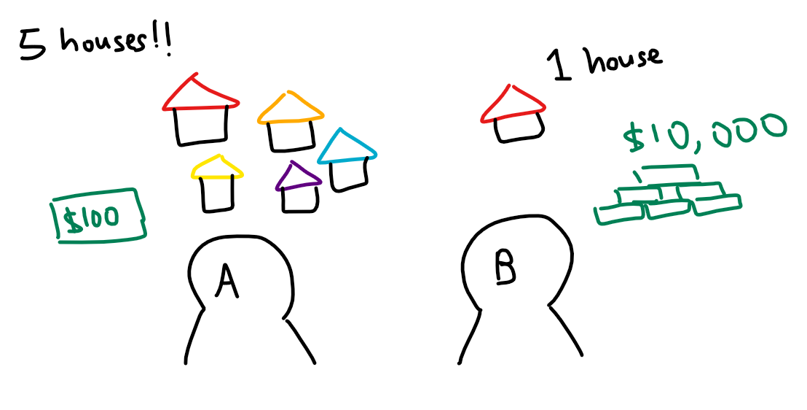

```{r setup, include=FALSE}
knitr::opts_chunk$set(echo = TRUE, 
                      eval = TRUE,
                      message = FALSE,
                      warning = FALSE,
                      fig.retina = 3)
```

## 1.0 Overview

Our focus for this hands-on exercise is on delineating homogeneous region by using geographically referenced multivariate data. There are two major analysis: (a) hierarchical cluster analysis and (b) spatially constrained cluster analysis.

### The analytical question 

Remember last week's analytical question, where we put ourselves in the shoes of a planner working for the local government? Well, time to put on those shoes again. We've learned to find the distribution of development across the whole city/country, and we even know where the hot spots are, but now we've got another issue: regionalisation.

It's common practice in spatial policy to to delineate the market or planning area into homogeneous regions by using multivariate data. But how do we go about it? Well, we're going to find out in this exercise, where our goal is to delineate the Shan State of Myanmar into homogeneous regions by using multiple Information and Communication technology (ICT) measures, namely: Radio, Television, Land line phone, Mobile phone, Computer, and Internet at home.  

## 2.0 Setup

### 2.1 Packages Used

The R packages we'll be using today are:

- [**sf**](https://cran.r-project.org/web/packages/sf/index.html): used for importing, managing, and processing geospatial data
- [**tmap**](https://cran.r-project.org/web/packages/tmap/index.html): used for plotting thematic maps, such as choropleth and bubble maps
- [**tidyverse**](https://www.tidyverse.org/): used for importing, wrangling and visualising data (and other data science tasks!)
- [**spdep**](https://cran.r-project.org/web/packages/spdep/index.html): used to create spatial weights matrix objects, global and local spatial autocorrelation statistics and related calculations (e.g. spatially lag attributes)
- [**rgdal**](https://cran.r-project.org/web/packages/rgdal/index.html): provides bindings to the Geospatial Data Analysis Library (GDAL) and used for projectoin/transforamtion operations
- [**coorplot**](https://cran.r-project.org/web/packages/corrplot/vignettes/corrplot-intro.html), [**ggpubr**](https://cran.r-project.org/web/packages/ggpubr/index.html) and [**heatmaply**](https://cran.r-project.org/web/packages/heatmaply/index.html) for multivariate data visualisation & analysis
- [**cluster**](https://cran.r-project.org/web/packages/cluster/): for cluster analysis - contains multiple clustering methods
- [**ClustGeo**](https://cran.r-project.org/web/packages/ClustGeo/vignettes/intro_ClustGeo.html): for clustering analysis - implements a hierarchical clustering algorithm including spatial/geographical constraints

In addition, the following **tidyverse** packages will be used (for attribute data handling):

- **readr** for importing delimited files (.csv)
- **dplyr** for wrangling and transforming data
- **ggplot2** for visualising data

```{r}
packages = c('rgdal', 'spdep', 'tmap', 'sf', 'ggpubr', 'cluster', 'ClustGeo', 'factoextra', 'NbClust', 'heatmaply', 'corrplot', 'psych', 'tidyverse')
for (p in packages){
  if(!require(p, character.only = T)){
    install.packages(p)
    }
  library(p,character.only = T)
}
```

### 2.2 Data Used
The datasets used for this exercise are:

- `myanmar_township_boundaries`: an ESRI shapefile that contains the township boundary information of Myanmar
- `Shan-ICT`: a .csv extract of [**The 2014 Myanmar Population and Housing Census Myanmar**](https://myanmar.unfpa.org/en/publications/2014-population-and-housing-census-myanmar-data-sheet) at the township level.

Both data sets can be downloaded from the [Myanmar Information Management Unit (MIMU)](http://themimu.info/) 

### 2.3 Importing Data
Let's import our aspatial and geospatial data per usual:

```{r}
#output: simple features object
shan_sf <- st_read(dsn = "data/geospatial", 
                   layer = "myanmar_township_boundaries") %>%
  filter(ST %in% c("Shan (East)", "Shan (North)", "Shan (South)"))

#output: tibble data.frame
ict <- read_csv ("data/aspatial/Shan-ICT.csv")
```

We can check the data:

```{r}
shan_sf
summary(ict)
```

Or, for our `shan_sf` which is conformed to the tidy framework, we can use *glimpse()*:

```{r}
glimpse(shan_sf)
```

### 2.4 Deriving New Variables

<center>
{width=50%}
</center>

Still remember this comic from our [In-Class Exercise 03](https://is415-msty.netlify.app/posts/2021-09-02-in-class-exercise-3/)? As our friends at xkcd put it, the population is not evenly distributed across the map. As such, counting-based map distributions maps roughly start representing the population instead of our topic of interest. In other words, in context of our data, townships with relatively higher total number of households will also have a higher number of households who own radios, TVs, etc. You can refer to the choropleth map comparison in section 3.2 below for an illustration of this point. 

Anyways, absolute values are obviously biased towards the underlying total number of households, which isn't what we want! `r emo::ji("pensive_face")` Since we can't use the absolute values, what should we do? 

Never fear! We'll derive the penetration rate of each ICT variable and use that instead:

```{r}
ict_derived <- ict %>%
  mutate(`RADIO_PR` = `Radio`/`Total households`*1000) %>%
  mutate(`TV_PR` = `Television`/`Total households`*1000) %>%
  mutate(`LLPHONE_PR` = `Land line phone`/`Total households`*1000) %>%
  mutate(`MPHONE_PR` = `Mobile phone`/`Total households`*1000) %>%
  mutate(`COMPUTER_PR` = `Computer`/`Total households`*1000) %>%
  mutate(`INTERNET_PR` = `Internet at home`/`Total households`*1000) %>%
  rename(`DT_PCODE` =`District Pcode`,`DT`=`District Name`,
         `TS_PCODE`=`Township Pcode`, `TS`=`Township Name`,
         `TT_HOUSEHOLDS`=`Total households`,
         `RADIO`=`Radio`, `TV`=`Television`, 
         `LLPHONE`=`Land line phone`, `MPHONE`=`Mobile phone`,
         `COMPUTER`=`Computer`, `INTERNET`=`Internet at home`) 
```

Let's review the summary statistics of the newly derived penetration rates:

```{r}
summary(ict_derived)
```

Six new fields have been added into the data.frame: `RADIO_PR`, `TV_PR`, `LLPHONE_PR`, `MPHONE_PR`, `COMPUTER_PR`, and `INTERNET_PR`.

### 2.5 Data Preparation

Let's perform a relational join to update the attribute data of `shan_sf` (geospatial) with the attribute fields of our `ict_dervied` data.frame object (aspatial). We'll do this with *left_join()*:

```{r}
#output: the data fields from ict_derived are now updated into the data frame of shan_sf
shan_sf <- left_join(shan_sf, 
                     ict_derived, 
                     by=c("TS_PCODE"="TS_PCODE"))
```

## 3.0 Exploratory Data Analysis (EDA)

### 3.1 EDA using statistical graphics

Let's conduct EDA to find the distribution of variables. One great visualisation method is to use a histogram, which easily identifies the overall distribution/skewness of the data values (i.e. left skew, right skew or normal distribution). We'll use `RADIO`:

```{r, fig.width= 4, fig.height=3}
ggplot(data=ict_derived, 
       aes(x=`RADIO`)) +
  geom_histogram(bins=20, 
                 color="black", 
                 fill="light blue")
```

Meanwhile, if we'd like to detect outliers, we should look to boxplot:

```{r, fig.width= 4, fig.height=3}
ggplot(data=ict_derived, 
       aes(x=`RADIO`)) +
  geom_boxplot(color="black", 
               fill="light blue")
```

Let's also plot the distribution of the newly derived variables. We'll use `RADIO_PR`:

```{r, fig.width= 4, fig.height=3}
ggplot(data=ict_derived, 
       aes(x=`RADIO_PR`)) +
  geom_histogram(bins=20, 
                 color="black", 
                 fill="light blue")
```

```{r, fig.width= 4, fig.height=3}
ggplot(data=ict_derived, 
       aes(x=`RADIO_PR`)) +
  geom_boxplot(color="black", 
               fill="light blue")
```

As we can see, the histogram for our original variable `RADIO` is right-skewed, with extremely far-out outliers (over six times the amount at 50th perenctile!) which means an extensive range. On the flip side, `RADIO_PR` has a relatively normal distribution that is slightly right-skewed, and its range is far more contained. Also notice the difference in the range of the 25th-to-50th percentile, and 50th-to-75th percentile for both: `RADIO` has the latter being significantly longer in range than the former, while `RADIO_PR` has them around the same length.

Let's use multiple histograms to reveal the distribution of the selected variables in the *ict_derived* data.frame:

```{r echo=FALSE, eval=TRUE, fig.width=10}
radio <- ggplot(data=ict_derived, 
             aes(x= `RADIO_PR`)) +
  geom_histogram(bins=20, 
                 color="black", 
                 fill="light blue")
tv <- ggplot(data=ict_derived, 
             aes(x= `TV_PR`)) +
  geom_histogram(bins=20, 
                 color="black", 
                 fill="light blue")
llphone <- ggplot(data=ict_derived, 
             aes(x= `LLPHONE_PR`)) +
  geom_histogram(bins=20, 
                 color="black", 
                 fill="light blue")
mphone <- ggplot(data=ict_derived, 
             aes(x= `MPHONE_PR`)) +
  geom_histogram(bins=20, 
                 color="black", 
                 fill="light blue")
computer <- ggplot(data=ict_derived, 
             aes(x= `COMPUTER_PR`)) +
  geom_histogram(bins=20, 
                 color="black", 
                 fill="light blue")
internet <- ggplot(data=ict_derived, 
             aes(x= `INTERNET_PR`)) +
  geom_histogram(bins=20, 
                 color="black", 
                 fill="light blue")
ggarrange(radio, tv, llphone, mphone, computer, internet, ncol = 3, nrow = 2)
```

Introducing the [*ggarange()*](https://rpkgs.datanovia.com/ggpubr/reference/ggarrange.html) function of the [**ggpubr**](https://rpkgs.datanovia.com/ggpubr/index.html) package! It's used to group the histograms together.

### 3.2 EDA using choropleth map

Let's use a choropleth map to have a look at the distribution of the Radio penetration rate of Shan State (at township level):

```{r}
qtm(shan_sf, "RADIO_PR")
```

Now, let's compare `RADIO` to `RADIO_PR`. We'll start by looking at the dsitribution of total number of households and number of radios:

In fact, let's illustrate that point:

```{r fig.width=10}
TT_HOUSEHOLDS.map <- tm_shape(shan_sf) + 
  tm_fill(col = "TT_HOUSEHOLDS",
          n = 5,
          style = "jenks", 
          title = "Total households") + 
  tm_borders(alpha = 0.5) 
RADIO.map <- tm_shape(shan_sf) + 
  tm_fill(col = "RADIO",
          n = 5,
          style = "jenks",
          title = "Number Radio ") + 
  tm_borders(alpha = 0.5) 
tmap_arrange(TT_HOUSEHOLDS.map, RADIO.map,
             asp=NA, ncol=2)
```

Notice that townships with relatively larger number of households also have a relatively higher number of radio ownership. Now, let's look at the distribution of total number of households and Radio penetration rate:

```{r fig.width=10}
tm_shape(shan_sf) +
    tm_polygons(c("TT_HOUSEHOLDS", "RADIO_PR"),
                style="jenks") +
    tm_facets(sync = TRUE, ncol = 2) +
  tm_legend(legend.position = c("right", "bottom"))+
  tm_layout(outer.margins=0, asp=0)
```

There's a marked difference between that `RADIO` choropleth map and the `RADIO_PR` one: instead of having high densities of radio ownership in the same areas with high levels of households (mostly in the Central areas of the map), we see the more representative penetration rate (where the highest density is in the extremities of the map, one in the North, one in the West and one in the East).

### 3.3 Correlation Analysis

Before we perform cluster analysis, we need to perform correlation analysis so as to ensure that the cluster variables are not highly correlated. "Why?" Well - each variable gets a different weight in cluster analysis. But if you have two variables that are highly correlated (aka collinear) - the concept they represent is effectively similar, and that concept gets twice the weight as other variables since it has two contributor variables. Our solution would hence be skewed towards that concept, which is undesirable. You can read more about it on [this article](https://www.greenbook.org/marketing-research/cluster-analysis).

<center>
{width=90%}
</center>

We'll use use [*corrplot.mixed()*](https://cran.r-project.org/web/packages/corrplot/corrplot.pdf) function of the [**corrplot**](https://cran.r-project.org/web/packages/corrplot/vignettes/corrplot-intro.html) package to visualise and analyse the correlation of the input variables.

```{r}
cluster_vars.cor = cor(ict_derived[,12:17])
corrplot.mixed(cluster_vars.cor,
         lower = "ellipse", 
               upper = "number",
               tl.pos = "lt",
               diag = "l",
               tl.col = "black")
```

The correlation plot above shows that `COMPUTER_PR` and `INTERNET_PR` are highly correlated, which makes sense considering that a good portion of internet users access it through desktops and laptops. Knowing this, we should only use one of them in the cluster analysis instead of both.

##  4.0 Hierarchy Cluster Analysis

### 4.1 Extrating clustering variables

Firstly, we'll extract the clustering variables from the `shan_sf`:

```{r}
cluster_vars <- shan_sf %>%
  st_set_geometry(NULL) %>%
  select("TS.x", "RADIO_PR", "TV_PR", "LLPHONE_PR", "MPHONE_PR", "COMPUTER_PR")
head(cluster_vars,10)
```

Note that the final clustering variables list does not include variable `INTERNET_PR` - as we've found from our 3.3 Correlation Analysis, it's highly correlated with the variable `COMPUTER_PR`, so we're using the latter only.

Next, we need to change the rows by township name instead of row number: 

```{r}
row.names(cluster_vars) <- cluster_vars$"TS.x"
head(cluster_vars,10)
```

Success! The row number has been replaced into the township name.

From there, let's delete the TS.x field:

```{r eval=TRUE}
shan_ict <- select(cluster_vars, c(2:6))
head(shan_ict, 10)
```

### 4.2 Data Standardisation

When multiple variables are used, we'd normally see a difference in the range of their values. However, our analysis will tend to be biased to variables with larger values. To illustrate this point...

Imagine that we're trying to determine a person's level of wealth, and we have the variables "money in their wallet" and "number of houses they own".

<center>
{width=80%}
</center>

Person A has \$100 in their wallet, owns 5 houses. Person B has \$10,000 in their wallet, owns 1 house. 

As humans, our first thought might be "how does Person A afford 5 houses!?" - we *know* that having more houses is a better indicator wealth than cash. But our analysis only looks at the difference - "a difference of 9,900 is more significant than a difference of 4" - and then assign a greater weight to "money in their wallet". 

As such, to prevent such a case from happening, we'll need to standardise the input variables.

#### 4.2.1 Min-Max standardisation

We'll use *normalize()* of the [*heatmaply*](https://cran.r-project.org/web/packages/heatmaply/index.html) package to standardise using the Min-Max method, and display the summary statistics with *summary()*.

```{r}
shan_ict.std <- normalize(shan_ict)
summary(shan_ict.std)
```

Note that the values range of the Min-max standardised clustering variables are 0-1 now. 

#### 4.2.2 Z-score standardisation

For Z-score standardisation, we assume all variables come from some normal distribution. If we know otherwise, it should not be used. We'll use [*scale()*](https://www.rdocumentation.org/packages/base/versions/3.6.2/topics/scale) of Base R to perform Z-score standardisation. We'll also use [*describe()*](https://www.rdocumentation.org/packages/Hmisc/versions/4.4-0/topics/describe) of [**psych**]( https://cran.r-project.org/web/packages/psych/index.html) package instead of *summary()* since it provides the standard deviation.

```{r}
shan_ict.z <- scale(shan_ict)
describe(shan_ict.z)
```

Note that the mean and standard deviation of the Z-score standardised clustering variables are 0 and 1 respectively.

#### 4.2.3 Visualising the standardised clustering variables

Other than reviewing the summary statistics of the standardised clustering variables, let's visualise their distribution graphical as well!

```{r, fig.width=12, fig.height=4}
r <- ggplot(data=ict_derived, 
             aes(x= `RADIO_PR`)) +
  geom_histogram(bins=20, 
                 color="black", 
                 fill="light blue")
shan_ict_s_df <- as.data.frame(shan_ict.std)
s <- ggplot(data=shan_ict_s_df, 
       aes(x=`RADIO_PR`)) +
  geom_histogram(bins=20, 
                 color="black", 
                 fill="light blue") +
  ggtitle("Min-Max Standardisation")
shan_ict_z_df <- as.data.frame(shan_ict.z)
z <- ggplot(data=shan_ict_z_df, 
       aes(x=`RADIO_PR`)) +
  geom_histogram(bins=20, 
                 color="black", 
                 fill="light blue") +
  ggtitle("Z-score Standardisation")
ggarrange(r, s, z,
          ncol = 3,
          nrow = 1)
```

Did you notice? `r emo::ji("light_bulb")` The overall distribution of the clustering variables will change after the data standardisation. However, **take note** that we should **NOT** perform data standardisation if the values range of the clustering variables isn't very large.  

### 4.3 Computing proximity matrix

Let's compute the proximity matrix by using [*dist()*](https://stat.ethz.ch/R-manual/R-devel/library/stats/html/dist.html) of R. *dist()* supports six distance proximity calculations:

- euclidean
- maximum
- manhattan
- canberra
- binary
- minkowski

*The default is euclidean proximity matrix.*

Here, we'll compute the proximity matrix using *euclidean* method:

```{r}
proxmat <- dist(shan_ict, method = 'euclidean')
```

Let's inspect the content of `proxmat`:

```{r echo=TRUE, eval=FALSE}
proxmat
```

### 4.4 Computing hierarchical clustering

While there are several packages which provide hierarchical clustering functions, in this exercise, we'll be introducing the [*hclust()*](https://stat.ethz.ch/R-manual/R-devel/library/stats/html/hclust.html) function of R stats. It employs the agglomeration method to compute the cluster, and supports 8 clustering algorithms: ward.D, ward.D2, single, complete, average(UPGMA), mcquitty(WPGMA), median(WPGMC) and centroid(UPGMC).

We'll try the ward.D method for our hierarchcial cluster analysis:

```{r}
# output: hclust class object which describes the tree produced by the clustering process
hclust_ward <- hclust(proxmat, method = 'ward.D')
```

We can then *plot()* the tree:

```{r fig.width=10, fig.height=6}
plot(hclust_ward, cex = 0.6)
```

### 4.5 Selecting the optimal clustering algorithm

One of the main challenges of hierarchical clustering is how to identify stronger clustering structures. To address this, we use the [*agnes()*](https://www.rdocumentation.org/packages/cluster/versions/2.1.0/topics/agnes) function of the [**cluster**](https://cran.r-project.org/web/packages/cluster/) package. It functions like *hclust* but with the added benefit of the agglomerative coefficient, which measures the amount of clustering structure found, with Values closer to 1 suggesting a strong clustering structure.

Let's compute the agglomerative coefficients of all hierarchical clustering algorithms to see which ones has the strongest clsutering structure!

```{r}
m <- c( "average", "single", "complete", "ward")
names(m) <- c( "average", "single", "complete", "ward")
ac <- function(x) {
  agnes(shan_ict, method = x)$ac
}
map_dbl(m, ac)
```

DING-DING-DING! We have a winner: Ward’s method provides the strongest clustering structure among the four methods assessed. Hence, only Ward's method will be used in the subsequent analysis.

### 4.6 Determining Optimal Clusters

Another technical challenge faced when performing clustering analysis is how to determine the optimal clusters to retain. There are [three](https://www.datanovia.com/en/lessons/determining-the-optimal-number-of-clusters-3-must-know-methods/) commonly used methods to determine the optimal clusters:

- [Elbow Method](https://en.wikipedia.org/wiki/Elbow_method_(clustering))
- [Average Silhouette Method](https://www.sciencedirect.com/science/article/pii/0377042787901257?via%3Dihub)
- [Gap Statistic Method](https://statweb.stanford.edu/~gwalther/gap)

For this exercise, we'll be using the gap statistic method.

#### Gap Statistic Method

The [**gap statistic**](http://www.web.stanford.edu/~hastie/Papers/gap.pdf) compares the total within intra-cluster variation for different values of k with their expected values under null reference distribution of the data. The estimate of the optimal clusters will be the value that maximizes the gap statistic. This also implies that the clustering structure is far away from the random uniform distribution of points.

To compute the gap statistic, we'll use the [*clusGap()*](https://www.rdocumentation.org/packages/cluster/versions/2.1.0/topics/clusGap) function of the [**cluster**](https://cran.r-project.org/web/packages/cluster/index.html) package. We'll also be using the the [*hcut*](https://rpkgs.datanovia.com/factoextra/reference/hcut.html) function from the [**factoextra**](https://rpkgs.datanovia.com/factoextra/index.html) package.  

```{r}
set.seed(12345)
gap_stat <- clusGap(shan_ict, 
                    FUN = hcut, 
                    nstart = 25, 
                    K.max = 10, 
                    B = 50)
print(gap_stat, method = "firstmax")
```

Next, we'll visualise the plot by using the [*fviz_gap_stat()*](https://rpkgs.datanovia.com/factoextra/reference/fviz_nbclust.html) function of [**factoextra**](https://rpkgs.datanovia.com/factoextra/index.html) package:

```{r}
fviz_gap_stat(gap_stat)
```

Hmm... as we can see, the recommended number of clusters to retain is 1. But that simply isn't logical - one cluster would mean that the whole map is one big cluster, which defeats the purpose of cluster analysis and segmentation `r emo::ji("worried_face")` 

Looking at the gap statistic graph, the 6-cluster gives the largest gap statistic  - so we'll pick that as our best choice.

### 4.7 Interpreting the dendrograms

What is a dendrogram? In a dendrogram, each leaf corresponds to one observation. As we move up the tree, observations that are similar to each other are combined into branches, which are themselves fused at a higher height.

The height of the fusion, provided on the vertical axis, indicates the (dis)similarity between two observations. The higher the height of the fusion, the less similar the observations are. Take note that conclusions about the proximity of two observations can be drawn only based on the height where branches containing those two observations first are fused. We **cannot** use the proximity of two observations along the horizontal axis as a criteria of their similarity.

Let's try plotting a dendrogram with a border around the selected clusters by using the [*rect.hclust()*](https://stat.ethz.ch/R-manual/R-devel/library/stats/html/rect.hclust.html) function of R stats:

```{r fig.width=10, fig.height=6}
plot(hclust_ward, cex = 0.6)
rect.hclust(hclust_ward, 
            k = 6, 
            # specify border colours for rectangles
            border = 2:5)
```

### 4.8 Visually-driven hierarchical clustering analysis

In this section, we'll be building highly interactive or static cluster heatmaps with the [*heatmaply*](https://cran.r-project.org/web/packages/heatmaply/index.html) package.

#### 4.8.1 Transforming the data frame into a matrix

For heatmaps, our data has to be in a data matrix:

```{r}
shan_ict_mat <- data.matrix(shan_ict)
```

#### 4.8.2 Plotting interactive cluster heatmap using *heatmaply()*

Now, we'll use the [*heatmaply()*](https://talgalili.github.io/heatmaply/reference/heatmaply.html) function of the [heatmaply](https://talgalili.github.io/heatmaply/index.html) package to build an interactive cluster heatmap:

```{r fig.width=8, fig.height=6}
heatmaply(normalize(shan_ict_mat),
          Colv=NA,
          dist_method = "euclidean",
          hclust_method = "ward.D",
          seriate = "OLO",
          colors = Blues,
          k_row = 6,
          margins = c(NA,200,60,NA),
          fontsize_row = 4,
          fontsize_col = 5,
          main="Geographic Segmentation of Shan State by ICT indicators",
          xlab = "ICT Indicators",
          ylab = "Townships of Shan State"
          )
```

### 4.9 Mapping the clusters formed

Using the [*cutree()*](https://stat.ethz.ch/R-manual/R-devel/library/stats/html/cutree.html) function of Base R, we'll derive 6-cluster model. 

```{r}
# outputs a list object
groups <- as.factor(cutree(hclust_ward, k=6))
```

Since our output is a list object, we'll need to append it back on `shan_sf` to visualise our clusters. Firstly, we'll convert `groups` into a matrix, then append it onto `shan_sf` with *cbind()*, and while we're at it - we'll rename the `as.matrix.groups` field as `CLUSTER`.

```{r}
shan_sf_cluster <- cbind(shan_sf, as.matrix(groups)) %>%
  rename(`CLUSTER`=`as.matrix.groups.`)
```

Next, let's have a quick plot of a choropleth map of the clusters formed:

```{r}
qtm(shan_sf_cluster, "CLUSTER")
```

As we can see from our choropleth map above, the clusters are very fragmented. The tends to be one of the major limitations when non-spatial clustering algorithm (in this case, hierarchical clustering) is used.

## 5.0 Spatially Constrained Clustering - SKATER approach

Well, now that we know what a non-spatial clustering algorithm is like, what about spatial clustering algorithms? In this section, we'll learn how derive spatially constrained cluster by using the [*skater()*](https://r-spatial.github.io/spdep/reference/skater.html) method of the [**spdep**](https://r-spatial.github.io/spdep/index.html) package.


### 5.1 Converting into SpatialPolygonsDataFrame

While our heatmaps needed a matrix format, our SKATER function only supports **sp** objects. As such, we'll  need to convert `shan_sf` into SpatialPolygonsDataFrame with the [*as_Spatial()*](https://r-spatial.github.io/sf/reference/coerce-methods.html) method:

```{r}
shan_sp <- as_Spatial(shan_sf)
```

### 5.2 Computing Neighbour List

Next, we'll use [poly2nd()](https://r-spatial.github.io/spdep/reference/poly2nb.html) to compute the neighbours list from polygon list:

```{r}
shan.nb <- poly2nb(shan_sp)
summary(shan.nb)
```

Now, let's get to plotting. Since we can now plot the community area boundaries as well,let's plot that graph on top of the map, like so:

```{r}
# sets boundaries
plot(shan_sp, 
     border=grey(.5))
# plot the neighbour list object
# coordinates applied to the original SpatialPolygonDataFrame to extract centroids
plot(shan.nb,  
     coordinates(shan_sp), 
     col="blue", 
     add=TRUE)
```

**NOTE**: if you plot the network first and then the boundaries, some of the areas will be clipped. This is because the plotting area is determined by the characteristics of the first plot. In this example, since the boundary map extends further than the graph, we should plot it first.

### 5.3 Computing minimum spanning tree

#### 5.3.1 Calculating edge costs

We'll use [*nbcosts()*](https://r-spatial.github.io/spdep/reference/nbcosts.html) of the **spdep** package to compute the cost of each edge aka the distance between nodes:

```{r}
lcosts <- nbcosts(shan.nb, shan_ict)
```

This is the notion of a generalised weight for a spatial weights matrix: for each observation, this gives the pairwise dissimilarity between its values on the five variables and the values for the neighbouring observation (from the neighbour list).

Next, let's  incorporate these costs into a weights object the same way we did in the calculation of inverse of distance weights: we'll convert it into a list weights object by specifying the just computed ***lcosts*** as the weights. We'll use [*nb2listw()*](https://r-spatial.github.io/spdep/reference/nb2listw.html), like so:.

```{r}
# style="B" to make sure that the cost values are not row-standardised
shan.w <- nb2listw(shan.nb, 
                   lcosts, 
                   style="B")
summary(shan.w)
```

#### 5.3.2 Computing minimum spanning tree

We'll compute the minimum spanning tree with [*mstree()*](https://r-spatial.github.io/spdep/reference/mstree.html):

```{r}
shan.mst <- mstree(shan.w)
```

After computing the MST, we can check its class and dimension:

```{r}
class(shan.mst)
dim(shan.mst)
```

"Wait a moment, why is the dimension 54 and not 55?" You might be wondering. Don't worry: this happens because the minimum spanning tree consists on n-1 edges (links) in order to traverse all the nodes.

Let's also display the content of `shan.mst`: 

```{r}
head(shan.mst)
```

Now that we have a rough overview of our MST, it's time to plot! Our goal is to see how the initial neighbour list is simplified to just one edge connecting each of the nodes, while passing through all the nodes. Like before, we'll plot it together with the township boundaries.

```{r}
plot(shan_sp, border=gray(.5))
plot.mst(shan.mst, 
         coordinates(shan_sp), 
         col="blue", 
         cex.lab=0.7, 
         cex.circles=0.005, 
         add=TRUE)
```

### 5.4 Computing spatially constrained clusters using SKATER method

Now to the meat of the section! Let's compute the spatially constrained cluster using [*skater()*](https://r-spatial.github.io/spdep/reference/skater.html):

```{r}
clust6 <- skater(edges = shan.mst[,1:2], 
                 data = shan_ict, 
                 method = "euclidean", 
                 ncuts = 5)
```

The *skater()* method takes three mandatory arguments:
- the first two columns of the MST matrix (i.e. not the cost)
- the data matrix (to update the costs as units are being grouped)
- the number of cuts. Note that it is set to **one less than the number of clusters** to represent the number of cuts

```{r}
str(clust6)
```

Did you notice? The grouops vector contains labels of hte cluster to which each observation belongs - followed by a detailed summary for each of the clustesr in `edges.groups`. Also take note that the sum of squares measures are given as ssto for the total and ssw to show the effect of each of the cuts on the overall criterion.

Let's check the cluster assignment:

```{r}
ccs6 <- clust6$groups
ccs6
```

We can also check the number of observations per cluster with *table()*:

```{r}
table(ccs6)
```

Lastly, let's plot the pruned tree that shows the five clusters on top of the townshop area: 

```{r fig.width=4, fig.height=6}
plot(shan_sp, border=gray(.5))
plot(clust6, 
     coordinates(shan_sp), 
     cex.lab=.7,
     groups.colors=c("red","green","blue", "brown", "pink"),
     cex.circles=0.005, 
     add=TRUE)
```

### 5.5 Visualising the clusters in choropleth map

Let's plot the newly derived clusters by using SKATER method!

```{r}
groups_mat <- as.matrix(clust6$groups)
shan_sf_spatialcluster <- cbind(shan_sf_cluster, as.factor(groups_mat)) %>%
  rename(`SP_CLUSTER`=`as.factor.groups_mat.`)
qtm(shan_sf_spatialcluster, "SP_CLUSTER")
```

We should also compare the hierarchical clustering and spatially constrained hierarchical clustering maps:

```{r fig.width=10, fig.height=6}
hclust.map <- qtm(shan_sf_cluster,
                  "CLUSTER") + 
  tm_borders(alpha = 0.5) 
shclust.map <- qtm(shan_sf_spatialcluster,
                   "SP_CLUSTER") + 
  tm_borders(alpha = 0.5) 
tmap_arrange(hclust.map, shclust.map,
             asp=NA, ncol=2)
```

## 6.0 End Notes

With that, we've learned how to perform both non-spatial clustering and spatially-constrained clustering, from data prep to visualisation! Tune in next week for more geospatial analytics tips `r emo::ji("smile")` 