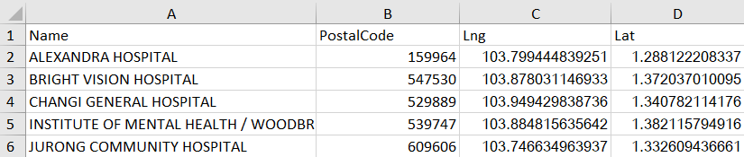
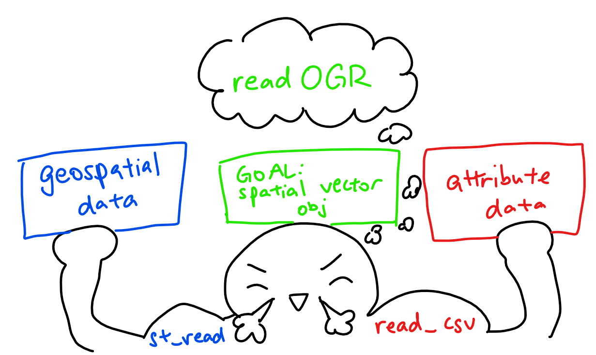
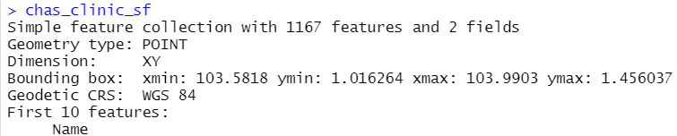
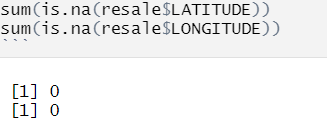

```{r setup, include=FALSE}
knitr::opts_chunk$set(echo = TRUE, 
                      eval = TRUE,
                      message = FALSE,
                      warning = FALSE,
                      fig.retina = 3)
```

## 1.0 Overview

### 1.1 Background

Singapore's public housing is a ["Singapore Icon"](https://www.hdb.gov.sg/about-us/our-role/public-housing-a-singapore-icon) - with 1 million flats spread across 24 towns and 3 estates that comprise around 80% of the housing for Singapore's population. Our country boasts one of the [highest home ownership](https://www.bloomberg.com/news/articles/2020-07-08/behind-the-design-of-singapore-s-low-cost-housing) in the world.

Yet there's trouble in paradise: just earlier this year (2021), [a housing frenzy drove public housing prices to soaring heights](https://www.bloomberg.com/news/articles/2021-03-09/singapore-s-public-housing-prices-soar-as-frenzy-grips-market) with [24 subsidized units selling for more than $743K in Feb 2021](https://therealdeal.com/national/2021/03/14/singapores-subsidized-housing-market-heats-up/). 

The reason? The pandemic.

The pandemic-induced labour shortage added years to the wait times for future builds, and so prospective homeowners started turning to the resale market - which meant a climbing HDB price index, and [concerns on whether housing is still affordable for first-time homeowners](https://www.channelnewsasia.com/commentary/bto-hdb-expensive-city-center-young-couples-first-home-1841541). 

But what factors affect these resale prices? The structure itself, like how big the home is? Or perhaps the location, like how close your favourite hawker centre or your local GP is? What combination of factors make housing units more attractive - and thus more pricey? We aim to find out.

### 1.2 Problem Statement

Housing prices are affected by a litany of factors: financial factors like the economic health of the country and the purchasing power of its citizens, structural factors like the characteristics of the properties (e.g. size, tenure), and locational factors like proximity to childcare centers, academic institutions and general accessibility.

Our aim is to build a hedonic pricing model with the appropriate GWR methods to **explain the factors affecting resale prices of public housing in Singapore.**

## 2.0 Setup

### 2.1 Packages Used

The R packages we'll use for this analysis are:

- [**sf**](https://cran.r-project.org/web/packages/sf/index.html): used for importing, managing, and processing geospatial data
- [**tidyverse**](https://www.tidyverse.org/): a collection of packages for data science tasks
- [**tmap**](https://cran.r-project.org/web/packages/tmap/index.html): used for creating thematic maps, such as choropleth and bubble maps
- [**spdep**](https://cran.r-project.org/web/packages/spdep/index.html): used to create spatial weights matrix objects, global and local spatial autocorrelation statistics and related calculations (e.g. spatially lag attributes)
- [**onemapsgapi**](https://cran.r-project.org/web/packages/onemapsgapi/index.html): used to query Singapore-specific spatial data, alongside additional functionalities. Recommended readings: [Vignette](https://cran.r-project.org/web/packages/onemapsgapi/vignettes/onemapsgapi_vignette.html) and [Documentation](https://www.onemap.gov.sg/docs/)
- [**httr**](https://cran.r-project.org/web/packages/httr/: used to make API calls, such as a GET request
- [**units**](https://cran.r-project.org/web/packages/units/index.html): used to for manipulating numeric vectors that have physical measurement units associated with them 
- [**matrixStats**](https://cran.r-project.org/web/packages/matrixStats/index.html): a set of high-performing functions for operating on rows and columns of matrices
- [**jsonlite**](https://cran.r-project.org/web/packages/jsonlite/vignettes/json-aaquickstart.html): a JSON parser that can convert from JSON to the appropraite R data types 

The following **tidyverse** packages will be used:

- **readr** for importing delimited files (.csv)
- **readxl** for importing Excel worksheets (.xlsx) - note that it has to be loaded explicitly as it is not a core tidyverse package
- **tidyr** for manipulating and tidying data
- **dplyr** for wrangling and transforming data
- **ggplot2** for visualising data

In addition, these R packages are specific to building + visualising hedonic pricing models:

- [**olsrr**](https://cran.r-project.org/web/packages/olsrr/index.html): used for building least squares regression models
- [**coorplot**](https://cran.r-project.org/web/packages/corrplot/vignettes/corrplot-intro.html) + [**ggpubr**](https://cran.r-project.org/web/packages/ggpubr/index.html): both are used for multivariate data visualisation & analysis 
- [**GWmodel**](https://cran.r-project.org/web/packages/GWmodel/index.html): provides a collection of localised spatial statistical methods, such as summary statistics, principal components analysis, discriminant analysis and various forms of GW regression

Lastly, here are the extra R packages that aren't necessary for the analysis itself, but help us go the extra mile with visualisations and presentation of our analysis:

- [**devtools**](https://cran.r-project.org/web/packages/devtools/index.html): used for installing any R packages which is not available in RCRAN. In this context, it'll be used to download the [**xaringanExtra**](https://pkg.garrickadenbuie.com/xaringanExtra/#/) package for [panelsets](https://pkg.garrickadenbuie.com/xaringanExtra/#/panelset)
- [**kableExtra**](https://haozhu233.github.io/kableExtra/): an extension of kable, used for table customisation
- [**plotly**](https://plotly.com/r/): used for creating interactive web graphics, and can be used in conjunction with ggplot2 with the `ggplotly()` function
- [**ggthemes**](https://cran.r-project.org/web/packages/ggthemes/index.html): an extension of ggplot2, with more advanced themes for plotting

```{r}
# initialise a list of required packages
packages = c('sf', 'tidyverse', 'tmap', 'spdep', 
             'onemapsgapi', 'units', 'matrixStats', 'readxl', 'jsonlite',
             'olsrr', 'corrplot', 'ggpubr', 'GWmodel',
             'devtools', 'kableExtra', 'plotly', 'ggthemes')

# for each package, check if installed and if not, install it
for (p in packages){
  if(!require(p, character.only = T)){
    install.packages(p)
  }
  library(p,character.only = T)
}
```

```{r results="hide"}
# reference for manipulating output messages: https://yihui.org/knitr/demo/output/
devtools::install_github("gadenbuie/xaringanExtra")
library(xaringanExtra)
```

```{r panelset, echo=FALSE}
xaringanExtra::use_panelset()
```

### 2.2 Datasets Used

```{r}
# initialise a dataframe of our aspatial and geospatial dataset details
datasets <- data.frame(
  Type=c("Aspatial",
         "Geospatial",
         "Geospatial",
         "Geospatial",
         "Geospatial",
         
         "Geospatial - Extracted",
         "Geospatial - Extracted",
         "Geospatial - Extracted",
         "Geospatial - Extracted",
         "Geospatial - Extracted",
         "Geospatial - Extracted",
         "Geospatial - Extracted",
         
         "Geospatial - Selfsourced",
         "Geospatial - Selfsourced",
         "Geospatial - Selfsourced",
         "Geospatial - Selfsourced"),
  
  Name=c("Resale Flat Prices",
         "Singapore National Boundary",
         "Master Plan 2014 Subzone Boundary (Web)",
         "MRT & LRT Locations Aug 2021",
         "Bus Stop Locations Aug 2021",
         
         "Childcare Services",
         "Eldercare Services",
         "Hawker Centres",
         "Kindergartens",
         "Parks",
         "Supermarkets",
         "Primary Schools",
         
         "Community Health Assistance Scheme (CHAS) Clinics",
         "Integrated Screening Programme (ISP) Clinics",
         "Public, Private and Non-for-profit Hospitals",
         "Shopping Mall SVY21 Coordinates`"),
  
  Format=c(".csv", 
           ".shp", 
           ".shp", 
           ".shp", 
           ".shp",
           
           ".shp", 
           ".shp", 
           ".shp", 
           ".shp",
           ".shp", 
           ".shp",
           ".shp",
           
           ".kml",
           ".shp",
           ".xlsx",
           ".csv"),
  
  Source=c("[data.gov.sg](https://data.gov.sg/dataset/resale-flat-prices)",
           "[data.gov.sg](https://data.gov.sg/dataset/national-map-polygon)",
           "[data.gov.sg](https://data.gov.sg/dataset/master-plan-2014-subzone-boundary-web)",
           "[LTA Data Mall](https://datamall.lta.gov.sg/content/datamall/en/search_datasets.html?searchText=mrt)",
           "[LTA Data Mall](https://datamall.lta.gov.sg/content/datamall/en/search_datasets.html?searchText=bus%20stop)",
           
           "[OneMap API](https://www.onemap.gov.sg/docs/)",
           "[OneMap API](https://www.onemap.gov.sg/docs/)",
           "[OneMap API](https://www.onemap.gov.sg/docs/)",
           "[OneMap API](https://www.onemap.gov.sg/docs/)",
           "[OneMap API](https://www.onemap.gov.sg/docs/)",
           "[OneMap API](https://www.onemap.gov.sg/docs/)",
           "[OneMap API](https://www.onemap.gov.sg/docs/)",
           
           "[data.gov.sg](https://data.gov.sg/dataset/chas-clinics)",
           "[OneMap API](https://www.onemap.gov.sg/docs/)",
           "Self-sourced and collated (section 2.3)",
           "[Mall SVY21 Coordinates Web Scaper](https://github.com/ValaryLim/Mall-Coordinates-Web-Scraper)")
  )

# with reference to this guide on kableExtra:
# https://cran.r-project.org/web/packages/kableExtra/vignettes/awesome_table_in_html.html
# kable_material is the name of the kable theme
# 'hover' for to highlight row when hovering, 'scale_down' to adjust table to fit page width
library(knitr)
library(kableExtra)
kable(datasets, caption="Datasets Used") %>%
  kable_material("hover", latex_options="scale_down")
```

*Each source links to the respective dataset source where possible - feel free download and follow along `r emo::ji("thumbs_up")` *

#### Data considerations

In reality, while most of the locational factors should be retrievable from the OneMapSG API, a number of them are *internal APIs* that cannot be shared due to copyright by the respective agencies. As such, data on MRT and Bus Stops were taken from [datamall.lta.gov.sg](https://datamall.lta.gov.sg/content/datamall/en.html) instead.

### 2.3 Self-sourcing + Collating Hospital Data

There's a locational feature that I felt was important in terms of accessibility: healthcare services, and hospitals in particular. However, this data isn't readily available, so I decided to try my hand at collating the data myself!

What I did was to search for a list of public, private and not-for-profit hospitals. [Healthhub](https://www.healthhub.sg/directory/hospitals) and [Wikipedia](https://en.wikipedia.org/wiki/List_of_hospitals_in_Singapore) served to be great resources for this, and I also cross-checked between them and with the [Singapore Government Directory](https://www.sgdi.gov.sg/other-organisations/hospitals).

<center>
{width=90%}
</center>

From there, I used Google and Healthhub to verify their postal codes.

<center>
{width=90%}
</center>

With this, we have our excel workbook! There's an 'All' sheet which is the collation of all hospitals, and said hospitals are categorised under 'Public', 'Private' and 'Not-for-Profit' in their respective sheets. Our two columns are `Name` and `PostalCode`.

<center>
{height=50%}
</center>

"But wait!" You might quip, "those are only postal codes. We need the longitude and latitude if we want to analyse this as geospatial data!" 

No worries, dear reader! Our aim is to transform this .csv into a .shp, and that's possible with our handy OneMapSG API - specifically, the [search function](https://www.onemap.gov.sg/docs/#search). To use the search function, we have to specify:

- `searchVal`: our search value
- `returnGeom {Y/N}`: whether we can to return the geometry
- `getAddrDetails {Y/N}`: whether we want to return address details for a point

Let's try using the postal code of Ren Ci Community Hospital (329562) as our search value!

<center>
{width=90%}
</center>

Oh no `r emo::ji("worried_face")`  As we can see, there could be multiple results for a single postal code, and as we can see: each result has a slightly different longitude/latitude. To rectify this and narrow down to our desired result, we'll add our hospital name to the search value:

<center>
{width=90%}
</center>

There we go! Afterwards, I collated the longitude and latitude and added it to the updated hospital excel file, `hospitals_updated.xlsx`, so it looks like this:

<center>
{width=80%}
</center>

>EDIT: in retrospect, I realised I could have tried pulling this data with GET requests (with the httr package) and parased the JSON (with the jsonlite package). Oh well - that's something we can try in future works!

Note that some hospitals are integrated into a healthcare hub with a community hospital: in other words, they are near each other, or in the case of Jurong Community Hospital and Ng Teng Fong General Hospital, share the same postal code. As we've seen from our OneMapSG API that the same postal code has different latitude + longitude for different buildings, and knowing that they serve different purposes and different types of patients, I've opted to leave both types of hospitals in. However, you might want to take note of this for future work.

In addition, one of the hospitals listed on Wikipedia and Healthhub, "Concord International Hospital", was reported to have [suspended their healthcare services](https://www.channelnewsasia.com/singapore/concord-international-hospital-suspend-services-lapses-moh-505326), but that article was followed up by a [resumption of services, possibly under a new name](https://www.channelnewsasia.com/singapore/concord-international-hospital-allowed-resume-services-following-suspension-could-reopen-under-new-name-2017626).

<center>
{width=80%}
{width=80%}
</center>

In addition, Google has listed it as 'permenanetly closed'.

<center>
{width=70%}
</center>

Due to the uncertain conditions of Concord International Hospital, I've opted to leave it out of this dataset.

### 2.4 Good Primary Schools

Education and academic institutions are an especially important locational factors for families with children, or expect to have children. While some might be concerned about the number of schools around their house, I believe that most parents are focused only on the proxmimity to 'good/elite schools', especially when [distance affects priority admission](https://www.moe.gov.sg/primary/p1-registration/distance). For this analysis, our focus will be on the primary-school level of education - and only on the 'good/elite' schools. While MOE doesn't release a ranking of the schools, we can roughly gauge the 'rank' from a number of factors:

- Popularity in Primary 1 (P1) Registration
- whether it offers the Gifted Education Programme (GEP)
- if there is a Special Assistance Plan (SAP)
- Achievements in the Singapore Youth Festival Arts Presentation
- Representation in the Singapore National School Games
- Singapore Uniformed Groups Unit Recognition

I'm referring to [schlah's Primary School Rankings, 2020](https://schlah.com/primary-schools) as they transparently state the weights given for each factor.

<center>
{width=90%}
</center>

Like with the hospital dataset, I've made use of OneMapSG's common api search function to find the longitude and latitudes of these primary schools and saved it in a new excel, `top10_prisch_updated`. Speaking of OneMapSG API... let's look at how to use it in the next section!

### 2.5 Using the OneMapSG API

Last exercise, I met a wall with some authorisation issues with the OneMapSG API. But this time, I say goodbye to those worries - token in hand, I could make use of the API! I'd recommend reading its [introductory document](https://cran.r-project.org/web/packages/onemapsgapi/onemapsgapi.pdf) and its [vignette](https://cran.r-project.org/web/packages/onemapsgapi/vignettes/onemapsgapi_vignette.html) to get a sensing as to how to use it. However, if you have similar authorisation issues, fret not: you can download the datasets from either [data.gov.sg](https://data.gov.sg/) or [LTA Data Mall](https://datamall.lta.gov.sg/content/datamall/en.html). Check our [this document](https://www.tech.gov.sg/files/media/media-releases/2013/04/factsheetOneMappdf.pdf) for the list of available themes.

We've already discussed how to use the search function to help us with finding the longitude and latitude of our specified hospitals and primary schools - but what about whole datasets? Well, that's possible, of course! In fact, we can even download them as shapefiles. Here's my process for finding and downloading the relevant datasets:

1. Before we start, be sure to have your token! I preloaded mine into a `token` variable for ease of access.
2. Search for the specified theme with `search_themes(token, "searchval")` - for example, if I wanted to search for childcare services, I'd run `search_themes(token, "childcare")` in my console
3. [Optional] Check the theme status with `get_theme_status(token, "themename")` 
4. The theme dataset is a tibble dataframe, so we can retrieve and store it with `themetibble <- get_theme(token, "themename")`
5. From here, we can convert our tibble dataframe to simple features dataframe. All the themes for this project use Lat and Lng as the latitude and longitude respectively, and our project coordinates system should be in the WGS84 system, aka ESPG code 4326. Thus, `themesf <- st_as_sf(themetibble, coords=c("Lng", "Lat"), crs=4326)`
6. Now, we'll need to write from an sf into a shapefile, which we can do with `st_write(themesf, "themename.shp")`

Here's the compilation of codes of the process, from start to finish:

```{r eval=FALSE}
# i used this set of codes and ran them in the console for each locational factor
# libraries should have been preloaded, but put here for reference of the necessary libraries!
library(sf)
library(onemapsgapi)

token <- "your value"
search_themes(token, "searchval")
get_theme_status(token, "themename")
themetibble <- get_theme(token, "themename")
themesf <- st_as_sf(themetibble, coords=c("Lng", "Lat"), crs=4326)
```

#### Things to look out for when using the API

Sometimes, when using `search_themes` to search for the datasets, your search value might turn up more than 10 results, but the tibble output auto-heads to the first 10 rows.

<center>
{width=90%}
</center>

If you want to see more, what you can do is to add a %>%print(n=desiredval) after your code, like so:

```{r eval=FALSE}
# Reference: https://stackoverflow.com/questions/49122347/having-trouble-viewing-more-than-10-rows-in-a-tibble
search_themes(token, "parks", "nparks") %>% print(n = 25) #or your desired number
```

<center>
{width=90%}
</center>

In addition, there might be similarly titles themes that both seem relevant to your analysis at first glance. For example, the same nparks query above has both "Parks" and "Nparks Parks and Nature Reserve", uploaded by the National Parks Board. Which one should we pick? A closer look brings us to this:

<center>
{width=80%}
</center>

Notice that "parks" is for recreational purposes, while "NParks Parks and Nature Reserve" were uploaded with environmental purposes in mind. Seeing as we're trying to relate the locational factors to the pricing of resale housing units, it makes more sense to go with the former!

## 3.0 Data Wrangling: Geospatial Data

Here's a lil refresher on the import methods:

<center>
{width=90%}
</center>

In addition, since we have .kml files - recall what we learned in our very first exercise, [Hands-On Exercise 02](https://is415-msty.netlify.app/posts/2021-08-30-hands-on-exercise-2/):

<center>
{width=90%}
</center>

### 3.1 Importing Geospatial Data

::::: {.panelset}
::: {.panel}
## Base {.panel-name}
```{r}
# reads in geospatial data and stores into respective dataframes
sg_sf <- st_read(dsn = "data/geospatial", layer="CostalOutline")
mpsz_sf <- st_read(dsn = "data/geospatial", layer = "MP14_SUBZONE_WEB_PL")
rail_network_sf <- st_read(dsn="data/geospatial", layer="MRTLRTStnPtt")
bus_sf <- st_read(dsn="data/geospatial", layer="BusStop")
```
:::
::: {.panel}
## Extracted {.panel-name}
```{r}
childcare_sf <- st_read(dsn="data/geospatial/extracted", layer="childcare")
eldercare_sf <- st_read(dsn="data/geospatial/extracted", layer="eldercare")
hawkercentre_sf <- st_read(dsn="data/geospatial/extracted", layer="hawkercentres")
kindergarten_sf <- st_read(dsn="data/geospatial/extracted", layer="kindergartens") 
park_sf <- st_read(dsn="data/geospatial/extracted", layer="parks")
supermarket_sf <- st_read(dsn="data/geospatial/extracted", layer="supermarkets")
```
:::
::: {.panel}
## Self-Sourced {.panel-name}
```{r}
chas_clinic_sf <- st_read("data/geospatial/selfsourced/chas-clinics-kml.kml")
isp_clinic_sf <- st_read(dsn="data/geospatial/selfsourced", layer="moh_isp_clinics")
malls <- read_csv("data/geospatial/selfsourced/mall_coordinates_updated.csv")
mall_sf <- st_as_sf(malls, coords = c("longitude", "latitude"), crs=4326)
hospitals <- read_excel("data/geospatial/selfsourced/hospitals_updated.xlsx")
hospitals_sf <-st_as_sf(hospitals, coords = c("Lng", "Lat"), crs=4326)
topprisch <- read_excel("data/geospatial/selfsourced/top10_prisch_updated.xlsx")
topprisch_sf <-st_as_sf(topprisch, coords = c("Lng", "Lat"), crs=4326)
```
:::
:::::

As we can see, all of our 'base' datasets' projected CRS is the 'Singapore Projected Coordinate system', [SVY21](https://epsg.io/3414) (ESPG Code 3414), which is appropriate for our Sinagpore-centric analysis. However, all the other datasets in 'extracted' and 'selfsourced' are using the 'World Geodetic System 1984', [WGS84](https://epsg.io/4326). We'll address this and check on their CRS with *st_crs()* later on in Section 3.3.

In addition, notice `chas_clinic_sf` has its dimensions listed as 'XYZ': it has a z-dimension, though as we can see from the z_range, both zmin and zmax are at 0. As it is irrelevant to our analysis, we'll drop this with [*st_zm()*](https://r-spatial.github.io/sf/reference/st_zm.html) in our pre-processing.

### 3.2 Data Pre-processing

Here are the things we need to check and tweak:

1. Remove Z-Dimension (for chas_clinic_sf only)
2. Removing unnecessary columns
3. Check for invalid geometries
4. Check for missing values

#### 3.2.1 Removing Z-Dimensions

We'll take care of the Z-Dimension of `chas_clinic_sf` with [*st_zm()*](https://r-spatial.github.io/sf/reference/st_zm.html), a function that drops Z (or M) dimensions from feature geometries and appropriately reset the classes.

```{r results='hide'}
# drops the Z-dimension from our dataframes
# due to the length of the output, I've opted to hide the results 
chas_clinic_sf <- st_zm(chas_clinic_sf)
```

```{r eval=FALSE}
# once again, due to the length of output, I've opted to leave this as a non-evaluated line of code
# however, I've included a screenshot of the first portion of the output!
chas_clinic_sf
```

<center>
{width=80%}
</center>

#### 3.2.2 Removing Unnecessary Colummns

For most of our locational factor dataframes, the only thing we need to know is the name of the facility (childcare centre, eldercare etc.) and its geometry columm. As such, we only need to keep *the first (name) column* with `select(c(1))` or `select(1)`.

```{r}
childcare_sf <- childcare_sf %>%
  select(c(1))
eldercare_sf <- eldercare_sf %>%
  select(c(1))
hawkercentre_sf <- hawkercentre_sf %>%
  select(c(1))
kindergarten_sf <- kindergarten_sf %>%
  select(c(1))
park_sf <- park_sf %>%
  select(c(1))
supermarket_sf <- supermarket_sf %>%
  select(c(1))

chas_clinic_sf <- chas_clinic_sf %>%
  select(c(1))
isp_clinic_sf <- isp_clinic_sf %>%
  select(c(1))
hospitals_sf <- hospitals_sf %>%
  select(c(1))
topprisch_sf <- topprisch_sf %>%
  select(c(1))

#for the mall_sf, the first column is actually the number, so we select the second column insteaed
mall_sf <- mall_sf %>%
  select(c(2))
```

#### 3.2.3 Invalid Geometries

```{r}
# function breakdown:
# the st_is_valid function checks whether a geometry is valid
# which returns the indices of certain values based on logical conditions
# length returns the length of data objects

# checks for the number of geometries that are NOT valid
length(which(st_is_valid(sg_sf) == FALSE))
length(which(st_is_valid(mpsz_sf) == FALSE))
length(which(st_is_valid(rail_network_sf) == FALSE))
length(which(st_is_valid(bus_sf) == FALSE))

length(which(st_is_valid(childcare_sf) == FALSE))
length(which(st_is_valid(eldercare_sf) == FALSE))
length(which(st_is_valid(hawkercentre_sf) == FALSE))
length(which(st_is_valid(kindergarten_sf) == FALSE))
length(which(st_is_valid(park_sf) == FALSE))
length(which(st_is_valid(supermarket_sf) == FALSE))

length(which(st_is_valid(chas_clinic_sf) == FALSE))
length(which(st_is_valid(isp_clinic_sf) == FALSE))
length(which(st_is_valid(mall_sf) == FALSE))
length(which(st_is_valid(hospitals_sf) == FALSE))
length(which(st_is_valid(topprisch_sf) == FALSE))

# Alternative Method
# test <- st_is_valid(sg_sf,reason=TRUE)
# length(which(test!= "Valid Geometry"))
# credit to Rajiv Abraham Xavier https://rpubs.com/rax/Take_Home_Ex01
```

As we can see from the output, `sg` has 1 invalid geometry while `mpsz` has 9 invalid geometries. With reference to [this article on checking and creating validity](https://r-spatial.github.io/sf/reference/valid.html), let's address them and check again:

```{r}
# st_make_valid takes in an invalid geometry and outputs a valid one with the lwgeom_makevalid method
sg_sf <- st_make_valid(sg_sf)
length(which(st_is_valid(sg_sf) == FALSE))
mpsz_sf <- st_make_valid(mpsz_sf)
length(which(st_is_valid(mpsz_sf) == FALSE))
```

Success! `r emo::ji("party_popper")` 

#### 3.2.4 Missing Values

::::: {.panelset}
::: {.panel}
## Base {.panel-name}
```{r}
# the rowSums(is.na(sg_sf))!=0 checks every row if there are NA values, returning TRUE or FALSE
# the sg_sf [] 'wrapper' prints said rows that contain NA values
sg_sf[rowSums(is.na(sg_sf))!=0,]
mpsz_sf[rowSums(is.na(mpsz_sf))!=0,]
rail_network_sf[rowSums(is.na(rail_network_sf))!=0,]
bus_sf[rowSums(is.na(bus_sf))!=0,]
```
:::
::: {.panel}
## Extracted {.panel-name}
```{r}
childcare_sf[rowSums(is.na(childcare_sf))!=0,]
eldercare_sf[rowSums(is.na(eldercare_sf))!=0,]
hawkercentre_sf[rowSums(is.na(hawkercentre_sf))!=0,]
kindergarten_sf[rowSums(is.na(kindergarten_sf))!=0,]
park_sf[rowSums(is.na(park_sf))!=0,]
supermarket_sf[rowSums(is.na(supermarket_sf))!=0,]
```
:::
::: {.panel}
## Self-Sourced {.panel-name}
```{r}
chas_clinic_sf[rowSums(is.na(chas_clinic_sf))!=0,]
isp_clinic_sf[rowSums(is.na(isp_clinic_sf))!=0,]
mall_sf[rowSums(is.na(mall_sf))!=0,]
hospitals_sf[rowSums(is.na(hospitals_sf))!=0,]
topprisch_sf[rowSums(is.na(topprisch_sf))!=0,]
```
:::
:::::

There's a missing value in our bus_sf dataset, so let's remove the NA observation:

```{r}
# removes rows that have an NA value in the respective NA columns
# which is LOC_DESC and TYPE_CD_DE for bus_sf and taxi_sf respectively
bus_sf <- na.omit(bus_sf,c("LOC_DESC"))
```

And let's check for missing values one last time, just to be sure:

```{r}
# the rowSums(is.na(bus))!=0 checks every row if there are NA values, returning TRUE or FALSE
# the bus 'wrapper' prints said rows that contain NA values
bus_sf[rowSums(is.na(bus_sf))!=0,]
```

Alright, our geospatial data pre-processing is done! `r emo::ji("partying_face")` 

>Note: if you didn't remove the unnecssary columns, you likely would've gotten a lot of NA across various datasets e.g. "descriptions" that aren't filled in, and also would have columns unneeded for analysis e.g. "icons". That's why we narrow down to our necessary columns this time round!

### 3.3 Verifying + Transforming Coordinate System

When we imported the data, we made a mental note to verify the projected CRS - and we'll do that now!

::::: {.panelset}
::: {.panel}
## Base {.panel-name}
```{r}
# using st_crs() function to check on the CRS and ESPG Codes
st_crs(sg_sf)
st_crs(mpsz_sf)
st_crs(rail_network_sf)
st_crs(bus_sf)
```
:::
::: {.panel}
## Extracted {.panel-name}
```{r}
st_crs(childcare_sf)
st_crs(eldercare_sf)
st_crs(hawkercentre_sf)
st_crs(kindergarten_sf)
st_crs(park_sf)
st_crs(supermarket_sf)
```
:::
::: {.panel}
## Self-Sourced {.panel-name}
```{r}
st_crs(chas_clinic_sf)
st_crs(isp_clinic_sf)
st_crs(mall_sf)
st_crs(hospitals_sf)
st_crs(topprisch_sf)
```
:::
:::::

Hmm. That's not right - our projected CRS should be SVY21 (ESPG Code 3414), but for our given data, the current ESPG Codes are 9001. In addition, some of our self-sourced/extracted datasets are in WG84 (ESPG Code 4326) as well. Let's assign the correct ESPG Codes:

```{r warning=FALSE}
# with st_set_crs(), we can assign the appropriate ESPG Code
sg_sf <- st_set_crs(sg_sf, 3414)
mpsz_sf <- st_set_crs(mpsz_sf, 3414)
rail_network_sf <- st_set_crs(rail_network_sf, 3414)
bus_sf <- st_set_crs(bus_sf, 3414)

# with st_transform(), we can change from one CRS to another
childcare_sf <- st_transform(childcare_sf, crs=3414)
eldercare_sf <- st_transform(eldercare_sf, crs=3414)
hawkercentre_sf <- st_transform(hawkercentre_sf, crs=3414)
kindergarten_sf <- st_transform(kindergarten_sf, crs=3414)
park_sf <- st_transform(park_sf, crs=3414)
supermarket_sf <- st_transform(supermarket_sf, crs=3414)

chas_clinic_sf <- st_transform(chas_clinic_sf, crs=3414)
isp_clinic_sf <- st_transform(isp_clinic_sf, crs=3414)
hospitals_sf <- st_transform(hospitals_sf, crs=3414)
topprisch_sf <- st_transform(topprisch_sf, crs=3414)
mall_sf <- st_transform(mall_sf, crs=3414)
```

And now, let's check if the CRS has been properly assigned:

::::: {.panelset}
::: {.panel}
## Base {.panel-name}
```{r}
# using st_crs() function to check on the CRS and ESPG Codes
st_crs(sg_sf)
st_crs(mpsz_sf)
st_crs(rail_network_sf)
st_crs(bus_sf)
```
:::
::: {.panel}
## Extracted {.panel-name}
```{r}
st_crs(childcare_sf)
st_crs(eldercare_sf)
st_crs(hawkercentre_sf)
st_crs(kindergarten_sf)
st_crs(park_sf)
st_crs(supermarket_sf)
```
:::
::: {.panel}
## Self-Sourced {.panel-name}
```{r}
st_crs(chas_clinic_sf)
st_crs(isp_clinic_sf)
st_crs(mall_sf)
st_crs(hospitals_sf)
st_crs(topprisch_sf)
```
:::
:::::

Whew, that's a long output - but as we can see, it's all good! `r emo::ji("light_bulb")` 

### 3.4 Initial Visualisation
Now that we've finished our standard pre-processing, let's try visualising our data:

::::: {.panelset}
::: {.panel}
## SG {.panel-name}
```{r}
# plots the geometry only - these are the 'base' maps
# alternatively, we can use plot(sg$geometry)
plot(st_geometry(sg_sf))
```
:::
::: {.panel}
## MPSZ {.panel-name}
```{r}
plot(st_geometry(mpsz_sf))
```
:::
:::::

The main difference between `sg` and `mpsz` is that the former is a nationwide map, while the latter shows the subzones. Whichever we use depends on the scale of analysis: we might use `sg` for a general overview, while we'll tap on the subzone divisions in `mpsz` if we want to look into specific subzones.

```{r}
# switching to interactive map for better visualisation and to explore specific areas if needed
tmap_mode("view")
tm_shape(rail_network_sf) +
  tm_dots(col="purple", size=0.05)

# return tmap mode to plot for future visualisations
tmap_mode("plot")
```

These are the MRT/LRT train stations. There are 3 distinct clusters - the two in the upper area, (West and Northeast regions specifically) are due to the LRT lines, while the cluster in the Central region is due interconnections of different lines in the CBD and city areas for increased connectivity 

This also matches up to the existing railway network map:

<center>
{width=90%}
</center>
*Retrieved from [MRT.SG](https://mrt.sg/map). Original work by Wikipedia user Seloloving.*

Let's also visualise the bus stops:

```{r}
tmap_mode("plot")
tm_shape(mpsz_sf) +
  tm_borders(alpha = 0.5) +
  tmap_options(check.and.fix = TRUE) +
tm_shape(bus_sf) +
  tm_dots(col="red", size=0.05) +
  tm_layout(main.title = "Bus Stops",
          main.title.position = "center",
          main.title.size = 1.2,
          frame = TRUE)
```

These is a good supplements to our `railway_network` - we can look at how the transport system and general connectivity of a place could play a role in determining the resale prices of housing units, especially since many citizens depend on the public transport system in their everyday lives due to its accessibility and cost. 

Now, let's view our other locations factors. Due to the amount of locational factors, I've opted to split them into the 'recreational/lifestyle' factors (hawker centres, parks, supermarkets, malls) and the 'healthcare/education' factors (childcare, eldercare, kindergartens, top primary schools, CHAS + ISP clinics, hospitals).

::::: {.panelset}
::: {.panel}
## Recreational/Lifestyle {.panel-name}
```{r}
tmap_mode("view")
tm_shape(hawkercentre_sf) +
  tm_dots(alpha=0.5, #affects transparency of points
          col="#d62828",
          size=0.05) +
tm_shape(park_sf) +
  tm_dots(alpha=0.5,
          col="#f77f00",
          size=0.05) +
tm_shape(supermarket_sf) +
  tm_dots(alpha=0.5,
          col="#fcbf49",
          size=0.05) +
tm_shape(mall_sf) +
  tm_dots(alpha=0.5,
          col="#eae2b7",
          size=0.05)
```
:::
::: {.panel}
## Healthcare/Education {.panel-name}
```{r}
tmap_mode("view")
tm_shape(childcare_sf) +
  tm_dots(alpha=0.5, #affects transparency of points
          col="#2ec4b6",
          size=0.05) +
tm_shape(eldercare_sf) +
  tm_dots(alpha=0.5,
          col="#e71d36",
          size=0.05) +
tm_shape(kindergarten_sf) +
  tm_dots(alpha=0.5,
          col="#ff9f1c",
          size=0.05) +
tm_shape(chas_clinic_sf) +
  tm_dots(alpha=0.5,
          col="#011627",
          size=0.05) +
tm_shape(isp_clinic_sf) +
  tm_dots(alpha=0.5,
        col="#fdfffc",
        size=0.05) +
tm_shape(hospitals_sf) +
  tm_dots(alpha=0.5,
        col="#6d597a",
        size=0.05) +
tm_shape(topprisch_sf) +
  tm_dots(alpha=0.5,
        col="#f4acb7",
        size=0.05)
```
:::
:::::

## 4.0 Data Wrangling: Aspatial Data

### 4.1 Importing Aspatial Data

Now that we have our geospatial data sorted out, let's move on to our aspatial data! We'll need to import the data first. You might remember that [in our last take-home exercise](https://is415-msty.netlify.app/posts/2021-09-10-take-home-exercise-1/), we discovered the existence of duplicate columns when performing EDA. It's important to understand what we're working with and to check for any discrepancies! As such, after importing, let's take a look at our dataframes with *glimpse()*:

::::: {.panelset}
::: {.panel}
## Import {.panel-name}
```{r}
# reads the the respective aspatial data and stores it as dataframes
# I've included show_col_types=FALSE so that there won't be a output of column types
# since in the next portion, we'll be using glimpse() to look at columns specifically
resale <- read_csv("data/aspatial/resale-flat-prices-based-on-registration-date-from-jan-2017-onwards.csv", show_col_types=FALSE)
```
:::
::: {.panel}
## Glimpse() {.panel-name}
```{r}
# gives an associated attribute information of the dataframe 
glimpse(resale)
```
:::
:::::

Wait a moment... there's no longitude and latitude features! In addition, keep in mind that we're looking at **four-room flat** and a transaction period between 1st January 2019 to 30th September 2020. 

Let's filter the data, first:

```{r echo=TRUE, eval=FALSE}
# transaction period from 01-Jan-19 to 30-Sep-20
# 4-room flats 
resale <- resale %>% 
  filter(flat_type == "4 ROOM") %>%
  filter(month >= "2019-01" & month < "2020-10")
```

Now, let's **geocode** our aspatial data and add its longitude and latitude features with our OneMapSG API!

### 4.2 Geocoding our aspatial data

From my past experience with the search function of the OneMapSG API, I've realised that "ST." is usually written as "SAINT" instead - for example, St. Luke's Primary School is written as Saint Luke's Primary School. To address, this, we'll replace such occurrences:

```{r echo=TRUE, eval=FALSE}
resale$street_name <- gsub("ST\\.", "SAINT", resale$street_name)
```

Now, we let's create the geocoding function! Here's what we need to do:

1. Combine the block and street name into an address
2. Pass the address as the searchVal in our query
3. Send the query to OneMapSG search *Note: Since we don't need all the address details, we can set `getAddrDetails` as 'N'*
4. Convert response (JSON object) to text
5. Save response in text form as a dataframe
6. We only need to retain the latitude and longitude for our output

```{r echo=TRUE, eval=FALSE}
library(httr)
geocode <- function(block, streetname) {
  base_url <- "https://developers.onemap.sg/commonapi/search"
  address <- paste(block, streetname, sep = " ")
  query <- list("searchVal" = address, 
                "returnGeom" = "Y",
                "getAddrDetails" = "N",
                "pageNum" = "1")
  
  res <- GET(base_url, query = query)
  restext<-content(res, as="text")
  
  output <- fromJSON(restext)  %>% 
    as.data.frame %>%
    select(results.LATITUDE, results.LONGITUDE)

  return(output)
}
```

Now, all we have to do is to execute the geocoding function:

```{r echo=TRUE, eval=FALSE}
resale$LATITUDE <- 0
resale$LONGITUDE <- 0

for (i in 1:nrow(resale)){
  temp_output <- geocode(resale[i, 4], resale[i, 5])
  
  resale$LATITUDE[i] <- temp_output$results.LATITUDE
  resale$LONGITUDE[i] <- temp_output$results.LONGITUDE
}
```

### 4.3 Structural Factors

#### 4.3.1 Floor Level

We need to conduct dummy coding on the **storey_range** variable if we want to use it in the model - but let's first take a look at the storey_range values to get a rough idea:

```{r}
unique(resale$storey_range)
```

As we can see, there are **17 storey range categories**. We'l use *pivot_wider()* and create duplicate variables representing every storey range, with the value being 1 if the observation belongs in said storey range, and 0 if otherwise.  

```{r echo=TRUE, eval=FALSE}
resale <- resale %>%
  pivot_wider(names_from = storey_range, values_from = storey_range, 
              values_fn = list(storey_range = ~1), values_fill = 0) 
```

#### 4.3.1 Remaining Lease

Currently, the `remaining_lease` is in <chr> string format - we need it to be numeric. How we'll do it is to split the string, taking in the values of the month and year - and replace the original values with the calculated value of the remaining lease in years.

```{r echo=TRUE, eval=FALSE}
str_list <- str_split(resale$remaining_lease, " ")

for (i in 1:length(str_list)) {
  if (length(unlist(str_list[i])) > 2) {
      year <- as.numeric(unlist(str_list[i])[1])
      month <- as.numeric(unlist(str_list[i])[3])
      resale$remaining_lease[i] <- year + round(month/12, 2)
  }
  else {
    year <- as.numeric(unlist(str_list[i])[1])
    resale$remaining_lease[i] <- year
  }
}
```

### 4.4 Locational Factors - CBD

Lastly, we need to factor in the proximity to the Central Business District - in the Downtown Core. It's located in the southwest of Singapore. As such, let's take the coordinates of Downtown Core to be the coordinates of the CBD:

```{r echo=TRUE, eval=FALSE}
lat <- 1.287953
lng <- 103.851784

cbd_sf <- data.frame(lat, lng) %>%
  st_as_sf(coords = c("lng", "lat"), crs=4326) %>%
  st_transform(crs=3414)
```

### 4.5 Remaining Data Pre-Processing

#### 4.5.1 Missing Values

Like with our geospatial data, we should check if there are missing values. We're only concerned about the longitude and latitude specifically:

```{r echo=TRUE, eval=FALSE}
sum(is.na(resale$LATITUDE))
sum(is.na(resale$LONGITUDE))
```

>Note: PSST! If you'd like a way to show the number of NA values for columns with NA values only, I'd recommend checking [this](https://sebastiansauer.github.io/NAs-with-dplyr/) out.

<center>
{width=50%}
</center>

No NA values - we can move on!

#### 4.5.2 Convert into sf objects + Transforming Coordinate System

Now, we have to transform our dataframe into an sf object, and then verify and transform our assigned CRS for our aspatial datasets. In fact, we already know that (just like some of our geospatial datasets above) `resale` uses WGS84 (ESPG Code 4326) on account of using Latitude and Longitude - so we can do these two things in one go:

```{r echo=TRUE, eval=FALSE}
# st_as_sf outputs a simple features data frame
resale_sf <- st_as_sf(resale, 
                      coords = c("LONGITUDE", 
                                 "LATITUDE"), 
                      # the geographical features are in longitude & latitude, in decimals
                      # as such, WGS84 is the most appropriate coordinates system
                      crs=4326) %>%
  #afterwards, we transform it to SVY21, our desired CRS
  st_transform(crs = 3414)
```

### 4.6 Proximity Distance Calculation

One of the things we need to find is the proximity to particular facilities - which we can compute with *st_distance()*, and find the closest facility (shortest distance) with the *rowMins()* function of our **matrixStats** package. The values will be appended to the data frame as a new column. 
  
```{r echo=TRUE, eval=FALSE}
proximity <- function(df1, df2, varname) {
  dist_matrix <- st_distance(df1, df2) %>%
    drop_units()
  df1[,varname] <- rowMins(dist_matrix)
  return(df1)
}
```

Let's implement it!

```{r echo=TRUE, eval=FALSE}
resale_sf <- 
  # the columns will be truncated later on when viewing 
  # so we're limiting ourselves to two-character columns for ease of viewing between
  proximity(resale_sf, cbd_sf, "PROX_CBD") %>%
  proximity(., childcare_sf, "PROX_CHILDCARE") %>%
  proximity(., eldercare_sf, "PROX_ELDERCARE") %>%
  proximity(., hawkercentre_sf, "PROX_HAWKER") %>%
  proximity(., rail_network_sf, "PROX_MRT") %>%
  proximity(., park_sf, "PROX_PARK") %>%
  proximity(., topprisch_sf, "PROX_TOPPRISCH") %>%
  proximity(., mall_sf, "PROX_MALL") %>%
  proximity(., supermarket_sf, "PROX_SPRMKT") %>%
  proximity(., hospitals_sf, "PROX_HOSPITAL")
```

### 4.7 Facility Count within Radius Calculation

Other than proxmity, which calculates the shortest distance, we also want to find the *number* of facilities within a particular radius. Like above, we'll use *st_distance()* to compute the distance between the flats and the desried facilities, and then sum up the observations with *rowSums()*.  The values will be appended to the data frame as a new column.

```{r echo=TRUE, eval=FALSE}
num_radius <- function(df1, df2, varname, radius) {
  dist_matrix <- st_distance(df1, df2) %>%
    drop_units() %>%
    as.data.frame()
  df1[,varname] <- rowSums(dist_matrix <= radius)
  return(df1)
}
```

Now, let's implement it!

```{r echo=TRUE, eval=FALSE}
resale_sf <- 
  num_radius(resale_sf, kindergarten_sf, "NUM_KNDRGTN", 350) %>%
  num_radius(., childcare_sf, "NUM_CHILDCARE", 350) %>%
  num_radius(., bus_sf, "NUM_BUS_STOP", 350) %>%
  num_radius(., isp_clinic_sf, "NUM_ISP_CLIN", 350) %>%
  num_radius(., chas_clinic_sf, "NUM_CHAS_CLIN", 350)
```

### 4.8 Saving the Dataset

Phew! That took a long time to load... I'd rather not have to rerun all those pre-processing fucntiosna gain, so let's this dataframe as a shapefile and read it in when we need it! 

Before saving the dataset, let's rename the columns to shorter forms and relocate the **price** column to the front of the data frame, like so:

```{r echo=TRUE, eval=FALSE}
resale_sf <- resale_sf %>%
  # sometimes, you might get an internal error: can't find `agr` columns
  # to circumvent, have an empty mutate()
  # you won't affect your columns, but it corrects the agr attribute names
  # reference: https://github.com/r-spatial/sf/issues/1472
  mutate() %>%
  rename("AREA_SQM" = "floor_area_sqm", 
         "LEASE_YRS" = "remaining_lease", 
         "PRICE"= "resale_price") %>%
  relocate(`PRICE`)
```

We can now save the final flat resale price data set as a **SHP** file using *st_write* of **sf** package.

```{r echo=TRUE, eval=FALSE}
st_write(resale_sf, "data/geospatial/resale-final.shp")
```

## 5.0 Exploratory Data Analysis

Now, we can finally move on into EDA! Let's start by loading and taking a look at our dataset:

```{r}
resale_sf <- st_read(dsn="data/geospatial", layer="resale-final")
```

```{r}
glimpse(resale_sf)
```

Notice that `LEASE_YRS` is still in string format - we've got to update that to a numeric format:

```{r}
# had to use the truncated version!
resale_sf$LEASE_Y <- as.numeric(resale_sf$LEASE_Y)
```

```{r}
summary(resale_sf$PRICE)
```

### 5.1 Statistical Graphics

We can start by plotting the distribution of selling price:

```{r}
ggplot(data=resale_sf, aes(x=`PRICE`)) +
  geom_histogram(bins=20, color="black", fill="light blue") +
    labs(title = "Distribution of Resale Prices",
         x = "Resale Prices",
         y = 'Frequency')
```

The figure above reveals a right skewed distribution. This means that more 4-room housing units were transacted at relative lower prices.   

Statistically, the skewed distribution can be normalised by using log transformation - which we'll derive with the *mutate()* function of the **dplyr** package and store in a new variable, like so:

```{r}
resale_sf <- resale_sf %>%
  mutate(`LOG_PRICE` = log(PRICE))

ggplot(data = resale_sf, aes(x=`LOG_PRICE`)) +
  geom_histogram(bins=20, color="black", fill="light blue") +
  labs(title = "Distribution of Resale Prices (Log)",
       x = "Resale Prices",
       y = 'Frequency')
```

The post-tranformation histogram is relatively less skewed - though the difference isn't particularly visually significant. Do note that we will still be using `RESALE_PRICE` in the later parts of our analysis.

```{r}
# to drop the LOG_PRICE since it's no longer needed
drops <- c("LOG_PRICE")
resale_sf <- resale_sf[ , !(names(resale_sf) %in% drops)]
```

We can also use boxplots to see this distribution:

```{r}
ggplot(data = resale_sf, aes(x = '', y = PRICE)) +
  geom_boxplot() + 
  labs(x='', y='Resale Prices')
```

This distribution is in line with our summary statistics from earlier, with our first quartile being at 352800, the median at 405000 and the third quartile being 470000. Generally, most buildings seem to fall within 375000 and 500000 - though as we can see, there's quite a number of outliers on the high end, with the biggest outlier being over twice the amount of our third quartile at 1186888.

### 5.2 Multiple histogram plots of distribution of locational factors

We should also take a look at the distribution of our locational factors:

```{r, message=FALSE, fig.width=12, fig.height=8}
AREA_SQM <- ggplot(data = resale_sf, aes(x = `AREA_SQ`)) + 
  geom_histogram(bins=20, color="black", fill = 'lightblue')

LEASE_YRS <- ggplot(data = resale_sf, aes(x = `LEASE_Y`)) + 
  geom_histogram(bins=20, color="black", fill = 'lightblue')

PROX_CBD <- ggplot(data = resale_sf, aes(x = `PROX_CB`)) + 
  geom_histogram(bins=20, color="black", fill = 'lightblue')

PROX_CHILDCARE <- ggplot(data = resale_sf, aes(x = `PROX_CH`)) + 
  geom_histogram(bins=20, color="black", fill = 'lightblue')

PROX_ELDERCARE <- ggplot(data = resale_sf, aes(x = `PROX_EL`)) + 
  geom_histogram(bins=20, color="black", fill = 'lightblue')

PROX_HAWKER <- ggplot(data = resale_sf, aes(x = `PROX_HA`)) + 
  geom_histogram(bins=20, color="black", fill = 'lightblue')

PROX_MRT <- ggplot(data = resale_sf, aes(x = `PROX_MR`)) + 
  geom_histogram(bins=20, color="black", fill = 'lightblue')

PROX_PARK <- ggplot(data = resale_sf, aes(x = `PROX_PA`)) + 
  geom_histogram(bins=20, color="black", fill = 'lightblue')

PROX_TOPPRISCH <- ggplot(data = resale_sf, aes(x = `PROX_TO`)) + 
  geom_histogram(bins=20, color="black", fill = 'lightblue')

PROX_MALL <- ggplot(data = resale_sf, aes(x = `PROX_MA`)) + 
  geom_histogram(bins=20, color="black", fill = 'lightblue')

PROX_SPRMKT <- ggplot(data = resale_sf, aes(x = `PROX_SP`)) + 
  geom_histogram(bins=20, color="black", fill = 'lightblue')

PROX_HOSPITAL <- ggplot(data = resale_sf, aes(x = `PROX_HO`)) + 
  geom_histogram(bins=20, color="black", fill = 'lightblue')

ggarrange(AREA_SQM, LEASE_YRS, PROX_CBD, PROX_CHILDCARE, PROX_ELDERCARE, PROX_HAWKER, PROX_MRT, PROX_PARK, PROX_TOPPRISCH, PROX_MALL, PROX_SPRMKT, PROX_HOSPITAL, ncol = 3, nrow = 4)
```

```{r, message=FALSE, fig.width=12, fig.height=8}
NUM_CHILDCARE <- ggplot(data = resale_sf, aes(x = `NUM_CHI`)) + 
  geom_histogram(bins=20, color="black", fill = 'lightblue')

NUM_KNDRGTN <- ggplot(data = resale_sf, aes(x = `NUM_KND`)) + 
  geom_histogram(bins=20, color="black", fill = 'lightblue')

NUM_BUS_STOP <- ggplot(data = resale_sf, aes(x = `NUM_BUS`)) + 
  geom_histogram(bins=20, color="black", fill = 'lightblue')

NUM_ISP_CLIN <- ggplot(data = resale_sf, aes(x = `NUM_ISP`)) + 
  geom_histogram(bins=20, color="black", fill = 'lightblue')

NUM_CHAS_CLIN <- ggplot(data = resale_sf, aes(x = `NUM_CHA`)) + 
  geom_histogram(bins=20, color="black", fill = 'lightblue')

ggarrange(NUM_KNDRGTN, NUM_CHILDCARE, NUM_BUS_STOP, NUM_ISP_CLIN, NUM_CHAS_CLIN, ncol = 2, nrow = 3)
```

### 5.3 Statistical Point Map

Let's create an interactive map that reveals the geospatial distribution of resale prices of 4-room housing units in Singapore:

```{r}
tmap_mode("view")
tmap_options(check.and.fix = TRUE)
tm_shape(resale_sf) +  
  tm_dots(col = "PRICE",
          alpha = 0.6,
          style="quantile") +
  # sets minimum zoom level to 11, sets maximum zoom level to 14
  tm_view(set.zoom.limits = c(11,14))
```

Before moving on to the next section, we'll revert the R display into **plot** mode for future visualisations.

```{r}
# return tmap mode to plot for future visualisations
tmap_mode("plot")
```

From the map, we can observe that flats with higher resale prices tend to be more concentrated in the **central area** of Singapore. Let's dig a little deeper and check if our hypothesis is correct by looking at the towns with the highest average price:

```{r}
town_mean <- aggregate(resale_sf[,"PRICE"], list(resale_sf$town), mean)
top10_town = top_n(town_mean, 10, `PRICE`) %>%
  arrange(desc(`PRICE`))
top10_town
```

We can see that 'Central Area' ranks the highest amongst the mean resale price, and with central town Queenstown not far behind. The are other other central towns such as Bishan and Mraine Parade relatively highly too (making the top 10) - indicating a high density of highly-priced housing units that are resold.

## 6.0 Linear Regression

### 6.1 Simple Linear Regression

Firstly, let's build a simple linear regression model with `PRICE` as our dependent variable and `AREA_SQM` as our independent variable. In land-scarce Singapore where a plot of land is worth its weight in gold, it would make sense that area of the housing unit is the biggest factor in driving prices up - so let's test this hypothesis:

```{r}
# output: class 'lm' object or class c('mlm', 'lm') multi-response
resale_slr <- lm(formula=PRICE ~ AREA_SQ, data = resale_sf)
```

We can use the *summary()* and *anova()* (short for analysis of variance) functions to obtain and print their related results, like so:

```{r}
summary(resale_slr)
```

The output report reveals that the SELLING_PRICE can be explained by using the formula:

$$
y = 528452.8 + -997.2(area)
$$

This is shocking! From our summary output above, we see that our multiple R-squared value is 0.003476, which means that the simple regression model built is able to explain about only 0.3% of the resale prices - a very poor model indeed! 

Since our p-value is much smaller than 0.0001, we will reject the null hypothesis that the mean is a good estimator of `PRICE`. This allows us to infer that the simple linear regression model above is a good estimator of `PRICE`.

The **Coefficients:** section of the report reveals that the p-values of both the estimates of the `Intercept` and `AREA_SQ` are smaller than 0.001. Within this context, the null hypothesis of the B0 and B1 are equal to 0 will be rejected. As such, we can infer that B0 and B1 are good parameter estimates.

Let's try visualising the model with a best fit curve:

```{r}
ggplot(data=resale_sf,  
       aes(x=`AREA_SQ`, y=`PRICE`)) +
  geom_point() +
  geom_smooth(method = lm)
```

Look at that level of variability - the values of `AREA_SQ` can barely fit into that straight line. No wonder the model is so poorly fitted. From here, we can conclude that that **AREA_SQ is not a good indicator of predicting the PRICE.**

### 6.2 Multiple Linear Regression

#### 6.2.1 Visualising the relationships of the independent variables

Just like in the our [Hands-on Exercise 08](https://is415-msty.netlify.app/posts/2021-10-11-hands-on-exercise-8/), before building a multiple regression model, we need to perform correlation analysis so as to ensure that the cluster variables are not highly correlated. "Why?" Well - if you have two variables that are highly correlated (aka collinear) - the concept they represent is effectively similar, which compromises the quality of our model as it becomes skewed towards those collinear variables. 

A correlation matrix is commonly used to visualise the relationships between the independent variables: in this section, the **corrplot** package will be used. Now, let's try plotting a scatterplot matrix of the relationship between the independent variables in `resale_sf`. We'll use the AOE order, which orders the variables by the angular order of eigenvectors.

```{r}
resale_nogeom_sf <- resale_sf %>%
  st_drop_geometry()
```

```{r fig.width=20, fig.height=20}
corrplot(cor(resale_nogeom_sf[, 10:ncol(resale_nogeom_sf)]), diag = FALSE, order = "AOE",
         tl.pos = "td", tl.cex = 0.5, method = "number", type = "upper")
```

As we can see, there is high positive correlation between `NUM_ISP` and `NUM_CHA`, which refers to the clinics that support the Community Health Assistance Scheme and/or have the Integrated Screening Programme. Seeing as a good portion of clinics are government-owned or government-supported, it would make sense for them to have both of these government schemes.

Between the two, we'll pick `NUM_CHA` for the CHAS, which subsidises citizens of all ages and is likely to be of more concern to potential houseowners.

Lastly - there is a very high positive correlation between `PROX_CB` and `PROX_TO`, representing proximity to the CBD and to Top Primary Schools respectively. This is reflected in reality, where the top primary schools are clustered near to the central region. Between the two, I find the proximity to top primary schools a more interesting and significant factor, on account of the earlier research on how location affects priority for primary school registration. As such, we'll remove `PROX_CB` as well.

#### 6.2.2 Building a hedonic pricing model using multiple linear regression method

```{r}
resale_mlr <- lm(formula = PRICE ~ AREA_SQ + LEASE_Y + 
                   X01TO03 + X04TO06 + X07TO09 + X10TO12 + X13TO15 + X16TO18 + 
                   X19TO21 + X22TO24 + X25TO27 + X28TO30 + X31TO33 + X34TO36 + 
                   X37TO39 + X40TO42 + X43TO45 + X46TO48 + X49TO51 + 
                   PROX_CH + PROX_EL + PROX_HA + PROX_MR + PROX_PA + PROX_TO + 
                   PROX_MA + PROX_SP + PROX_HO + 
                   NUM_KND + NUM_CHI + NUM_BUS + NUM_CHA, 
                 data = resale_sf)

summary(resale_mlr)
```

As we can clearly see, not all the independent variables are statistically significant, and said variables should be removed. The variables I've identified as insignificant are X16TO18, X19TO21, X22TO24 and surprisingly, PROX_HO.

```{r}
resale_mlr1 <- lm(formula = PRICE ~ AREA_SQ + LEASE_Y + 
                   X01TO03 + X04TO06 + X07TO09 + X10TO12 + X13TO15 + X25TO27 + X28TO30 + 
                   X31TO33 + X34TO36 + X37TO39 + X40TO42 + X43TO45 + X46TO48 + X49TO51 + 
                   PROX_CH + PROX_EL + PROX_HA + PROX_MR + 
                   PROX_PA + PROX_TO + PROX_MA + PROX_SP +  
                   NUM_KND + NUM_CHI + NUM_BUS + NUM_CHA, 
                  data = resale_sf)
ols_regress(resale_mlr1)
```

### 6.3 Testing LR Assumptions

There are 4 assumptions that must be met before we perform regression on geographical data: 

1. Test of multicollinearity: ensure that the variables are not highly correlated
2. Test of non-linearity: the relationship between the dependent variable and independent variables should be approximately linear
3. Testing for normality assumption: The residuals are assumed to be normally distributed
4. Test for spatial autocorrelation

#### 6.3.1 Checking for multicollinearity

We'll test for signs of multicollinearity with the [*ols_vif_tol()*](https://olsrr.rsquaredacademy.com/reference/ols_coll_diag.html) function of our **olsrr** package. In general, if the VIF value is less than 5, then there is usually no sign/possibility of correlations.

```{r}
ols_vif_tol(resale_mlr1)
```

Since the VIF of the independent variables is less than 10, we can safely conclude that there are no signs of multicollinearity amongst the independent variables. `r emo::ji("smile")` 

#### 6.3.2 Test for Non-Linearity

In addition to testing for multicollinearity, we also need to test the assumption that linearity and additivity of the relationship between dependent and independent variables when performing multiple linear regression.

We'll perform the linearity assumption test with the [*ols_plot_resid_fit()*](https://olsrr.rsquaredacademy.com/reference/ols_plot_resid_fit.html) function:
  
```{r}
ols_plot_resid_fit(resale_mlr1)
```

For most part, our data points are scattered around the 0 line (though there are a few outliers). However, it is still within range of tolernace, thus we can safely conclude that the relationships between the dependent variable and independent variables are linear.

#### 6.3.3 Test for Normality Assumption

Next, we'll perform the normality assumption test with the [*ols_plot_resid_hist()*](https://olsrr.rsquaredacademy.com/reference/ols_plot_resid_hist.html) function:

```{r}
ols_plot_resid_hist(resale_mlr1)
```

As we can see, the residual of the multiple linear regression model (i.e. resale_mlr1) resembles a normal distribution.

#### 6.3.4 Testing for Spatial Autocorrelation

Since hedonic model we aim to build is using geographically referenced attributes, it is important for us to visualize the residual of the hedonic pricing model. In order to the perform spatial autocorrelation test, we'l need to convert ***resale_mlr1*** simple into a SpatialPointsDataFrame.

```{r}
mlr_output <- as.data.frame(resale_mlr1$residuals)
resale_res_sf <- cbind(resale_sf, 
                        resale_mlr1$residuals) %>%
  rename(`MLR_RES` = `resale_mlr1.residuals`)
```

```{r}
# convert from a simple features object to a SpatialPointsDataFrame
# due to requirements of using the spdep package
resale_sp <- as_Spatial(resale_res_sf)
resale_sp
```

Now, let's display the distribution of the residuals on an interactive map:

```{r}
tmap_mode("view")
tm_shape(mpsz_sf)+
  tm_polygons(alpha = 0.4) +
tm_shape(resale_sp) +  
  tm_dots(col = "MLR_RES",
          alpha = 0.6,
          style="quantile") +
  tm_view(set.zoom.limits = c(11,14))

#switch back to 'plot' before continuing
tmap_mode("plot")
```

There ARE indeed signs of spatial autocorrelation. To proof that our observation is indeed true, the Moran's I test will be performed.

#### 6.3.5 Moran I's Test

Firstly, let's compute the distance-based weight matrix by using the [*dnearneigh()*](https://r-spatial.github.io/spdep/reference/dnearneigh.html) function of the **spdep** package.

```{r}
nb <- dnearneigh(coordinates(resale_sp), 0, 1500, longlat = FALSE)
summary(nb)
```

We'll convert the output neighbours lists (i.e. nb) into a spatial weights with the [*nb2listw()*](https://r-spatial.github.io/spdep/reference/nb2listw.html) function:

```{r}
nb_lw <- nb2listw(nb, style = 'W')
summary(nb_lw)
```

Lastly, to perform Moran's I test for residual spatial autocorrelation, we'll use the [*lm.morantest()*](https://r-spatial.github.io/spdep/reference/lm.morantest.html) function:

```{r}
lm.morantest(resale_mlr1, nb_lw)
```

The Global Morans I test for residual spatial autocorrelation shows that its **p-value is less than the alpha value** of 0.05. Hence, we will **reject** the null hypothesis that the residuals are randomly distributed.

Since the Observed Global Moran I is greater than 0, we can infer that the residuals resemble cluster distribution.

## 7.0 Building Hedonic Pricing Models using GWmodel

### 7.1 Building Adaptive Bandwidth GWR Model

#### 7.1.1 Computing the adaptive bandwidth

We will first use *bw.gwr()* to determine the recommended data point to use:

```{r eval=FALSE}
bw_adaptive <- bw.gwr(formula = PRICE ~ AREA_SQ + LEASE_Y +
                      PROX_CH + PROX_EL + PROX_HA + PROX_MR + 
                      PROX_PA + PROX_TO + PROX_MA + PROX_SP +
                      NUM_KND + NUM_CHI + NUM_BUS + NUM_CHA,
                      data=resale_sp, approach="CV", kernel="gaussian",
                      adaptive=TRUE, longlat=FALSE)
```

>Due to the sheer amount of time needed to build this, I've opted to leave its eval as FALSE

The result shows that number of recommended data point is **56**. We will then pass this value in while generating the adaptive bandwidth GWR model. 

#### 7.1.2 Constructing the adaptive bandwidth gwr model

Now, we can calibrate the gwr-based hedonic pricing model by using adaptive bandwidth and gaussian kernel:

```{r}
gwr_adaptive <- gwr.basic(formula = PRICE ~ AREA_SQ + LEASE_Y +
                      PROX_CH + PROX_EL + PROX_HA + PROX_MR + 
                      PROX_PA + PROX_TO + PROX_MA + PROX_SP +
                      NUM_KND + NUM_CHI + NUM_BUS + NUM_CHA,
                      data=resale_sp, bw=56, 
                      kernel = 'gaussian', adaptive=TRUE, longlat = FALSE)
```

Let's display the model output:

```{r}
gwr_adaptive
```

From this, we can see that the adjusted r-square of the gwr is **significantly better** than the global multiple linear regression model! 

### 7.2 Visualising GWR Output

#### 7.2.1 Converting SDF into **sf** data.frame 

```{r}
resale_sf_adaptive <- st_as_sf(gwr_adaptive$SDF) %>%
  st_transform(crs=3414)

gwr_adaptive_output <- as.data.frame(gwr_adaptive$SDF)

resale_sf_adaptive <- cbind(resale_res_sf,
                            as.matrix(gwr_adaptive_output))

glimpse(resale_sf_adaptive)
```

### 6.2 Visualising local R2

Now, we'll create an interactive point symbol map:

```{r echo=TRUE, eval=TRUE}
tmap_mode("view")
tm_shape(mpsz_sf)+
  tm_polygons(alpha = 0.1) +
tm_shape(resale_sf_adaptive) +  
  tm_dots(col = "Local_R2",
          border.col = "gray60",
          border.lwd = 1) +
  tm_view(set.zoom.limits = c(11,14))
```

We can observe that majority of the HDB flats have Local R-squared values are within the range of **0.6 to 1**. This is a great thing: it means that most of the HDB Resale Prices can be **explained by the GWR Model**!

```{r echo=TRUE, eval=TRUE}
tmap_mode("plot")
```

## 7.0 Conclusion and ending notes

To recap, we used the following factors to build the hedonic pricing model:

- Area of the unit
- Floor level
- Remaining lease
- Proximity to CBD
- Proximity to childcare centres
- Proximity to eldercare centres
- Proximity to hawker centres
- Proximity to MRT
- Proximity to parks
- Proximity to good primary schools
- Proximity to shopping malls
- Proximity to supermarkets
- Proximity to hospitals
- No. of kindergartens within 350m
- No. of childcare centres within 350m
- No. of bus stops within 350m
- No. of CHAS clinics within 350m
- No. of ISP clinics within 350m

From our study, we found that the majority of these factors affect the resale prices of 4-room flats with a transaction period from 01-Jan-2019 to 30-Sep-2020. As proximity to the CBD area is highly correlated with the factor of good primary schools, we omitted it from model building. In addition, proximity to supermarkets and number of childcare centres within 350m were insignificant.

If you recall, from section 6.2.2.2 - I was surprised (and a little disappointed, after all the work I did to collate the data...) to find that proximity to hospitals turned out to be statistically insignificant to our analysis. However, seeing that the other healthcare facilities (CHAS Clinics) are still significant, this implies a priority of healthcare facilities that we need on a semi-frequent basis (for common colds, flus etc.) as compared to ones that we might need in medical emergencies or situations. 

It's also a lesson learned - that just because I might feel strongly about a particular factor affecting the variable, doesn't meant that my belief is the same and is reflected in everyone else's beliefs. There's a constant need for us, as data analysts who control not just how we analyse but also how we present our analysis to the people - to try not to bring in our biases to the point of affecting our work.

While we've concluded on the possible locational factors that affect pricing, there are three things to consider: firstly, that **there might be significant locational factors not covered by this study**, and is something to consider for future work. Secondly, our focus was only on 4-room flats: there might be a different set of analysis and conclusions drawn for other types of housing units.

Lastly, **part of our dataset extends into 2020, which is know to be a year full of outliers** due to the COVID-19 pandemic affecting the very lifestyles of everyone across the planet. As such, it might have had an impact on the prices or might had downplayed particular locational factors (e.g. hawker centres, parks that were closed down/not open to public during lockdown and quarantine period) and their effect on the price of the housing units.

We've scratched the surface of what affects housing unit prices, but there's still many more ways to foray into this topic of interest. I'm excited to see what else can be built upon what I've already done `r emo::ji("smile")` 

#### Resources of Note

You can check out past papers on this particular topic:
- [Economic returns to energy-efficient investments in the housing market: Evidence from Singapore](https://www.sciencedirect.com/science/article/abs/pii/S016604621100055X): it brings in the hedonic pricing model, just like in this sutdy, though at a slightly different angle
- [Government Policies and Private Housing Prices in Singapore](https://journals-sagepub-com.libproxy.smu.edu.sg/doi/abs/10.1080/0042098975268): provides good background on the housing situation in Singapore, though its methodology differs. You can can also download from [ink.library.smu.edu.sg as pdf](https://ink.library.smu.edu.sg/cgi/viewcontent.cgi?article=1117&context=soe_research)

And here's a few extra resources on working with OneMap and Geocoding:
- [Towards Data Science Article on working with APIs in this very context of Singapore's HDB Resale Market](https://towardsdatascience.com/working-with-apis-in-data-science-explore-bit-rent-theory-in-singapores-hdb-resale-market-d7760fdfc601)
- [Geocoding with OneMap API](https://towardsdatascience.com/geocoding-singapore-coordinates-onemap-api-3e1542bf26f7)

