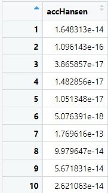

```{r setup, include=FALSE}
knitr::opts_chunk$set(echo = TRUE, 
                      eval = TRUE,
                      message = FALSE,
                      warning = FALSE,
                      fig.retina = 3)
```

## 1.0 Overview

Like always, before we start: just what *is* geographical accessibility? Well, the answer's in the name: it's about how easy a location is to be accessed - its capacity to be reached by other locations. Determining geographical accessibility is critical in urban planning - for example, the placement of transport infrastructure so as to connect healthcare facilities and public amenities to the people in residential areas.

<center>
{width=90%} 
</center>

Here's this week's recommended reading: [a primer on what geographical accessibility](https://gistbok.ucgis.org/bok-topics/modelling-accessibility) is and how it's measured. It might come off as a little heavy on the theory (and math side), so if you'd prefer to see accessibility in action - why not look at accessibility in terms of healthcare in [this study](https://www.ncbi.nlm.nih.gov/pmc/articles/PMC8238135/)? 
  

## 2.0 Setup

### 2.1 Packages Used

The packages we'll be introducing today are:

- [**SpatialAcc**](https://cran.r-project.org/web/packages/SpatialAcc/index.html): used for  modelling geographical accessibility
- [**ggstatsplot**](https://cran.r-project.org/web/packages/ggstatsplot/index.html): an extension of ggplot2 that is used for statistical analysis

In addition, we'll be using packages from our previous exercises:

- [**sf**](https://cran.r-project.org/web/packages/sf/index.html): used for importing, managing, and processing geospatial data
- [**tmap**](https://cran.r-project.org/web/packages/tmap/index.html): used for plotting thematic maps, such as choropleth and bubble maps
- [**tidyverse**](https://www.tidyverse.org/): used for importing, wrangling and visualising data (and other data science tasks!)

In addition, the following **tidyverse** packages will be used (for attribute data handling):

- **readr** for importing delimited files (.csv)
- **dplyr** for wrangling and transforming data
- **ggplot2** for visualising data

```{r}
packages = c('sf', 'tmap', 'SpatialAcc', 'ggstatsplot', 'reshape2', 'tidyverse')
for(p in packages){
  if(!require(p, character.only = T)){
    install.packages(p)
  }
  library(p, character.only = T)
}
```

### 2.2 Data Used

The datasets used for this exercise are:

- `MP14_SUBZONE_NO_SEA_PL`: a polygon feature data in ESRI shapefile format from [data.gov.sg](https://data.gov.sg/), providing information of URA 2014 Master Plan Planning Subzone boundary data, in SVY21 projected coordinates system
- `hexagons`: A 250m radius hexagons GIS data in ESRI shapefile format which was created by using [*st_make_grid()*](https://r-spatial.github.io/sf/reference/st_make_grid.html) of the sf package
- `ELDERCARE`: GIS data showing location of eldercare service, from [data.gov.sg](https://data.gov.sg/dataset/eldercare-services). Note that there are **two** versions: one in ESRI shapefile format, and the other in Google kml file format. For this exercise, we'll be using the ESRI shapefile.
- `OD_Matrix`: a distance matrix in csv format. There are six fields:
  - `origin_id`: the unique id values of the origin (i.e. `fid` of hexagon data set.),
  -`destination_id`: the unique id values of the destination (i.e. `fid` of `ELDERCARE` data set.),
  -`entry_cost`: the perpendicular distance between the origins and the nearest road),
  -`network_cost`: the actual network distance from the origin and destination, 
  -`exit_cost`: the perpendicular distance between the destination and the nearest road), and
  -`total_cost`: the summation of `entry_cost`, `network_cost` and `exit_cost`.

All the values of the cost related fields are in **metres**.

### 2.3 Geospatial Data Importing + Wrangling

#### Importing Geospatial Data

```{r}
# output: simple features object
mpsz <- st_read(dsn = "data/geospatial", layer = "MP14_SUBZONE_NO_SEA_PL")
hexagons <- st_read(dsn = "data/geospatial", layer = "hexagons") 
eldercare <- st_read(dsn = "data/geospatial", layer = "ELDERCARE") 
```

#### Updating CRS Information

As we can see, our `mpsz` does not have any EPSG information. Let's address that, and use [ESPG 3414](https://epsg.io/3414) which is the SVY21 projected coordinates system specific to Singapore:

```{r}
mpsz <- st_transform(mpsz, 3414)
eldercare <- st_transform(eldercare, 3414)
hexagons <- st_transform(hexagons, 3414)

# check the newly-transformed sf for the correct ESPG code 3414
st_crs(mpsz)
```

#### Cleaning + Updating Attribute Fields

As we can see, there are many redundant fields in `eldercare` and `hexagons`. In addition, we should add new fields, `capacity` and `demand` into `eldercare` and `hexagons` respectively - these can be derived with the *mutate()* function of the **dplyr** package.

```{r}
eldercare <- eldercare %>%
  select(fid, ADDRESSPOS) %>%
  mutate(capacity = 100)

hexagons <- hexagons %>%
  select(fid) %>%
  mutate(demand = 100)
```

> Notice:  For the purpose of this hands-on exercise, a constant value of 100 is used. In practice, the actual demand of the hexagon and actual capacity of the eldercare centre should be used instead.

### 2.4 Aspatial Data Importing + Wrangling

#### Importing Distance Matrix

```{r message=FALSE}
# output: tibble data.frame
ODMatrix <- read_csv("data/aspatial/OD_Matrix.csv", skip = 0)
```

#### Tidying distance matrix

Here's what our imported ODMatrix looks like - it's organised columnwise:

<center>
{width=90%}
</center>

However, most of the modelling packages in R expect a matrix like this:

<center>
{width=90%}
</center>

To explain the expected matrix: the rows represent **origins** (i.e. also know as **from** field) and the columns represent **destination** (i.e. also known as **to** field.)

Well, our matrix needs to be transformed from a thin format to that fat format! We'll use the *spread()* fucntion of our **tidyr** package, like so:

```{r}
distmat <- ODMatrix %>%
  select(origin_id, destination_id, total_cost) %>%
  spread(destination_id, total_cost)%>%
  select(c(-c('origin_id')))
```

>Note: We can also use [pivot_wider()](https://tidyr.tidyverse.org/reference/pivot_wider.html), which is the newer and updated function!

Currently, the distance is measured in metres because SVY21 projected coordinate system is used - to make it easier for our analysis, we should convert from metres ot kilometres:

```{r}
distmat_km<-as.matrix(distmat/1000)
```

## 3.0  Modelling and Visualising Accessibility using Hansen Method

### 3.1 Computing Hansen's accessibility

Now that our data's done, we're ready to dive into the meat of today's exercise: computing geographical accessibility! First up is computing Hansen's accessibility by using the *ac()* function of our newly-introduced [**SpatialAcc**](https://cran.r-project.org/web/packages/SpatialAcc/index.html) package. 

Let's check how to use *ac()* first:

<center>
{width=75%}
{width=80%}
</center>
*Taken from the [SpatialAcc Package Guide](https://cran.r-project.org/web/packages/SpatialAcc/SpatialAcc.pdf)*

Now, let's try it out!

```{r}
acc_Hansen <- data.frame(ac(hexcen$demand,
                            eldercare$capacity,
                            distmat_km, 
                            d0 = 50,
                            power = 2, 
                            family = "Hansen"))
```

Oh, yikes!! Look at the default field name:

<center>
{width=75%}
</center>

That's too long and messy - we'll rename it.

```{r}
colnames(acc_Hansen) <- "accHansen"
```

<center>
{width=30%}
</center>

Much better `r emo::ji("smile")` Next, we have to convert the data table into tibble format:

```{r}
acc_Hansen <- tbl_df(acc_Hansen)
```

Lastly, we'll join the `acc_Hansen` tibble data frame with the `hexagons` simple feature data frame using the *bind_cols()* function of our **dplyr** package.

```{r}
hexagon_Hansen <- bind_cols(hexagons, acc_Hansen)
```

### 3.2 Visualising Hansen's accessibility 

Still remember how we extracted the map extent in our [Hands-On Exercise 9](https://is415-msty.netlify.app/posts/2021-10-17-hands-on-exercise-9/), when we were wrangling our geospatial data in Section 2.3? We'll be doing the same thing here with *st_bbox()*:

```{r}
mapex <- st_bbox(hexagons)
```

Now, let's plot:

```{r fig.width=12, fig.height=8}
tmap_mode("plot")
tm_shape(hexagon_Hansen,
         bbox = mapex) + 
  tm_fill(col = "accHansen",
          n = 10,
          style = "quantile",
          border.col = "black",
          border.lwd = 1) +
tm_shape(eldercare) +
  tm_symbols(size = 0.1) +
  tm_layout(main.title = "Accessibility to eldercare: Hansen method",
            main.title.position = "center",
            main.title.size = 2,
            legend.outside = FALSE,
            legend.height = 0.45, 
            legend.width = 3.0,
            legend.format = list(digits = 6),
            legend.position = c("right", "top"),
            frame = TRUE) +
  tm_compass(type="8star", size = 2) +
  tm_scale_bar(width = 0.15) +
  tm_grid(lwd = 0.1, alpha = 0.5)
```

### 3.3 Statistical graphic visualisation

In this section, we'll compare the distribution of Hansen's accessibility values by URA Planning Region. Firstly, we need to add the planning region field into `hexagon_Hansen`:

```{r}
hexagon_Hansen <- st_join(hexagon_Hansen, mpsz, 
                          join = st_intersects)
```

Next, we'll plot the distribution by using the boxplot graphical method:  

```{r}
ggplot(data=hexagon_Hansen, 
       aes(y = log(accHansen), 
           x= REGION_N)) +
  geom_boxplot() +
  geom_point(stat="summary", 
             fun.y="mean", 
             colour ="red", 
             size=2)
```

## 4.0 Modelling and Visualising Accessibility using KD2SFCA Method

This section's going to be a repeat of what we did above, only with a different method! And since we've explained the code already, this time we'll combine the codes into one chunk for efficiency `r emo::ji("thumbs_up")` 

### 4.1 Computing KD2SFCA's accessibility

```{r}
acc_KD2SFCA <- data.frame(ac(hexagons$demand,
                            eldercare$capacity,
                            distmat_km, 
                            d0 = 50,
                            power = 2, 
                            family = "KD2SFCA"))
colnames(acc_KD2SFCA) <- "accKD2SFCA"
acc_KD2SFCA <- tbl_df(acc_KD2SFCA)
hexagon_KD2SFCA <- bind_cols(hexagons, acc_KD2SFCA)
```

### 4.2 Visualising KD2SFCA's accessibility 

```{r fig.width=12, fig.height=8}
tmap_mode("plot")
tm_shape(hexagon_KD2SFCA,
         bbox = mapex) + 
  # note that 'mapex' is reused for our bbox argument!
  tm_fill(col = "accKD2SFCA",
          n = 10,
          style = "quantile",
          border.col = "black",
          border.lwd = 1) +
tm_shape(eldercare) +
  tm_symbols(size = 0.1) +
  tm_layout(main.title = "Accessibility to eldercare: KD2SFCA method",
            main.title.position = "center",
            main.title.size = 2,
            legend.outside = FALSE,
            legend.height = 0.45, 
            legend.width = 3.0,
            legend.format = list(digits = 6),
            legend.position = c("right", "top"),
            frame = TRUE) +
  tm_compass(type="8star", size = 2) +
  tm_scale_bar(width = 0.15) +
  tm_grid(lwd = 0.1, alpha = 0.5)
```

### 4.3 Statistical graphic visualisation

Now, we are going to compare the distribution of KD2CFA accessibility values by URA Planning Region. Like before, we need to add the planning region field into `hexagon_KD2SFCA`, like so:

```{r}
hexagon_KD2SFCA <- st_join(hexagon_KD2SFCA, mpsz, 
                          join = st_intersects)
```

Plotting time! We'll be using the boxplot graphical method again:  

```{r}
ggplot(data=hexagon_KD2SFCA, 
       aes(y = accKD2SFCA, 
           x= REGION_N)) +
  geom_boxplot() +
  geom_point(stat="summary", 
             fun.y="mean", 
             colour ="red", 
             size=2)
```

## 5.0 Modelling and Visualising Accessibility using Spatial Accessibility Measure (SAM) Method

### 5.1 Computing SAM accessibility

```{r}
acc_SAM <- data.frame(ac(hexagons$demand,
                         eldercare$capacity,
                         distmat_km, 
                         d0 = 50,
                         power = 2, 
                         family = "SAM"))
colnames(acc_SAM) <- "accSAM"
acc_SAM <- tbl_df(acc_SAM)
hexagon_SAM <- bind_cols(hexagons, acc_SAM)
```

### 5.2 Visualising SAM's accessibility 

```{r fig.width=12, fig.height=8}
tmap_mode("plot")
tm_shape(hexagon_SAM,
         bbox = mapex) +
  # note that 'mapex' is reused for our bbox argument!
  tm_fill(col = "accSAM",
          n = 10,
          style = "quantile",
          border.col = "black",
          border.lwd = 1) +
tm_shape(eldercare) +
  tm_symbols(size = 0.1) +
  tm_layout(main.title = "Accessibility to eldercare: SAM method",
            main.title.position = "center",
            main.title.size = 2,
            legend.outside = FALSE,
            legend.height = 0.45, 
            legend.width = 3.0,
            legend.format = list(digits = 3),
            legend.position = c("right", "top"),
            frame = TRUE) +
  tm_compass(type="8star", size = 2) +
  tm_scale_bar(width = 0.15) +
  tm_grid(lwd = 0.1, alpha = 0.5)
```

### 5.3 Statistical graphic visualisation

Now, we are going to compare the distribution of SAM accessibility values by URA Planning Region. As always, we need to add the planning region field into `hexagon_SAM`:

```{r}
hexagon_SAM <- st_join(hexagon_SAM, mpsz, 
                       join = st_intersects)
```

One last plot with the boxplot graphical method: 

```{r}
ggplot(data=hexagon_SAM, 
       aes(y = accSAM, 
           x= REGION_N)) +
  geom_boxplot() +
  geom_point(stat="summary", 
             fun.y="mean", 
             colour ="red", 
             size=2)
```

## 6.0 Ending Notes & Thank You

With that, we've learned how to model, compute and visualise accessibility measures! 

And now - we come to the end of our hands-on exercises. This past few months have been full of learning experiences: from our baby steps of importing and basic mapping, to flexing our geospatial biceps with (advanced!) point pattern analysis, to real-life implementation and application with segmentation and accessibility. And that's not exhaustive - there's so much more we learned together, and I hope this journey has been as fulfilling for you as it has for me! `r emo::ji("sparkling_heart")` 

My greatest and warmest thanks for Prof. Kam Tin Seong, who's worked tirelessly to provide all sorts of resources, from data to readings, and for his readiness in answering clarification emails! For those who want to learn even more, his lesson blog can be found [here](https://is415.netlify.app/). And thank you to all my classmates who've helped address our collective doubts with targeted questions - nothing beats a shared learning experience `r emo::ji("smile")` 

<center>
{width=90%}
</center>

...Or is this really the end? **Tune in next week**, and you might just get an encore post! `r emo::ji("smile")` `r emo::ji("sparkles")` 
